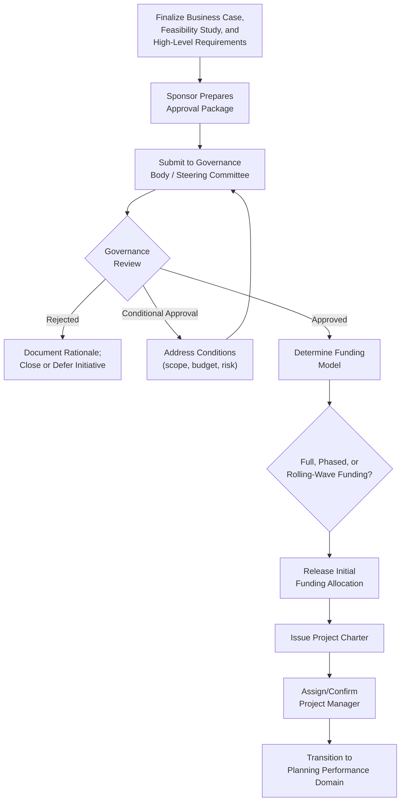

## Securing Project Approval and Funding

### Definition and Purpose

Securing Project Approval and Funding is the process of presenting a project's business case, feasibility findings, and high-level requirements to organizational governance bodies to obtain formal authorization and the financial commitment needed to proceed. It is the culminating activity of project initiation — the point at which a proposed initiative transitions from candidate to authorized project, typically marked by the issuance of a project charter and the release of budget.

This process synthesizes the outputs of earlier initiation activities (project selection, business case, feasibility study, high-level requirements) into a decision package that governance stakeholders can evaluate and act upon.

### Purpose Within Project Initiation

- Obtain formal organizational commitment of resources (budget, staff, capital) to the project
- Establish the project's legitimacy and authority through governance-level endorsement
- Confirm alignment between the proposed project and current organizational strategy and priorities at the point of authorization
- Define the funding structure and any conditions or constraints attached to approval
- Transition accountability from the initiation sponsor/proposer to a formally designated project manager

### Governance Structures Involved

- **Project Sponsor** — typically the primary advocate and decision-maker responsible for securing approval, often the individual accountable for realizing the project's business benefits
- **Steering Committee / Governance Board** — a cross-functional body reviewing and approving projects against strategic and resource criteria
- **Portfolio Management Office (PfMO) or PMO** — often facilitates the approval process, ensures consistency in evaluation criteria, and tracks approved projects against overall portfolio capacity
- **Finance/Budget Committee** — reviews and releases funding, sometimes as a separate approval gate from strategic/scope approval
- **Executive Leadership / Board** — for large or strategically significant projects, final approval may require executive or board-level sign-off

### Funding Models

**1. Full Upfront Funding**

The complete project budget is approved and allocated at initiation, commonly used for well-defined, lower-risk, predictive projects.

**2. Phased/Staged Funding (Gated Funding)**

Funding is released incrementally at defined phase gates, contingent on the project demonstrating continued viability and progress. This model reduces the organization's exposure to sunk-cost risk on projects that reveal problems early.

**3. Rolling-Wave or Incremental Funding**

Common in adaptive/agile delivery, where funding is allocated per increment or planning horizon (e.g., quarterly), allowing budget to be redirected based on demonstrated value delivery rather than committed entirely upfront.

**4. Capital vs. Operating Budget Allocation**

Distinguishing whether funding is drawn from capital expenditure (CapEx) budgets, typically for asset-creating investments, versus operating expenditure (OpEx) budgets, typically for ongoing services — a distinction with significant accounting, tax, and approval-process implications in many organizations.

### Approval and Funding Workflow

**Key Points**

- Approval and funding are related but sometimes distinct governance gates — strategic/scope approval and financial release may be granted by different bodies or at different times
- Phased and rolling-wave funding models shift organizational risk exposure by tying continued investment to demonstrated project viability, rather than committing full budget upfront
- The project charter is typically the formal artifact evidencing approval, and its issuance is what grants the project manager authority to apply organizational resources to the project

### Preparing an Effective Approval Package

A well-prepared package for governance review typically includes:

- **Executive summary** of the business case and recommendation
- **Key financial metrics** (NPV, IRR, payback period, ROI) presented clearly for non-specialist reviewers
- **Feasibility findings**, especially any conditional feasibility items requiring governance awareness
- **High-level requirements and scope boundaries**, clarifying what is and is not included
- **Risk summary**, highlighting top risks and proposed mitigations
- **Requested funding amount and model**, with clear articulation of what is being asked of the governance body
- **Proposed governance and reporting structure** for the project once approved

### Example

**Scenario**: A telecommunications company is seeking approval to fund a network infrastructure expansion into a new service region.

- **Approval package prepared**: The sponsor consolidates the business case (positive NPV over a 7-year horizon), feasibility findings (technically and legally feasible, with a conditional item pending local permitting approval), and high-level requirements (coverage targets, service-level requirements) into a governance presentation.
- **Governance review**: The steering committee grants **conditional approval**, pending confirmation of local permitting timelines, given the material schedule risk this represents.
- **Condition addressed**: The sponsor obtains a preliminary permitting timeline from the relevant municipal authority, satisfying the condition, and resubmits for final approval.
- **Funding model selected**: Given the multi-year build-out and meaningful uncertainty in later phases (equipment cost volatility, potential regulatory changes), the committee approves **phased funding** — releasing budget for the first 18-month phase, with subsequent phases requiring a funding review contingent on phase-one performance.
- **Formal authorization**: Upon final approval, the project charter is issued, the initial funding tranche is released, and a project manager is formally assigned with delegated authority to apply the released budget and resources.

### Common Pitfalls

- **Presenting an incomplete or overly technical package** — governance bodies typically need concise, decision-focused summaries rather than exhaustive technical detail; failing to tailor the package to the audience can stall or derail approval
- **Treating approval as a single event** — for phased or gated funding models, failing to plan for subsequent approval checkpoints can create false confidence in total funding security
- **Ignoring conditional approval requirements** — proceeding informally on unaddressed conditions before they are formally resolved can create governance and compliance exposure
- **Misaligning funding model with project risk profile** — securing full upfront funding for a highly uncertain, novel initiative removes a valuable risk-management lever that phased funding would have provided
- **Underestimating the time required for governance review** — particularly for projects requiring multiple approval layers (steering committee, finance, executive board), insufficient lead time can delay project start beyond planned timelines

### Practical Workflow

1. Consolidate business case, feasibility study, and high-level requirements into a governance-ready approval package
2. Identify the appropriate governance body or bodies required for approval, including any separate financial release gate
3. Tailor the package's level of detail and framing to the specific governance audience
4. Present the package and respond to governance questions or requested conditions
5. Address any conditional approval requirements and resubmit if necessary
6. Determine the funding model (full, phased, or rolling-wave) appropriate to the project's risk and organizational preference
7. Secure formal approval and release of initial funding
8. Issue the project charter, formally authorizing the project and the project manager's authority
9. Transition from initiation into detailed planning, carrying forward any funding conditions or phase-gate requirements

**Related Topics**

- Building a Business Case
- Feasibility Studies
- Project Charter Development
- Portfolio and Program Management
- Phase-Gate Governance Models
- Planning Performance Domain