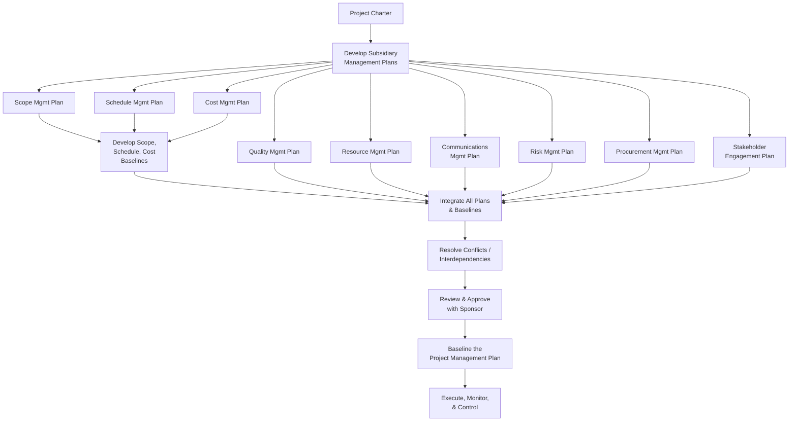

## Assembling the Project Management Plan

### Definition and Purpose

The Project Management Plan (PMP) is the formal, approved document that defines how a project is executed, monitored, controlled, and closed. It is the master integrating document of the project — not a single artifact but a collection of subsidiary management plans and baselines, unified into a coherent whole that describes the complete approach to delivering the project's scope.

Assembling the Project Management Plan is the activity of developing, integrating, and formally baselining these components once the project has been authorized via the project charter, transitioning the project from initiation into active planning and execution.

### Purpose Within the Project Lifecycle

- Provide a single source of truth for how the project will be planned, executed, monitored, and closed
- Integrate the outputs of individual knowledge-area or domain-specific plans into a coherent, non-contradictory whole
- Establish the baselines (scope, schedule, cost) against which performance will be measured throughout execution
- Define how changes to the plan itself will be managed as the project progresses
- Serve as the primary reference and communication tool between the project manager, sponsor, team, and key stakeholders

### Components of the Project Management Plan

**1. Subsidiary Management Plans**

- **Scope Management Plan** — how scope will be defined, validated, and controlled
- **Requirements Management Plan** — how requirements will be analyzed, documented, and managed
- **Schedule Management Plan** — how the schedule will be developed, monitored, and controlled
- **Cost Management Plan** — how costs will be estimated, budgeted, and controlled
- **Quality Management Plan** — how quality policies, objectives, and responsibilities will be implemented
- **Resource Management Plan** — how resources will be estimated, acquired, managed, and released
- **Communications Management Plan** — how, when, and to whom project information will be communicated
- **Risk Management Plan** — how risk management activities will be structured and performed
- **Procurement Management Plan** — how procurement will be conducted, from make-or-buy decisions through contract closure
- **Stakeholder Engagement Plan** — strategies for engaging stakeholders based on their needs and influence

**2. Baselines**

- **Scope Baseline** — the approved project scope statement, WBS, and WBS dictionary
- **Schedule Baseline** — the approved version of the project schedule
- **Cost Baseline** — the approved, time-phased project budget, excluding management reserves

**3. Additional Components**

- **Change Management Plan** — how change requests will be submitted, evaluated, and processed
- **Configuration Management Plan** — how project artifacts and deliverables will be version-controlled
- **Performance Measurement Baseline** — the integrated scope-schedule-cost baseline used for earned value analysis
- **Project Life Cycle Description** and **Development Approach** — carried forward from earlier tailoring decisions
- **Management Reviews** — planned points at which the project's progress and continued viability will be formally reviewed

### Integration Approach

**Key Points**

- The Project Management Plan is not simply a folder of independently developed documents — genuine integration requires resolving interdependencies and conflicts between subsidiary plans (e.g., an aggressive schedule plan must be reconciled with realistic resource availability in the resource plan)
- Baselines, once approved, are changed only through formal change control — this distinguishes a baseline from a plan component that can be updated more flexibly as new information emerges
- The level of detail and formality of the Project Management Plan should be tailored to project size, complexity, and organizational context, consistent with the tailoring principle applied throughout project management practice

### Progressive Elaboration

The Project Management Plan is rarely completed in a single pass. It is typically developed through **progressive elaboration**: an initial version is created early, based on available information, and is refined and detailed as the project progresses and more information becomes known — particularly relevant for the schedule and cost baselines in projects using rolling wave planning.

### Plan Interdependencies

| If This Plan Changes... | These Plans Are Typically Affected |
| --- | --- |
| Scope Management Plan | Schedule, Cost, Quality, Resource plans |
| Schedule Management Plan | Cost, Resource, Risk plans |
| Resource Management Plan | Schedule, Cost, Communications plans |
| Risk Management Plan | Cost (reserves), Schedule (contingency), Procurement plans |
| Stakeholder Engagement Plan | Communications Management Plan |

[Inference] These interdependencies are a primary reason integration is treated as a distinct, deliberate step rather than an automatic byproduct of drafting each subsidiary plan separately — plans developed in isolation by different specialists (a scheduler, a cost estimator, a risk manager) frequently contain assumptions that conflict until explicitly reconciled.

### Example

**Scenario**: A construction firm is assembling the Project Management Plan for a mid-rise commercial building project.

- **Scope Management Plan**: Defines that scope changes require written client sign-off and formal WBS revision.
- **Schedule Management Plan**: Establishes a critical-path-based predictive schedule with monthly progress reviews.
- **Cost Management Plan**: Ties budget control to earned value metrics, reviewed alongside the schedule.
- **Risk Management Plan**: Identifies weather delays and material price volatility as top risk categories, with contingency reserves allocated in the cost baseline accordingly.
- **Integration point identified**: During integration, the project team discovers the resource management plan assumes a crew size that the schedule management plan's critical path does not actually accommodate during a key concrete-pour phase — the schedule is revised to reflect realistic crew availability before the schedule baseline is finalized.
- **Baselining**: Once reconciled, the scope, schedule, and cost baselines are formally approved by the client and internal sponsor, and any subsequent changes must proceed through the documented change management plan.

### Common Pitfalls

- **Treating subsidiary plans as independent, unreconciled documents** — assembling a Project Management Plan without actively resolving cross-plan conflicts undermines its usefulness as an integrated guide
- **Over-detailing the plan for a small or low-risk project** — applying the full weight of every subsidiary plan and baseline to a simple initiative can introduce unnecessary overhead, contrary to the tailoring principle
- **Treating the plan as static once approved** — failing to apply progressive elaboration or formal change control as new information emerges can leave the plan disconnected from actual project reality
- **Confusing management plans with baselines** — baselines require formal change control to modify; management plans (the "how we will manage X" documents) can typically be updated more flexibly as approaches are refined
- **Skipping sponsor/stakeholder review before baselining** — finalizing baselines without stakeholder buy-in risks later disputes over scope, schedule, or cost expectations

### Practical Workflow

1. Begin with the approved project charter as the foundational input
2. Develop subsidiary management plans appropriate to the project's tailored scope (not every plan is necessary for every project)
3. Develop the scope, schedule, and cost baselines in parallel, cross-checking assumptions against resource and risk plans
4. Actively identify and resolve interdependencies and conflicts between subsidiary plans
5. Consolidate all components into the integrated Project Management Plan document
6. Review the assembled plan with the sponsor and key stakeholders
7. Formally baseline the plan, establishing the reference point for future change control
8. Apply progressive elaboration to refine plan details as the project advances and more information becomes available
9. Manage all subsequent changes to baselines through the documented change management process

**Related Topics**

- Planning Performance Domain
- Work Breakdown Structure (WBS) Development
- Integrated Change Control
- Performance Measurement Baseline and Earned Value Management
- Risk Management Planning
- Communications Management Plan