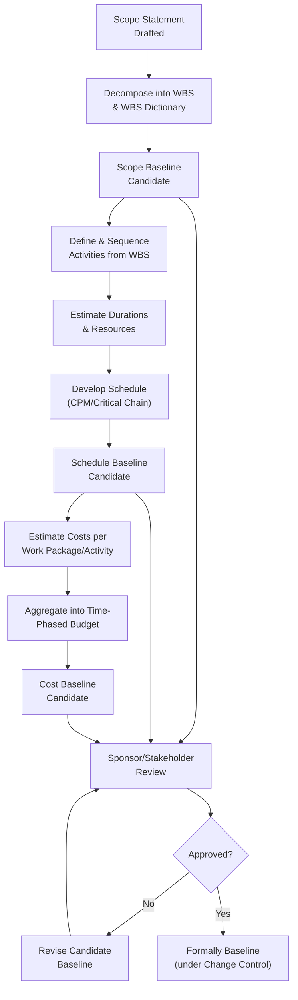

## Establishing Baselines and Subsidiary Plans

### Definition and Purpose

Establishing Baselines and Subsidiary Plans is the detailed technical activity of developing each component management plan and formally fixing the scope, schedule, and cost baselines that together form the Project Management Plan's operational core. Where assembling the Project Management Plan addresses *integrating* these components into a coherent whole, this activity addresses the specific tools, techniques, and approval mechanics used to *produce* each one correctly in the first place.

A baseline, specifically, is an approved version of a work product (scope statement, schedule, or budget) used as a basis for comparison to actual results — it is a snapshot, changed only through formal, documented change control, not adjusted informally as work progresses.

### The Three Baselines in Detail

**1. Scope Baseline**

Composed of three integrated documents:

- **Project Scope Statement** — detailed description of the project scope, deliverables, and exclusions
- **Work Breakdown Structure (WBS)** — hierarchical decomposition of total project scope into work packages
- **WBS Dictionary** — detailed descriptions of each WBS component, including work package descriptions, acceptance criteria, and assigned resources

**2. Schedule Baseline**

The approved version of the project schedule model, developed through:

- Activity definition — identifying specific actions needed to produce deliverables
- Activity sequencing — determining dependencies between activities
- Duration estimating — using analogous, parametric, or three-point techniques
- Schedule development — applying critical path method (CPM) or critical chain method to produce a feasible, resource-leveled schedule

**3. Cost Baseline**

The approved, time-phased budget excluding management reserves, developed by aggregating estimated costs of individual work packages or activities into a cost performance baseline, typically visualized as an S-curve showing planned cumulative expenditure over time.

### Baseline Development and Approval Flow

**Key Points**

- The three baselines are sequentially dependent — the schedule baseline cannot be reliably developed without a stable scope baseline, and the cost baseline depends on both
- Once approved, a baseline is only changed through formal change control; informal "re-baselining" without documented approval undermines the baseline's value as a performance-measurement reference
- The scope, schedule, and cost baselines together form the **Performance Measurement Baseline**, used for earned value calculations during execution

### Developing Subsidiary Plans: Common Techniques by Plan

| Subsidiary Plan | Key Development Techniques |
| --- | --- |
| Scope Management Plan | Expert judgment on scope definition approach; alignment with organizational scope policies |
| Schedule Management Plan | Selection of scheduling methodology (CPM, agile iterations); definition of schedule control thresholds |
| Cost Management Plan | Selection of estimating techniques; definition of cost control thresholds and EVM methodology |
| Quality Management Plan | Benchmarking against quality standards; cost of quality analysis; definition of quality metrics |
| Resource Management Plan | Resource breakdown structure development; responsibility assignment matrix (RACI) |
| Communications Management Plan | Stakeholder communication requirements analysis; communication channel formula ($n(n-1)/2$) |
| Risk Management Plan | Definition of risk categories, probability/impact scales, and risk tolerance thresholds |
| Procurement Management Plan | Make-or-buy analysis; contract type selection criteria |
| Stakeholder Engagement Plan | Stakeholder engagement assessment matrix (current vs. desired engagement) |

### Control Thresholds

A key mechanical element embedded in subsidiary plans (particularly schedule and cost) is the definition of **control thresholds** — the acceptable variance from baseline before a formal response is triggered. For example, a cost management plan might specify: "A cost variance exceeding 10% of the baseline at any reporting period triggers mandatory root cause analysis and corrective action planning." Defining these thresholds during plan development, rather than improvising them during execution, ensures consistent, objective control decisions later.

### Example

**Scenario**: A software company is establishing baselines and subsidiary plans for a customer relationship management (CRM) system rollout.

- **Scope baseline**: The project scope statement defines inclusion of core CRM modules and exclusion of a planned marketing automation integration (deferred to a future phase). The WBS decomposes work into modules (contact management, sales pipeline, reporting), each broken down to work packages with WBS dictionary entries specifying acceptance criteria.
- **Schedule baseline**: Using activities derived directly from WBS work packages, the team applies three-point estimating for uncertain integration tasks and straightforward estimates for well-understood configuration tasks, then develops a critical path schedule identifying the data migration task as the primary schedule risk driver.
- **Cost baseline**: Costs are estimated bottom-up per work package and aggregated into a time-phased budget, producing an S-curve that shows heavier spend concentrated in the middle third of the project during core development and integration.
- **Risk Management Plan**: Defines risk tolerance thresholds specific to this project — schedule risks above a defined probability-impact score require a documented response plan; lower-scored risks are logged and monitored only.
- **Cost Management Plan control threshold**: Specifies that any single work package exceeding its estimate by more than 15% requires escalation to the project sponsor, established before execution begins to avoid ad hoc escalation criteria later.

### Common Pitfalls

- **Baselining before scope is sufficiently stable** — establishing a schedule or cost baseline against an immature or ambiguous scope baseline produces unreliable baselines requiring premature re-baselining
- **Omitting the WBS dictionary** — a WBS without accompanying detailed dictionary entries leaves acceptance criteria and work package boundaries ambiguous, undermining both estimating accuracy and later scope validation
- **Defining control thresholds after variances occur** — improvised, after-the-fact decisions about what variance level warrants escalation introduce inconsistency and potential bias into cost and schedule control
- **Treating subsidiary plans as boilerplate** — copying a subsidiary plan template without genuinely tailoring risk categories, communication needs, or estimating techniques to the specific project undermines the plan's practical usefulness
- **Re-baselining informally** — adjusting a baseline without routing the change through the documented change control process erodes its value as an objective performance reference

### Practical Workflow

1. Finalize the project scope statement based on validated high-level requirements and charter scope
2. Develop the WBS and WBS dictionary to the work package level, defining clear acceptance criteria
3. Formally establish the scope baseline through stakeholder and sponsor review
4. Define, sequence, and estimate activities derived from the scope baseline
5. Develop the schedule using an appropriate methodology (CPM, critical chain, or iteration-based for adaptive components)
6. Formally establish the schedule baseline
7. Estimate costs per work package or activity and aggregate into a time-phased budget
8. Formally establish the cost baseline, completing the Performance Measurement Baseline
9. Develop each relevant subsidiary management plan, defining specific control thresholds and methodologies appropriate to the project
10. Route all baseline changes exclusively through the documented change control process once approved

**Related Topics**

- Assembling the Project Management Plan
- Work Breakdown Structure (WBS) Development
- Estimating Techniques: Analogous, Parametric, Three-Point
- Critical Path Method and Schedule Network Analysis
- Earned Value Management (EVM) Deep Dive
- Integrated Change Control