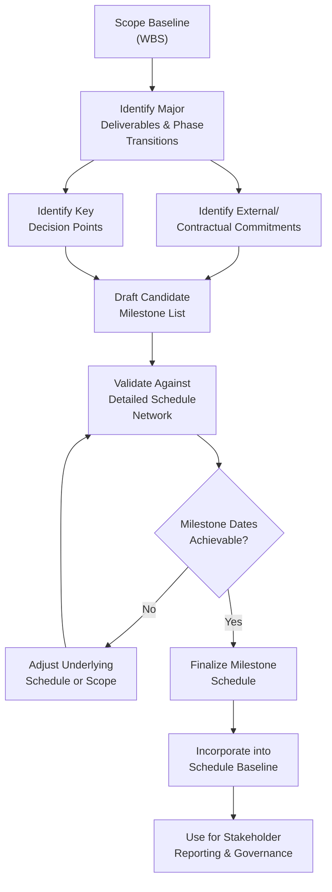
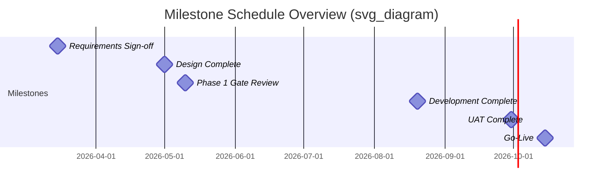

## Milestone Planning

### Definition and Purpose

Milestone Planning is the technique of identifying significant points or events within a project schedule that mark the completion of a major deliverable, phase, or decision point. Milestones are typically represented as zero-duration events in the schedule — they do not consume time or resources themselves but serve as checkpoints for tracking progress, triggering governance reviews, or signaling contractual or stakeholder-facing commitments.

Milestone planning provides a high-level, simplified view of project progress that is particularly useful for communicating status to executives, sponsors, and other stakeholders who need visibility into project trajectory without the full detail of the underlying activity-level schedule.

### Purpose and Applications

- Provide a simplified, high-level view of project progress suitable for executive and stakeholder communication
- Mark key decision points where governance review or go/no-go decisions occur
- Establish contractual or regulatory checkpoints tied to payments, approvals, or compliance deadlines
- Support phased or gated funding models by defining the specific points at which funding release or continuation is evaluated
- Anchor schedule performance measurement — tracking whether milestones are achieved on, ahead of, or behind their planned dates

### Types of Milestones

- **Major deliverable milestones** — completion of a significant work product (e.g., "Design phase complete")
- **Phase-gate milestones** — transition points between project phases, often tied to governance review (e.g., "Phase 1 gate review")
- **External/contractual milestones** — dates tied to contractual obligations, regulatory submissions, or vendor deliveries
- **Decision milestones** — points requiring a go/no-go or directional decision (e.g., "Go/no-go decision for full rollout")
- **Interim/internal milestones** — team-level checkpoints not necessarily visible to external stakeholders, used for internal progress tracking

### Characteristics of Well-Defined Milestones

- **Zero duration** — a milestone represents a point in time, not a span of work
- **Clear, verifiable completion criteria** — unambiguous definition of what constitutes achievement of the milestone
- **Meaningful to stakeholders** — represents genuine progress or a decision point relevant to the audience tracking it, not an arbitrary date
- **Appropriately spaced** — too few milestones reduce visibility into progress; too many create excessive administrative tracking overhead without proportional insight

### Milestone Planning in the Schedule Development Process

**Key Points**

- Milestones are derived from the detailed schedule, not created independently of it — a milestone date must be validated against the underlying activity network to ensure it is achievable
- The milestone schedule and the detailed activity schedule serve different audiences and purposes; both are necessary but neither replaces the other
- Milestones tied to phased or gated funding directly connect schedule planning to the funding model established during project approval

### Milestone Chart Example

A simplified milestone chart, commonly used for executive reporting:

| Milestone | Planned Date | Status |
| --- | --- | --- |
| Requirements sign-off | Mar 15 | Complete |
| Design phase complete | May 1 | Complete |
| Phase 1 gate review (funding decision) | May 10 | Complete — approved |
| Development complete | Aug 20 | In progress |
| UAT complete | Sep 30 | Not started |
| Go-live | Oct 15 | Not started |

**Example**

### Milestone Slippage and Trend Analysis

Tracking not just whether a milestone was met, but how its planned date has shifted over successive reporting periods, provides an early warning signal of schedule risk:

| Milestone | Original Plan | Revised (Report 2) | Revised (Report 3) | Trend |
| --- | --- | --- | --- | --- |
| Development Complete | Aug 20 | Aug 20 | Sep 5 | Slipping |
| UAT Complete | Sep 30 | Sep 30 | Oct 12 | Slipping |
| Go-Live | Oct 15 | Oct 15 | Oct 28 | Slipping |

[Inference] A pattern of consistent, compounding milestone slippage across successive reports is generally treated as a stronger warning signal than a single isolated slip, since it suggests a systemic underlying issue (e.g., underestimated complexity or resource constraints) rather than a one-off disruption — though distinguishing the two requires root cause analysis rather than the trend data alone.

### Example

**Scenario**: A financial services firm is planning a core banking platform migration.

- **Major deliverable milestones**: "Data mapping complete," "Parallel testing environment ready," "Regulatory compliance sign-off"
- **Phase-gate milestone**: "Phase 1 (planning and design) gate review" — tied to the phased funding model established during project approval, requiring steering committee approval before phase 2 funding is released
- **External/contractual milestone**: "Regulatory filing submitted" — a hard external date driven by a banking regulator's filing window, not adjustable by internal project decisions
- **Decision milestone**: "Go/no-go for full customer migration" — contingent on successful completion of parallel testing with the legacy system
- **Validation against detailed schedule**: The team confirms the "Regulatory filing submitted" milestone date is achievable by tracing back through the detailed activity network, confirming sufficient buffer exists given known dependencies on external compliance review turnaround time
- **Reporting use**: The milestone chart, rather than the full activity-level schedule, is used in monthly executive steering committee updates, with drill-down into detailed schedule available only if a milestone shows at-risk status

### Common Pitfalls

- **Setting milestone dates without validating the underlying schedule** — aspirational milestone dates disconnected from realistic activity-level estimates create false confidence and later credibility problems when they slip
- **Over-milestoning** — defining so many milestones that the milestone chart loses its value as a simplified, high-level communication tool
- **Vague milestone completion criteria** — a milestone such as "development mostly done" is not objectively verifiable and undermines the milestone's purpose as a clear checkpoint
- **Failing to track milestone date trends over time** — reporting only current status without comparing to prior baseline dates misses early warning signals of compounding schedule risk
- **Treating milestone achievement as equivalent to overall project health** — a project can hit interim milestones while accumulating hidden risk or technical debt that is not visible at the milestone level alone

### Practical Workflow

1. Review the scope baseline and detailed schedule to identify candidate milestones tied to major deliverables and phase transitions
2. Incorporate any external, contractual, or regulatory dates as fixed milestones
3. Identify key decision points requiring governance review or go/no-go determination
4. Validate proposed milestone dates against the detailed activity-level schedule network to confirm achievability
5. Define clear, objective, verifiable completion criteria for each milestone
6. Finalize the milestone schedule and incorporate it into the approved schedule baseline
7. Use the milestone chart for stakeholder and executive reporting, reserving the detailed schedule for team-level management
8. Track milestone date trends across reporting periods, not just current status, to surface early schedule risk signals

**Related Topics**

- Establishing Baselines and Subsidiary Plans
- Critical Path Method and Schedule Network Analysis
- Phase-Gate Governance Models
- Measurement Performance Domain
- Securing Project Approval and Funding
- Estimating Techniques: Analogous, Parametric, Three-Point