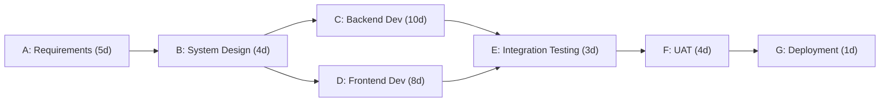

## Dependency Mapping

### Definition and Purpose

Dependency mapping is the process of identifying, documenting, and visualizing the relationships between tasks, activities, or work packages within a project schedule. It establishes the logical sequence in which work must occur, revealing which tasks must precede others, which can run concurrently, and which are constrained by external factors.

**Key Points**

- Forms the structural backbone of the project schedule network diagram
- Enables accurate critical path calculation
- Surfaces scheduling risk before execution begins
- Required input for tools like the Critical Path Method (CPM) and Program Evaluation and Review Technique (PERT)

### Why Dependency Mapping Matters

Without a dependency map, a schedule is just a list of durations with no logical structure. Dependency mapping answers questions such as:

- What must finish before this task can start?
- What happens if this task slips?
- Which tasks have flexibility (float/slack) and which do not?
- Where are the bottlenecks or single points of failure in the workflow?

### Types of Dependencies

#### 1. Logical (Dependency Type) Relationships

These describe the sequencing logic between two activities, commonly denoted as Predecessor → Successor.

| Type | Abbreviation | Description | Example |
| --- | --- | --- | --- |
| Finish-to-Start | FS | Successor cannot start until predecessor finishes | Foundation must finish before framing starts |
| Start-to-Start | SS | Successor cannot start until predecessor starts | Excavation and dust suppression start together |
| Finish-to-Finish | FF | Successor cannot finish until predecessor finishes | Testing cannot finish until development finishes |
| Start-to-Finish | SF | Successor cannot finish until predecessor starts | Rare; used in shift-handoff scenarios |

FS is the most common relationship type, used in the vast majority of real-world schedules. SF is rarely used and typically appears in specialized scenarios like just-in-time manufacturing or security shift changes.

#### 2. Dependency Origin (Nature) Categories

- **Mandatory (Hard Logic):** Physically or contractually required sequencing (e.g., you cannot pour concrete before building the formwork).
- **Discretionary (Soft/Preferred Logic):** Chosen by the project team based on best practice, not a hard constraint (e.g., choosing to complete design reviews sequentially rather than in parallel).
- **External:** Dependency on a factor outside the project team's control (e.g., a permit from a regulatory agency, a vendor delivery).
- **Internal:** Dependency within the project team's control (e.g., one internal team's output feeding another's input).

[Inference] The mandatory/discretionary/external/internal taxonomy is drawn from common PMBOK-aligned practice; exact terminology may vary slightly across methodologies and organizations.

### Lead and Lag Time

- **Lag:** A delay inserted between a predecessor and successor (e.g., FS + 3 days means the successor starts 3 days after the predecessor finishes — such as a curing period after concrete is poured).
- **Lead:** An acceleration that allows a successor to start before the predecessor fully finishes (e.g., FS − 5 days means the successor can begin 5 days before the predecessor completes, often used to overlap phases).

$$ES_{successor} = EF_{predecessor} + Lag$$

Where a negative lag value represents lead time.

### The Dependency Mapping Process

**Next Steps** (procedural — treat as a workflow)

1. **Decompose the scope** into a Work Breakdown Structure (WBS) so discrete activities exist to link.
2. **Identify predecessors and successors** for each activity through stakeholder interviews, technical requirements, and contractual obligations.
3. **Classify each dependency** by type (FS/SS/FF/SF) and nature (mandatory/discretionary/external/internal).
4. **Apply lead/lag values** where activities overlap or require a buffer.
5. **Build the network diagram** using the Precedence Diagramming Method (PDM) or Arrow Diagramming Method (ADM).
6. **Validate the logic** by checking for open ends (activities with no predecessor/successor unless intentionally the first/last), circular dependencies, and unrealistic constraints.
7. **Calculate the critical path** using forward and backward pass calculations.
8. **Review with stakeholders** to confirm the network reflects real-world constraints.

### Network Diagramming Methods

#### Precedence Diagramming Method (PDM)

The dominant modern approach. Activities are represented as nodes (boxes), and dependencies are shown as arrows connecting them. This is the method used natively by tools like Microsoft Project, Primavera P6, and most modern PM software.

#### Arrow Diagramming Method (ADM)

An older method (also called Activity-on-Arrow) where activities are represented by arrows and nodes represent events (points in time). ADM only supports FS relationships natively, which is why PDM has largely superseded it.

### Example: Building a Simple Dependency Map

Consider a software release project with these activities:

| Activity | Description | Predecessor | Type | Duration |
| --- | --- | --- | --- | --- |
| A | Requirements gathering | — | — | 5 days |
| B | System design | A | FS | 4 days |
| C | Backend development | B | FS | 10 days |
| D | Frontend development | B | FS | 8 days |
| E | Integration testing | C, D | FS | 3 days |
| F | UAT (User Acceptance Testing) | E | FS | 4 days |
| G | Deployment | F | FS | 1 day |

**Example**

Notice that C and D both depend only on B and can run in parallel, while E cannot start until *both* C and D finish (a merge point / FS with multiple predecessors). This parallelism is exactly what a dependency map is designed to expose — without mapping it explicitly, a planner might sequence C and D unnecessarily, extending the timeline by 8 days.

Below is the network diagram for this example.

### Critical Path Identification

Once the dependency map is built, the critical path is the longest sequence of dependent activities determining the minimum project duration. Using the example above:

- Path 1: A → B → C → E → F → G = 5 + 4 + 10 + 3 + 4 + 1 = 27 days
- Path 2: A → B → D → E → F → G = 5 + 4 + 8 + 3 + 4 + 1 = 25 days

Path 1 is the **critical path** (27 days). Path 2 has 2 days of float — Frontend Development could slip by up to 2 days without delaying the project, assuming no other constraints change.

**Key Points**

- Any delay on a critical path activity delays the entire project
- Non-critical activities have float/slack and can absorb some delay
- Dependency mapping accuracy directly determines critical path accuracy — an error in logic can hide or fabricate a false critical path

### Common Dependency Mapping Errors

- **Circular dependencies (logic loops):** Activity A depends on B, which depends on A — makes the network unsolvable and must be resolved before scheduling.
- **Over-constraining with discretionary logic:** Treating preferred sequencing as mandatory, which artificially removes parallelization opportunities and inflates the schedule.
- **Missing external dependencies:** Failing to map dependencies on vendors, regulators, or other teams, leading to unplanned delays.
- **Dangling activities:** Tasks with no successor (other than the final milestone) that get forgotten in downstream impact analysis.
- **Ignoring resource dependencies:** Logical dependency mapping alone doesn't account for resource contention (e.g., two parallel tasks needing the same specialist) — this typically requires separate resource leveling analysis.

### Visual Representation of a Dependency Relationship

The following SVG illustrates a single FS relationship with lag, annotated with early start (ES) and early finish (EF) values.

<svg xmlns="http://www.w3.org/2000/svg" viewBox="0 0 640 220">
<title>FS Dependency with Lag (svg_diagram)</title>
<rect x="20" y="60" width="180" height="70" rx="6" fill="#dbe9ff" stroke="#2c5aa0" stroke-width="2" />
<text x="110" y="90" font-size="14" text-anchor="middle" fill="#1a1a1a" font-family="sans-serif">Predecessor</text>
<text x="110" y="110" font-size="12" text-anchor="middle" fill="#333" font-family="sans-serif">ES=0 EF=10</text>
<rect x="420" y="60" width="180" height="70" rx="6" fill="#d9f2d9" stroke="#2c8a2c" stroke-width="2" />
<text x="510" y="90" font-size="14" text-anchor="middle" fill="#1a1a1a" font-family="sans-serif">Successor</text>
<text x="510" y="110" font-size="12" text-anchor="middle" fill="#333" font-family="sans-serif">ES=13 EF=20</text>
<line x1="200" y1="95" x2="415" y2="95" stroke="#555" stroke-width="2" marker-end="url(#arrow)" />
<text x="307" y="80" font-size="12" text-anchor="middle" fill="#555" font-family="sans-serif">Lag = 3 days</text>
<text x="320" y="180" font-size="12" text-anchor="middle" fill="#444" font-family="sans-serif">FS relationship: Successor ES = Predecessor EF + Lag (10 + 3 = 13)</text>

</svg>

### Tools Commonly Used for Dependency Mapping

- **Microsoft Project:** Native PDM support, automatic critical path highlighting.
- **Primavera P6:** Industry standard for large/complex construction and engineering programs; robust dependency and constraint modeling.
- **Smartsheet, Asana, Monday.com:** Simplified dependency linking suited to smaller or agile-adjacent teams. [Unverified] Exact feature parity with full CPM calculation varies by tool and plan tier, and may change as vendors update their products.
- **Whiteboard/sticky-note mapping:** Common in early planning workshops before formalizing in software, especially for discretionary logic discussions.

### Dependency Mapping in Agile Contexts

While traditionally associated with waterfall/CPM scheduling, dependency mapping remains relevant in agile environments, typically expressed as:

- **Story/epic dependencies** across sprints or teams (often tracked on a dependency board or via linked tickets in Jira)
- **Cross-team dependencies** in scaled frameworks like SAFe, visualized on a Program Increment (PI) board
- **Blocked/blocking relationships** at the ticket level rather than formal FS/SS/FF/SF notation

[Inference] Agile dependency tracking tends to be lighter-weight and more visual (kanban-style) than formal CPM notation, reflecting the iterative and adaptive nature of those frameworks, though specific implementation varies significantly by organization.

### Conclusion

Dependency mapping transforms a flat list of tasks into a structured network that reveals sequencing logic, parallelization opportunities, and schedule risk. It is a prerequisite for critical path analysis and a foundational discipline in both predictive (waterfall) and adaptive (agile) project management approaches. Accuracy in classifying dependency type and nature directly determines the reliability of downstream schedule calculations and risk forecasts.

**Related Topics**

- Critical Path Method (CPM) calculation (forward/backward pass, float)
- Program Evaluation and Review Technique (PERT) and three-point estimating
- Resource leveling and resource-constrained scheduling
- Work Breakdown Structure (WBS) development
- Schedule network templates and fast-tracking/crashing techniques
- Risk register integration with schedule dependencies