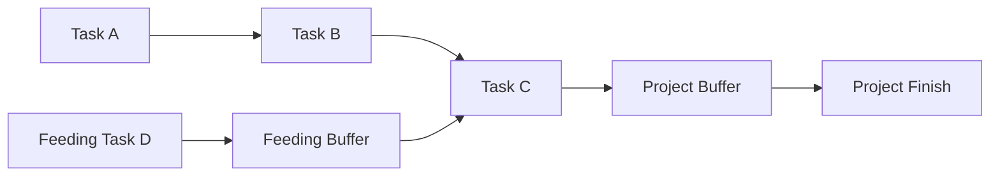

## Contingency and Buffer Planning

### Definition and Purpose

Contingency and buffer planning is the practice of deliberately allocating extra time, cost, or resources into a project plan to absorb the effects of identified and unidentified risks. It distinguishes between reserves for **known-unknowns** (risks identified in the risk register) and **unknown-unknowns** (risks that cannot be anticipated), ensuring the schedule and budget remain credible under uncertainty.

**Key Points**

- Protects project baselines from erosion due to normal variability and risk events
- Distinguishes contingency reserve (known risks) from management reserve (unknown risks)
- Applies to schedule (time buffers), cost (budget reserves), scope, and resources
- A core input to realistic baselines used for earned value management (EVM)

### Why Buffers and Contingencies Are Necessary

Deterministic estimates (single-point durations/costs) rarely reflect real-world variability. Without reserves:

- Any minor risk event or estimation error cascades directly into schedule or cost overruns
- Stakeholders lose confidence when baselines are missed almost immediately
- There is no mechanism to absorb legitimate uncertainty without renegotiating the entire baseline

[Inference] Organizations that omit contingency planning tend to experience more frequent baseline rebaselining, though the degree varies by industry, project complexity, and estimating maturity.

### Types of Reserves

#### 1. Contingency Reserve

Allocated for **identified risks** that remain after mitigation ("known-unknowns"), typically documented in the risk register. Owned and can be spent by the project manager without escalation, within delegated authority limits.

#### 2. Management Reserve

Allocated for **unforeseen risks** ("unknown-unknowns") not identified during risk planning. Owned by senior management/sponsor; the project manager typically requires approval to draw from it, and its use often triggers a formal change control process.

#### 3. Schedule Buffer (Time Reserve)

Extra duration inserted into the schedule to protect the finish date from variability. Buffers can be placed at different points depending on the scheduling philosophy (see Critical Chain below).

#### 4. Cost/Budget Reserve (Cost Contingency)

Extra funds added to the cost baseline. Combined, cost baseline + contingency reserve = **cost baseline**, and cost baseline + management reserve = **total project budget** (per PMBOK terminology).

$$\text{Cost Baseline} = \sum \text{Activity Cost Estimates} + \text{Contingency Reserve}$$

$$\text{Total Project Budget} = \text{Cost Baseline} + \text{Management Reserve}$$

**Key Points**

- Confusing contingency reserve with management reserve is a common governance failure — they have different owners and approval thresholds
- Reserves should never be treated as a padding mechanism to inflate estimates arbitrarily; they should be quantitatively justified

### Common Reserve Estimation Methods

#### 1. Percentage-Based (Rule of Thumb)

A flat percentage (e.g., 10%, 15%, 20%) applied to the baseline estimate, often based on historical data or organizational policy. Simple but not risk-specific.

[Unverified] Commonly cited percentages (e.g., 10% for low-risk, 20-25% for medium, 40%+ for high-risk/novel projects) vary widely by industry and organizational benchmarking data, and should be validated against organizational historical records rather than treated as universal standards.

#### 2. Expected Monetary Value (EMV) Analysis

Calculates reserve needs based on probability × impact for each identified risk.

$$EMV = \sum_{i=1}^{n} P_i \times I_i$$

Where $P_i$ is the probability of risk $i$ occurring and $I_i$ is its cost/schedule impact.

**Example**

| Risk | Probability | Impact (cost) | EMV |
| --- | --- | --- | --- |
| Vendor delay | 30% | $50,000 | $15,000 |
| Scope change request | 20% | $30,000 | $6,000 |
| Key resource turnover | 10% | $40,000 | $4,000 |
| **Total Contingency Reserve** |  |  | **$25,000** |

#### 3. Three-Point (PERT) Estimating

Uses optimistic (O), most likely (M), and pessimistic (P) estimates to calculate a weighted expected duration/cost and standard deviation, from which reserve can be derived statistically.

$$E = \frac{O + 4M + P}{6}$$

$$\sigma = \frac{P - O}{6}$$

A reserve can then be set at a desired confidence level (e.g., $E + 1\sigma$ for approximately 68% confidence, $E + 2\sigma$ for approximately 95%, assuming a roughly normal/Beta distribution approximation).

#### 4. Monte Carlo Simulation

Runs thousands of probabilistic iterations across the schedule/cost model (using distributions for each activity's duration/cost) to generate a confidence curve (S-curve), from which reserve can be selected at a target percentile (e.g., P80 = 80% confidence of completing within that duration/cost).

[Inference] Monte Carlo simulation is generally considered more statistically defensible than flat percentage buffers because it models the compounding and correlation effects of multiple risks simultaneously, though its accuracy still depends heavily on the quality of the input distributions.

### Buffer Placement Strategies

#### Traditional (Per-Task Padding)

Each task estimate includes built-in slack. Criticized in the Theory of Constraints literature (notably by Eliyahu Goldratt) for encouraging **Parkinson's Law** (work expands to fill the time available) and the **Student Syndrome** (work is delayed until the deadline nears), which dissipates the padding without protecting the actual finish date.

#### Critical Chain Project Management (CCPM)

Removes padding from individual tasks and instead aggregates the saved time into pooled buffers placed strategically in the network:

- **Project Buffer:** Placed at the end of the critical chain, protecting the overall project finish date.
- **Feeding Buffer:** Placed where a non-critical chain path merges into the critical chain, protecting the critical chain from delays on feeding paths.
- **Resource Buffer:** A signal/alert (not necessarily time) ensuring a critical resource is available exactly when needed.

**Key Points**

- CCPM buffers are monitored using "buffer consumption" tracking (e.g., a red/yellow/green fever chart) rather than tracking individual task variance
- Buffer consumption rate relative to critical chain completion percentage triggers management attention thresholds

### Buffer Consumption Monitoring (Fever Chart Concept)

A common CCPM control tool plots percentage of project buffer consumed against percentage of critical chain completed, divided into zones:

- **Green Zone:** Buffer consumption is proportionate or better than progress — no action needed
- **Yellow Zone:** Buffer consumption is outpacing progress — monitor closely, prepare mitigation
- **Red Zone:** Buffer consumption significantly exceeds progress — immediate corrective action required

<svg xmlns="http://www.w3.org/2000/svg" viewBox="0 0 640 400">
<title>Buffer Consumption Fever Chart (svg_diagram)</title>
<rect x="60" y="20" width="540" height="340" fill="#ffffff" stroke="#333" stroke-width="1" />
<rect x="60" y="20" width="540" height="113" fill="#d9f2d9" />
<rect x="60" y="133" width="540" height="113" fill="#fff3cd" />
<rect x="60" y="246" width="540" height="114" fill="#f8d7da" />

<text x="590" y="60" font-size="12" text-anchor="end" fill="`#2c8a2c`" font-family="sans-serif">Green</text>

<text x="590" y="175" font-size="12" text-anchor="end" fill="`#a67c00`" font-family="sans-serif">Yellow</text>

<text x="590" y="290" font-size="12" text-anchor="end" fill="`#b02a2a`" font-family="sans-serif">Red</text>

<line x1="60" y1="360" x2="600" y2="360" stroke="#000" stroke-width="1.5" />
<line x1="60" y1="20" x2="60" y2="360" stroke="#000" stroke-width="1.5" />

<text x="330" y="385" font-size="13" text-anchor="middle" fill="#333" font-family="sans-serif">% Critical Chain Complete</text>

<text x="25" y="190" font-size="13" text-anchor="middle" fill="#333" font-family="sans-serif" transform="rotate(-90 25 190)">% Buffer Consumed</text>

<polyline points="60,340 150,300 240,270 330,150 420,110 500,70" fill="none" stroke="#1a1a1a" stroke-width="2.5" />
<circle cx="500" cy="70" r="4" fill="#1a1a1a" />
<text x="510" y="65" font-size="11" fill="#1a1a1a" font-family="sans-serif">Current status</text>
</svg>

In the plotted trajectory above, the project trends from green into yellow territory as buffer consumption begins to outpace chain progress — a signal for the project manager to investigate root causes before it crosses into red.

### Contingency Planning Beyond Time and Cost

- **Scope contingency:** Reserved capacity to absorb minor scope clarifications without formal change requests (distinct from scope creep, which is uncontrolled).
- **Resource contingency:** Backup resources, cross-training, or on-call vendor arrangements to cover unplanned absence or attrition.
- **Technical contingency (fallback plans):** Predefined alternative technical approaches if a primary approach fails (common in R&D and engineering-heavy projects).

### Governance and Drawdown Process

**Next Steps** (procedural)

1. Quantify contingency reserve per identified risk during risk response planning (Plan Risk Responses).
2. Aggregate to a total contingency reserve, added to the cost/schedule baseline.
3. Set management reserve separately, based on organizational risk appetite and project complexity, and exclude it from the performance measurement baseline (PMB).
4. Define authority thresholds — e.g., PM can approve draws up to a set limit; anything above requires sponsor/steering committee approval.
5. Track reserve consumption against realized risk events; log each drawdown with justification.
6. Report remaining reserve status regularly in status reports and steering committee reviews.
7. Reassess reserve adequacy at each phase gate or major milestone as new risks are identified or retired.

### Common Pitfalls

- **Treating reserves as a slush fund:** Drawing on contingency for scope enhancements rather than legitimate risk realization erodes protection against actual risk events.
- **Double-dipping:** Padding individual task estimates *and* adding a separate contingency reserve, resulting in excessive, undisclosed schedule/cost inflation.
- **Opaque reserves:** Failing to disclose reserve size and rationale to stakeholders, which can create trust issues if reserves appear to be arbitrary "fat" in the budget.
- **Static reserves:** Not reassessing reserve adequacy as the project progresses and risk exposure changes (early-stage uncertainty is typically higher than late-stage uncertainty).
- **Under-differentiating reserve types:** Blending contingency and management reserve into a single number removes the audit trail and approval discipline both are meant to provide.

### Relationship to Earned Value Management (EVM)

Contingency reserve **is included** in the Performance Measurement Baseline (PMB), while management reserve is **excluded** from it. This distinction matters for EVM metrics:

$$BAC = \sum \text{Planned Activity Costs} + \text{Contingency Reserve}$$

Management reserve is tracked separately from BAC (Budget at Completion) and only folded in when formally approved and allocated to the baseline via change control.

### Conclusion

Contingency and buffer planning converts abstract risk exposure into concrete, governed reserves of time, cost, scope, and resources. Distinguishing contingency reserve (known risks, PM-controlled) from management reserve (unknown risks, sponsor-controlled) preserves both flexibility and financial discipline. Whether reserves are calculated via simple percentages, EMV, PERT, or Monte Carlo simulation, and whether buffers are embedded per-task or pooled under a Critical Chain approach, the underlying goal is the same: protect the baseline's credibility against the inevitable gap between plans and reality.

**Related Topics**

- Quantitative risk analysis (EMV, Monte Carlo simulation, sensitivity analysis)
- Critical Chain Project Management (CCPM) and Theory of Constraints
- Earned Value Management (EVM) fundamentals (PV, EV, AC, CPI, SPI)
- Risk register development and risk response strategies (avoid, mitigate, transfer, accept)
- Change control processes and baseline management
- Three-point (PERT) estimating techniques