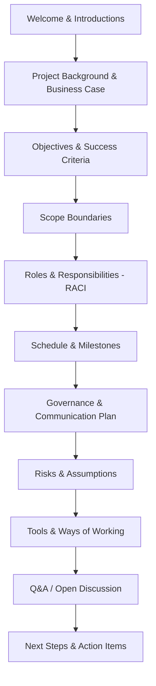

## Running an Effective Project Kickoff

### Definition and Purpose

The project kickoff is the formal event that transitions a project from planning/initiation into execution. It aligns all stakeholders — sponsors, team members, and often clients or vendors — around a shared understanding of the project's objectives, scope, governance, and ways of working before substantive work begins.

**Key Points**

- Marks the official start of execution, not initiation
- Serves both an informational function (shared understanding) and a social function (team formation, relationship building)
- Poorly run kickoffs correlate with early misalignment, scope disputes, and rework later in the project
- Distinct from a "sales kickoff" or "internal planning meeting" — this is the alignment event with the full stakeholder set

### Types of Kickoff Meetings

#### 1. Internal Kickoff

Held with the core project team before engaging external stakeholders. Focuses on roles, internal working agreements, tools, and initial task assignments.

#### 2. External (Client/Stakeholder) Kickoff

Held with the client, sponsor, and key external stakeholders. Focuses on objectives, scope boundaries, governance, communication cadence, and expectations.

[Inference] Many organizations run the internal kickoff first so the team can align internally and identify open questions before presenting a unified front externally, though the order is sometimes reversed for smaller or highly collaborative engagements.

### Pre-Kickoff Preparation

**Next Steps** (procedural — preparation phase)

1. **Finalize foundational documents** — project charter, scope statement, and high-level schedule should exist in at least draft form before the kickoff; the kickoff is not the place to define these from scratch.
2. **Identify and confirm attendees** — ensure all key decision-makers, not just delegates, are present, particularly the sponsor.
3. **Draft and circulate an agenda in advance** so attendees arrive prepared rather than encountering the scope for the first time in the room.
4. **Prepare kickoff materials** — slides, charter summary, RACI matrix, schedule overview, and risk highlights.
5. **Confirm logistics** — meeting length (typically 60–120 minutes depending on project size), format (in-person, virtual, hybrid), and recording/notes ownership.
6. **Align with the sponsor beforehand** on key messages, especially around scope boundaries and success criteria, to avoid contradicting statements surfacing live in the meeting.

### Core Agenda Components

A well-structured kickoff typically covers the following, though sequencing and depth vary by project size and audience.

| Agenda Item | Purpose |
| --- | --- |
| Welcome and introductions | Establish who is in the room and their role |
| Project background and business case | Anchor the "why" behind the project |
| Objectives and success criteria | Define what "done" and "successful" mean |
| Scope boundaries (in/out of scope) | Prevent early scope ambiguity |
| Roles and responsibilities (RACI) | Clarify decision rights and accountability |
| High-level schedule and milestones | Set timeline expectations |
| Governance and communication plan | Define meeting cadence, reporting, escalation paths |
| Risks and assumptions overview | Surface known constraints early |
| Tools and ways of working | Establish shared systems (PM tool, chat, documentation) |
| Q&A and open discussion | Surface concerns while the full group is present |
| Next steps and immediate actions | Ensure momentum continues after the meeting ends |

### Kickoff Meeting Flow (Visual)

### Defining Roles and Responsibilities (RACI)

A RACI matrix (Responsible, Accountable, Consulted, Informed) is commonly introduced or reviewed at kickoff to prevent ambiguity about decision authority.

**Example**

| Activity | Sponsor | Project Manager | Team Lead | Client Stakeholder |
| --- | --- | --- | --- | --- |
| Approve scope changes | A | R | C | C |
| Provide technical requirements | I | C | R | A |
| Weekly status reporting | I | R/A | C | I |
| Final deliverable sign-off | A | R | I | A |

(R = Responsible, A = Accountable, C = Consulted, I = Informed)

### Establishing Success Criteria

Success criteria should be specific and measurable, ideally following SMART principles (Specific, Measurable, Achievable, Relevant, Time-bound). Vague criteria like "improve customer satisfaction" should be translated into measurable terms during the kickoff discussion, e.g., "increase customer satisfaction score (CSAT) from 72 to 85 by Q4."

**Key Points**

- Success criteria agreed at kickoff become the reference point for later scope and change discussions
- Misaligned success criteria between sponsor and delivery team is a leading cause of late-stage "this isn't what we asked for" conflicts

### Communication and Governance Setup

The kickoff is the natural point to establish:

- **Meeting cadence:** Daily standups, weekly status meetings, monthly steering committee reviews
- **Reporting format:** Status report templates, dashboards, RAG (Red/Amber/Green) status conventions
- **Escalation path:** Who resolves issues at each threshold before they reach the sponsor
- **Decision-making process:** How and by whom scope, budget, and schedule changes are approved

### Facilitation Techniques for Effective Kickoffs

- **Set the tone early:** Open with the business case and "why" before diving into logistics — this frames the project's importance rather than starting with administrative detail.
- **Use visual aids:** Timeline graphics, RACI charts, and org charts reduce ambiguity compared to verbal-only explanations.
- **Actively invite questions from quieter stakeholders:** Silence in a kickoff does not necessarily indicate alignment — it may indicate disengagement or unspoken concerns.
- **Timebox discussion topics:** Prevent any single agenda item (especially scope debates) from consuming the entire meeting; park unresolved items for follow-up.
- **Assign a notetaker distinct from the facilitator:** Allows the PM/facilitator to focus on guiding discussion rather than capturing details simultaneously.
- **Close with explicit next steps and owners:** Every kickoff should end with a visible action item list, not just a general sense of alignment.

### Virtual and Hybrid Kickoff Considerations

- Use breakout rooms for smaller group introductions in larger virtual kickoffs to increase engagement
- Share materials in advance and use collaborative tools (shared slides, virtual whiteboards) to maintain engagement parity between in-person and remote attendees
- Record the session (with consent) for absent stakeholders, but avoid relying on recordings as a substitute for live participation from key decision-makers
- Explicitly manage speaking turns since visual cues for "who wants to speak next" are weaker on video calls

[Inference] Hybrid kickoffs where some attendees are in-person and others remote carry a documented risk of the remote group being less engaged unless facilitation deliberately compensates (e.g., directly soliciting remote input at intervals), though the degree of this effect varies by team culture and facilitation skill.

### Common Pitfalls

- **Treating the kickoff as a status/logistics meeting only:** Missing the alignment and relationship-building purpose reduces the event to a formality with little lasting value.
- **Skipping the sponsor's presence:** A kickoff without the sponsor sends a signal that the project lacks executive priority and removes an opportunity to reinforce authority and success criteria directly.
- **Vague or missing success criteria:** Leaves the team executing against ambiguous goals.
- **No follow-up on action items:** Momentum generated at kickoff dissipates quickly if next steps aren't tracked and revisited.
- **Overloading the agenda:** Attempting to cover exhaustive detail (e.g., line-by-line schedule review) in a kickoff meant for high-level alignment, leaving no time for discussion or questions.
- **One-way presentation format:** A kickoff run purely as a slide deck read-through, with no discussion, misses the chance to surface disagreements while stakeholders are together.

### Post-Kickoff Follow-Up

**Next Steps**

1. Distribute meeting notes and the action item list within 24–48 hours while context is fresh.
2. Update the project charter, RACI, or communication plan based on any adjustments raised during the meeting.
3. Schedule the first recurring status/governance meeting per the cadence agreed at kickoff.
4. Confirm tool access and onboarding for any team members who join immediately after kickoff.
5. Follow up individually with any stakeholders who seemed disengaged or raised unresolved concerns during the session.

### Conclusion

An effective project kickoff does more than announce that a project has started — it establishes shared understanding of objectives, scope, roles, and governance while building the working relationships execution depends on. Thorough preparation, a well-structured agenda, active facilitation, and disciplined follow-through on action items distinguish kickoffs that create lasting alignment from those that are quickly forgotten administrative formalities.

**Related Topics**

- Project charter development
- Stakeholder analysis and engagement planning
- RACI matrix construction
- Communication management plans
- Scope statement and scope boundary definition
- Governance structures and steering committees