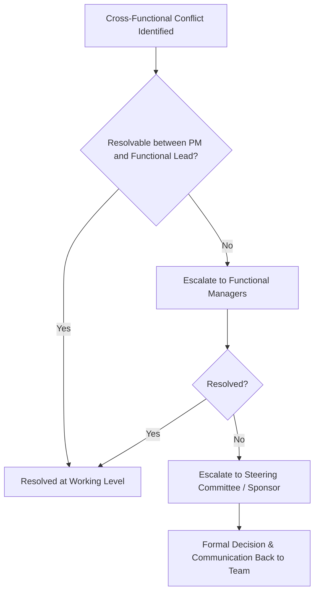

## Coordinating Cross Functional Teams

### Definition and Purpose

Cross-functional team coordination is the discipline of aligning individuals from different departments, specialties, or organizational units — each with distinct priorities, reporting lines, and technical vocabularies — toward a shared project outcome. Unlike single-function teams, cross-functional coordination must actively bridge structural gaps that don't naturally resolve through shared management or shared culture.

**Key Points**

- Team members typically report to functional managers, not the project manager, creating a matrix authority structure
- Success depends more on influence, communication design, and process than on direct authority
- Common in product development, IT/engineering-business initiatives, marketing launches, and organizational transformation projects

### Why Cross-Functional Coordination Is Difficult

- **Divided loyalty:** Team members often prioritize their functional manager's requests over project tasks, especially under competing deadlines.
- **Vocabulary and priority mismatches:** Engineering, marketing, finance, and operations each have different definitions of "done," different risk tolerances, and different success metrics.
- **Asynchronous availability:** Cross-functional members are frequently part-time on the project, splitting attention across multiple initiatives.
- **Invisible dependencies:** Work handoffs between functions (e.g., design → engineering → QA → marketing) are more prone to being dropped or misunderstood than handoffs within a single function.

[Inference] Matrix reporting structures are widely cited as a primary source of the coordination friction described above, since project managers typically lack formal authority over team members' performance reviews or compensation, though the degree of friction varies significantly by organizational culture and how matrix authority is formally defined.

### Organizational Structure Context

| Structure | PM Authority | Coordination Implication |
| --- | --- | --- |
| Functional | Low/None | PM relies almost entirely on negotiation with functional managers |
| Weak Matrix | Low | PM acts more as coordinator/expediter than decision-maker |
| Balanced Matrix | Moderate | Shared authority between PM and functional managers |
| Strong Matrix | High | PM has significant authority; team may be dedicated |
| Projectized | Very High | Team reports directly to PM; least cross-functional friction |

The coordination techniques described in this document are most critical in functional and weak/balanced matrix structures, where the PM's authority over team members is limited or shared.

### Core Coordination Mechanisms

#### 1. Shared Goal Alignment

Establishing a single, unambiguous definition of project success that supersedes (without necessarily overriding) each function's local metrics. Often anchored in the project charter and reinforced at kickoff.

#### 2. RACI and Interface Definition

Mapping not just who does what, but explicitly defining **handoff points** between functions — where one team's output becomes another's input, and what "acceptable" looks like at each interface.

**Example**

| Deliverable | Owning Function | Consuming Function | Handoff Criteria |
| --- | --- | --- | --- |
| UX wireframes | Design | Engineering | Approved by product owner; annotated for edge cases |
| API specification | Engineering | QA | Versioned, includes test data contracts |
| Release notes | Engineering | Marketing | Finalized 5 business days before launch |
| Compliance sign-off | Legal | Operations | Written approval attached to release ticket |

#### 3. Cadence and Ritual Design

Establishing recurring touchpoints calibrated to the coordination need — not every cross-functional dependency requires a daily standup, and over-scheduling meetings across busy functional staff erodes goodwill.

| Ritual | Frequency | Purpose |
| --- | --- | --- |
| Cross-functional standup | Daily/2x weekly | Surface blockers early |
| Dependency review | Weekly | Check handoff status across functions |
| Steering committee | Monthly | Escalate cross-functional conflicts, resource contention |
| Retrospective | Per phase/sprint | Improve coordination process itself |

#### 4. Escalation Pathways

A defined, agreed-upon path for resolving conflicts between functions (e.g., competing priorities, resource contention) before they stall the project. Typically escalates from PM → functional managers → steering committee/sponsor.

### Communication Design for Cross-Functional Teams

- **Establish a shared vocabulary glossary** early, particularly for terms that mean different things across functions (e.g., "release" may mean a code deployment to engineering but a customer-facing launch to marketing).
- **Use a single source of truth for status** (a shared PM tool, dashboard, or wiki) rather than allowing each function to maintain separate, potentially conflicting tracking.
- **Tailor communication format to audience:** Technical teams may want detailed tickets; executives typically want a one-page RAG status summary. Sending identical detail to both audiences reduces engagement from at least one group.
- **Document decisions, not just discussions:** Cross-functional teams are especially prone to "I thought we agreed on X" disputes since attendees interpret verbal discussions through their own functional lens.

### Managing Competing Priorities and Resource Contention

Since cross-functional members often split time across multiple projects, explicit prioritization mechanisms are necessary:

- **Resource allocation agreements** negotiated with functional managers upfront (e.g., "40% of Engineer X's time for the duration of Phase 2"), ideally documented and revisited at phase boundaries.
- **Visible prioritization signals** (e.g., a shared priority list visible to all functional managers) reduce the ambiguity that causes silent deprioritization of the project's tasks.
- **Regular check-ins with functional managers**, not just team members, to catch early signs of reallocation before it affects the schedule.

**Key Points**

- Verbal resource commitments without documentation are a frequent source of later disputes — write down allocation percentages and durations
- A project's priority in one function's queue (e.g., "P2" in engineering) may not match its priority in another's, and this mismatch itself needs surfacing and resolving, not just individual escalation each time it causes delay

### Tools Commonly Used

- **Shared project management platforms** (Jira, Asana, Monday.com, Microsoft Project) providing cross-team visibility into task status and dependencies
- **Shared documentation/wiki spaces** (Confluence, Notion, SharePoint) for glossary, decisions log, and process documentation
- **Dependency/interface tracking boards** — sometimes a dedicated Kanban board specifically for cross-team handoffs, separate from each function's internal work board
- **Dashboarding tools** (Power BI, Tableau, or built-in PM tool dashboards) for executive-level rollup reporting that doesn't require reading into each function's internal tracker

[Unverified] Specific feature capabilities and integration options for these tools change frequently as vendors update their products; current documentation should be consulted for exact cross-team dependency tracking features.

### Building Trust and Team Cohesion Across Functions

- **Joint kickoff and team-building activities:** Establishing personal relationships across functional lines reduces the tendency to view other functions as "them" rather than "us."
- **Rotating meeting ownership/facilitation:** Prevents the appearance that the initiative "belongs" to one function, which can otherwise reduce buy-in from others.
- **Celebrating cross-functional wins publicly:** Reinforces that success is shared rather than attributed to whichever function delivered the most visible piece.
- **Psychological safety:** Team members from less dominant functions (e.g., a single QA representative among many engineers) should feel able to raise concerns without being overridden by numerical or hierarchical majority.

### Common Pitfalls

- **PM assuming authority they don't have:** In functional/weak matrix structures, directives from the PM alone often carry little weight without functional manager buy-in — negotiation, not command, is the primary tool.
- **Underestimating handoff friction:** Assuming work will transfer cleanly between functions without explicit interface definitions leads to rework and blame-shifting when quality gaps surface late.
- **One-size-fits-all cadence:** Applying the same meeting rhythm to all functions regardless of their actual coordination needs, causing meeting fatigue and reduced engagement.
- **Ignoring functional manager relationships:** Focusing coordination efforts entirely on individual contributors while neglecting the functional managers who control resourcing and priority — this often resurfaces as unplanned resource pulls.
- **Conflating "cross-functional" with "self-organizing":** Assuming coordination will happen organically without a structured cadence, RACI, or escalation path, especially in larger initiatives spanning more than a few functions.

### Measuring Coordination Effectiveness

| Indicator | What It Signals |
| --- | --- |
| Handoff cycle time | How quickly work moves cleanly between functions |
| Number of escalations per phase | Frequency of unresolved cross-functional conflict |
| Rework rate at interface points | Quality of handoffs between functions |
| Resource allocation variance | Gap between committed and actual functional time delivered |
| Retrospective sentiment by function | Whether all functions feel equally heard and represented |

### Conclusion

Coordinating cross-functional teams requires compensating for the structural realities of matrix organizations — divided reporting lines, differing priorities, and vocabulary gaps — through deliberate mechanisms rather than assumed alignment. Clear interface definitions, calibrated communication cadence, documented resource agreements, and defined escalation paths convert a loosely connected group of specialists into a coordinated delivery unit. Because the project manager in these settings typically leads through influence rather than formal authority, relationship-building and negotiation skill are as central to success as any process or tool.

**Related Topics**

- Matrix organizational structures and PM authority levels
- RACI matrix development and interface/handoff mapping
- Stakeholder engagement and influence without authority
- Conflict resolution and escalation management
- Resource allocation and capacity planning across functions
- Communication management plans