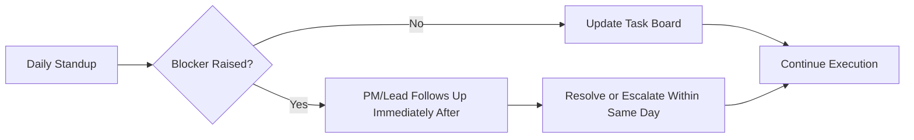

## Managing Day to Day Delivery

### Definition and Purpose

Day-to-day delivery management is the operational discipline of executing a project plan in real time — tracking task progress, resolving blockers, managing team capacity, and maintaining schedule and budget integrity through the countless small decisions that occur between major milestones. It is where the plans produced during initiation and planning are converted into actual, verified progress.

**Key Points**

- Distinct from strategic planning: this is tactical, near-term execution management
- Occurs continuously throughout the execution phase, typically on daily/weekly cycles
- Success is measured by consistent, small-scale course correction rather than large periodic interventions
- Heavily reliant on accurate, timely status information from the team

### Core Daily/Weekly Activities

#### 1. Task and Status Tracking

Monitoring the state of individual work items against the plan — not started, in progress, blocked, or complete — using a shared PM tool as the system of record rather than relying on memory or informal updates.

#### 2. Blocker Identification and Removal

Actively surfacing obstacles preventing progress (missing information, unavailable resources, technical issues, external dependencies) and either resolving them directly or escalating promptly.

#### 3. Team Check-Ins

Regular touchpoints (standups, 1:1s) to understand real progress versus reported progress, catch early warning signs, and maintain team morale and clarity.

#### 4. Schedule and Budget Monitoring

Comparing actual progress against the baseline to detect variance early, before it compounds into a larger deviation that's harder to correct.

#### 5. Stakeholder Communication

Keeping sponsors and stakeholders informed at a cadence and level of detail appropriate to their role, without waiting for formal milestone reporting to surface material issues.

### Daily Standups (Structure and Facilitation)

The standup is the most common day-to-day delivery ritual, whether in agile or traditional project contexts.

**Standard Format (Three Questions)**

1. What did I complete since the last standup?
2. What will I work on until the next standup?
3. What is blocking me?

**Key Points**

- Standups should be timeboxed (typically 15 minutes) and focused on coordination, not problem-solving — detailed technical discussions should be taken offline ("parking lot")
- The PM/Scrum Master's role is to listen for blockers and follow up after the meeting, not to demand justification for every item
- Standups tracking status the PM tool already shows accurately add little value; standups should surface what the tracker doesn't capture — nuance, risk signals, and interpersonal blockers

### Task Board and Status Tracking Conventions

| Status | Definition | Common Pitfall |
| --- | --- | --- |
| Not Started | No work has begun | Tasks sit here longer than planned without visibility into why |
| In Progress | Active work underway | "In progress" for multiple days without incremental detail can mask stalling |
| Blocked | Work cannot continue due to a dependency or obstacle | Blockers left unflagged or unescalated for too long |
| In Review/QA | Work complete, awaiting verification | Review bottlenecks are a common hidden source of delay |
| Done | Verified complete per agreed acceptance criteria | Marking "done" without meeting acceptance criteria creates false progress signals |

**Example**

A task marked "In Progress" for six consecutive days without comment is a signal worth investigating directly rather than assuming steady progress — it may indicate the task is larger than estimated, blocked but unreported, or deprioritized informally by the assignee in favor of other work.

### Variance Detection and Response

Day-to-day delivery management relies on comparing planned versus actual performance frequently enough to catch drift early.

$$SV = EV - PV \qquad CV = EV - AC$$

Where $SV$ is schedule variance, $CV$ is cost variance, $EV$ is earned value, $PV$ is planned value, and $AC$ is actual cost. A negative $SV$ or $CV$ signals the project is behind schedule or over budget respectively.

**Next Steps** (response protocol when variance is detected)

1. Confirm the variance is real and not a data/reporting artifact (e.g., a task marked complete late but actually finished on time).
2. Identify the root cause — resource constraint, underestimation, scope creep, external dependency, technical difficulty.
3. Assess impact on downstream tasks and the critical path.
4. Determine correction options — reallocate resources, adjust scope, apply schedule compression techniques (fast-tracking or crashing), or formally replan.
5. Communicate the variance and correction plan to relevant stakeholders before it becomes visible through missed milestones.
6. Document the variance and resolution for lessons-learned purposes.

### Issue and Risk Management in Daily Operations

Day-to-day delivery is where risks identified during planning either materialize or are avoided, and where new issues (unplanned events already occurring) are logged and triaged.

| Concept | Definition | Day-to-Day Handling |
| --- | --- | --- |
| Risk | A potential future event with uncertain occurrence | Monitor risk register triggers; watch leading indicators |
| Issue | A risk that has materialized, or an unplanned problem | Log immediately; assign owner and target resolution date |
| Action Item | A discrete task arising from a meeting or issue | Track to closure with clear ownership and due date |

**Key Points**

- An issue log distinct from the risk register keeps materialized problems visible and accountable, rather than blending them into general task tracking where urgency can be lost
- Issues without a named owner and target date tend to linger unresolved

### Managing Team Capacity and Workload

- **Monitor for overallocation:** Team members assigned to multiple concurrent tasks or projects can silently become bottlenecks; capacity should be tracked, not assumed.
- **Protect focus time:** Excessive meeting load or context-switching demands measurably reduce delivery throughput; day-to-day management includes actively limiting unnecessary interruptions.
- **Balance short-term pressure with sustainable pace:** Consistently pushing team members to absorb schedule slippage through overtime tends to produce diminishing returns and increased attrition risk over a sustained period. [Inference] The specific threshold at which overtime becomes counterproductive varies by team, task type, and individual, but the general pattern is well documented in project management and organizational behavior literature.

### Communication Cadence for Day-to-Day Delivery

| Audience | Frequency | Format |
| --- | --- | --- |
| Core team | Daily | Standup, chat/tool updates |
| Project sponsor | Weekly or bi-weekly | Status report, brief summary |
| Steering committee | Monthly | Formal status report, RAG dashboard |
| Ad hoc (issues/blockers) | As needed | Direct escalation, not held for the next scheduled update |

**Key Points**

- Material issues (significant schedule risk, budget overrun, scope disputes) should be escalated immediately rather than held for the next scheduled reporting cycle — delayed bad news is consistently worse-received than prompt bad news
- Status reports should distinguish between "on track," "at risk," and "off track" with clear, consistent criteria rather than subjective color assignment that varies report to report

### Tools Commonly Used

- **Kanban/Scrum boards** (Jira, Trello, Azure DevOps, Asana) for visualizing task flow and status
- **Burndown/burnup charts** for tracking remaining work against time in iterative delivery contexts
- **Gantt chart tools** (Microsoft Project, Smartsheet) for traditional schedule tracking against baseline
- **Communication platforms** (Slack, Microsoft Teams) for real-time coordination and blocker escalation
- **Time tracking and capacity planning tools** (Toggl, Harvest, or built-in PM tool capacity views) to monitor team allocation

[Unverified] Specific feature sets and integrations across these tools change frequently as vendors release updates; current product documentation should be consulted for exact capabilities.

### Common Pitfalls

- **Status theater:** Team members reporting "on track" out of habit or to avoid difficult conversations, rather than reflecting true status — undermines the entire tracking system's value.
- **Meeting overload:** Excessive daily/weekly meetings intended to increase visibility can paradoxically reduce actual delivery time available to the team.
- **Reactive-only management:** Spending all available time firefighting active blockers with no time reserved for proactively scanning for emerging risks.
- **Micromanagement:** Excessive granular check-ins on individual task execution can erode trust and autonomy, particularly with experienced team members.
- **Delayed escalation:** Holding known issues until the next scheduled status meeting rather than surfacing them immediately, allowing preventable delay to compound.
- **Ignoring small variances:** Assuming minor day-to-day schedule slips are individually inconsequential, when their cumulative effect over weeks can consume the entire schedule buffer.

### Conclusion

Day-to-day delivery management is the continuous operational work of converting a project plan into realized progress — tracking status honestly, removing blockers quickly, monitoring variance before it compounds, and maintaining calibrated communication with the team and stakeholders. It requires a balance between structured tracking discipline and flexible, responsive judgment, since the volume and pace of daily decisions make rigid over-process as counterproductive as under-process. Sustained project success depends less on any single major intervention and more on the consistent quality of these small, frequent management actions.

**Related Topics**

- Earned Value Management (EVM) and variance analysis
- Risk and issue log management
- Agile ceremonies (standups, sprint reviews, retrospectives)
- Resource capacity planning and workload balancing
- Status reporting and stakeholder communication cadence
- Schedule compression techniques (fast-tracking and crashing)