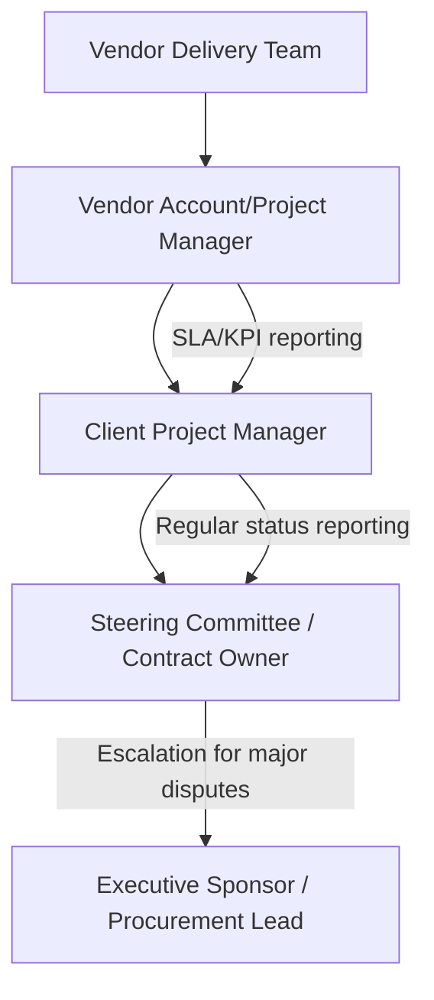

## Managing Vendors During Execution

### Definition and Purpose

Vendor management during execution is the ongoing discipline of overseeing external suppliers, contractors, and service providers to ensure contracted deliverables are provided on time, within budget, and to the agreed quality standard. It extends beyond procurement/contracting (which establishes the relationship) into active performance monitoring, relationship management, and issue resolution throughout the delivery period.

**Key Points**

- Distinct from vendor selection/procurement, which occurs earlier in the project lifecycle
- Requires balancing contractual enforcement with collaborative relationship management
- Vendor performance issues often surface project risk that the internal team cannot directly control
- Applies to product vendors, service contractors, consultants, and outsourced delivery teams alike

### Vendor Relationship Types and Contract Models

| Contract Type | Description | Execution Implication |
| --- | --- | --- |
| Fixed Price (FP) | Vendor delivers defined scope for a set price | Scope changes require formal change orders; vendor bears cost risk of overruns |
| Time and Materials (T&M) | Client pays for actual hours/materials used | Requires close monitoring of hours billed versus progress achieved |
| Cost Reimbursable | Client reimburses vendor costs plus a fee | Requires detailed cost tracking and audit rights |
| Fixed Price Incentive Fee (FPIF) | Fixed price with incentive/penalty tied to performance targets | Requires clear, measurable performance metrics defined upfront |

[Inference] The choice of contract type made during procurement significantly shapes which execution-phase management behaviors matter most — for example, T&M contracts demand more granular hour/output tracking than fixed-price contracts, where the vendor bears more of the delivery risk directly.

### Core Vendor Management Activities During Execution

#### 1. Performance Monitoring Against SLAs and KPIs

Tracking vendor output against agreed Service Level Agreements (SLAs) and Key Performance Indicators (KPIs) established in the contract or statement of work (SOW).

**Example**

| Metric | Target | Monitoring Frequency |
| --- | --- | --- |
| On-time delivery rate | ≥95% of milestones on schedule | Monthly |
| Defect/rework rate | <5% of deliverables requiring rework | Per deliverable |
| Response time to issues | <24 hours for critical issues | Continuous |
| Invoice accuracy | 100% match to contracted rates/scope | Per billing cycle |

#### 2. Deliverable Acceptance and Quality Review

Formal review and sign-off process for vendor deliverables against agreed acceptance criteria, typically involving a defined review window and documented approval or rejection with reasons.

#### 3. Invoice and Payment Management

Verifying invoiced amounts match contracted rates, delivered scope, and approved change orders before authorizing payment — a control point that also surfaces scope or billing discrepancies early.

#### 4. Change Order Management

Formal process for modifying vendor scope, cost, or schedule, requiring documented approval from both parties before work proceeds under the new terms.

#### 5. Risk and Issue Escalation

Tracking vendor-related risks (e.g., single-vendor dependency, financial instability, key personnel turnover on the vendor side) and issues (e.g., missed milestones, quality defects) with the same discipline applied to internal risks and issues.

### Vendor Governance Structure

**Key Points**

- A single named point of contact on both sides (client PM and vendor account/project manager) reduces miscommunication compared to ad hoc multi-person contact
- Escalation paths should be defined in the contract/SOW, not improvised when a dispute arises

### Vendor Governance Cadence

| Activity | Frequency | Participants |
| --- | --- | --- |
| Operational check-in | Weekly | Client PM, vendor delivery lead |
| Performance/SLA review | Monthly | Client PM, vendor account manager |
| Steering/relationship review | Quarterly | Sponsors, procurement, senior vendor leadership |
| Contract/SOW review | Per contract term or annually | Procurement, legal, project sponsor |

### Managing Vendor Risk

Common vendor-related risks and mitigation approaches:

- **Single-vendor dependency:** Mitigated through documented fallback plans, escrow arrangements for critical IP/code, or dual-sourcing for critical components where feasible.
- **Vendor financial instability:** Monitored through periodic financial health checks (where contractually permitted) and awareness of industry signals (layoffs, executive departures, negative press).
- **Key personnel turnover on the vendor side:** Mitigated by requiring knowledge transfer documentation and, where negotiated, key-person clauses in the contract requiring notice or replacement approval rights.
- **Scope creep via informal requests:** Prevented by routing all scope changes through formal change control rather than allowing direct, undocumented requests to vendor staff.
- **Quality drift over the contract lifecycle:** Addressed through consistent, ongoing deliverable review rather than only reviewing quality at major milestones.

### Handling Vendor Performance Issues

**Next Steps** (escalation protocol)

1. Document the specific performance gap against the contracted SLA/KPI or deliverable specification, with dates and evidence.
2. Raise the issue directly with the vendor's project/account manager, referencing the specific contractual term breached.
3. Request a documented corrective action plan with a specific timeline.
4. Monitor the corrective action plan closely; if performance does not improve, escalate to the vendor's senior leadership and internal steering committee.
5. If the relationship remains materially non-compliant, engage procurement/legal to assess contractual remedies (penalties, termination clauses, or replacement vendor sourcing).
6. Document the full issue history for future vendor evaluation and sourcing decisions.

**Key Points**

- Verbal warnings without documentation weaken any later contractual dispute or termination case
- Addressing performance issues early and directly, rather than accumulating frustration, generally preserves the working relationship better than delayed confrontation

### Vendor Communication Best Practices

- **Maintain a single source of truth for scope and requirements** shared with the vendor (a shared SOW repository, requirements tracker) to prevent divergence between what the client believes was agreed and what the vendor is executing against.
- **Communicate changes formally**, even when the relationship is informal and friendly — undocumented verbal changes are a leading cause of scope and billing disputes.
- **Provide timely feedback on deliverables** within the review window specified in the contract; delayed feedback from the client side can itself become a schedule risk the vendor is not responsible for.
- **Treat vendor staff as an extension of the team where appropriate** (for embedded/staff-augmentation arrangements) to maintain morale and delivery quality, while still respecting the contractual boundary of the relationship.

### Multi-Vendor Coordination

When multiple vendors contribute to the same project, additional coordination mechanisms are needed:

- **Interface/dependency mapping between vendors:** Defining explicitly which vendor delivers what to whom, similar to cross-functional handoff mapping, but formalized contractually where possible.
- **Joint vendor coordination meetings:** Bringing multiple vendors together (where competitively appropriate) to resolve shared dependencies directly rather than relaying information solely through the client PM.
- **Clear ownership of integration risk:** Determining upfront who is accountable when a defect arises at the boundary between two vendors' work, since each vendor may otherwise attribute the issue to the other.

[Unverified] Whether joint multi-vendor meetings are appropriate can depend on competitive sensitivities between vendors (e.g., competitors in the same industry); this determination is typically made case-by-case with procurement/legal input.

### Common Pitfalls

- **Under-monitoring T&M contracts:** Assuming vendor-reported hours reflect efficient progress without independent verification against deliverable status.
- **Over-reliance on the vendor relationship manager's self-reported status:** Not independently validating status through deliverable review or direct technical team contact.
- **Scope creep through informal channels:** Allowing internal team members to request "small" additional work directly from vendor staff without going through change control, which accumulates into significant uncompensated (or disputed) scope.
- **Delayed escalation of performance issues:** Allowing repeated missed milestones to continue without formal documentation until the relationship has deteriorated significantly.
- **Poor knowledge transfer planning:** Failing to require documentation and transition planning until the vendor contract is ending, risking loss of institutional knowledge.
- **Ignoring the payment-performance link:** Continuing to approve invoices at full value despite known unresolved performance issues, which weakens later leverage in dispute resolution.

### Conclusion

Managing vendors during execution requires the same rigor applied to internal team management — clear performance tracking, disciplined communication, and structured escalation — combined with the added complexity of contractual boundaries and a business relationship extending beyond any single project. Establishing clear governance cadence, formal change control, and documented performance monitoring from the outset of execution reduces the likelihood of disputes and positions the project team to resolve issues collaboratively before they require contractual remedies.

**Related Topics**

- Procurement management and contract types (FP, T&M, cost-reimbursable)
- Statement of Work (SOW) development
- Service Level Agreements (SLAs) and KPI design
- Change control and change order processes
- Vendor risk assessment and dual-sourcing strategies
- Contract closeout and vendor performance evaluation