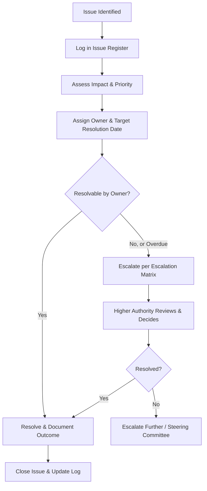

## Issue Management and Escalation

### Definition and Purpose

Issue management is the structured process of identifying, logging, prioritizing, resolving, and tracking problems that have already occurred and are actively affecting a project — as distinct from risks, which are potential future events. Escalation is the formal mechanism by which unresolved issues are raised to higher levels of authority when they exceed the current owner's ability, authority, or time to resolve.

**Key Points**

- Issues are realized problems; risks are potential problems — the two require related but distinct tracking mechanisms
- An issue is often, but not always, a materialized risk from the risk register
- Effective escalation is a defined process, not an ad hoc reaction to frustration or urgency
- Poor issue management is a common root cause of schedule and budget overruns that trace back to problems left unresolved too long

### Issues vs. Risks vs. Action Items

| Concept | Definition | Example |
| --- | --- | --- |
| Risk | A potential future event with uncertain probability and impact | "Vendor may fail to deliver API access by the agreed date" |
| Issue | A problem that has already occurred and requires resolution | "Vendor has not delivered API access; integration testing is blocked" |
| Action Item | A discrete task assigned to resolve part of an issue or follow up on a decision | "Contact vendor account manager to confirm revised delivery date" |

[Inference] Conflating risks and issues into a single log is a common practical mistake, since it can cause active problems to receive the same lower-urgency review cadence typically applied to risk monitoring, though the specific impact depends on how rigorously the combined log is actually reviewed.

### The Issue Management Lifecycle

### Issue Register Components

An issue log/register is the central tracking artifact and typically includes:

| Field | Purpose |
| --- | --- |
| Issue ID | Unique identifier for tracking and reference |
| Description | Clear statement of the problem |
| Date raised | When the issue was identified |
| Raised by | Who identified it |
| Priority/Severity | Urgency and impact classification |
| Owner | Individual accountable for driving resolution |
| Target resolution date | Deadline for action |
| Status | Open, in progress, escalated, resolved, closed |
| Resolution/outcome | What was done and the result |
| Related risk (if applicable) | Link to the risk register entry, if the issue originated as a materialized risk |

**Example**

| ID | Description | Priority | Owner | Target Date | Status |
| --- | --- | --- | --- | --- | --- |
| ISS-014 | Vendor API access not delivered; blocks integration testing | High | Client PM | 2026-09-15 | Escalated |
| ISS-015 | Key developer unavailable due to reassignment by functional manager | Medium | Functional Manager | 2026-09-18 | In Progress |
| ISS-016 | Test environment configuration mismatch causing failed builds | Low | QA Lead | 2026-09-12 | Resolved |

### Issue Prioritization (Severity/Impact Classification)

A common approach classifies issues along impact and urgency dimensions to determine response speed.

| Priority | Definition | Response Expectation |
| --- | --- | --- |
| Critical | Blocks project progress entirely or poses severe business/safety/compliance risk | Immediate response, same-day escalation if unresolved |
| High | Significantly affects schedule, cost, or quality if unresolved | Response within 24 hours |
| Medium | Moderate impact; manageable within normal working cadence | Response within a few business days |
| Low | Minor impact; can be addressed as capacity allows | Addressed in normal task flow |

[Unverified] Specific response time thresholds vary considerably by organization, industry, and project type (e.g., safety-critical industries typically apply stricter thresholds than internal process improvement projects); the categories above represent common practice rather than a universal standard.

### Escalation Matrix Design

An escalation matrix formalizes who is authorized to resolve issues at each severity/impact level and the timeframe within which escalation to the next level should occur if unresolved.

**Example**

| Level | Authority | Scope of Decision | Escalation Trigger |
| --- | --- | --- | --- |
| 1 | Team Lead / Project Coordinator | Day-to-day task-level issues | Unresolved after 1 business day |
| 2 | Project Manager | Cross-team issues, minor scope/schedule adjustments | Unresolved after 2–3 business days, or exceeds PM authority |
| 3 | Sponsor / Steering Committee | Budget reallocation, major scope change, vendor disputes | Unresolved after committee review, or strategic/contractual impact |
| 4 | Executive Sponsor / Senior Leadership | Organization-wide impact, contract termination, major reputational risk | Reserved for the most severe or unresolved critical issues |

**Key Points**

- Defining the escalation matrix during planning (not improvising it during a crisis) ensures issues move through the right channel quickly under pressure
- Each level should have a clear time-based trigger, not just a severity-based one, to prevent issues from silently stalling at a level where the owner lacks authority or bandwidth

### How to Escalate Effectively

**Next Steps** (escalation communication protocol)

1. **State the issue clearly and factually** — avoid framing that assigns blame before the facts are established.
2. **Quantify the impact** — schedule delay, cost impact, quality risk, or downstream dependency effects, using concrete figures where possible.
3. **Summarize what has already been tried** — demonstrates the issue has exhausted the current owner's authority or options rather than being escalated prematurely.
4. **Propose options, not just the problem** — presenting 2–3 possible resolutions (even with trade-offs) is more actionable for the escalation recipient than a bare problem statement.
5. **Specify the decision or action needed and by when** — vague escalations ("just wanted to flag this") often fail to produce timely action.
6. **Follow up in writing** — even after a verbal escalation conversation, document the outcome and next steps.

**Example**

A well-formed escalation message: "The vendor has missed the API access delivery date by 5 business days, blocking integration testing and putting the September 30 milestone at risk of a 1-week slip. We have followed up twice with the vendor's account manager without a firm new date. I recommend either (a) escalating directly to the vendor's delivery director this week, or (b) temporarily reprioritizing the QA team to test against a mocked API to preserve schedule. I need a decision by end of day Thursday to keep the milestone achievable."

### Common Escalation Anti-Patterns

- **Escalating too early:** Raising an issue to senior leadership before working-level resolution attempts have been made, which can undermine confidence in the team's ability to self-manage.
- **Escalating too late:** Holding onto an issue in hopes of resolving it independently until the delay has already caused irreversible schedule or cost impact.
- **Escalating without options:** Presenting only the problem, forcing the recipient to invest time understanding context before any decision can even be considered.
- **Skipping levels inappropriately:** Bypassing the direct manager or PM to go straight to the sponsor, which can damage working relationships even if well-intentioned.
- **Using escalation as a blame mechanism:** Framing escalation primarily around assigning fault rather than resolving the problem, which increases defensiveness and slows resolution.

### Issue Review Cadence

| Review Type | Frequency | Focus |
| --- | --- | --- |
| Daily standup | Daily | New blockers surfaced informally |
| Issue log review | Weekly | Status of all open issues, aging analysis |
| Steering committee | Monthly (or as triggered) | Escalated issues requiring senior decision |

**Key Points**

- Tracking issue **age** (time since raised) alongside priority helps surface issues that are quietly stalling despite not being formally escalated
- An issue with no status update in over a week, regardless of stated priority, warrants direct follow-up with its owner

### Root Cause Analysis and Prevention

Beyond resolving the immediate issue, mature issue management includes analyzing recurring patterns to prevent similar issues:

- **Categorize resolved issues by root cause** (e.g., vendor delay, resource conflict, requirements ambiguity, technical defect) to identify systemic patterns.
- **Feed recurring root causes into the risk register** for future projects or later phases — if the same category of issue recurs repeatedly, it likely represents an underlying risk that should be proactively managed rather than repeatedly reacted to.
- **Include issue trends in retrospectives/lessons learned** so process improvements address root causes, not just symptoms.

### Tools Commonly Used

- **Dedicated issue tracking within PM tools** (Jira, Azure DevOps, Monday.com) often using a distinct issue type separate from standard tasks
- **Shared issue log spreadsheets or trackers** for smaller projects without a dedicated PM tool
- **Dashboard/reporting tools** for visualizing issue aging, priority distribution, and escalation status at a glance
- **Steering committee reporting templates** that summarize only escalated/high-priority issues rather than the full log, to keep senior review efficient

[Unverified] Exact tracking features (custom issue types, automated escalation triggers, aging alerts) vary by tool and licensing tier and should be confirmed against current vendor documentation.

### Common Pitfalls

- **No formal issue log:** Relying on memory, email threads, or scattered chat messages to track issues, causing items to be forgotten or duplicated.
- **Issues without owners:** Logging a problem without assigning clear accountability, resulting in no one driving it to resolution.
- **Static severity assessment:** Failing to re-evaluate an issue's priority as circumstances change (an issue that was low priority initially may become critical as a deadline approaches).
- **No defined escalation path:** Improvising escalation during a crisis rather than following a pre-agreed matrix, leading to inconsistent, relationship-dependent outcomes.
- **Closing issues prematurely:** Marking an issue resolved before verifying the underlying problem is actually fixed, only to have it resurface later.
- **Escalation fatigue:** Escalating too many low-priority issues, causing senior stakeholders to disengage from the escalation process entirely, which then delays response when a genuinely critical issue arises.

### Conclusion

Issue management and escalation provide the structured mechanism for surfacing, resolving, and learning from problems that inevitably arise during project execution. A well-designed issue log paired with a clear, pre-defined escalation matrix ensures problems are addressed at the appropriate level of authority and urgency, rather than stalling with an owner who lacks the power to resolve them or bypassing levels in a way that damages working relationships. Consistent application of prioritization criteria, timely and well-structured escalation communication, and root cause analysis of resolved issues together reduce both the frequency and impact of problems over the life of the project.

**Related Topics**

- Risk register development and risk response planning
- RACI matrices and decision authority mapping
- Status reporting and steering committee governance
- Root cause analysis techniques (5 Whys, fishbone diagrams)
- Change control processes
- Lessons learned and retrospectives