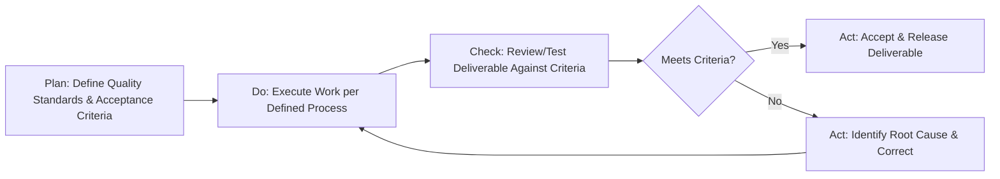

## Deliverable Quality Assurance

### Definition and Purpose

Deliverable quality assurance (QA) is the systematic set of activities performed throughout project execution to ensure deliverables meet defined quality standards, acceptance criteria, and stakeholder requirements before they are accepted or released. It encompasses both process-oriented quality assurance (ensuring the right process is followed to produce quality) and product-oriented quality control (verifying the output itself meets specifications).

**Key Points**

- Quality Assurance (QA) is proactive and process-focused; Quality Control (QC) is reactive and product-focused — the two are complementary, not interchangeable
- Quality standards should be defined during planning, not improvised during review
- Poor deliverable quality is a leading cause of rework, schedule slippage, and stakeholder trust erosion
- Applies to tangible deliverables (software, documents, physical products) and intangible outcomes (processes, training, organizational change)

### Quality Assurance vs. Quality Control

| Aspect | Quality Assurance (QA) | Quality Control (QC) |
| --- | --- | --- |
| Focus | Process — preventing defects | Product — detecting defects |
| Timing | Throughout the project lifecycle | At specific checkpoints on completed work |
| Orientation | Proactive | Reactive |
| Example Activity | Establishing a peer review process | Conducting the peer review on a specific deliverable |
| Owner | Often a dedicated QA role or process owner | Often the reviewer, tester, or inspector |

[Inference] The QA/QC distinction is standard across most project quality frameworks (including PMBOK), though in smaller projects the same individual or small team often performs both functions without a formal separation of roles.

### The Quality Management Cycle (Plan-Do-Check-Act)

### Defining Quality Standards and Acceptance Criteria

Quality standards must be specific, measurable, and agreed upon before work begins — vague standards ("high quality," "professional-looking") cannot be objectively verified.

**Example**

| Deliverable | Vague Standard (Avoid) | Specific Acceptance Criteria (Use) |
| --- | --- | --- |
| Software feature | "Works well" | "Passes all defined unit and integration tests; handles specified edge cases; page load under 2 seconds" |
| Client report | "Professional quality" | "Follows brand style guide; zero grammatical errors; approved by two reviewers before delivery" |
| Training materials | "Effective training" | "Covers all specified learning objectives; post-training assessment score ≥80% for 90% of participants" |

**Key Points**

- Acceptance criteria should be documented and agreed with the deliverable's ultimate approver before work begins, not negotiated after the fact
- Ambiguous or missing acceptance criteria is a frequent root cause of "this isn't what we asked for" disputes late in the project

### Common Quality Assurance Techniques

#### 1. Peer Review and Walkthroughs

Structured review of work-in-progress or completed deliverables by colleagues, catching defects earlier and cheaper than downstream detection.

#### 2. Checklists

Standardized lists of required characteristics or steps, ensuring consistency and reducing reliance on memory for recurring quality checks (e.g., a pre-release checklist, a document quality checklist).

#### 3. Quality Audits

Independent, structured review of whether project processes are being followed as defined — distinct from reviewing the deliverable itself; audits assess adherence to the *process* meant to produce quality.

#### 4. Testing (for technical deliverables)

Includes unit testing, integration testing, system testing, and user acceptance testing (UAT), each targeting different levels of the deliverable's correctness and fitness for use.

#### 5. Statistical Sampling

For high-volume deliverables where 100% inspection is impractical, a representative sample is inspected and results are extrapolated, commonly using control charts or acceptance sampling methods.

#### 6. Root Cause Analysis Tools

- **Fishbone (Ishikawa) diagram:** Visually organizes potential causes of a defect into categories (people, process, materials, equipment, environment, measurement).
- **5 Whys:** Iteratively asks "why" to trace a defect back to its underlying root cause rather than stopping at the symptom.
- **Pareto analysis:** Identifies the small number of defect causes responsible for the majority of quality issues (the "80/20" principle).

### Quality Review Workflow

**Next Steps** (procedural)

1. **Define acceptance criteria** for the deliverable during planning, agreed with the approver.
2. **Establish the review/testing method** appropriate to the deliverable type (peer review, automated tests, formal inspection).
3. **Execute the review at the defined checkpoint** — not only at final delivery, but at interim milestones where feasible to catch defects early.
4. **Document findings** — specific, actionable feedback rather than vague dissatisfaction.
5. **Track defects/rework items** to closure with assigned owners and target dates, similar to issue management.
6. **Re-review corrected work** before final acceptance, rather than assuming a single correction pass resolves all findings.
7. **Formally sign off** once criteria are met, creating a documented acceptance record.

### Cost of Quality Framework

Quality-related costs are typically categorized into four groups, illustrating the economic case for proactive QA over reactive defect correction.

| Category | Type | Example |
| --- | --- | --- |
| Prevention Costs | Cost of conformance | Training, process documentation, quality planning |
| Appraisal Costs | Cost of conformance | Testing, inspections, audits |
| Internal Failure Costs | Cost of nonconformance | Rework, scrap, delays caught before delivery |
| External Failure Costs | Cost of nonconformance | Warranty claims, reputational damage, client-reported defects |

$$\text{Cost of Quality} = \text{Prevention} + \text{Appraisal} + \text{Internal Failure} + \text{External Failure}$$

**Key Points**

- Failure costs (especially external) are generally far more expensive than prevention and appraisal costs, providing the economic rationale for investing in upfront QA processes
- [Inference] The often-cited principle that catching a defect earlier is cheaper than catching it later is well-supported in software engineering and manufacturing quality literature, though the exact cost multiplier varies significantly by industry, defect type, and how "cost" is measured.

### Defect Tracking and Severity Classification

| Severity | Definition | Example | Typical Response |
| --- | --- | --- | --- |
| Critical | Deliverable unusable or violates safety/compliance requirements | Application crashes on core function; safety hazard in physical product | Immediate halt to release; fix before any further progress |
| Major | Significant functional or quality gap | Key feature doesn't work as specified | Fix required before acceptance |
| Minor | Limited impact on function or usability | Cosmetic issue, minor wording error | May be logged for a future release with approver agreement |
| Cosmetic | No functional impact | Formatting inconsistency | Lowest priority; often batched for efficiency |

### Quality Assurance Roles and Responsibilities

| Role | Typical Responsibility |
| --- | --- |
| Project Manager | Ensures quality processes are planned, resourced, and followed; escalates unresolved quality issues |
| Quality Assurance Lead/Team | Defines and audits adherence to quality processes; may conduct independent reviews |
| Subject Matter Experts (SMEs) | Provide technical review of deliverable accuracy and completeness |
| Deliverable Approver/Sponsor | Formally accepts or rejects the deliverable against agreed criteria |
| Delivery Team | Produces the deliverable and performs initial self-review/testing |

### Formal Deliverable Sign-Off

A documented acceptance process protects both the project team and the client/sponsor by creating a clear record of when and by whom a deliverable was formally accepted.

**Example**

A sign-off record typically includes: deliverable name/version, acceptance criteria referenced, reviewer name and role, date of review, outcome (accepted/accepted with conditions/rejected), and any noted exceptions or follow-up items.

**Key Points**

- Informal or verbal-only acceptance ("looks good, thanks") creates ambiguity later if quality disputes arise
- Conditional acceptance (accepted with noted minor issues to be resolved later) should still be documented explicitly, including the agreed resolution timeline

### Common Pitfalls

- **Defining quality standards after work begins:** Leads to disputes about whether a deliverable meets a standard that was never clearly agreed upon in advance.
- **Testing only at the end:** Deferring all quality verification to final delivery rather than incremental checkpoints increases the cost and schedule impact of any defects found.
- **Skipping peer review under schedule pressure:** A common but risky trade-off, since defects caught late are typically more expensive to fix than those caught early.
- **Inconsistent acceptance criteria interpretation:** Different reviewers applying different personal standards rather than the documented, agreed criteria.
- **No defect tracking discipline:** Verbally noting issues without logging and tracking them to closure, resulting in unresolved quality gaps that resurface later.
- **Confusing "accepted" with "perfect":** Treating any signed-off deliverable as immune from future quality discussion, rather than recognizing that acceptance reflects meeting the criteria defined at that time.

### Conclusion

Deliverable quality assurance combines proactive process discipline (QA) with reactive product verification (QC) to ensure work meets defined, measurable standards before acceptance. Establishing clear acceptance criteria during planning, applying appropriate review and testing techniques throughout execution rather than only at the end, and maintaining disciplined defect tracking and formal sign-off collectively reduce rework, protect stakeholder trust, and lower the overall cost of quality across the project.

**Related Topics**

- Quality management planning and the Cost of Quality framework
- User Acceptance Testing (UAT) design and execution
- Root cause analysis techniques (5 Whys, fishbone diagrams, Pareto analysis)
- Defect tracking and severity classification systems
- Deliverable acceptance and formal sign-off processes
- Continuous improvement and quality audits