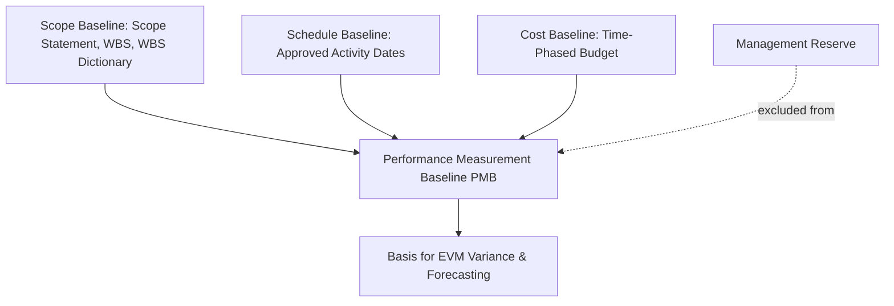
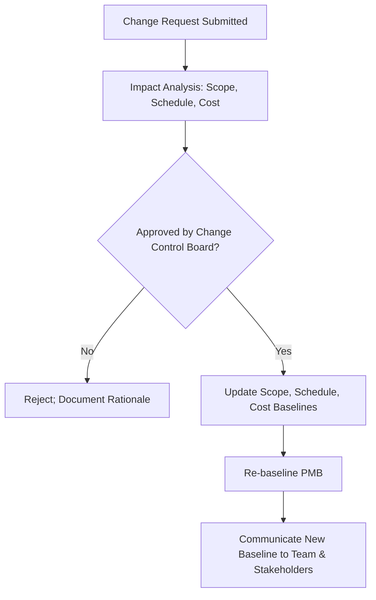

## Performance Measurement Baselines

### Definition and Purpose

The Performance Measurement Baseline (PMB) is the approved, integrated scope-schedule-cost plan against which actual project execution is measured to detect and manage variance. It serves as the fixed reference point for objectively assessing whether a project is on track, ahead, or behind — enabling variance analysis, forecasting, and performance reporting throughout execution.

**Key Points**

- The PMB integrates three baselines: scope, schedule, and cost — it is not cost alone
- Changes to the PMB require formal change control; it is not adjusted informally as work progresses
- Management reserve is explicitly excluded from the PMB, while contingency reserve is included
- The PMB is the foundation for Earned Value Management (EVM) calculations

### Components of the Performance Measurement Baseline

#### 1. Scope Baseline

Comprises the approved project scope statement, Work Breakdown Structure (WBS), and WBS dictionary. Defines exactly what work is included (and excluded) in the project.

#### 2. Schedule Baseline

The approved version of the project schedule, including start/finish dates for all activities, used to compare against actual schedule performance.

#### 3. Cost Baseline

The approved, time-phased budget (excluding management reserve) used to measure and monitor cost performance, typically expressed as an S-curve showing cumulative planned spend over time.

$$PMB = \text{Scope Baseline} + \text{Schedule Baseline} + \text{Cost Baseline (time-phased)}$$

### PMB and Budget Hierarchy

Understanding where the PMB sits within the overall project budget structure clarifies what is and isn't subject to performance measurement.

$$\text{Cost Baseline} = \sum \text{Work Package Estimates} + \text{Contingency Reserve}$$

$$\text{Total Project Budget} = \text{Cost Baseline (PMB)} + \text{Management Reserve}$$

| Component | Included in PMB? | Controlled By |
| --- | --- | --- |
| Work package cost estimates | Yes | Project Manager |
| Contingency reserve | Yes | Project Manager (within delegated authority) |
| Management reserve | No | Sponsor/senior management |

**Key Points**

- This distinction matters directly for EVM: Budget at Completion (BAC) is based on the PMB, and management reserve draws require formal baseline change before being reflected in performance metrics
- Conflating management reserve into the PMB obscures true cost performance and can mask genuine overruns

### The S-Curve (Cumulative Cost Baseline)

The cost baseline is typically visualized as an S-curve — cumulative planned value (PV) plotted against time — reflecting the natural pattern of slower spending at project start and end, with acceleration in the middle execution phase.

<svg xmlns="http://www.w3.org/2000/svg" viewBox="0 0 640 380">
<title>Cost Baseline S-Curve (svg_diagram)</title>
<rect x="60" y="20" width="540" height="300" fill="#ffffff" stroke="#333" stroke-width="1" />
<line x1="60" y1="320" x2="600" y2="320" stroke="#000" stroke-width="1.5" />
<line x1="60" y1="20" x2="60" y2="320" stroke="#000" stroke-width="1.5" />

<text x="330" y="355" font-size="13" text-anchor="middle" fill="#333" font-family="sans-serif">Time</text>

<text x="25" y="170" font-size="13" text-anchor="middle" fill="#333" font-family="sans-serif" transform="rotate(-90 25 170)">Cumulative Cost</text>

<path d="M 60 320 C 150 310, 220 280, 280 220 C 340 150, 380 90, 440 55 C 480 40, 550 30, 600 25" fill="none" stroke="`#2c5aa0`" stroke-width="3" />

<text x="500" y="45" font-size="12" fill="`#2c5aa0`" font-family="sans-serif">Planned Value (PV) - Baseline</text>

<path d="M 60 320 C 150 312, 220 290, 280 250 C 340 200, 380 140, 440 100 C 480 75, 540 55, 590 45" fill="none" stroke="`#c0392b`" stroke-width="2.5" stroke-dasharray="6,4" />

<text x="440" y="120" font-size="12" fill="`#c0392b`" font-family="sans-serif">Actual Cost (AC)</text>

<text x="90" y="40" font-size="11" fill="#666" font-family="sans-serif">Slow Start</text>

<text x="330" y="180" font-size="11" fill="#666" font-family="sans-serif">Rapid Execution</text>

<text x="500" y="65" font-size="11" fill="#666" font-family="sans-serif">Closeout Taper</text>

</svg>

The characteristic S-shape reflects gradual ramp-up during initiation/planning, steep spend during peak execution, and a taper during closeout — deviations from this expected shape (e.g., a flat middle section) often signal a stalled project.

### Establishing the Baseline

**Next Steps** (procedural)

1. **Finalize the WBS and scope statement**, ensuring all in-scope work is decomposed to a manageable level (typically work packages).
2. **Develop activity-level cost and duration estimates** for each work package using appropriate estimating techniques (analogous, parametric, three-point, bottom-up).
3. **Sequence activities and build the network diagram**, establishing the schedule baseline through critical path calculation.
4. **Time-phase the budget** by distributing work package costs across the schedule to produce the cumulative cost baseline (S-curve).
5. **Add contingency reserve** based on quantitative or qualitative risk analysis, keeping it within the cost baseline.
6. **Obtain formal approval** from the sponsor/steering committee, converting the plan from a draft into the approved PMB.
7. **Baseline the plan in the PM tool** (e.g., saving a baseline snapshot in Microsoft Project or Primavera P6) so subsequent tracking can compare actual progress against this fixed reference.

### Using the PMB for Variance Analysis (EVM Integration)

Once established, the PMB provides the "planned value" (PV) reference against which Earned Value (EV) and Actual Cost (AC) are compared.

$$SV = EV - PV \qquad CV = EV - AC$$

$$SPI = \frac{EV}{PV} \qquad CPI = \frac{EV}{AC}$$

Where $SV$/$SPI$ measure schedule performance and $CV$/$CPI$ measure cost performance relative to the baseline. An $SPI$ or $CPI$ below 1.0 indicates underperformance relative to the baseline plan.

**Example**

If a project's cost baseline (PV) at a given point calls for $100,000 of work to be completed, but only $80,000 worth of planned work has actually been earned (EV) at an actual cost (AC) of $95,000:

- $SV = 80{,}000 - 100{,}000 = -20{,}000$ (behind schedule)
- $CV = 80{,}000 - 95{,}000 = -15{,}000$ (over budget)
- $SPI = 80{,}000 / 100{,}000 = 0.80$
- $CPI = 80{,}000 / 95{,}000 \approx 0.84$

Both indices below 1.0 indicate the project is behind schedule and over budget relative to its PMB.

### Baseline Change Control

The PMB is not static once approved — legitimate scope changes require it to be revised — but changes must go through formal control rather than informal adjustment.

**Key Points**

- Rebaselining should be infrequent and well-documented; excessive rebaselining undermines the PMB's value as a stable performance reference
- A distinction is often maintained between the original baseline (for historical variance analysis) and the current baseline (for ongoing performance tracking), particularly in regulated or contractually governed projects

### Common Baseline Types and Their Relationship

| Baseline Term | Description |
| --- | --- |
| Original Baseline | The first approved PMB, preserved for historical comparison |
| Current Baseline | The most recently approved PMB, reflecting all approved changes |
| Revised Baseline | A baseline updated following a formally approved change |

[Inference] Retaining the original baseline alongside the current baseline is standard practice in earned value management maturity models and many government/defense contracting frameworks (e.g., those aligned with ANSI/EIA-748), though the degree of formality required varies by contract type and organizational EVM maturity.

### Common Pitfalls

- **Baselining too early:** Establishing the PMB before scope, estimates, or the schedule network are sufficiently mature results in a baseline that requires immediate, frequent revision — undermining its credibility as a stable reference.
- **Informal rebaselining:** Adjusting the baseline without formal change control simply because the project has drifted from it, which erases the ability to detect genuine variance.
- **Excluding contingency reserve incorrectly:** Placing contingency reserve outside the PMB (confusing it with management reserve) distorts cost performance indices.
- **Ignoring the schedule baseline in favor of cost only:** Some organizations track cost baseline rigorously while neglecting schedule baseline comparison, missing schedule-driven risk that hasn't yet manifested as cost variance.
- **Treating the PMB as immutable when legitimate change occurs:** Refusing to formally rebaseline after major approved scope changes leads to persistently reported variance that reflects outdated scope rather than genuine performance issues.

### Conclusion

The Performance Measurement Baseline is the integrated scope, schedule, and cost reference point that makes objective performance measurement possible throughout project execution. By clearly separating the PMB (with its included contingency reserve) from management reserve, and by governing changes through formal control rather than informal drift, the PMB remains a credible, stable foundation for Earned Value Management, variance analysis, and forecasting — enabling the project team and stakeholders to base decisions on measured performance rather than subjective impressions of progress.

**Related Topics**

- Earned Value Management (EVM): EV, PV, AC, SPI, CPI
- Contingency and management reserve planning
- Work Breakdown Structure (WBS) and WBS dictionary development
- Schedule network diagramming and critical path method
- Change control processes and change control boards
- Forecasting techniques (EAC, ETC, TCPI)