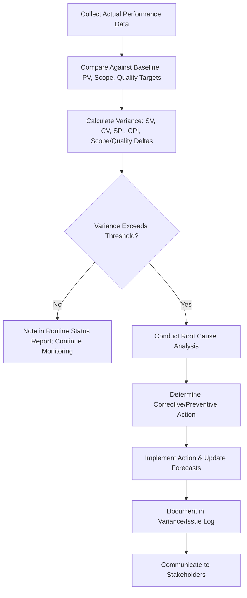

## Variance Analysis

### Definition and Purpose

Variance analysis is the technique of determining the cause and degree of difference between baseline (planned) performance and actual performance, then deciding whether corrective or preventive action is required. It is the analytical core of project monitoring and control, transforming raw status data into actionable insight about schedule, cost, scope, and quality performance.

**Key Points**

- Requires an approved Performance Measurement Baseline (PMB) as the reference point for comparison
- Applies across multiple dimensions: schedule, cost, scope, quality, and resource performance
- The goal is not just detecting variance but understanding root cause and determining response
- Threshold-based variance analysis focuses management attention on deviations significant enough to warrant action

### Types of Variance

| Variance Type | What It Measures | Common Metric |
| --- | --- | --- |
| Schedule Variance | Difference between planned and actual schedule progress | SV, SPI |
| Cost Variance | Difference between planned and actual cost performance | CV, CPI |
| Scope Variance | Difference between approved scope and delivered scope | Change request volume, scope creep indicators |
| Quality Variance | Difference between required and actual quality levels | Defect rates, rework rates |
| Resource Variance | Difference between planned and actual resource utilization | Utilization rate, overallocation instances |

### Earned Value Management (EVM) Formulas for Variance

EVM provides the most widely used quantitative framework for schedule and cost variance analysis, built on three core data points: Planned Value (PV), Earned Value (EV), and Actual Cost (AC).

$$SV = EV - PV$$

$$CV = EV - AC$$

$$SPI = \frac{EV}{PV} \qquad CPI = \frac{EV}{AC}$$

**Interpretation:**

- $SV > 0$ or $SPI > 1.0$: ahead of schedule
- $SV < 0$ or $SPI < 1.0$: behind schedule
- $CV > 0$ or $CPI > 1.0$: under budget
- $CV < 0$ or $CPI < 1.0$: over budget

**Example**

A project has a planned value (PV) of $200,000 at the current reporting date. The earned value (EV) — the budgeted cost of work actually completed — is $170,000, and the actual cost (AC) incurred is $190,000.

- $SV = 170{,}000 - 200{,}000 = -30{,}000$
- $CV = 170{,}000 - 190{,}000 = -20{,}000$
- $SPI = 170{,}000 / 200{,}000 = 0.85$
- $CPI = 170{,}000 / 190{,}000 \approx 0.89$

This indicates the project is behind schedule (only 85% of planned work value delivered) and over budget (spending $1.00 to earn approximately $0.89 of planned value).

### Variance Analysis Workflow

### Variance Thresholds

Organizations typically define acceptable variance thresholds in advance, so minor, expected fluctuations don't trigger unnecessary escalation while significant deviations receive prompt attention.

**Example**

| Threshold Level | SPI/CPI Range | Response |
| --- | --- | --- |
| Green (On Track) | 0.95 – 1.05 | Routine monitoring; no action required |
| Yellow (Watch) | 0.85 – 0.94 or 1.06 – 1.15 | Investigate cause; prepare contingency options |
| Red (Action Required) | Below 0.85 or above 1.15 | Formal corrective action plan; escalate to sponsor |

[Unverified] Specific threshold percentages vary considerably by organization, industry, and project risk tolerance; the ranges shown represent a common illustrative convention rather than a universal standard.

### Root Cause Analysis for Variance

Detecting variance is only the first step — determining *why* it occurred is necessary to select an appropriate response. Common techniques include:

- **5 Whys:** Iteratively asking "why" to trace the variance to its underlying cause rather than stopping at the symptom (e.g., "why is the task late?" → "why was the resource unavailable?" → "why was the resource reassigned?").
- **Fishbone (Ishikawa) diagram:** Organizes potential contributing causes into categories such as people, process, technology, and external factors.
- **Trend analysis:** Reviewing variance over multiple reporting periods to distinguish a one-time anomaly from a systemic, worsening pattern.

### Schedule Variance Analysis Beyond SPI

SPI has a known limitation: it can show favorable values near project completion even when the project is behind schedule, because EV approaches the total budget regardless of actual timeline. Two supplementary techniques address this:

#### Critical Path Variance

Directly comparing actual progress on critical path activities against the schedule baseline, independent of EVM's aggregate SPI calculation. This is often more reliable late in the project since it isolates the activities that actually determine the finish date.

#### Earned Schedule (ES)

An extension to traditional EVM that converts earned value into a time-based measure, addressing SPI's late-project distortion.

$$SPI(t) = \frac{ES}{AT}$$

Where $ES$ is earned schedule (the point in time at which the current EV should have been achieved per the baseline) and $AT$ is actual time elapsed. [Inference] Earned Schedule is generally considered a methodological improvement over traditional SPI for schedule variance analysis, particularly in the later stages of a project, though it is less universally adopted in practice than the standard EVM formulas.

### Cost Variance Analysis and Forecasting

Variance analysis feeds directly into forecasting the likely final cost of the project.

$$EAC = AC + \frac{(BAC - EV)}{CPI}$$

Where $EAC$ (Estimate at Completion) assumes the current cost performance trend continues for remaining work, $BAC$ is Budget at Completion, and the formula divides remaining budgeted work by the current CPI to reflect ongoing performance efficiency.

$$TCPI = \frac{BAC - EV}{BAC - AC}$$

The To-Complete Performance Index ($TCPI$) indicates the cost efficiency required on remaining work to meet the original budget — a $TCPI$ significantly above 1.0 signals that meeting the original BAC may be unrealistic without a substantial performance improvement.

**Example**

Given $BAC = \$500{,}000$, $EV = \$170{,}000$, $AC = \$190{,}000$, $CPI \approx 0.89$:

$$EAC = 190{,}000 + \frac{500{,}000 - 170{,}000}{0.89} \approx 190{,}000 + 370{,}786 \approx \$560{,}786$$

This suggests the project is trending toward a final cost roughly $60,786 over the original budget if current cost performance continues unchanged.

### Scope Variance Analysis

Unlike schedule and cost, scope variance is typically assessed less through a single formula and more through structured comparison:

- **Change request volume and value:** Tracking the cumulative number and cost/schedule impact of approved changes against the original scope baseline.
- **Scope creep indicators:** Informal, unapproved additions to scope that haven't gone through change control — a warning sign distinct from formally approved scope changes.
- **Deliverable completeness checks:** Verifying delivered features/outputs against the original WBS and requirements documentation to detect scope gaps or unauthorized substitutions.

**Key Points**

- Scope variance analysis should distinguish formally approved changes (expected, governed) from scope creep (unplanned, ungoverned) — conflating the two obscures whether the change control process is functioning as intended

### Quality Variance Analysis

Compares actual defect rates, rework frequency, or customer-reported issues against quality targets established during planning.

**Example**

| Metric | Target | Actual | Variance |
| --- | --- | --- | --- |
| Defect rate | <5% of deliverables | 8.5% | Unfavorable — investigate root cause |
| Rework hours | <10% of total effort | 6% | Favorable |
| UAT pass rate | ≥95% first-pass | 91% | Unfavorable — near threshold |

### Presenting Variance Analysis to Stakeholders

Effective variance reporting translates raw numbers into a clear narrative rather than presenting indices without context.

**Next Steps** (reporting approach)

1. Lead with the headline status (on track/at risk/off track) before detailed figures.
2. Present the key variance metrics (SV, CV, SPI, CPI, or scope/quality equivalents) with brief plain-language interpretation.
3. Explain the root cause in accessible terms, avoiding purely technical EVM jargon for non-specialist audiences.
4. State the corrective action already taken or proposed, with expected impact and timeline.
5. Provide an updated forecast (EAC, forecast completion date) reflecting the current trend.

**Key Points**

- Presenting a negative variance without a corresponding action plan tends to generate more stakeholder anxiety and follow-up questions than presenting the same variance alongside a clear response
- Consistency in reporting format across periods allows stakeholders to track trend direction, not just single-period snapshots

### Common Pitfalls

- **Analyzing variance without investigating root cause:** Reporting that SPI is 0.85 without explaining why provides a number but not actionable insight.
- **Ignoring variance trends over single-period snapshots:** A single period's variance may be noise; a consistent multi-period trend is a stronger signal requiring action.
- **Over-reliance on SPI near project completion:** As noted above, SPI converges toward 1.0 near completion regardless of actual schedule performance — critical path variance or Earned Schedule should supplement SPI in later project stages.
- **Conflating scope creep with approved scope change:** Reporting all scope variance as equivalent obscures whether ungoverned scope expansion is occurring.
- **Setting variance thresholds too tight or too loose:** Overly tight thresholds create escalation fatigue from constant minor alerts; overly loose thresholds delay detection of genuine problems.
- **Failing to update forecasts after detecting variance:** Continuing to report the original BAC or finish date as if unaffected, despite clear variance trends, understates risk to stakeholders.

### Conclusion

Variance analysis converts the gap between planned and actual performance into actionable management insight by quantifying the deviation, diagnosing its root cause, and informing a proportionate response. While Earned Value Management formulas (SV, CV, SPI, CPI) provide the primary quantitative toolkit for schedule and cost variance, mature variance analysis also incorporates scope and quality dimensions, supplements SPI with critical path or Earned Schedule analysis in later project stages, and translates technical indices into clear, action-oriented communication for stakeholders. Consistent application of variance thresholds and root cause analysis distinguishes proactive project control from reactive firefighting.

**Related Topics**

- Earned Value Management (EVM) fundamentals and forecasting (EAC, ETC, TCPI)
- Performance Measurement Baseline (PMB) development
- Root cause analysis techniques (5 Whys, fishbone diagrams, Pareto analysis)
- Earned Schedule methodology
- Change control and scope creep management
- Status reporting and stakeholder communication