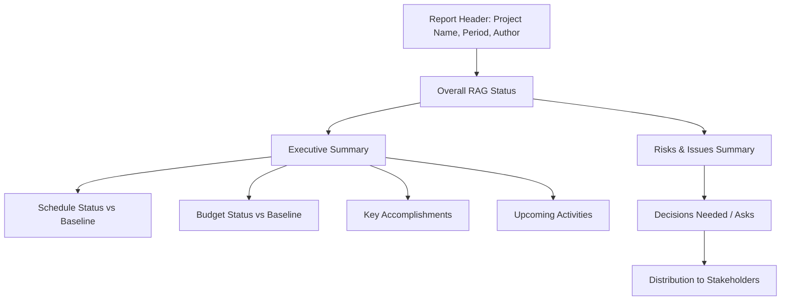

## Status Reports and Dashboards

### Definition and Purpose

Status reports and dashboards are the primary communication artifacts used to convey project health, progress, and risk to stakeholders at a cadence and level of detail appropriate to their role. A status report is typically a periodic, narrative-plus-metrics document; a dashboard is a live or frequently refreshed visual summary designed for at-a-glance consumption. Together they form the core of project transparency and governance communication.

**Key Points**

- Status reports and dashboards serve different but complementary purposes: reports provide narrative context and detail; dashboards provide rapid visual scanning
- Audience-appropriate detail is critical — the same underlying data often needs different presentation for executives versus delivery teams
- Consistency in format and metrics across reporting periods enables trend recognition, not just single-point-in-time assessment
- Poor reporting design is a common cause of stakeholder disengagement or, conversely, information overload

### Status Report vs. Dashboard

| Aspect | Status Report | Dashboard |
| --- | --- | --- |
| Format | Narrative document, often with embedded charts | Visual, often interactive, live or near-live data |
| Frequency | Periodic (weekly, bi-weekly, monthly) | Continuous or refreshed on a set interval |
| Depth | Detailed context, explanations, narrative | High-level, scannable metrics |
| Primary Audience | Sponsors, steering committees, detailed stakeholders | Executives, broad stakeholder groups, "at a glance" viewers |
| Typical Tooling | Word/PDF documents, email, PM tool exports | Power BI, Tableau, PM tool native dashboards (Jira, Monday.com) |

### Core Components of a Status Report

| Section | Purpose |
| --- | --- |
| Overall status (RAG) | Immediate at-a-glance health indicator |
| Executive summary | Brief narrative of key developments since the last report |
| Milestone/schedule status | Progress against baseline dates |
| Budget status | Spend against baseline, forecast at completion |
| Key accomplishments | Recently completed significant work |
| Upcoming activities | What's planned before the next report |
| Risks and issues | Newly identified or escalated risks/issues requiring stakeholder awareness |
| Decisions needed | Explicit asks requiring stakeholder input or approval |
| Change requests | Status of pending or recently approved scope/schedule/cost changes |

### RAG (Red-Amber-Green) Status Convention

A widely used shorthand for communicating status at a glance, though criteria must be explicitly defined to avoid subjective or inconsistent application.

**Example**

| Status | Color | Typical Criteria |
| --- | --- | --- |
| Green | On Track | SPI/CPI within defined threshold (e.g., 0.95–1.05); no unresolved critical risks |
| Amber | At Risk | SPI/CPI outside threshold but recoverable; risks identified with mitigation in progress |
| Red | Off Track | Significant schedule/cost variance; unresolved critical issues; corrective action required |

**Key Points**

- RAG criteria should be defined once, documented, and applied consistently — allowing status color to be subjectively assigned by whoever authors the report each period undermines its value as an objective signal
- A status that shifts from Green directly to Red without an intervening Amber period often indicates either a sudden genuine event or, more commonly, delayed/inaccurate reporting in prior periods

### Status Report Structure Example

### Designing Effective Dashboards

#### Key Design Principles

- **Lead with the most important metric:** Overall status/RAG should be immediately visible without scrolling or clicking.
- **Limit the number of metrics displayed:** A dashboard crowded with every available metric reduces the speed advantage that makes dashboards valuable over full reports.
- **Use consistent visual encoding:** The same color, shape, or position should always mean the same thing across the dashboard (e.g., red always means "at risk," never used for a different purpose elsewhere on the same view).
- **Show trend, not just current state:** A single data point ("60% complete") is less informative than a trend line showing whether progress is accelerating, steady, or stalling.
- **Design for the audience's decision needs:** An executive dashboard should support "do I need to intervene?" decisions; a team-level dashboard should support "what do I work on next?" decisions.

#### Common Dashboard Elements

| Element | Typical Use |
| --- | --- |
| RAG status tiles | Immediate health indicator per project or workstream |
| Burndown/burnup chart | Progress against remaining scope over time (agile contexts) |
| Gantt/timeline view | Milestone and schedule status |
| Budget gauge/S-curve | Spend against planned budget |
| Risk heat map | Visual plot of risk probability vs. impact |
| Issue aging chart | Distribution of open issues by age and priority |

### Example Dashboard Layout (Conceptual)

<svg xmlns="http://www.w3.org/2000/svg" viewBox="0 0 640 380">
<title>Project Status Dashboard Layout (svg_diagram)</title>
<rect x="10" y="10" width="620" height="360" fill="#f7f7f7" stroke="#ccc" />
<rect x="25" y="25" width="180" height="80" rx="6" fill="#d9f2d9" stroke="#2c8a2c" stroke-width="2" />
<text x="115" y="55" font-size="14" text-anchor="middle" fill="#1a1a1a" font-family="sans-serif">Overall Status</text>
<text x="115" y="80" font-size="20" text-anchor="middle" fill="#2c8a2c" font-family="sans-serif" font-weight="bold">GREEN</text>
<rect x="220" y="25" width="180" height="80" rx="6" fill="#fff3cd" stroke="#a67c00" stroke-width="2" />
<text x="310" y="55" font-size="14" text-anchor="middle" fill="#1a1a1a" font-family="sans-serif">Schedule (SPI)</text>
<text x="310" y="80" font-size="20" text-anchor="middle" fill="#a67c00" font-family="sans-serif" font-weight="bold">0.91</text>
<rect x="415" y="25" width="180" height="80" rx="6" fill="#d9f2d9" stroke="#2c8a2c" stroke-width="2" />
<text x="505" y="55" font-size="14" text-anchor="middle" fill="#1a1a1a" font-family="sans-serif">Budget (CPI)</text>
<text x="505" y="80" font-size="20" text-anchor="middle" fill="#2c8a2c" font-family="sans-serif" font-weight="bold">1.02</text>
<rect x="25" y="120" width="280" height="220" fill="#ffffff" stroke="#999" />
<text x="165" y="140" font-size="13" text-anchor="middle" fill="#333" font-family="sans-serif">Burnup Chart</text>
<polyline points="40,320 90,290 140,250 190,200 240,160 290,130" fill="none" stroke="#2c5aa0" stroke-width="2.5" />
<line x1="40" y1="320" x2="290" y2="140" stroke="#999" stroke-width="1.5" stroke-dasharray="4,3" />
<rect x="320" y="120" width="280" height="220" fill="#ffffff" stroke="#999" />
<text x="460" y="140" font-size="13" text-anchor="middle" fill="#333" font-family="sans-serif">Risk Heat Map</text>
<circle cx="400" cy="280" r="10" fill="#2c8a2c" />
<circle cx="450" cy="240" r="14" fill="#a67c00" />
<circle cx="520" cy="180" r="18" fill="#b02a2a" />
<text x="460" y="335" font-size="11" fill="#666" font-family="sans-serif">Low → High Impact/Probability</text>
</svg>

### Tailoring Reports to Audience

**Example**

| Audience | Focus | Detail Level |
| --- | --- | --- |
| Delivery team | Task-level status, blockers, immediate priorities | High detail, tool-native (Jira board, sprint board) |
| Project sponsor | Milestone progress, budget status, key risks/decisions needed | Moderate detail, narrative + key metrics |
| Steering committee | Overall RAG, major risks/issues, decisions required | Low detail, high-level summary with drill-down available |
| Executive leadership | Portfolio-level rollup, only significant deviations flagged | Minimal detail, exception-based reporting |

**Key Points**

- Sending the same highly detailed report to all audiences typically results in disengagement from senior stakeholders and insufficient actionable detail for delivery teams
- Exception-based reporting (only surfacing items requiring attention) is often more effective for senior audiences than exhaustive status recitation

### Reporting Cadence

| Report Type | Typical Frequency | Primary Audience |
| --- | --- | --- |
| Team-level status/board | Continuous/daily | Delivery team |
| Detailed status report | Weekly or bi-weekly | Project sponsor, project team |
| Steering committee report | Monthly | Steering committee, senior stakeholders |
| Executive/portfolio dashboard | Continuous or monthly snapshot | Executive leadership |

### Common Reporting Anti-Patterns

- **Vanity metrics:** Reporting metrics that look favorable but don't reflect genuine project health (e.g., "tasks closed" without regard to whether they were the right or most important tasks).
- **Report as a status theater exercise:** Producing polished reports that mask underlying problems to avoid difficult conversations, rather than transparently surfacing risk.
- **Inconsistent RAG criteria application:** Different report authors or periods applying different subjective thresholds for the same color, eroding trust in the indicator's meaning.
- **Overloaded dashboards:** Attempting to display every available metric simultaneously, defeating the dashboard's purpose of rapid at-a-glance assessment.
- **Stale dashboard data:** Presenting a "live" dashboard that is, in practice, rarely updated, misleading viewers about current status.
- **No narrative context on dashboards:** Numbers and colors without brief explanatory context can prompt more questions than they answer, particularly for infrequent viewers.

### Tools Commonly Used

- **Native PM tool dashboards:** Jira dashboards, Monday.com dashboards, Asana Portfolios, Microsoft Project status views
- **Business intelligence tools:** Power BI, Tableau, Looker for cross-project or portfolio-level rollups requiring integration of multiple data sources
- **Document-based reporting:** Word/PDF templates, PowerPoint status decks, or standardized email formats for narrative status reports
- **Automated reporting/status aggregation:** Tools that pull status directly from task trackers to reduce manual compilation effort and improve data freshness

[Unverified] Specific integration capabilities and automation features vary by tool and licensing tier and should be confirmed against current vendor documentation.

### Common Pitfalls

- **Manual, error-prone compilation:** Building reports by manually copying data from multiple sources introduces delay and transcription errors; automated data pulls where available reduce this risk.
- **Reporting without a defined audience in mind:** Producing a single generic report format for all stakeholders rather than tailoring content and detail level.
- **Delayed reporting:** Issuing status reports well after the period they describe, reducing their usefulness for timely decision-making.
- **No accountability for report accuracy:** Allowing team members to self-report status without any verification, risking optimistic bias in reported figures.
- **Dashboard/report metric mismatch:** Presenting different numbers for the same metric across the dashboard and the narrative report due to different data refresh timing or calculation methods, undermining stakeholder confidence in the data.

### Conclusion

Status reports and dashboards translate ongoing project performance into communication artifacts tailored to their audience's decision-making needs — reports providing narrative depth and context, dashboards providing rapid visual scanning. Consistent, well-defined RAG criteria, audience-appropriate detail levels, and disciplined reporting cadence together determine whether these artifacts build stakeholder trust and enable timely intervention, or become disengaging noise that obscures genuine project health.

**Related Topics**

- Variance analysis and Earned Value Management (EVM) metrics
- RAG status criteria design and governance
- Stakeholder analysis and communication planning
- Risk heat maps and risk register reporting
- Steering committee governance structures
- Portfolio and program-level reporting rollups