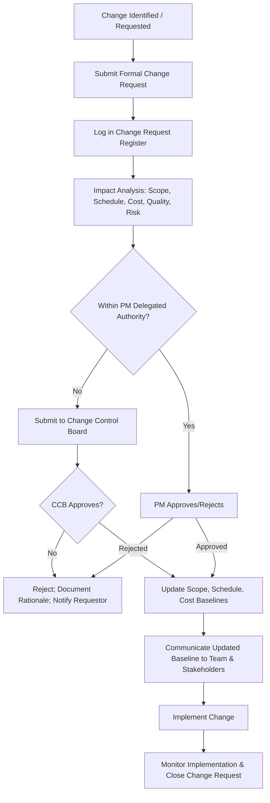

## Change Request Management

### Definition and Purpose

Change request management is the formal process for identifying, evaluating, approving or rejecting, and implementing proposed modifications to a project's scope, schedule, cost, or other baselines. It ensures that changes — which are inevitable in most projects — are deliberately assessed for impact and consciously authorized rather than absorbed informally, protecting the integrity of the approved baseline.

**Key Points**

- Change is not inherently bad; uncontrolled change (scope creep) is the risk, not change itself
- Every change request should be evaluated for impact on scope, schedule, cost, quality, and risk before approval
- A formal Change Control Board (CCB) or equivalent authority typically governs approval for changes beyond a defined threshold
- Approved changes require the Performance Measurement Baseline (PMB) to be formally updated, not silently adjusted

### Change Request vs. Scope Creep

| Aspect | Formal Change Request | Scope Creep |
| --- | --- | --- |
| Process | Documented, evaluated, formally approved/rejected | Informal, undocumented, absorbed without review |
| Visibility | Tracked in change log; stakeholders aware | Often invisible until cumulative impact surfaces |
| Baseline Impact | Baseline formally updated if approved | Baseline silently invalidated without update |
| Accountability | Clear approval trail | No clear record of who authorized the addition |

[Inference] Scope creep is frequently described in project management literature as accumulating through many individually "small" informal requests rather than one large uncontrolled change, which is part of why it often goes unnoticed until overall schedule or cost impact becomes significant.

### The Change Control Process

### Change Request Register Components

| Field | Purpose |
| --- | --- |
| Change ID | Unique identifier for tracking |
| Description | Clear statement of the proposed change |
| Requestor | Who initiated the request |
| Date submitted | When the request was logged |
| Category | Scope, schedule, cost, quality, or resource change |
| Impact analysis summary | Assessed effect on baseline dimensions |
| Priority/urgency | How time-sensitive the decision is |
| Decision authority | Who is authorized to approve (PM, CCB, sponsor) |
| Status | Submitted, under review, approved, rejected, implemented, closed |
| Decision date and rationale | When decided and why |

**Example**

| ID | Description | Category | Impact | Status |
| --- | --- | --- | --- | --- |
| CR-021 | Add multi-language support to user interface | Scope | +3 weeks, +$18,000 | Approved by CCB |
| CR-022 | Reduce UAT window from 2 weeks to 1 week | Schedule | Increased quality risk | Rejected |
| CR-023 | Substitute vendor component due to supply delay | Scope/Cost | +$4,000, neutral schedule | Approved by PM |

### Impact Analysis Dimensions

Every change request should be assessed across multiple dimensions before a decision is made, since a change that appears minor in one dimension may be significant in another.

| Dimension | Key Questions |
| --- | --- |
| Scope | Does this add, remove, or modify deliverables? Does it affect the WBS? |
| Schedule | Does this affect the critical path or introduce new dependencies? |
| Cost | What is the direct cost, and does it require drawing on contingency or management reserve? |
| Quality | Does this affect acceptance criteria or introduce new quality risk? |
| Risk | Does this introduce new risks or change the probability/impact of existing risks? |
| Resources | Does this require additional or different skill sets, or affect resource availability elsewhere? |

**Key Points**

- A change that seems schedule-neutral in isolation may still consume float that protects other activities, reducing overall schedule resilience
- Cost impact analysis should distinguish whether the change can be absorbed within contingency reserve or requires management reserve/rebaselining approval

### Change Control Board (CCB) Structure and Authority

| Role | Typical Composition | Authority Level |
| --- | --- | --- |
| Project Manager | Delegated authority for minor changes within defined thresholds | Low-impact changes (e.g., under a defined cost/schedule threshold) |
| Change Control Board | Sponsor, key stakeholders, technical leads, sometimes client representatives | Moderate to major changes affecting baseline |
| Executive Sponsor/Steering Committee | Senior leadership | Major changes affecting strategic direction, budget reallocation, or contract terms |

**Example**

A typical delegated authority threshold: the PM may approve changes with combined schedule impact under 3 business days and cost impact under $5,000; anything beyond this requires CCB review.

[Unverified] Specific delegated authority thresholds vary widely by organization size, project value, and governance maturity; the figures above are illustrative rather than standard.

### Evaluating and Deciding on Change Requests

**Next Steps** (decision workflow)

1. **Verify completeness** of the change request — ensure enough detail exists to conduct meaningful impact analysis.
2. **Conduct impact analysis** across scope, schedule, cost, quality, risk, and resource dimensions.
3. **Identify alternatives** where feasible — sometimes the underlying need can be met with a lower-impact approach than the one originally proposed.
4. **Present the analysis to the appropriate decision authority** (PM or CCB) with a clear recommendation, not just raw data.
5. **Document the decision and rationale**, whether approved, rejected, or deferred.
6. **Communicate the outcome** to the requestor and affected stakeholders promptly, regardless of decision direction.
7. **If approved, update baselines formally** and communicate the revised baseline to the full team before implementation begins.

### Prioritizing and Batching Change Requests

For projects with a high volume of change requests, batching related or lower-urgency requests for periodic review (rather than evaluating each individually as it arrives) can reduce governance overhead while still maintaining control.

| Approach | When to Use |

 

| Individual review | High-impact or urgent changes requiring immediate decision |

| Batched/periodic review | Lower-priority changes that can wait for a scheduled CCB meeting without material impact |

| Fast-track approval | Pre-approved change categories within tightly bounded impact (e.g., minor documentation updates) |

### Communicating Change Decisions

**Key Points**

- Rejected change requests should be communicated with clear rationale, not silence — an unexplained rejection often resurfaces later as the same request through a different channel
- Approved changes should be communicated to the full team, not just the requestor, since downstream tasks may be affected by baseline updates the assignee wasn't directly involved in requesting

### Change Requests and Vendor/Contract Contexts

When a change affects vendor-delivered work, the change control process typically intersects with contractual change order procedures:

- Changes to fixed-price contracts generally require a formal change order with agreed cost/schedule adjustment before the vendor proceeds
- Time and materials (T&M) contracts may absorb minor changes more fluidly but still benefit from documented change requests to maintain scope traceability and prevent billing disputes
- Multi-vendor projects require coordination to ensure a change affecting one vendor's deliverable doesn't create an undocumented dependency impact on another vendor's work

### Common Pitfalls

- **Bypassing formal process for "small" changes:** Individually minor undocumented changes accumulate into significant scope creep over the project lifecycle.
- **Analysis paralysis on low-impact changes:** Applying the same heavyweight review process to trivial changes as to major ones, slowing the project down disproportionately to the change's actual significance.
- **No clear decision authority:** Ambiguity about who can approve what level of change leads to either bottlenecks (everything escalated unnecessarily) or ungoverned approval (anyone approving anything).
- **Approving changes without baseline updates:** Implementing an approved change without formally revising the schedule/cost baseline, causing subsequent variance analysis to be inaccurate.
- **Ignoring cumulative impact:** Evaluating each change request in isolation without considering the cumulative effect of multiple approved changes on overall schedule and budget.
- **Poor communication of rejected requests:** Silent or unexplained rejections erode trust and often lead to the same request being informally pursued through other channels.

### Conclusion

Change request management provides the structured discipline needed to accommodate legitimate project change while protecting the integrity of the approved baseline. A well-designed process — clear impact analysis criteria, defined decision authority thresholds, disciplined documentation, and prompt communication of outcomes — allows a project to remain adaptive to genuine business need without descending into ungoverned scope creep. The distinction between formally controlled change and informal scope drift is often the single clearest indicator of a mature project control environment.

**Related Topics**

- Scope creep prevention and scope baseline management
- Performance Measurement Baseline (PMB) updates and rebaselining
- Change Control Board (CCB) governance design
- Contract change orders and vendor management
- Risk register updates following approved changes
- Configuration management and version control of project documents