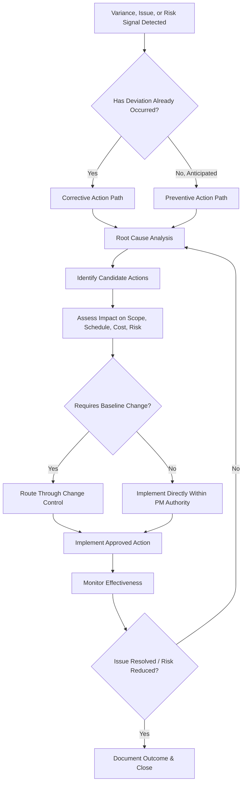

## Corrective and Preventive Actions

### Definition and Purpose

Corrective and preventive actions (CAPA) are the two categories of response taken during project monitoring and control to address performance gaps. A corrective action addresses a deviation that has already occurred, realigning actual performance with the plan. A preventive action addresses a potential future deviation identified before it occurs, reducing the probability of a similar issue arising elsewhere in the project.

**Key Points**

- Corrective actions are reactive (respond to realized variance); preventive actions are proactive (address anticipated variance before it happens)
- Both are formal outputs of the monitoring and control process, typically requiring documentation and, where they affect baselines, change control
- Distinct from defect repair, which corrects a flaw in a completed deliverable rather than a process or plan deviation
- Effective CAPA relies on root cause analysis, not just symptom treatment

### Corrective Action vs. Preventive Action vs. Defect Repair

| Type | Trigger | Focus | Example |
| --- | --- | --- | --- |
| Corrective Action | A variance or issue has already occurred | Realign actual performance with the plan | Reassigning resources after a task falls behind schedule |
| Preventive Action | A potential future deviation is identified before it occurs | Reduce probability of an anticipated problem | Adding a review checkpoint after noticing a pattern of late-stage defects on similar tasks |
| Defect Repair | A completed deliverable does not meet specifications | Fix the specific nonconforming output | Reworking a report section that failed quality review |

[Inference] This three-way distinction is commonly used in PMBOK-aligned frameworks; in day-to-day project practice, teams sometimes use "corrective action" loosely to cover all three, though maintaining the distinction helps clarify whether the response addresses a process problem, a future risk, or a specific broken deliverable.

### The CAPA Process Flow

### Identifying the Need for Corrective Action

Corrective action needs typically surface through:

- **Variance analysis:** SPI/CPI or other metrics falling outside acceptable thresholds (see variance analysis practices)
- **Issue escalation:** A logged issue that has grown in impact or remained unresolved past its target date
- **Quality inspection results:** Deliverables failing to meet acceptance criteria
- **Stakeholder feedback:** Direct reports of dissatisfaction or unmet expectations not yet captured in formal metrics

### Identifying the Need for Preventive Action

Preventive action needs typically surface through:

- **Trend analysis:** A pattern across multiple data points suggesting an emerging (but not yet critical) problem
- **Risk register review:** A risk's probability or impact increasing based on new information, warranting mitigation before it materializes into an issue
- **Lessons learned from similar work:** A defect or delay pattern observed in one part of the project suggesting similar risk exists elsewhere
- **Audit findings:** Process audits revealing a gap likely to cause future nonconformance if left unaddressed

**Example**

If two separate modules in a software project have both experienced late-stage integration defects traced to inadequate interface documentation, a *corrective* action would be reworking the two affected modules' documentation. A *preventive* action would be mandating interface documentation review for all remaining modules before their integration phase begins, addressing the systemic pattern rather than only the two instances already observed.

### Root Cause Analysis as a CAPA Foundation

Selecting an effective corrective or preventive action depends on accurately identifying root cause rather than only addressing the visible symptom.

#### 5 Whys Technique

Iteratively asks "why" to trace a problem to its underlying cause.

**Example**

1. Why did the deliverable fail QA? — It had a formatting error.
2. Why did the formatting error occur? — The template wasn't followed.
3. Why wasn't the template followed? — The team member wasn't aware a new template existed.
4. Why weren't they aware? — Template updates aren't communicated when published.
5. Why isn't this communicated? — There's no defined process for announcing template changes.

The root cause (missing communication process for template updates) is a preventive action target — different, and more systemic, than simply correcting the one deliverable's formatting.

#### Fishbone (Ishikawa) Diagram

Organizes potential causes into categories (commonly people, process, technology/equipment, materials, environment, measurement) to ensure root cause analysis considers multiple contributing factors rather than fixating on the first plausible explanation.

### CAPA Documentation and Tracking

| Field | Purpose |
| --- | --- |
| CAPA ID | Unique identifier |
| Type | Corrective, preventive, or defect repair |
| Triggering issue/variance/risk | What prompted the action |
| Root cause | Underlying cause identified through analysis |
| Proposed action | Specific action to be taken |
| Owner | Individual accountable for implementation |
| Target completion date | Deadline for implementation |
| Baseline impact | Whether the action requires formal change control |
| Effectiveness review date | When the action's success will be assessed |
| Status | Proposed, approved, in progress, implemented, verified effective, closed |

**Example**

| ID | Type | Root Cause | Action | Owner | Status |
| --- | --- | --- | --- | --- | --- |
| CAPA-008 | Corrective | Resource overallocation on critical path task | Reassign secondary resource to support task completion | Team Lead | Implemented |
| CAPA-009 | Preventive | Recurring late-stage integration defects | Mandate interface review checkpoint before all remaining integrations | QA Lead | In Progress |
| CAPA-010 | Corrective | Vendor missed milestone due to unclear requirements | Clarify and re-issue requirements document; extend milestone by agreed days | Project Manager | Closed |

### CAPA and Change Control Interaction

**Key Points**

- A corrective or preventive action that stays within the project manager's delegated authority (e.g., internal task reassignment, adding a review step) can typically be implemented directly
- An action that affects the schedule baseline, cost baseline, or scope (e.g., extending a milestone date, adding budget for additional testing) must be routed through formal change control before implementation, just as any other baseline-affecting change would be
- Implementing baseline-affecting corrective/preventive actions without formal change control undermines the Performance Measurement Baseline's integrity in the same way ungoverned scope creep does

### Verifying Effectiveness

A corrective or preventive action is not complete simply because it was implemented — its effectiveness in actually resolving or preventing the targeted problem must be verified.

**Next Steps** (verification protocol)

1. Define, at the time the action is proposed, what "success" looks like (e.g., "no further integration defects traced to interface documentation gaps over the next three module integrations").
2. Set a specific review date to assess whether the defined success criteria have been met.
3. If the action proves effective, formally close the CAPA record with the verification outcome documented.
4. If ineffective, return to root cause analysis — the original diagnosis may have been incomplete or incorrect, warranting a different action.
5. Feed verified-effective preventive actions into organizational process assets or lessons learned for use on future projects or later project phases.

### Common Pitfalls

- **Treating symptoms instead of root causes:** Repeatedly correcting the same type of issue without ever addressing why it keeps recurring, resulting in a cycle of recurring corrective actions rather than a resolved problem.
- **Skipping root cause analysis under time pressure:** Implementing the first plausible fix without verifying it addresses the actual underlying cause, risking recurrence.
- **Implementing baseline-affecting actions without change control:** Bypassing formal approval for actions that alter schedule, cost, or scope, undermining the PMB's reliability.
- **No effectiveness verification:** Marking a CAPA "complete" upon implementation without ever confirming the targeted problem was actually resolved or prevented.
- **Preventive action neglect:** Focusing exclusively on corrective action (fighting fires) without investing time in the trend analysis and lessons-learned review needed to identify preventive opportunities.
- **Poor documentation:** Failing to record root cause and rationale, making it difficult to recognize recurring patterns across the project or apply lessons to future projects.

### Conclusion

Corrective and preventive actions form the practical response mechanism of project monitoring and control — corrective actions realigning performance after a deviation has occurred, and preventive actions reducing the likelihood of anticipated deviations before they materialize. Both depend on rigorous root cause analysis rather than surface-level symptom treatment, and both require formal change control when they affect the approved baseline. Verifying that implemented actions actually achieve their intended effect, and feeding successful preventive measures into organizational lessons learned, distinguishes a mature control process from one that merely reacts to the same recurring problems indefinitely.

**Related Topics**

- Variance analysis and Earned Value Management (EVM)
- Root cause analysis techniques (5 Whys, fishbone diagrams, Pareto analysis)
- Change control processes and the Change Control Board (CCB)
- Issue management and escalation
- Risk register and risk response planning
- Lessons learned and organizational process assets