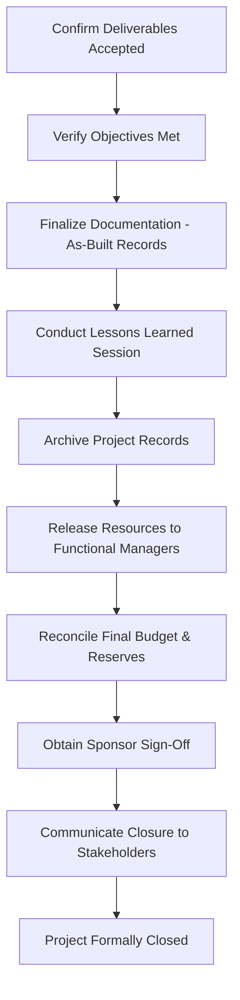
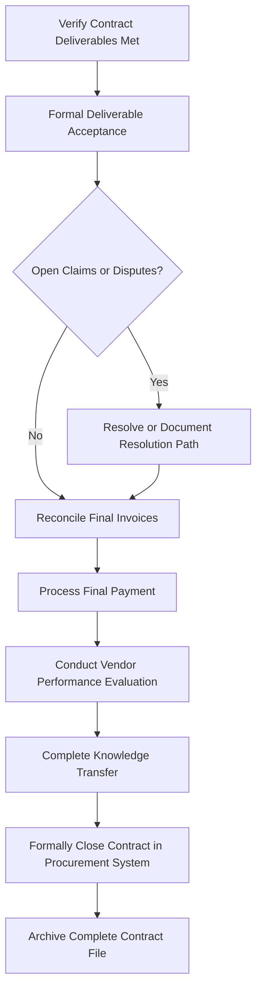

## Administrative and Contract Closure

### Definition and Purpose

Administrative and contract closure is the formal process of finalizing all project activities, documentation, and contractual obligations to bring a project or phase to an orderly, verifiable conclusion. Administrative closure addresses internal project wrap-up (documentation, releasing resources, archiving records), while contract closure specifically addresses the formal completion and settlement of contracts with external vendors or clients, including resolution of any open claims.

**Key Points**

- Administrative closure applies to every project; contract closure applies specifically to projects involving procurement or contractual agreements
- Closure should occur for each contract when its terms are met, and administrative closure for the project overall occurs at project or phase end
- Skipping formal closure activities is a common source of unresolved obligations, lost knowledge, and disputes that surface after the project team has disbanded
- Both closure types typically require formal sign-off, not just the natural tapering off of activity

### Administrative Closure vs. Contract Closure

| Aspect | Administrative Closure | Contract Closure |
| --- | --- | --- |
| Scope | Entire project or phase | Each individual contract/vendor agreement |
| Trigger | Project or phase completion, or early termination | Contract terms fulfilled, or contract terminated |
| Key Outputs | Final report, archived records, released resources | Contract file, formal acceptance, final payment |
| Primary Owner | Project Manager | Project Manager, often with Procurement/Legal |

### Administrative Closure Activities

**Next Steps** (procedural sequence)

1. **Verify all deliverables have been formally accepted** against agreed acceptance criteria, with documented sign-off.
2. **Confirm all project objectives have been met** or formally document any objectives not achieved and why.
3. **Finalize all project documentation** — update the WBS, schedules, and other planning documents to reflect final "as-built" status.
4. **Conduct a lessons learned session** and document findings for the organizational knowledge base.
5. **Archive project records** according to organizational retention policies and any regulatory requirements.
6. **Release project resources** — formally notify functional managers that team members are available for reassignment.
7. **Close out financial accounts** — ensure all costs are recorded, final budget reconciliation is complete, and any unspent contingency/reserve is returned per organizational policy.
8. **Obtain final sponsor/stakeholder sign-off** confirming the project is formally closed.
9. **Communicate closure** to all stakeholders, including a summary of outcomes achieved.

### Administrative Closure Process Flow

### Key Administrative Closure Documents

| Document | Purpose |
| --- | --- |
| Final project report | Summarizes objectives, outcomes, budget/schedule performance, and key learnings |
| Lessons learned register | Captures what went well, what didn't, and recommendations for future projects |
| As-built documentation | Final, accurate record of what was actually delivered (may differ from original plan) |
| Resource release notice | Formal communication releasing team members back to functional organization |
| Final financial reconciliation | Confirms actual costs against budget, including reserve utilization |
| Formal closure sign-off | Documented sponsor/stakeholder acknowledgment that the project is complete |

### Contract Closure Activities

**Next Steps** (procedural sequence)

1. **Verify contract deliverables** meet all terms specified in the contract or Statement of Work (SOW).
2. **Conduct formal product/deliverable acceptance** with the vendor, documenting sign-off against contractual acceptance criteria.
3. **Resolve any open claims or disputes** before final closure — unresolved claims should be explicitly documented with an agreed resolution path if they cannot be closed immediately.
4. **Verify all invoices have been processed and reconciled** against contracted rates and approved change orders.
5. **Process final payment** per the contract's payment terms.
6. **Conduct a vendor performance evaluation**, documenting performance against SLAs/KPIs for use in future vendor selection decisions.
7. **Complete knowledge transfer requirements** specified in the contract (documentation handover, training, code/IP transfer).
8. **Formally terminate/close the contract** in the procurement system, updating vendor records.
9. **Archive the complete contract file**, including the original contract, all amendments/change orders, correspondence, and acceptance records.

### Contract Closure Process Flow

### Contract File Contents

A complete contract file, retained per organizational and often legal/regulatory retention requirements, typically includes:

| Component | Description |
| --- | --- |
| Original signed contract/SOW | The foundational agreement |
| All amendments and change orders | Documented modifications to scope, cost, or schedule |
| Correspondence records | Key emails, meeting notes, formal notices |
| Invoices and payment records | Complete financial transaction history |
| Deliverable acceptance records | Sign-off documentation for each deliverable |
| Performance evaluation | Final vendor performance assessment |
| Dispute/claim resolution records | Documentation of any disputes and how they were resolved |

**Key Points**

- Retention periods for contract files are often driven by legal, tax, or regulatory requirements rather than purely organizational preference, and can extend well beyond project completion — [Unverified] specific retention periods vary significantly by jurisdiction, industry, and contract type, and should be confirmed with legal/compliance guidance rather than assumed.

### Handling Early or Incomplete Contract Termination

Not all contracts close through natural completion; some are terminated early due to performance issues, changed business needs, or mutual agreement.

| Termination Type | Description | Closure Consideration |
| --- | --- | --- |
| Termination for convenience | Client ends contract without vendor fault, per contract terms | Settlement typically per pre-agreed termination clause |
| Termination for cause | Contract ended due to vendor non-performance or breach | May involve dispute resolution, withheld payment, or legal action |
| Mutual termination | Both parties agree to end the contract | Negotiated settlement terms documented |

[Inference] Early termination closure processes generally require more extensive legal and procurement involvement than natural contract completion, given the higher likelihood of disputed obligations, though the specific process depends heavily on the termination clause language in the original contract.

### Lessons Learned Capture

A structured lessons learned process, ideally conducted before the team disperses, captures institutional knowledge that would otherwise be lost.

**Example**

| Category | What Went Well | What Could Improve | Recommendation |
| --- | --- | --- | --- |
| Vendor Management | Clear SLA definition reduced disputes | Invoice reconciliation delays occurred monthly | Automate invoice-to-SOW matching for future contracts |
| Schedule | Buffer placement protected the critical path effectively | Feeding buffer sizing was too conservative | Refine feeding buffer estimation method |
| Communication | Weekly steering updates kept sponsor engaged | Status reports lacked consistent RAG criteria | Standardize RAG thresholds across future projects |

**Key Points**

- Lessons learned sessions held well after the team has dispersed tend to capture less accurate and less complete detail than those held promptly at closure
- Findings should be stored in an accessible, searchable organizational repository, not just filed away — the goal is application to future projects, not archival for its own sake

### Common Pitfalls

- **Deferring closure activities indefinitely:** Allowing "closure" to happen informally as the team simply moves on to other work, without ever completing formal documentation, sign-off, or archiving.
- **Skipping vendor performance evaluation:** Losing valuable input for future vendor selection decisions by not formally documenting how a vendor performed.
- **Leaving contract disputes unresolved:** Allowing ambiguous claims to remain open indefinitely rather than reaching documented resolution or an explicit agreed path forward.
- **Inadequate knowledge transfer:** Releasing resources or closing vendor contracts before ensuring institutional knowledge (documentation, code, process knowledge) has been properly transferred.
- **Poor records archiving:** Failing to organize and retain project and contract records per organizational/legal retention requirements, creating risk if records are needed later for audits, disputes, or reference.
- **Treating lessons learned as a formality:** Conducting a rushed, superficial lessons learned session that produces generic, non-actionable findings rather than genuine insight.

### Conclusion

Administrative and contract closure provide the formal, disciplined conclusion to a project that prevents loose ends — unresolved contracts, unreleased resources, unarchived records, and uncaptured knowledge — from persisting after the project team disbands. While administrative closure addresses the project holistically, contract closure requires specific attention to each vendor agreement's terms, acceptance, financial settlement, and performance evaluation. Executing both thoroughly, rather than allowing closure to happen informally through simple inactivity, protects the organization's legal and financial interests while preserving valuable knowledge for future projects.

**Related Topics**

- Lessons learned and organizational process assets
- Vendor performance evaluation and procurement management
- Final project reporting and stakeholder communication
- Records retention and knowledge management
- Contract types and termination clauses
- Project and phase-gate governance