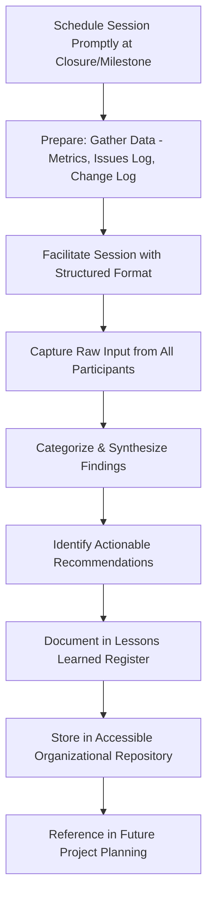
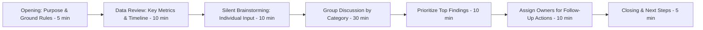

## Conducting Lessons Learned Sessions

### Definition and Purpose

A lessons learned session is a structured retrospective meeting held to capture what worked well, what didn't, and what should be done differently on future projects, based on the team's direct experience delivering the current one. It converts tacit, individually-held knowledge into documented organizational process assets that improve the planning and execution of future projects.

**Key Points**

- Should be conducted at project/phase closure while the team is still assembled and memory is fresh, not deferred until convenient
- Distinct from a status review — the focus is retrospective learning and process improvement, not progress reporting
- Effective sessions require psychological safety so participants raise genuine issues rather than only favorable observations
- Findings are only valuable if captured in an accessible repository and actively referenced on future projects — not filed away and forgotten

### When to Conduct Lessons Learned Sessions

While a comprehensive session is standard at final project closure, mature organizations also conduct them at other points to capture learning before it's lost or before problems recur.

| Timing | Purpose |
| --- | --- |
| End of each major phase/milestone | Capture learning while still applicable to remaining phases |
| End of each sprint/iteration (agile contexts) | Continuous, incremental process improvement |
| After a significant issue or crisis | Focused analysis of a specific event while details are fresh |
| Final project closure | Comprehensive review across the full project lifecycle |

[Inference] Phase-end and sprint-end lessons learned sessions are generally considered more actionable than waiting solely until final closure, since findings can be applied to the remainder of the same project rather than only benefiting future, unrelated projects.

### Lessons Learned Session Process Flow

### Pre-Session Preparation

**Next Steps** (preparation phase)

1. **Schedule the session promptly** after project/phase completion, while the team is still intact and details are fresh — ideally before key team members are reassigned.
2. **Gather objective data in advance** — variance reports, issue logs, change request history, quality metrics, and schedule/budget performance — to ground the discussion in facts rather than only impressions.
3. **Send a pre-session survey or prompt** allowing participants to reflect individually before the group discussion, which can surface points quieter team members might not raise live.
4. **Select a neutral facilitator** where possible — someone without a strong personal stake in defending particular decisions, which can encourage more candid input than when the PM who made contested decisions also facilitates.
5. **Communicate the session's purpose clearly** as learning-focused and blame-free, setting expectations before the meeting begins.

### Common Facilitation Frameworks

#### 1. Start-Stop-Continue

Simple, widely used structure organizing input into three categories.

| Category | Question |
| --- | --- |
| Start | What should we start doing that we didn't do this time? |
| Stop | What should we stop doing because it didn't work? |
| Continue | What worked well and should be repeated? |

#### 2. What Went Well / What Didn't / What We'll Change

A slightly more detailed variant explicitly separating observation from action.

| Category | Question |
| --- | --- |
| What went well | Specific practices, decisions, or events that contributed positively |
| What didn't go well | Specific challenges, failures, or gaps encountered |
| What we'll change | Concrete, actionable recommendations for future projects |

#### 3. Sailboat Retrospective

A visual/metaphorical technique often used in agile contexts: the boat (team) is propelled by wind (things that helped), slowed by anchors (things that held the team back), threatened by rocks (risks ahead), and aiming for an island (the goal).

#### 4. 4Ls (Liked, Learned, Lacked, Longed For)

| Category | Question |
| --- | --- |
| Liked | What aspects of the project did participants enjoy or value? |
| Learned | What new knowledge or skill was gained? |
| Lacked | What resources, support, or information was missing? |
| Longed For | What did participants wish had been available or different? |

[Unverified] The choice among these frameworks is largely a matter of facilitator and team preference rather than one being objectively superior; different frameworks may surface different types of insight depending on team culture and session context.

### Facilitating an Effective Session

**Key Points**

- Establish ground rules upfront — focus on processes and systems, not individual blame; "the schedule didn't account for testing time" is more actionable than "so-and-so estimated poorly"
- Use silent brainstorming (e.g., written sticky notes or a shared digital board) before open discussion to reduce groupthink and ensure quieter voices are captured before louder ones dominate the conversation
- Timebox each discussion category to maintain momentum and ensure all planned topics are covered
- Explicitly invite input from underrepresented perspectives (e.g., a vendor representative, a junior team member) who may have observed different issues than senior or vocal participants
- Distinguish between things within the team's control (process, communication, planning) and external factors (market conditions, unexpected vendor issues) to keep recommendations actionable

### Session Structure Example

### Categorizing and Synthesizing Findings

Raw input from a lessons learned session is often unstructured; converting it into actionable findings typically involves:

- **Grouping similar comments** into themes (e.g., multiple comments about unclear requirements become a single "requirements clarity" theme)
- **Distinguishing symptoms from root causes** — applying techniques like the 5 Whys to findings that describe a symptom ("testing took too long") to identify the underlying cause ("test environment provisioning was delayed by three weeks")
- **Separating observations from recommendations** — a finding that "communication with the vendor was difficult" is an observation; "establish a single named vendor point of contact at contract signing" is the actionable recommendation derived from it

**Example**

| Theme | Observation | Root Cause | Recommendation |
| --- | --- | --- | --- |
| Requirements clarity | Multiple mid-project scope clarifications required | Initial requirements gathering phase was compressed to meet an early deadline | Allocate minimum 2 weeks for requirements gathering on similar-sized projects |
| Vendor coordination | Frequent miscommunication on delivery dates | No single named point of contact on either side | Formally designate and document a primary contact for each vendor relationship at contract signing |
| Testing | UAT found significant defects late | Testing environment was not production-representative | Require environment parity sign-off before UAT begins |

### The Lessons Learned Register

A structured, searchable repository is what makes lessons learned genuinely reusable rather than a one-time discussion with no lasting effect.

| Field | Purpose |
| --- | --- |
| Category | Area of the project affected (schedule, cost, quality, communication, vendor, etc.) |
| Observation | What was observed to work well or poorly |
| Root cause | Underlying reason, where identified |
| Recommendation | Specific, actionable guidance for future projects |
| Applicability | Scope of relevance (this project type, this organization broadly, this industry) |
| Owner | Who is responsible for ensuring the recommendation is incorporated into future process/templates |

**Key Points**

- A lessons learned register with hundreds of ungrouped, unprioritized entries becomes difficult to use in practice — periodic curation into a smaller set of high-value, broadly applicable insights improves usability for future project teams
- Recommendations should specify applicability scope; a lesson specific to one client's unusual requirement differs in reusability from one reflecting a genuine organizational process gap

### Applying Lessons Learned to Future Projects

**Next Steps** (embedding into organizational practice)

1. **Incorporate high-value recommendations into templates and checklists** (e.g., updating a project charter template to include a risk category that was previously missed).
2. **Reference the lessons learned repository during project initiation** for new projects of similar type, size, or industry.
3. **Update training materials or onboarding content** where lessons reveal a skills or knowledge gap rather than a one-off circumstance.
4. **Review previously logged lessons at project kickoff** for relevant past findings, rather than only consulting the repository reactively when a similar problem recurs.
5. **Track whether recommendations were actually applied** on subsequent projects and whether they achieved the intended improvement, closing the feedback loop.

### Common Pitfalls

- **Holding the session too late:** Waiting until well after project closure, once the team has dispersed and details have faded from memory, produces vaguer and less actionable findings.
- **Blame-focused discussion:** Allowing the session to become about identifying who was at fault rather than what process or system gap contributed to the issue, which discourages candid participation in future sessions.
- **Dominant voices crowding out input:** Senior or vocal participants dominating discussion while quieter team members' observations go uncaptured, particularly without techniques like silent brainstorming to counteract this.
- **No action ownership:** Generating a list of findings with no assigned owner or mechanism to ensure recommendations are actually incorporated into future practice.
- **Findings filed and forgotten:** Storing lessons learned in a repository that is never consulted during future project planning, rendering the entire exercise ineffective despite good-faith effort in the session itself.
- **Generic, non-actionable findings:** Producing vague conclusions ("communication could have been better") without root cause analysis or specific, implementable recommendations.

### Conclusion

Conducting an effective lessons learned session requires more than gathering the team for an open-ended discussion — it depends on prompt timing, structured facilitation, psychological safety, and disciplined synthesis of raw input into specific, actionable, and properly scoped recommendations. The true value of the exercise is realized only when findings are captured in an accessible repository and genuinely referenced during future project planning, closing the loop between one project's experience and the next project's improved practice.

**Related Topics**

- Retrospective facilitation techniques (Start-Stop-Continue, Sailboat, 4Ls)
- Root cause analysis (5 Whys, fishbone diagrams)
- Organizational process assets and knowledge management
- Administrative and contract closure
- Project charter and template development
- Continuous improvement in project management maturity models