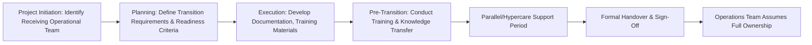

## Handover and Transition to Operations

### Definition and Purpose

Handover and transition to operations is the structured process of transferring a completed project's deliverables, knowledge, and ongoing responsibility from the project team to the operational or business-as-usual (BAU) organization that will own, maintain, and use them going forward. It ensures continuity of value delivery beyond the project's formal end, preventing the "cliff edge" where project support disappears before operational readiness is established.

**Key Points**

- A successful project delivery does not guarantee a successful transition — these are distinct outcomes requiring distinct planning
- Transition should be planned well before project closure, not treated as an afterthought once deliverables are complete
- Requires alignment between project team knowledge and operational team capability, capacity, and readiness
- Applies broadly: software systems handed to IT operations, new processes handed to business units, physical assets handed to facilities/maintenance teams, and more

### Why Transition Planning Matters

Projects are temporary; operations are ongoing. Without deliberate transition planning:

- Operational teams may lack the knowledge, documentation, or training needed to support what's been delivered
- Support gaps emerge between project team disengagement and operational team readiness, sometimes leaving no one accountable for issues that arise
- Institutional knowledge held only by project team members is lost once they move to other work
- Adoption and value realization suffer if end users aren't adequately prepared for the change

[Inference] Transition failures are frequently attributed less to the technical quality of the deliverable itself and more to inadequate knowledge transfer, training, or operational readiness — though the specific balance of causes varies by project type and organization.

### Transition Planning Timeline

Transition planning should begin well before project closure, ideally integrated into the project plan from an early stage rather than initiated only near the end.

### Key Components of a Transition Plan

| Component | Purpose |
| --- | --- |
| Receiving team identification | Clarifies who will own ongoing support/operation |
| Readiness criteria | Defines what "ready to receive" means, agreed in advance |
| Documentation requirements | Specifies what operational documentation must exist before handover |
| Training plan | Defines what training the operational team/end users need |
| Support model | Defines how issues will be handled post-transition (tiered support, SLAs) |
| Hypercare/parallel run period | Defines a transitional support window before full handoff |
| Formal acceptance criteria | Defines what constitutes successful, complete transition |

### Defining Operational Readiness Criteria

**Example**

| Readiness Dimension | Criteria |
| --- | --- |
| Documentation | Operations runbook, architecture diagrams, and troubleshooting guide completed and reviewed |
| Training | 100% of operational support staff have completed required training with passing assessment |
| Tooling access | Operational team has verified access to all systems, monitoring tools, and credentials needed |
| Support model | Support tiers, escalation paths, and SLAs formally defined and agreed |
| Known issues | All known defects/limitations documented with agreed remediation plan or accepted risk |

**Key Points**

- Readiness criteria should be defined and agreed with the receiving team early, not unilaterally declared by the project team at the point of handover
- Transitioning before readiness criteria are met tends to shift unresolved project risk onto the operational team, who may lack the context or authority to manage it effectively

### Documentation for Handover

| Document Type | Purpose |
| --- | --- |
| Operations/support runbook | Step-by-step guidance for routine operational tasks and common issue resolution |
| Architecture/system documentation | Technical design reference for understanding how the solution works |
| User guides/training materials | Reference material for end users interacting with the new system/process |
| Known issues and limitations log | Transparent record of unresolved items and their status |
| Support contact and escalation matrix | Who to contact for different issue types and severities |
| Warranty/post-implementation support terms | Defines any residual project team support obligations after formal handover |

**Key Points**

- Documentation written by the project team for its own use during execution is often insufficiently detailed or differently framed for an operational audience unfamiliar with the project's internal context — dedicated operational documentation is usually required, not simply a repurposed project artifact
- Documentation should be validated by the receiving team before handover, not merely delivered and assumed sufficient

### Knowledge Transfer Approaches

- **Formal training sessions:** Structured, scheduled sessions covering system/process operation, often with hands-on exercises and assessment
- **Shadowing and reverse shadowing:** Operational staff first observe project team members performing tasks, then perform tasks themselves while being observed and coached
- **Documentation walkthroughs:** Structured review sessions where the project team walks the operational team through key documentation, allowing real-time clarification
- **Embedded transition period:** Project team members remain partially engaged for a defined period post-go-live, available for questions before fully disengaging

[Unverified] The relative effectiveness of these approaches varies by the complexity of what's being transitioned and the receiving team's existing familiarity; complex technical systems often benefit from combining multiple approaches rather than relying on documentation alone.

### Hypercare and Parallel Run Periods

A defined transitional period following go-live where the project team remains actively available to support the operational team and address issues before full disengagement.

| Model | Description | Typical Use Case |
| --- | --- | --- |
| Hypercare | Project team provides elevated, readily available support for a defined window (e.g., 2–4 weeks) post-go-live | Software deployments, new process rollouts |
| Parallel run | Old and new systems/processes operate simultaneously for a period, allowing comparison and safety net before full cutover | High-risk system replacements, financial/regulatory systems |
| Phased cutover | Transition occurs in stages (by region, department, or user group) rather than all at once | Large-scale organizational rollouts |

**Key Points**

- Hypercare periods should have a clearly defined end date and de-escalation criteria agreed in advance, rather than continuing indefinitely by default due to ambiguity about when the project team's involvement should end
- Issues occurring during hypercare should still be logged and tracked (similar to standard issue management) to identify patterns before full project team disengagement

### Formal Handover Sign-Off

**Next Steps** (closure sequence)

1. Confirm all defined readiness criteria have been met, with evidence documented against each.
2. Conduct a final walkthrough or demonstration for the receiving team's sign-off.
3. Formally transfer any relevant licenses, credentials, contracts, or asset ownership records.
4. Obtain documented acceptance from the operational team's designated owner.
5. Communicate the transition completion to all stakeholders, including the effective date of full operational ownership.
6. Archive the transition documentation as part of the project's administrative closure record.

### Roles in Transition

| Role | Responsibility |
| --- | --- |
| Project Manager | Plans and coordinates the transition; ensures readiness criteria are tracked and met |
| Project Team/SMEs | Provide knowledge transfer, documentation, and hypercare support |
| Operations/Support Lead | Confirms readiness on behalf of the receiving team; formally accepts handover |
| End Users/Business Owner | Validate the deliverable meets operational needs; participate in training |
| Sponsor | Provides final approval that the project has achieved its intended outcome, often at or shortly after transition |

### Common Pitfalls

- **Treating transition as an afterthought:** Beginning transition planning only near project closure rather than integrating it into the project plan from an early stage, leaving insufficient time for documentation and training.
- **Insufficient documentation quality:** Handing over documentation written for the project team's internal use rather than tailored to an operational audience unfamiliar with project context.
- **No defined hypercare end date:** Allowing transitional support to continue indefinitely without a clear de-escalation point, delaying full project closure and blurring accountability.
- **Skipping readiness validation:** Declaring the operational team "ready" without their explicit agreement or verified completion of training and documentation review.
- **Losing key knowledge holders too early:** Reassigning critical project team members before knowledge transfer is complete, particularly for undocumented tacit knowledge.
- **No feedback loop post-transition:** Failing to check back with the operational team after full handover to confirm the transition was genuinely successful and identify any gaps that emerged once project support ended.

### Conclusion

Handover and transition to operations converts a completed project deliverable into a sustainably supported operational capability, bridging the structural gap between temporary project resourcing and ongoing business-as-usual ownership. Early transition planning, clearly defined readiness criteria, tailored documentation, deliberate knowledge transfer, and a well-bounded hypercare period together determine whether a project's value is fully realized after the team disbands, or is undermined by an operational organization left unprepared to sustain what was delivered.

**Related Topics**

- Administrative and contract closure
- Training needs analysis and delivery
- Support model design (tiered support, SLAs)
- Organizational change management and end-user adoption
- Lessons learned and knowledge management
- Post-implementation review and benefits realization