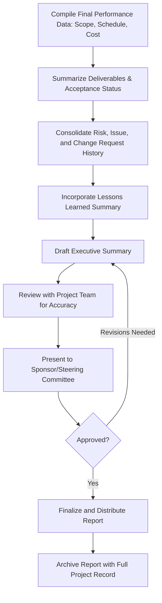
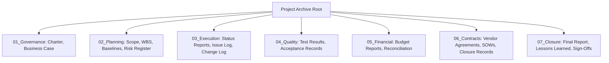

## Final Reporting and Archiving

### Definition and Purpose

Final reporting and archiving is the closing activity of consolidating a project's complete performance record, outcomes, and documentation into a formal final report and a properly organized, retrievable archive. It provides the definitive account of what was delivered, how the project performed against its baselines, and preserves the complete record for future audit, reference, or organizational learning needs.

**Key Points**

- The final report is a distinct deliverable from ongoing status reports — it is a retrospective summary of the entire project, not a periodic snapshot
- Archiving is not simply storing files; it requires deliberate organization, indexing, and adherence to retention requirements
- Both activities typically occur as part of, or immediately following, administrative closure
- A well-executed final report and archive protects the organization in the event of later audits, disputes, or reference needs, and supports future project planning

### Final Report vs. Status Reports

| Aspect | Status Report | Final Report |
| --- | --- | --- |
| Timing | Periodic, throughout execution | Once, at project closure |
| Scope | Current period performance | Entire project lifecycle |
| Purpose | Ongoing monitoring and decision support | Retrospective record and formal closure |
| Audience | Active stakeholders during execution | Sponsors, future project teams, auditors, organizational archive |
| Typical Length | Brief, focused on current status | Comprehensive, covering full performance history |

### Core Components of a Final Report

| Section | Content |
| --- | --- |
| Executive summary | High-level overview of objectives, outcomes, and overall success |
| Project overview | Original scope, objectives, and business case, for context |
| Final scope, schedule, and budget performance | Actual vs. baseline comparison across all three dimensions |
| Deliverables summary | List of all deliverables produced, with acceptance status |
| Key risks and issues encountered | Summary of significant risks/issues and how they were managed |
| Change request summary | Total approved changes and their cumulative scope/schedule/cost impact |
| Lessons learned summary | Key findings from lessons learned sessions (cross-referenced to the full register) |
| Financial reconciliation | Final budget reconciliation, including contingency/reserve utilization |
| Recommendations | Suggestions for related future work, follow-on projects, or benefits realization tracking |

### Final Report Development Process

### Reporting Final Performance Against Baselines

The final report should present clear, quantified comparisons between the original (or current, if formally rebaselined) Performance Measurement Baseline and actual final results.

**Example**

| Metric | Baseline | Actual | Variance |
| --- | --- | --- | --- |
| Schedule (finish date) | March 15, 2026 | March 29, 2026 | +14 days |
| Budget (total cost) | $450,000 | $472,000 | +$22,000 (4.9%) |
| Scope (deliverables) | 12 planned | 12 delivered, 2 via approved change requests | On scope (with governed changes) |
| Quality (defect rate) | <5% target | 3.2% actual | Favorable |

**Key Points**

- Variance should be explained with brief context (e.g., "the 14-day schedule variance reflects two approved scope changes adding $18,000 and 10 days," distinguishing governed change from unmanaged slippage) rather than presented as a bare number without narrative
- Distinguishing variance caused by approved changes from variance caused by execution issues gives a more accurate picture of underlying delivery performance

### Archiving: What to Preserve

| Category | Examples |
| --- | --- |
| Governance documents | Charter, business case, governance structure |
| Planning documents | Scope statement, WBS, schedule and cost baselines, risk register |
| Execution records | Status reports, meeting minutes, issue and change logs |
| Quality records | Test results, acceptance sign-offs, audit findings |
| Financial records | Budget reports, invoices, final reconciliation |
| Contract records | Vendor contracts, SOWs, amendments, closure documentation |
| Communication records | Key stakeholder correspondence, decision logs |
| Closure documents | Final report, lessons learned register, formal sign-offs |

### Archive Organization Principles

**Next Steps** (archiving procedure)

1. **Establish a consistent folder/repository structure** before archiving begins, ideally following an organizational standard rather than an ad hoc structure unique to this project.
2. **Index or catalog key documents** with clear naming conventions and metadata (project name, document type, date, version) to support future retrieval.
3. **Verify completeness** against a checklist of required closure documents before considering the archive final.
4. **Apply access controls** appropriate to the sensitivity of the content (e.g., financial or contractual records may need restricted access compared to general project documentation).
5. **Record retention periods and disposal dates** per organizational policy and any applicable legal/regulatory requirements, rather than assuming indefinite retention by default.
6. **Confirm archive accessibility** — verify that authorized future users (auditors, future project teams, portfolio management) can actually locate and access the archive, not just that files have been stored somewhere.

### Archive Structure Example

### Retention Requirements and Considerations

**Key Points**

- Retention periods are frequently governed by external factors — tax law, industry regulation, contractual terms — rather than solely internal organizational preference; [Unverified] specific retention durations vary significantly by jurisdiction, industry, and document type, and should be confirmed with legal/compliance guidance rather than assumed from general practice.
- Certain records (contracts, financial documentation, safety/compliance records) often carry longer mandatory retention periods than general project working documents
- Where legal holds or ongoing disputes exist, standard retention/disposal schedules should be suspended for the affected records until the hold is lifted

### Distribution of the Final Report

| Audience | Purpose |
| --- | --- |
| Project sponsor | Formal acknowledgment of project outcomes and closure |
| Steering committee/senior stakeholders | Record of governance oversight and final performance |
| Project Management Office (PMO) | Input to portfolio-level reporting and organizational lessons learned |
| Future project teams | Reference for similar future projects (via searchable archive) |
| Finance/audit functions | Record for financial reconciliation and potential audit reference |

### Common Pitfalls

- **Treating the final report as a formality:** Producing a superficial summary that doesn't genuinely capture variance explanations or actionable lessons, reducing its long-term reference value.
- **Incomplete data compilation:** Missing key performance data because it wasn't consistently tracked throughout execution, forcing reconstruction from memory at closure — a strong argument for consistent tracking discipline throughout the project rather than only at the end.
- **Disorganized archiving:** Storing documents without consistent structure, naming conventions, or indexing, making future retrieval difficult or impractical even though the records technically exist.
- **Ignoring retention requirements:** Applying a default or arbitrary retention period without checking applicable legal, regulatory, or contractual requirements, risking premature disposal of records that were required to be retained longer.
- **No access verification:** Assuming an archive is usable without confirming that future users can actually locate and access it through normal organizational channels.
- **Disconnected from lessons learned:** Producing a final report that doesn't reference or link to the detailed lessons learned register, missing the opportunity to connect performance data with the underlying causes and recommendations.

### Conclusion

Final reporting and archiving provide the definitive, retrospective record of a project's performance and the organized repository that preserves that record for future use. A thorough final report translates raw performance data into a clear narrative of what was achieved, how it compared to baseline, and what was learned, while disciplined archiving — with consistent structure, appropriate access controls, and adherence to retention requirements — ensures that record remains genuinely retrievable and useful long after the project team has moved on to other work.

**Related Topics**

- Administrative and contract closure
- Lessons learned session facilitation and documentation
- Records retention policy and compliance requirements
- Performance Measurement Baseline (PMB) and variance analysis
- Project Management Office (PMO) reporting and portfolio management
- Benefits realization and post-implementation review