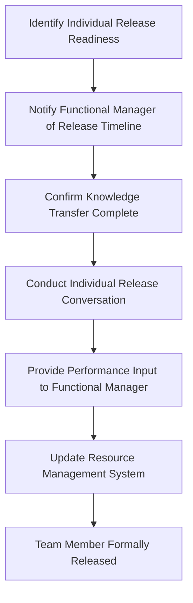

## Releasing and Recognizing the Team

### Definition and Purpose

Releasing and recognizing the team is the closure activity of formally ending team members' assignment to the project and acknowledging their contributions before they transition to other work. It addresses both the administrative mechanics of resource release (returning people to their functional organization or reassigning them to new projects) and the human dimension of closure — recognizing effort, providing performance feedback, and closing out the working relationship in a way that supports morale and future collaboration.

**Key Points**

- Resource release is an administrative and planning activity; recognition is a relational and motivational one — both matter and neither substitutes for the other
- Poorly handled team release can affect morale, future willingness to work with the project manager, and organizational reputation for how projects treat their people
- Recognition should be genuine and specific, not perfunctory, to have meaningful impact
- Timing matters — delayed or absent release/recognition activities are a common source of team member disengagement in a project's final weeks

### Resource Release: Administrative Activities

**Next Steps** (procedural sequence)

1. **Plan resource release timing** in the schedule, ideally staggered based on when each individual's contribution is complete rather than releasing everyone simultaneously at project end.
2. **Communicate release timing to functional managers** in advance, giving them lead time to plan the individual's next assignment.
3. **Conduct individual release conversations** with each team member, confirming their end date and any final responsibilities.
4. **Complete performance input for functional managers** — since in matrix organizations the project manager often lacks formal authority over performance reviews, providing structured feedback to the functional manager supports accurate evaluation.
5. **Ensure knowledge transfer is complete** before release, particularly for team members holding unique project knowledge not captured elsewhere.
6. **Update resource management systems** to reflect the team member's availability for reassignment.
7. **Confirm final timesheet/effort recording** is complete and accurate for project cost reconciliation purposes.

### Resource Release Process Flow

### Staggered Release Planning

Rather than releasing the entire team simultaneously at project close, most projects benefit from a staggered approach aligned to when each role's contribution is genuinely complete.

**Example**

| Role | Typical Release Point | Rationale |
| --- | --- | --- |
| Developers/builders | After deliverable acceptance and defect resolution | Core build work complete once deliverables pass QA |
| QA/testers | After UAT sign-off | Testing responsibilities complete once acceptance is confirmed |
| Trainers/change management | After go-live and initial hypercare | Adoption support needed through early operational period |
| Project Manager | After administrative/contract closure complete | Final closure activities and reporting require continued oversight |

**Key Points**

- Releasing team members prematurely, before their knowledge transfer or handover responsibilities are complete, risks gaps in institutional knowledge that surface only after they've moved to other work
- Retaining team members past their genuine point of usefulness, purely out of scheduling convenience, can create disengagement and is a poor use of organizational resources

### Recognizing Team Contributions

#### Why Recognition Matters

- Reinforces desired behaviors and effort, supporting motivation on future projects (both for this team and for the project manager's broader reputation)
- Provides closure and a sense of accomplishment, particularly important after a long or difficult project
- Signals to the broader organization that project contributions are valued, supporting future resource negotiation and team engagement

[Inference] Genuine, specific recognition is widely regarded in project management and organizational behavior practice as more motivating than generic or perfunctory praise, though the specific effect size varies by individual and organizational culture.

#### Forms of Recognition

| Type | Description | Best Suited For |
| --- | --- | --- |
| Public acknowledgment | Recognition in team meetings, organizational newsletters, or steering committee updates | Significant contributions, milestone achievements |
| Written feedback | Personalized notes or performance input highlighting specific contributions | Individual recognition, feeding into performance reviews |
| Team celebration event | Informal gathering, lunch, or dedicated closure event | Marking overall project completion as a shared achievement |
| Formal awards/recognition programs | Organization-specific award nominations or programs | Exceptional individual or team achievements meeting program criteria |
| Career/growth support | Advocacy for promotion, references, or advancement based on demonstrated project performance | Individuals who took on stretch responsibilities or grew significantly during the project |

**Key Points**

- Recognition should be specific to genuine contributions ("your redesign of the integration approach saved three weeks of rework") rather than generic ("great job, everyone") to feel authentic and meaningful
- Recognition given only to the most visible contributors while overlooking quieter, equally valuable contributions (e.g., a meticulous QA tester, an administrative coordinator) can create resentment rather than the intended morale boost

### Individual Recognition Considerations

Different team members may value different forms of recognition; a one-size-fits-all approach can miss the mark.

**Example**

| Preference Type | Appropriate Recognition Approach |
| --- | --- |
| Values public visibility | Public acknowledgment in team or organizational settings |
| Prefers private feedback | One-on-one conversation or written note |
| Career-motivated | Specific mention in formal performance review or advocacy for next role |
| Team-oriented | Group celebration emphasizing collective achievement |

[Unverified] Individual preferences for recognition style vary considerably and are best determined by knowing the specific person rather than assuming a universal preference; the categories above are illustrative rather than exhaustive.

### The Closure Conversation

A structured individual conversation at release, distinct from a performance review, focused on closure and forward-looking transition.

**Example Discussion Points**

- Summary of the individual's specific contributions and their impact on project outcomes
- Genuine feedback on strengths demonstrated during the project
- Constructive input on areas for growth, framed supportively
- Discussion of the individual's next assignment or immediate priorities
- Invitation for the individual's own feedback on their project experience

**Key Points**

- This conversation should happen regardless of whether the project was ultimately successful — team members who worked hard on a project that faced external challenges still deserve genuine, specific closure and recognition of their effort
- Skipping this conversation entirely, simply allowing team members to drift to their next assignment without any formal closure, is a missed opportunity that can leave team members feeling their contribution went unacknowledged

### Providing Performance Input in Matrix Organizations

In functional or matrix structures, the project manager typically does not conduct formal performance reviews directly but should provide structured input to the functional manager who does.

**Next Steps**

1. Document specific, observable contributions and outcomes for each team member throughout the project (not reconstructed from memory at closure).
2. Provide this input to the functional manager in a format useful for their formal review process, ideally before the functional manager's review cycle deadline.
3. Include both strengths and any genuine development areas, maintaining the same balance and honesty expected of any performance feedback.
4. Where a team member's contribution was exceptional, consider whether direct communication with the functional manager (beyond written input) would strengthen the case for the recognition it deserves.

### Team Celebration and Closure Events

- **Timing:** Ideally scheduled close to actual project completion while the shared experience is fresh, rather than significantly delayed
- **Inclusivity:** Should include all meaningful contributors, including part-time or peripheral team members who might otherwise be overlooked
- **Tone:** Should reflect the nature of the project's outcome honestly — an authentic acknowledgment of effort and specific achievements resonates more than forced positivity, particularly if the project faced genuine challenges
- **Format flexibility:** Can range from a simple team lunch to a more formal event, calibrated to organizational culture and project scale

### Common Pitfalls

- **Releasing the team without any closure activity:** Allowing team members to simply drift to new assignments without acknowledgment, missing an opportunity to reinforce positive contribution and support future engagement.
- **Generic, undifferentiated recognition:** Offering the same broad praise to everyone regardless of actual individual contribution, which can feel hollow rather than motivating.
- **Delayed or absent performance input:** Failing to provide timely, specific input to functional managers, resulting in less accurate or less complete performance reviews for team members.
- **Releasing key knowledge holders too early:** Prioritizing administrative efficiency (releasing everyone as soon as possible) over ensuring critical knowledge transfer is genuinely complete.
- **Overlooking quieter contributors:** Concentrating recognition on the most visible team members while under-recognizing equally important but less visible contributions.
- **Treating recognition as a box-ticking exercise:** Conducting perfunctory, insincere recognition activities that team members can readily perceive as going through the motions rather than genuine acknowledgment.

### Conclusion

Releasing and recognizing the team closes out the human dimension of a project alongside its administrative and contractual closure. Thoughtful, staggered resource release protects knowledge transfer and respects functional planning needs, while genuine, specific, and individually calibrated recognition reinforces positive contribution and supports morale for future work. Together, these activities determine whether a project's conclusion leaves team members feeling valued and ready for what comes next, or simply fades into an unacknowledged transition to other priorities.

**Related Topics**

- Administrative and contract closure
- Lessons learned session facilitation
- Matrix organizational structures and performance management
- Team motivation theory and recognition practices
- Resource management and capacity planning
- Handover and transition to operations