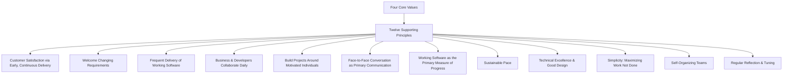

## The Agile Manifesto and Principles

### Definition and Purpose

The Agile Manifesto is a foundational declaration of values for software development, published in 2001 by seventeen practitioners who convened to articulate an alternative to heavyweight, plan-driven development processes. It is supported by twelve accompanying principles that elaborate on how the values translate into practice. Together, they form the philosophical basis from which specific agile frameworks (Scrum, Kanban, XP, and others) have since been derived.

**Key Points**

- Originated in February 2001 at a gathering in Snowbird, Utah, of seventeen software practitioners
- Consists of four core value statements and twelve supporting principles
- Is a mindset and set of values, not a specific methodology or process itself
- Frameworks like Scrum and Kanban are implementations that embody the Manifesto's values, not the Manifesto itself

Let me verify current details before proceeding.

Searched the webAgile Manifesto 2001 authors history

### Historical Origin

The Agile Manifesto was written in February 2001 when seventeen people met at The Lodge at Snowbird ski resort in the Wasatch mountains of Utah to talk, ski, relax, and try to find common ground. Attendees represented Extreme Programming, Scrum, DSDM, Adaptive Software Development, Crystal, Feature-Driven Development, Pragmatic Programming, and other approaches sympathetic to finding an alternative to documentation-driven, heavyweight software development processes. The group named themselves "The Agile Alliance." [History: The Agile Manifesto +2](https://agilemanifesto.org/history.html)

Most of the original authors did not anticipate how successful the manifesto would become — Jim Highsmith has noted that its adoption took off faster than any of the authors expected. [SpringerOpen](https://jserd.springeropen.com/articles/10.1186/s40411-018-0059-z)[SpringerOpen](https://jserd.springeropen.com/articles/10.1186/s40411-018-0059-z)

**Key Points**

- The seventeen practitioners often didn't agree on specifics, but found consensus around four core values. [Agile Alliance](https://agilealliance.org/agile101/the-agile-manifesto/)
- The signatories include well-known figures such as Kent Beck (co-creator of Extreme Programming), Mike Beedle (co-author of Agile Software Development with Scrum), and Robert C. Martin ("Uncle Bob"), among others [ProductPlan](https://www.productplan.com/glossary/agile-manifesto)
- Jeff Sutherland and Ken Schwaber had already created Scrum and introduced it at an OOPSLA conference in 1995, prior to the 2001 gathering that produced the shared Manifesto [Kaizenko](https://www.kaizenko.com/a-behind-the-scenes-look-at-the-writing-of-the-agile-manifesto/)

### The Four Core Values

The Agile Manifesto states a preference for individuals and interactions, working software, customer collaboration, and responding to change — valuing these over processes and tools, comprehensive documentation, contract negotiation, and following a plan, respectively. [Agile Alliance](https://agilealliance.org/agile101/the-agile-manifesto/)

| Valued More | Valued Less (but still valued) |
| --- | --- |
| Individuals and interactions | Processes and tools |
| Working software | Comprehensive documentation |
| Customer collaboration | Contract negotiation |
| Responding to change | Following a plan |

**Key Points**

- The Manifesto explicitly states that items on the right retain value — the framing is "over," not "instead of" — meaning traditional artifacts (documentation, contracts, plans) are not discarded, only deprioritized relative to the items on the left when trade-offs arise
- This is a common point of misunderstanding: agile does not mean "no documentation" or "no planning," but rather prioritizing adaptability and working outcomes when the two are in tension

### The Twelve Principles

The Manifesto is accompanied by twelve principles that elaborate the values into more concrete guidance for practice.

**Example — the Twelve Principles (paraphrased)**

1. Highest priority is satisfying the customer through early and continuous delivery of valuable software.
2. Welcome changing requirements, even late in development — agile processes harness change for the customer's competitive advantage.
3. Deliver working software frequently, with a preference for shorter timescales.
4. Business people and developers must work together daily throughout the project.
5. Build projects around motivated individuals; give them the environment and support they need, and trust them to get the job done.
6. Face-to-face conversation is the most efficient and effective method of conveying information within a development team.
7. Working software is the primary measure of progress.
8. Agile processes promote sustainable development; sponsors, developers, and users should be able to maintain a constant pace indefinitely.
9. Continuous attention to technical excellence and good design enhances agility.
10. Simplicity — the art of maximizing the amount of work not done — is essential.
11. The best architectures, requirements, and designs emerge from self-organizing teams.
12. At regular intervals, the team reflects on how to become more effective, then tunes and adjusts its behavior accordingly.

[Inference] This is a paraphrased summary rather than exact quotation of the twelve principles; the precise original wording is available on the Agile Manifesto's official site and should be consulted directly where verbatim text is needed.

### How the Values and Principles Relate to Traditional (Waterfall) Project Management

| Dimension | Traditional/Predictive Approach | Agile Approach |
| --- | --- | --- |
| Requirements | Defined comprehensively upfront | Expected to evolve; welcomed as new information emerges |
| Planning | Detailed, long-range plan | High-level roadmap with detailed near-term planning (rolling wave) |
| Progress measurement | % complete against plan, milestone tracking | Working software/product increments delivered |
| Change | Managed via formal change control to minimize | Embraced as a source of competitive advantage |
| Team structure | Often hierarchical, task-assigned | Self-organizing, cross-functional |
| Documentation | Comprehensive, often a primary deliverable | Sufficient to support the work; not an end in itself |

[Inference] Agile is often positioned as a spectrum relative to traditional predictive approaches rather than a strict binary; many organizations blend elements of both (hybrid approaches), and the appropriateness of each depends heavily on project type, industry, and the degree of requirements volatility expected.

### Common Frameworks That Embody the Manifesto

The Manifesto itself prescribes no specific process; various frameworks have since operationalized its values differently:

| Framework | Primary Focus |
| --- | --- |
| Scrum | Time-boxed iterations (sprints), defined roles and ceremonies |
| Kanban | Continuous flow, visualizing work, limiting work in progress |
| Extreme Programming (XP) | Engineering practices — pair programming, test-driven development, continuous integration |
| Scaled Agile Framework (SAFe) | Applying agile principles across multiple teams/large organizations |
| Lean Software Development | Applying lean manufacturing principles (waste elimination, flow) to software |

**Key Points**

- These frameworks can differ significantly in their specific practices while all tracing their underlying philosophy back to the same four values and twelve principles
- Selecting a framework is a separate decision from adopting agile values — an organization can nominally implement a framework's ceremonies (e.g., daily standups, sprints) without genuinely embracing the underlying values, sometimes referred to critically as "cargo cult agile" or "agile in name only"

### Common Misconceptions

- **"Agile means no planning":** The Manifesto values responding to change over rigidly following a plan, but planning itself remains essential — it simply becomes iterative and adaptive rather than fixed far in advance.
- **"Agile means no documentation":** Documentation is deprioritized relative to working software, not eliminated; the principle is "sufficient documentation," not "no documentation."
- **"Agile is a single methodology":** The Manifesto is a set of values and principles; Scrum, Kanban, XP, and others are specific frameworks that implement those values differently.
- **"Agile means no structure or discipline":** Self-organizing teams and simplicity require significant discipline in practice — sustainable pace, technical excellence, and regular reflection are principles requiring deliberate ongoing effort, not an absence of process.
- **"Agile only applies to software":** While originating in software development specifically, the underlying values (iterative delivery, collaboration, adaptability) have since been widely adapted to other domains, including general project and product management, marketing, and organizational change, though the twelve principles as originally written retain clear software-specific language (e.g., references to "working software").

### Conclusion

The Agile Manifesto and its twelve supporting principles established a values-based alternative to heavyweight, plan-driven software development, prioritizing individuals and interactions, working software, customer collaboration, and responsiveness to change — without discarding the value of processes, documentation, contracts, or plans entirely. As the philosophical foundation beneath frameworks like Scrum, Kanban, and XP, the Manifesto's lasting significance lies less in any specific practice it mandates and more in the mindset shift it represents: treating adaptability and continuous value delivery as central to how software (and, more broadly, project work) should be organized and executed.

**Related Topics**

- Scrum framework: roles, events, and artifacts
- Kanban method and flow-based delivery
- Extreme Programming (XP) engineering practices
- Hybrid and scaled agile approaches (SAFe, LeSS)
- Agile vs. waterfall project management comparison
- Self-organizing teams and servant leadership