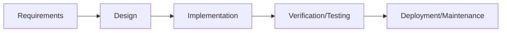
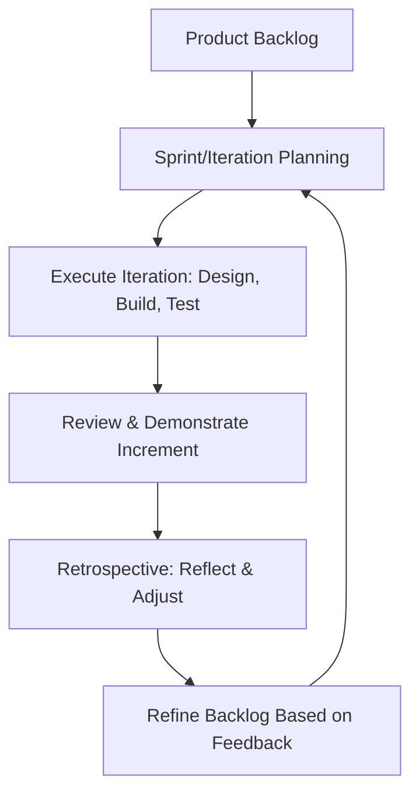

## Agile versus Waterfall Thinking

### Definition and Purpose

Agile and Waterfall represent two fundamentally different mindsets for organizing and executing project work. Waterfall is a predictive, sequential approach in which phases (requirements, design, build, test, deploy) proceed in a fixed order, each completed before the next begins. Agile is an adaptive, iterative approach in which work is delivered incrementally, requirements are expected to evolve, and planning happens continuously throughout execution rather than being fixed upfront.

**Key Points**

- The distinction is fundamentally about how each approach handles uncertainty and change, not merely about specific tools or ceremonies
- Waterfall assumes requirements can be substantially known and fixed at the outset; Agile assumes they will evolve and builds the process around that expectation
- Neither approach is universally superior — suitability depends on the nature of the work, the domain, and the degree of requirements volatility
- Many organizations use hybrid approaches blending elements of both rather than adopting either in pure form

### Origins and Underlying Philosophy

Waterfall traces to structured engineering and manufacturing disciplines, where sequential, gated processes suit work with well-understood requirements and high cost of late-stage change (e.g., construction, hardware manufacturing). Agile emerged from software development in the late 1990s and was formalized by the Agile Manifesto in 2001, responding specifically to the high rate of requirements change and discovery inherent in software projects.

[Inference] The "waterfall" model is often traced to a 1970 paper by Winston Royce, though Royce's original paper is frequently cited as having actually recommended iterative feedback loops between phases — the strictly sequential interpretation that became known as "waterfall" in practice is generally considered a simplification of his original argument.

### Core Structural Differences

| Dimension | Waterfall | Agile |
| --- | --- | --- |
| Phase structure | Sequential, gated phases | Iterative cycles (sprints/iterations) |
| Requirements | Fixed and detailed upfront | Expected to evolve; refined continuously |
| Planning horizon | Detailed plan for the entire project | Detailed near-term planning; high-level long-term roadmap |
| Change handling | Managed via formal change control to minimize disruption | Embraced as a source of value and competitive advantage |
| Delivery | Single delivery at project end (or per major phase) | Frequent incremental delivery of working output |
| Customer involvement | Concentrated at requirements and acceptance phases | Continuous throughout the project |
| Progress measurement | % complete against plan/milestones | Working software/product increments delivered |
| Team structure | Often functionally organized, task-assigned | Cross-functional, self-organizing |
| Documentation | Comprehensive, often a formal deliverable | Sufficient to support the work; not an end in itself |

### The Waterfall Sequential Flow

### The Agile Iterative Flow

### When Waterfall Thinking Fits Well

- **Well-understood, stable requirements:** Domains where the end state can be substantially specified upfront and is unlikely to change materially (e.g., regulatory compliance projects with fixed legal requirements)
- **High cost of late change:** Physical construction, hardware manufacturing, or other contexts where changing direction mid-execution is prohibitively expensive or physically impossible
- **Regulatory or contractual requirements for sequential gates:** Some industries (aerospace, pharmaceuticals, government contracting) require formal phase-gate documentation and sign-off for compliance reasons
- **Fixed-price contracts with clearly bounded scope:** Predictable, comprehensively specified scope suits a fixed-price commercial arrangement more naturally than continuously evolving requirements

### When Agile Thinking Fits Well

- **High requirements uncertainty or volatility:** Domains where the end users' actual needs are best discovered through iterative feedback rather than fully specified in advance (common in software, digital product development)
- **Need for early and frequent value delivery:** Business contexts where delivering partial value sooner is preferable to waiting for a complete solution
- **Competitive or fast-moving markets:** Environments where the ability to pivot in response to market feedback provides a meaningful advantage
- **Complex, novel problem domains:** Situations where the solution approach itself isn't well understood at the outset, making extensive upfront design speculative

[Inference] The suitability distinctions above reflect widely cited general guidance in project management literature (e.g., using the Cynefin framework's distinction between "complicated" and "complex" domains), though specific project circumstances often call for nuanced judgment rather than a strict either/or determination based on industry alone.

### Cost of Change Curve

A commonly cited conceptual difference between the two approaches concerns how the cost of changing requirements evolves over the project lifecycle.

<svg xmlns="http://www.w3.org/2000/svg" viewBox="0 0 640 380">
<title>Cost of Change Over Project Lifecycle (svg_diagram)</title>
<rect x="60" y="20" width="540" height="300" fill="#ffffff" stroke="#333" stroke-width="1" />
<line x1="60" y1="320" x2="600" y2="320" stroke="#000" stroke-width="1.5" />
<line x1="60" y1="20" x2="60" y2="320" stroke="#000" stroke-width="1.5" />

<text x="330" y="355" font-size="13" text-anchor="middle" fill="#333" font-family="sans-serif">Project Timeline</text>

<text x="25" y="170" font-size="13" text-anchor="middle" fill="#333" font-family="sans-serif" transform="rotate(-90 25 170)">Cost of Change</text>

<path d="M 60 300 C 200 290, 350 250, 450 150 C 500 100, 550 50, 600 30" fill="none" stroke="`#c0392b`" stroke-width="3" />

<text x="440" y="120" font-size="12" fill="`#c0392b`" font-family="sans-serif">Traditional/Waterfall (steep late-stage rise)</text>

<path d="M 60 300 C 200 280, 350 265, 450 250 C 500 240, 550 225, 600 210" fill="none" stroke="`#2c5aa0`" stroke-width="3" stroke-dasharray="6,4" />

<text x="420" y="270" font-size="12" fill="`#2c5aa0`" font-family="sans-serif">Agile/Iterative (flatter curve)</text>

</svg>

[Inference] This "cost of change" curve is a widely used conceptual illustration in agile literature to argue for iterative approaches, though it represents a generalized pattern rather than a precisely measured universal law — the actual shape varies by project type, and some empirical critiques argue the traditional steep-curve assumption has been overstated in certain contexts.

### Comparing Risk Management Approaches

| Aspect | Waterfall | Agile |
| --- | --- | --- |
| Risk discovery | Concentrated at defined review gates | Continuous, surfaced each iteration |
| Response to discovered risk | Often requires formal change control, potentially disruptive to the fixed plan | Absorbed into backlog reprioritization for the next iteration |
| Schedule risk exposure | Concentrated at the end (integration/testing phase) | Distributed across iterations; issues surface earlier |
| Requirements risk | High — assumes requirements were correctly and completely captured upfront | Lower — validated incrementally through working increments |

### Hybrid Approaches

Many organizations blend elements of both, recognizing that pure adherence to either model may not fit every context.

**Example**

| Hybrid Pattern | Description |
| --- | --- |
| Water-Scrum-Fall | Upfront requirements/design phase (waterfall-like), agile execution in the middle, formal release/deployment phase (waterfall-like) |
| Agile within a stage-gate structure | Overall program governed by traditional phase gates, but execution within each phase uses agile sprints |
| Scaled agile frameworks (e.g., SAFe) | Applies agile team-level practices within a broader program/portfolio structure that retains elements of longer-range planning |

**Key Points**

- Hybrid approaches are common in large enterprises, particularly where regulatory, contractual, or organizational governance requirements make pure agile impractical, while pure waterfall is seen as too rigid for the technical work itself
- [Unverified] The prevalence and specific structure of hybrid approaches vary considerably across industries and organizations; the patterns above represent commonly discussed illustrative examples rather than a single standardized model

### Common Misconceptions About Each Approach

- **"Waterfall means no flexibility ever":** Well-run waterfall projects still include formal change control processes to handle legitimate change — the difference is that change is treated as an exception requiring approval, not an expected, continuous input.
- **"Agile means no planning or documentation":** Agile still requires planning (sprint planning, release planning, roadmaps) and documentation (sufficient to support the work) — the difference is in degree, timing, and rigidity, not absence.
- **"Agile is always faster":** Agile's advantage is in adapting to change and delivering value incrementally, not necessarily in overall speed to a fully defined final scope — a well-understood, stable-scope project may complete comparably fast or faster under a well-run waterfall approach.
- **"You must choose one exclusively":** As shown above, hybrid approaches are common and often pragmatic responses to organizational constraints that don't neatly fit either pure model.

### Choosing Between Approaches: Key Questions

**Next Steps** (decision framework)

1. **Assess requirements certainty:** Can the full scope be reliably specified upfront, or is significant discovery expected during execution?
2. **Assess cost of late change:** Is the nature of the work such that changing direction mid-execution is prohibitively expensive (physical construction) or relatively low-cost (digital iteration)?
3. **Assess stakeholder/customer availability:** Does the customer/business have the capacity for continuous engagement that agile approaches require, or is intermittent engagement at defined milestones more realistic?
4. **Assess regulatory/contractual constraints:** Are there compliance or contractual requirements mandating specific sequential documentation and sign-off gates?
5. **Assess organizational and team readiness:** Does the team have experience with self-organization and iterative delivery, or would a significant change management effort be required to adopt agile practices effectively?
6. **Consider a hybrid model** where pure application of either approach doesn't fit the actual constraints of the environment.

### Common Pitfalls

- **Applying agile ceremonies without agile mindset:** Running daily standups and sprints while still requiring comprehensive upfront requirements sign-off and resisting mid-project change — sometimes called "agile in name only" or "cargo cult agile."
- **Applying waterfall to genuinely uncertain domains:** Attempting to fully specify requirements upfront in a domain where the actual solution can only be discovered through iteration, leading to costly late-stage rework when the fixed plan proves wrong.
- **Assuming one approach is inherently superior:** Advocating for agile or waterfall as a universal best practice without evaluating the specific project's requirements certainty, cost of change, and organizational context.
- **Underestimating the customer engagement agile requires:** Adopting agile without securing the continuous stakeholder availability the approach depends on, resulting in delayed feedback and reduced effectiveness.
- **Poorly designed hybrid models:** Combining elements of both without a coherent overall governance model, resulting in the rigidity of waterfall's gates combined with the ambiguity of agile's evolving scope, without capturing the benefits of either.

### Conclusion

Agile and Waterfall thinking represent genuinely different philosophies for managing uncertainty, change, and delivery — Waterfall optimizing for predictability and sequential control in stable, well-understood domains, and Agile optimizing for adaptability and incremental value delivery in domains characterized by discovery and change. The choice between them, or a deliberate hybrid combining elements of both, should be driven by an honest assessment of requirements certainty, cost of change, stakeholder engagement capacity, and regulatory context, rather than treating either approach as a universally superior default.

**Related Topics**

- The Agile Manifesto and twelve principles
- Scrum, Kanban, and other agile frameworks
- Hybrid and scaled agile approaches (Water-Scrum-Fall, SAFe)
- Cynefin framework and complexity-based project categorization
- Change control processes in predictive project management
- Risk management approaches across project methodologies