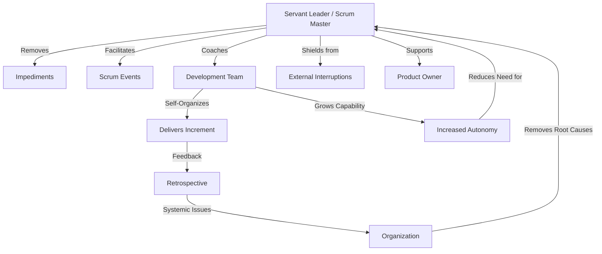

## Servant Leadership in Agile

### Definition and Core Concept

Servant leadership is a leadership philosophy in which the leader's primary role is to serve the team, remove obstacles, and enable others to perform at their best, rather than to direct, command, or control. The term was coined by Robert K. Greenleaf in his 1970 essay "The Servant as Leader." In Agile contexts, servant leadership is the foundational leadership model for roles such as Scrum Master, Agile Coach, and increasingly for managers and executives operating within Agile organizations.

The servant leader inverts the traditional leadership pyramid: instead of the team existing to serve the leader's objectives, the leader exists to serve the team's ability to deliver value.

### Key Points

- Authority is replaced by influence, facilitation, and trust
- Focus shifts from controlling outcomes to enabling the team's capability
- The leader actively works to develop team members' skills, autonomy, and decision-making capacity
- Success is measured by team growth, self-organization, and sustained delivery, not by the leader's visibility or control
- Servant leadership does not mean absence of leadership; it means leadership expressed through support rather than command

### Greenleaf's Foundational Test

Greenleaf proposed a test to evaluate whether servant leadership is genuinely occurring:

"Do those served grow as persons? Do they, while being served, become healthier, wiser, freer, more autonomous, more likely themselves to become servants?"

This test is often used in Agile coaching certifications (e.g., Scrum Alliance, Scrum.org) as a benchmark for evaluating Scrum Master effectiveness.

### Servant Leadership vs. Traditional Leadership

| Dimension | Traditional Leadership | Servant Leadership |
| --- | --- | --- |
| Power source | Positional authority | Trust and influence |
| Primary focus | Directing tasks | Removing impediments |
| Decision-making | Centralized | Distributed to team |
| Information flow | Top-down | Transparent, bidirectional |
| Success metric | Output compliance | Team growth and autonomy |
| Failure response | Assign blame | Facilitate learning (retrospectives) |
| Motivation style | Extrinsic (rewards/punishment) | Intrinsic (purpose, mastery, autonomy) |

### Core Behaviors of a Servant Leader in Agile

**1. Listening**

Actively listens to the team, stakeholders, and the organization to understand needs before acting. In Agile ceremonies, this manifests as facilitating rather than dominating discussion during Daily Scrums, Retrospectives, and Sprint Reviews.

**2. Empathy**

Understands team members' perspectives, challenges, and circumstances, fostering psychological safety.

**3. Healing**

Helps resolve conflicts within the team and supports recovery from setbacks (e.g., missed sprint goals, production incidents) without blame-oriented responses.

**4. Awareness**

Maintains self-awareness and situational awareness of team dynamics, organizational politics, and systemic impediments.

**5. Persuasion**

Relies on influence and consensus-building rather than positional authority to drive change — critical in Agile since Scrum Masters typically have no formal authority over the team.

**6. Conceptualization**

Balances day-to-day operational concerns with the broader organizational vision and long-term goals.

**7. Foresight**

Anticipates likely outcomes of current situations, drawing on past experience to help the team avoid foreseeable risks.

**8. Stewardship**

Holds team resources, culture, and processes in trust for the benefit of the team and organization rather than personal gain.

**9. Commitment to the Growth of People**

Actively invests in team members' professional development beyond immediate project needs.

**10. Building Community**

Fosters a sense of shared identity and collaboration within the team and across the organization.

### Application in Scrum Roles

**Scrum Master as Servant Leader**

The Scrum Guide explicitly frames the Scrum Master as a servant leader to the Scrum Team and the broader organization. Responsibilities include:

- Coaching the team in self-management and cross-functionality
- Removing impediments to the team's progress
- Facilitating Scrum events without dictating outcomes
- Shielding the team from external interruptions during a Sprint
- Helping the Product Owner with effective backlog management, without owning the backlog
- Coaching the organization in its Agile adoption, including working with stakeholders outside the team

**Product Owner and Servant Leadership**

While the Product Owner holds decision-making authority over the Product Backlog, effective Product Owners also apply servant leadership by serving stakeholders' interests, being transparent about tradeoffs, and enabling the Development Team to make informed decisions rather than dictating implementation.

**Engineering Managers and Servant Leadership**

In scaled or organizational contexts (e.g., SAFe, LeSS), engineering managers and functional leads are encouraged to adopt servant leadership by shifting from task assignment toward capability-building, career coaching, and impediment removal at the organizational level.

### Servant Leadership vs. Related Leadership Styles

**Situational Leadership**

Adjusts leadership style (directing, coaching, supporting, delegating) based on team member competence and commitment levels. Servant leadership can be considered a foundational stance that determines *how* situational leadership is applied — even directive interventions are framed as serving the team's needs, not asserting control. [Inference: the precise theoretical relationship between these two models is interpreted differently across coaching frameworks and is not fully standardized.]

**Transformational Leadership**

Focuses on inspiring and motivating followers toward a shared vision. Overlaps with servant leadership in emphasizing intrinsic motivation, but transformational leadership is more leader-vision-centric, whereas servant leadership is more follower-needs-centric.

**Command-and-Control Leadership**

The traditional antithesis of servant leadership; relies on hierarchy, directive instruction, and centralized decision-making. Widely regarded as misaligned with Agile values because it suppresses the self-organization principle central to Agile frameworks.

### Alignment with the Agile Manifesto and Principles

Servant leadership directly supports several Agile Manifesto principles:

- "Build projects around motivated individuals. Give them the environment and support they need, and trust them to get the job done."
- "The best architectures, requirements, and designs emerge from self-organizing teams."
- "Business people and developers must work together daily throughout the project" — requires a leader who facilitates rather than gatekeeps collaboration.

### Practical Example

**Scenario:** A Sprint is at risk because a third-party API the team depends on is undocumented and unstable.

**Command-and-control response:** The manager tells the team to "figure it out" and escalates blame in the Sprint Review if the goal is missed.

**Servant leadership response:**

1. The Scrum Master identifies the impediment during the Daily Scrum
2. Contacts the vendor or internal stakeholders directly to unblock the team, removing the burden from developers
3. Facilitates a conversation between the team and Product Owner to renegotiate scope transparently
4. Surfaces the systemic issue (poor third-party documentation) in the Retrospective so the organization can address the root cause
5. Coaches the team afterward on writing better contract tests against unstable dependencies, building long-term capability

### Common Anti-Patterns

- **"Servant" in title only**: Using the language of servant leadership while retaining command-and-control behaviors (micromanaging story assignment, overriding team decisions)
- **Abdication disguised as servant leadership**: Withdrawing entirely from decision-making or conflict resolution under the guise of "letting the team self-organize," leaving genuine impediments unaddressed
- **Scrum Master as project manager**: Assigning tasks, tracking individual velocity for performance reviews, or acting as a proxy for management authority — contradicts the facilitative nature of the role
- **Over-serving**: Removing every obstacle for the team, including ones they could resolve themselves, which stunts the team's growth in self-management (violates Greenleaf's "grow as persons" test)

### Measuring Servant Leadership Effectiveness

Common qualitative and quantitative indicators used in Agile coaching:

- Team's Sprint Goal achievement trend over time
- Reduction in externally imposed impediments recurring across sprints
- Increase in team members proactively resolving issues without escalation
- Psychological safety survey results (e.g., team retrospective sentiment, anonymous surveys)
- Reduced dependency on the Scrum Master for day-to-day facilitation as the team matures

[Unverified: no single standardized metric suite for servant leadership effectiveness is universally adopted across the industry; organizations typically adapt combinations of the above.]

### Diagram: Servant Leadership Influence Model

### Related Topics

- Scrum Master core responsibilities and accountabilities
- Self-organizing and self-managing teams
- Psychological safety in Agile teams
- Situational Leadership II model
- Coaching stances (Coach, Facilitator, Teacher, Mentor)
- Conflict resolution in cross-functional teams
- Agile team facilitation techniques
- Impediment and blocker management
- Distributed leadership in scaled Agile frameworks (SAFe, LeSS)