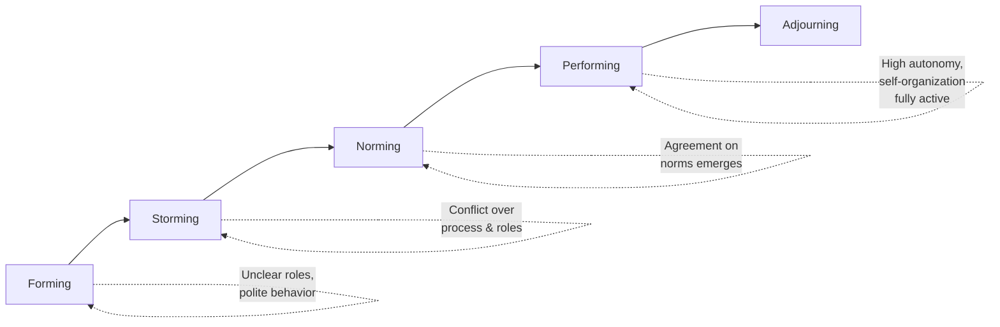

## Self Organizing Teams

### Definition and Core Concept

A self-organizing team is a team that determines *how* to accomplish its work without being directed by someone outside the team. Rather than a manager assigning tasks to individuals, the team collectively decides who does what, how work is sequenced, and how quality standards are met. Self-organization is one of the foundational structural principles of Agile frameworks, most explicitly codified in Scrum.

Self-organization applies to three primary dimensions of team work:

- **Task allocation**: Who works on what
- **Process/method**: How the work gets done
- **Team composition and coordination**: How members collaborate day to day

Note that self-organization typically does not extend to what the team builds (product scope and priority remain with the Product Owner) or organizational constraints (budget, compliance, staffing), which are set externally.

### Key Points

- Self-organization is a property that emerges under the right conditions; it cannot be mandated by decree alone
- Requires clear boundaries (goal, constraints) within which the team has autonomy — unconstrained freedom is not the same as self-organization
- Distinct from "self-managing" and "self-directing" teams, which represent different degrees of autonomy (see Team Autonomy Spectrum below)
- Relies heavily on servant leadership rather than command-and-control management to sustain itself
- Cross-functionality (having all skills needed to deliver an increment within the team) is a prerequisite for effective self-organization

### Team Autonomy Spectrum

Self-organization is often confused with total independence. In practice, most Agile literature distinguishes gradations of autonomy:

| Level | Who Decides "What to Build" | Who Decides "How to Build It" | Who Decides "Goals/Strategy" |
| --- | --- | --- | --- |
| Manager-led team | Management | Management | Management |
| Self-organizing team | Product Owner / stakeholders | Team | Management |
| Self-managing team | Product Owner / stakeholders | Team | Team (within org strategy) |
| Self-directing team | Team | Team | Team |

The 2020 Scrum Guide update shifted terminology from "self-organizing" to "self-managing," explicitly stating that Scrum Teams "choose who, how, and what to work on" — a stronger form of autonomy than earlier Scrum Guide versions implied. [Unverified: some practitioners and texts still use "self-organizing" and "self-managing" interchangeably; treatment varies by source and certification body.]

### Preconditions for Self-Organization

Self-organizing teams do not emerge spontaneously; specific organizational and team-level conditions must be present:

**1. Clear Purpose and Boundaries**

The team needs a well-defined goal (e.g., Sprint Goal, Product Goal) and known constraints (deadlines, compliance requirements, technical limitations) within which to operate.

**2. Cross-Functional Skill Coverage**

The team must possess all skills necessary to take work from idea to a usable increment without depending on external teams for routine work.

**3. Psychological Safety**

Team members must feel safe to disagree, propose ideas, admit mistakes, and challenge each other without fear of punishment.

**4. Trust from Management**

Leadership must genuinely delegate decision authority over "how" work gets done, and refrain from overriding team decisions on process and task allocation.

**5. Transparent Information Flow**

The team needs access to relevant information (business context, technical constraints, customer feedback) to make informed decisions.

**6. Stable Team Composition**

Frequent membership changes disrupt the trust and shared understanding self-organization depends on.

### Stages of Team Development (Tuckman's Model Applied to Agile)

Self-organizing teams typically progress through recognizable stages, commonly mapped to Bruce Tuckman's model:

- **Forming**: Team members are polite, roles unclear, high dependency on external direction
- **Storming**: Conflict emerges over working agreements, task ownership, and technical approach — a necessary phase, not a failure state
- **Norming**: Team establishes working agreements, definition of done, and communication patterns
- **Performing**: Team operates with high autonomy; self-organization is fully realized
- **Adjourning**: Team disbands or reforms (e.g., project completion, organizational restructuring)

[Inference: real teams often move nonlinearly through these stages, especially after membership or scope changes, rather than progressing strictly left to right.]

### Role of the Scrum Master / Agile Coach

The Scrum Master supports self-organization without directing it, primarily through:

- Facilitating (not dictating) decisions during Sprint Planning, Daily Scrum, and Retrospectives
- Coaching the team toward resolving conflicts internally rather than escalating
- Shielding the team from external interference that would undermine autonomous decision-making
- Helping the organization understand and respect the boundaries of team autonomy
- Gradually reducing their own involvement in facilitation as the team matures (see Shu-Ha-Ri progression)

### Shu-Ha-Ri and Self-Organization Maturity

Borrowed from martial arts pedagogy, Shu-Ha-Ri is commonly used in Agile coaching to describe a team's growth toward self-organization:

- **Shu (守)**: Team follows prescribed practices exactly (e.g., strict Scrum ceremonies) while learning fundamentals
- **Ha (破)**: Team begins adapting practices to its context, breaking from rigid prescription
- **Ri (離)**: Team transcends specific practices, self-organizing fluidly based on internalized principles

### Practical Example

**Scenario:** A cross-functional team has a Sprint Goal to deliver a checkout redesign. In a manager-led team, a project manager would assign the frontend work to Developer A, backend to Developer B, and QA to Developer C, with fixed sequencing.

**Self-organizing team approach:**

1. During Sprint Planning, the team collectively breaks the Sprint Goal into backlog items
2. Team members volunteer for items based on skill and interest, with pairing where knowledge gaps exist
3. The team decides mid-sprint to swap task ownership when Developer A finishes early and Developer C is blocked
4. No external approval is needed for these internal adjustments — they fall within the team's process autonomy
5. The Scrum Master intervenes only if an external impediment (e.g., a needed API from another team) blocks progress, and works to remove it

### Common Anti-Patterns

- **Self-organization as management abdication**: Leadership withdraws entirely, providing no goal clarity or constraints, leaving the team directionless — this produces chaos, not self-organization
- **Fake autonomy**: Team is told it self-organizes, but all decisions are still vetoed or overridden by a manager or "shadow" decision-maker
- **Single points of failure**: Lack of true cross-functionality forces the team to depend on individuals or external specialists for critical skills, undermining autonomous delivery
- **Skipping Storming**: Teams pressured to appear harmonious immediately often suppress necessary conflict, leading to unresolved friction that resurfaces later
- **Confusing self-organization with lack of process**: Self-organizing teams still need agreed norms (Definition of Done, working agreements); absence of process is not the goal

### Self-Organization vs. Traditional Team Structures

| Aspect | Traditional/Hierarchical Team | Self-Organizing Team |
| --- | --- | --- |
| Task assignment | Manager assigns | Team decides collectively |
| Decision-making speed | Slower (approval chains) | Faster (local decisions) |
| Accountability | Individual, manager-tracked | Shared, team-level |
| Skill development | Siloed specialization | Cross-training encouraged |
| Response to change | Requires re-planning by management | Adaptive, team-driven |
| Manager's role | Directs and controls | Coaches and removes impediments |

### Organizational Enablers Checklist

- Defined and communicated goals (Product Goal, Sprint Goal, OKRs)
- Team has authority over technical implementation decisions
- HR/performance systems evaluate team outcomes, not just individual output metrics
- Stable, long-lived team membership rather than project-based staffing churn
- Access to stakeholders and end users for direct feedback, reducing dependency on intermediaries

### Related Topics

- Servant leadership in Agile
- Cross-functional team design
- Tuckman's stages of group development
- Shu-Ha-Ri mastery model
- Psychological safety and team trust
- Definition of Done and working agreements
- Scrum Master facilitation techniques
- Team topologies and cognitive load
- Distributed and remote self-organizing teams
- Scaling self-organization (SAFe, LeSS, Spotify model)