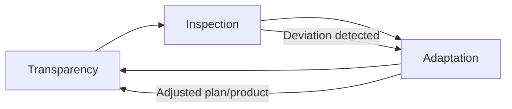
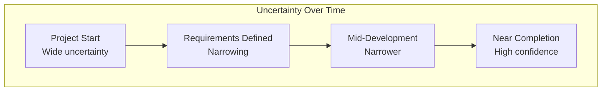
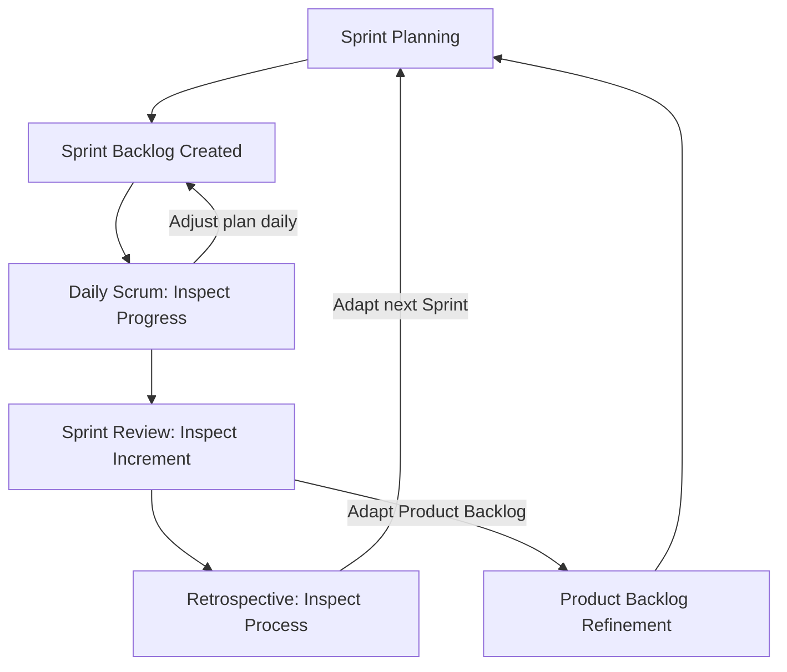

## Adaptive Planning Concepts

### Definition and Core Concept

Adaptive planning is a planning approach in which plans are treated as provisional, continuously revised artifacts rather than fixed contracts, based on ongoing feedback, changing requirements, and empirical evidence gathered during execution. It stands in direct contrast to predictive planning, where scope, schedule, and cost are defined upfront and execution follows the plan with minimal deviation.

Adaptive planning is one of the core mindset shifts underlying Agile methodologies and is explicitly referenced in the Agile Manifesto's twelfth principle: "At regular intervals, the team reflects on how to become more effective, then tunes and adjusts its behavior accordingly."

### Key Points

- Plans are treated as hypotheses to be validated, not commitments to be enforced
- Planning happens continuously and at multiple time horizons (rolling-wave, iteration-level, release-level)
- Relies on empirical process control: transparency, inspection, and adaptation
- Embraces the assumption that requirements and priorities will change as new information emerges
- Reduces the cost of change by planning in shorter horizons with frequent checkpoints

### Predictive vs. Adaptive Planning

| Dimension | Predictive (Waterfall-style) | Adaptive (Agile-style) |
| --- | --- | --- |
| Scope | Fixed upfront | Emergent, refined iteratively |
| Change handling | Change control process, often costly | Expected and embraced |
| Planning horizon | Entire project planned in detail upfront | Near-term detailed, long-term coarse |
| Success measure | Conformance to original plan | Delivered value and customer outcomes |
| Feedback frequency | End of project or phase gates | Every iteration (e.g., every sprint) |
| Risk management | Front-loaded risk analysis | Continuous risk discovery |
| Estimation | High-precision estimates upfront | Progressive elaboration, rough-to-refined |

### Empirical Process Control Theory

Adaptive planning is grounded in empiricism, formalized in Scrum through three pillars:

**1. Transparency**

Significant aspects of the process (Sprint Backlog, Definition of Done, progress) must be visible to those responsible for the outcome.

**2. Inspection**

Artifacts and progress toward goals must be inspected frequently enough to detect undesirable variances, without inspecting so frequently that it interferes with the work.

**3. Adaptation**

If inspection reveals that a process or product deviates outside acceptable limits, the process or product must be adjusted as soon as possible.

### Rolling Wave Planning

A specific adaptive planning technique in which work is planned in progressively greater detail as it approaches execution, while distant work remains at a coarse, high-level estimate.

- Near-term work (e.g., current Sprint): planned in fine-grained detail (tasks, hours)
- Mid-term work (e.g., next 2-3 Sprints): planned at a moderate level (user stories, rough estimates)
- Long-term work (e.g., future Releases/Epics): planned at a coarse level (themes, epics, rough T-shirt sizing)

This avoids the waste of detailed planning for work that is likely to change before it's reached.

```mermaid
gantt
    dateFormat  X
    axisFormat %s
    section Detail Level
    Fine-grained (Sprint 1 Tasks)   :done, a1, 0, 3
    Moderate (Sprint 2-3 Stories)   :active, a2, 3, 6
    Coarse (Release Epics)          : a3, 6, 12
```

### Multi-Horizon Planning Structure

Adaptive planning typically operates across several nested time horizons:

| Horizon | Typical Cadence | Artifact | Owner |
| --- | --- | --- | --- |
| Daily | Daily | Daily Scrum, task board updates | Development Team |
| Iteration | 1–4 weeks | Sprint Backlog, Sprint Goal | Scrum Team |
| Release | Multiple sprints | Release plan, roadmap | Product Owner |
| Strategic | Quarterly/Annually | Product vision, roadmap themes | Product Management/Leadership |

Each level feeds the one below it with priorities, while feedback from lower levels informs revisions to higher-level plans — a bidirectional flow rather than strict top-down cascading.

### Progressive Elaboration

The practice of continuously improving and detailing a plan as more accurate and complete information becomes available. Closely related to rolling wave planning but applies more broadly to requirements, estimates, and designs, not just scheduling.

**Example progression for a single feature:**

1. **Epic stage**: "Improve checkout experience" (vague, unestimated)
2. **Feature refinement**: "Add one-click checkout for returning customers" (bounded, roughly sized)
3. **User story stage**: "As a returning customer, I want to skip address entry so that I can check out faster" (specific, estimable)
4. **Task breakdown**: Individual technical tasks defined at Sprint Planning, just before implementation

### Adaptive Estimation Techniques

**Relative Estimation (Story Points)**

Estimating item size relative to other items rather than in absolute time units, using scales like Fibonacci-like sequences (1, 2, 3, 5, 8, 13...) to reflect increasing uncertainty at larger sizes.

**Planning Poker**

A consensus-based estimation technique where team members privately select story point estimates simultaneously, then discuss discrepancies to converge on a shared understanding — reduces anchoring bias.

**Velocity-Based Forecasting**

Using a team's historical throughput (story points or items completed per sprint) to forecast how much scope can realistically be delivered in future sprints, refined continuously as more sprints of data accumulate.

$$\text{Forecasted Sprints} = \frac{\text{Remaining Backlog Size}}{\text{Average Velocity}}$$

**Cone of Uncertainty**

A concept illustrating that estimation accuracy improves as a project progresses and more information is known, visualized as a narrowing range of possible outcomes over time.

### Backlog Refinement as Continuous Planning

Product Backlog refinement (grooming) is the primary adaptive planning activity in Scrum, occurring continuously rather than as a single upfront event:

- Breaking down large items (epics) into smaller, sprint-sized user stories
- Re-prioritizing based on new market information, customer feedback, or technical discoveries
- Adding acceptance criteria and estimates to upcoming items
- Removing or deprioritizing items that are no longer valuable

The Scrum Guide recommends refinement consume no more than approximately 10% of the Development Team's capacity, though this is a guideline rather than a strict rule. [Unverified: exact percentage guidance has varied across Scrum Guide editions and is treated as a rule of thumb rather than a mandated figure.]

### Adaptive Planning in Practice: Sprint-Level Cycle

### Practical Example

**Scenario:** A team is building a mobile banking app with an 8-month roadmap.

**Predictive approach:** Full requirements gathered upfront, detailed Gantt chart with fixed milestones for all 8 months, changes require formal change requests and re-baselining.

**Adaptive planning approach:**

1. Product vision and a coarse roadmap of quarterly themes are defined (e.g., "Q1: Core Account Management," "Q2: Payments")
2. Only the next 1–2 sprints are planned in detail; the Product Backlog for Q2 remains at epic-level granularity
3. After Sprint 3, user testing reveals that biometric login is more urgent than a planned feature — the Product Owner reprioritizes the backlog without formal change control
4. The reprioritized item is planned in detail only when it nears the top of the backlog (rolling wave)
5. Velocity data from Sprints 1–3 is used to forecast a realistic Q1 delivery date, replacing the original upfront estimate

### Common Anti-Patterns

- **Fake agility**: Calling planning "adaptive" while still holding teams to an original fixed-scope, fixed-date commitment made upfront
- **Over-planning distant work**: Investing significant effort detailing backlog items far in the future that will likely change before implementation
- **Under-planning near-term work**: Entering a Sprint without sufficiently refined items, causing mid-sprint confusion
- **Velocity as a target rather than a forecasting tool**: Pressuring teams to increase velocity artificially, which distorts estimates and undermines forecasting reliability
- **No re-prioritization mechanism**: Maintaining a static backlog that is never revisited despite new information, defeating the purpose of adaptive planning

### Related Topics

- Empirical process control (Scrum pillars)
- Rolling wave planning techniques
- Story point estimation and Planning Poker
- Product Backlog refinement practices
- Velocity and burndown/burnup forecasting
- Servant leadership in Agile
- Self-organizing teams
- Release planning vs. Sprint planning
- Risk-adjusted backlog prioritization
- Agile Manifesto principles