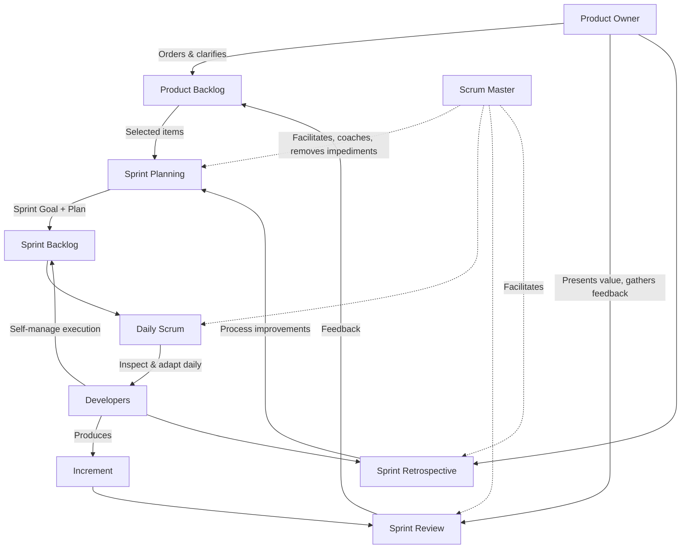

## Product Owner, Scrum Master, and Developer Roles

### Definition and Core Concept

Scrum defines exactly three accountabilities within the Scrum Team: the Product Owner, the Scrum Master, and the Developers. These are not job titles in the traditional organizational sense but distinct accountabilities that together form a single, cohesive, self-managing unit. The Scrum Guide is explicit that a Scrum Team has no sub-teams or hierarchies — all three accountabilities exist within one team, focused on one Product Goal at a time.

There is no "leader" among the three roles in the traditional sense; each accountability has authority over a distinct aspect of the work, and the roles function through collaboration rather than hierarchy.

### Key Points

- The Scrum Team is a unit of three to roughly ten people total (Scrum Guide removed a hard number in 2020 but recommends staying small, typically 10 or fewer, for communication efficiency)
- No accountability has authority to unilaterally direct another accountability's area of responsibility
- All three accountabilities are described as "servant leaders" to the team and organization in the 2020 Scrum Guide, not just the Scrum Master
- The Development Team as a separate reporting concept was removed in the 2020 Scrum Guide update; "Developers" are now Scrum Team members directly, and the Product Owner and Scrum Master are also full team members, not external roles

### Overview Comparison Table

| Aspect | Product Owner | Scrum Master | Developers |
| --- | --- | --- | --- |
| Primary accountability | Maximizing product value | Scrum process effectiveness | Creating the Increment |
| Decision authority | What gets built, priority order | How Scrum is applied | How work gets done technically |
| Reports to | Accountable to stakeholders for value | Accountable to the Scrum Team for process | Accountable to each other and PO for Increment |
| Typical count | 1 person | 1 person | Typically 3–9 people |
| Backlog ownership | Owns and orders Product Backlog | Does not own backlog | Estimates and executes backlog items |
| Authority over scope | Yes | No | No (but can push back on capacity) |
| Authority over process/method | No | Yes (facilitates, doesn't dictate) | Yes (self-manages how work is done) |

### Product Owner

**Core Accountability**

Maximizing the value of the product resulting from the work of the Scrum Team.

**Responsibilities**

- Developing and explicitly communicating the Product Goal
- Creating and clearly communicating Product Backlog items
- Ordering (prioritizing) Product Backlog items
- Ensuring the Product Backlog is transparent, visible, and understood
- Ensuring the Development Team understands items to the level needed

**Key Characteristics**

- The Product Owner is one person, not a committee. An organization may have a committee representing stakeholder desires, but the Product Owner remains the single point of accountability for backlog decisions
- To succeed, the entire organization must respect the Product Owner's decisions, expressed through the content and ordering of the Product Backlog
- The Product Owner may delegate backlog refinement work to Developers, but accountability remains with the Product Owner

**Common Misconceptions**

- The Product Owner is not a project manager; they don't manage timelines or team logistics
- The Product Owner does not dictate *how* the team implements features — only *what* and *in what order*
- The Product Owner is not merely a proxy for stakeholders passing along requests without prioritization judgment

### Scrum Master

**Core Accountability**

Establishing Scrum as defined in the Scrum Guide, and ensuring the Scrum Team's effectiveness.

**Responsibilities (Three Service Domains per the 2020 Scrum Guide)**

**1. Serving the Scrum Team**

- Coaching team members in self-management and cross-functionality
- Helping the team focus on creating high-value Increments that meet the Definition of Done
- Causing the removal of impediments to the team's progress
- Ensuring all Scrum events take place, are positive, productive, and kept within timebox

**2. Serving the Product Owner**

- Helping find techniques for effective Product Goal definition and Product Backlog management
- Helping the Scrum Team understand the need for clear, concise Product Backlog items
- Facilitating stakeholder collaboration as requested or needed

**3. Serving the Organization**

- Leading, training, and coaching the organization in its Scrum adoption
- Planning and advising Scrum implementations within the organization
- Helping employees and stakeholders understand and enact an empirical approach
- Removing barriers between stakeholders and Scrum Teams

**Key Characteristics**

- Has no positional authority over the Developers or Product Owner; influence is exercised through facilitation, coaching, and servant leadership, not command
- Is accountable for the team's effectiveness with Scrum, not for the product outcome itself
- Often described as a "servant leader to the Scrum Team," but the 2020 Scrum Guide extends this framing to all three accountabilities

**Common Misconceptions**

- The Scrum Master is not a project manager, team lead, or people manager
- The Scrum Master does not assign tasks to Developers
- The Scrum Master is not merely a meeting scheduler/note-taker — this significantly understates the coaching and organizational-change responsibilities of the role

### Developers

**Core Accountability**

Creating any aspect of a usable Increment each Sprint.

**Responsibilities**

- Creating the Sprint Backlog by selecting Product Backlog items and a plan for delivering them
- Instilling quality by adhering to a Definition of Done
- Adapting their plan each day toward the Sprint Goal
- Holding each other accountable as professionals

**Key Characteristics**

- "Developers" refers to whoever does the work of building the Increment — this includes any specialized skill required: software engineers, testers, designers, data engineers, writers, etc., depending on the product
- The Scrum Guide deliberately avoids specifying job titles for Developers, because the specific skills required vary by domain
- Developers are cross-functional as a group, meaning the team collectively has all skills necessary to create a valuable Increment, even if individuals specialize
- Developers self-manage: they decide internally who does what, when, and how, without direction from the Product Owner or Scrum Master on execution details

**Common Misconceptions**

- "Developers" does not mean only software engineers — it is a Scrum Guide term of art for anyone doing the hands-on work of building the product
- Individual Developers are not assigned tasks by the Scrum Master or Product Owner; task allocation is internal to the Developer group

### Interaction Model Across the Sprint

### Practical Example

**Scenario:** A Scrum Team is building an e-commerce recommendation engine.

- **Product Owner** decides that "Personalized homepage recommendations" ranks above "Recommendation email digests" in the Product Backlog, based on stakeholder input showing higher expected conversion impact
- **Developers** (a data scientist, two backend engineers, and a frontend engineer) self-organize during Sprint Planning, deciding the data scientist will build the recommendation model first while backend engineers design the API contract in parallel
- **Scrum Master** notices during the Daily Scrum that the data scientist is blocked waiting on production data access from an external platform team. The Scrum Master contacts that team directly to expedite access, removing the impediment without involving the Product Owner or dictating a technical workaround to the Developers

Each accountability acts within its own domain: the Product Owner never tells the data scientist which algorithm to use; the Scrum Master never reorders the backlog; the Developers never unilaterally change the Sprint Goal without Product Owner involvement.

### Accountability Boundaries Summary

| Decision | Product Owner | Scrum Master | Developers |
| --- | --- | --- | --- |
| What features are built | Decides | No authority | Provides estimates/feedback |
| Priority order of backlog | Decides | No authority | Provides input |
| How Scrum process is run | No authority | Facilitates/coaches | Follows agreed process |
| Technical implementation approach | No authority | No authority | Decides |
| Task breakdown within a Sprint | No authority | No authority | Decides |
| Definition of Done | Can propose stricter | Coaches on quality | Owns and upholds |
| Removing organizational impediments | Can flag | Actively removes | Can flag |

### Common Anti-Patterns

- **Product Owner as backlog order-taker**: Simply relaying stakeholder requests in the order received without exercising value-based prioritization judgment
- **Scrum Master as administrative assistant**: Reducing the role to scheduling meetings and updating boards, ignoring the coaching and organizational-change responsibilities
- **Scrum Master assigning tasks**: Directing individual Developers on what to work on, which undermines self-management
- **Proxy Product Owner**: A Product Owner who lacks real authority to make backlog decisions, requiring approval from an absent "real" decision-maker, which stalls the team
- **Developers without true cross-functionality**: A group requiring external teams for routine work (e.g., all QA done by a separate department), breaking the ability to deliver a usable Increment independently
- **One person holding two accountabilities**: E.g., Scrum Master also acting as Product Owner on the same team, which creates conflicting incentives and is generally discouraged

### Evolution Note: 2017 vs. 2020 Scrum Guide

[Unverified: exact phrasing differences are best confirmed against primary Scrum Guide text, but the general shift is well documented.] The 2020 Scrum Guide removed the term "Development Team" as a subgroup distinct from the Product Owner and Scrum Master, folding all three accountabilities into one flat "Scrum Team." It also removed prescriptive team-size numbers and explicitly extended the "servant leader" framing beyond just the Scrum Master to the whole team, reinforcing that no accountability sits above another.

### Related Topics

- Servant leadership in Agile
- Self-organizing teams
- Scrum events (Sprint Planning, Daily Scrum, Sprint Review, Retrospective)
- Product Backlog and Product Goal
- Definition of Done
- Sprint Backlog and Sprint Goal
- Stakeholder management in Scrum
- Cross-functional team design
- Scrum Master coaching stances