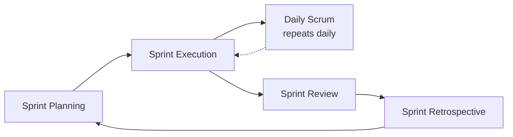

## Sprint Planning, Daily Scrum, Review, and Retrospective

### Definition and Core Concept

These four events, together with the Sprint itself, constitute the five formal events of Scrum. Each event is a formal opportunity to inspect and adapt Scrum artifacts, and each is timeboxed to prevent unbounded meetings. All events occur within the container of the Sprint, and all except the Sprint itself have a maximum duration that scales with Sprint length (typically based on a one-month Sprint, scaled down proportionally for shorter Sprints).

The four events exist to create regular opportunities for inspection and adaptation, operationalizing Scrum's empirical process control pillars (transparency, inspection, adaptation) at different points in the Sprint cycle.

### Key Points

- All events are timeboxed: they have a maximum duration and can be shorter, but should not run longer
- The Scrum Master ensures events happen, stay within timebox, and remain productive — but does not have to personally facilitate every event
- Events are formal opportunities for inspection and adaptation; informal communication throughout the Sprint is encouraged but does not replace these events
- Canceling a Sprint is possible but rare; the four events themselves are not optional in a Scrum implementation

### Events Overview Table

| Event | Purpose | Timebox (for 1-month Sprint) | Participants |
| --- | --- | --- | --- |
| Sprint Planning | Define what can be delivered and how | Max 8 hours | Entire Scrum Team |
| Daily Scrum | Inspect progress toward Sprint Goal | Max 15 minutes | Developers (others may attend) |
| Sprint Review | Inspect the Increment, adapt Product Backlog | Max 4 hours | Scrum Team + stakeholders |
| Sprint Retrospective | Inspect how the Sprint went, plan improvements | Max 3 hours | Entire Scrum Team |

Timeboxes scale down proportionally for shorter Sprints (e.g., a 2-week Sprint typically uses roughly half the maximum timebox for each event).

### Sprint Cycle Overview

### Sprint Planning

**Purpose**

Lays out the work to be performed for the Sprint, produced by the collaborative work of the entire Scrum Team.

**Structure: Three Topics**

**Topic 1 — Why is this Sprint valuable?**

The Product Owner proposes how the product could increase its value and utility in the current Sprint. The whole Scrum Team collaborates to define a Sprint Goal that communicates why the Sprint is valuable to stakeholders.

**Topic 2 — What can be done this Sprint?**

Developers select items from the Product Backlog to include in the current Sprint, discussing with the Product Owner as needed. The Scrum Team may refine these items, increasing understanding and confidence.

**Topic 3 — How will the chosen work get done?**

For each selected Product Backlog item, Developers plan the work necessary to create an Increment that meets the Definition of Done. This is often decomposed into smaller work items (tasks), typically of one day or less.

**Output**

The Sprint Backlog: the Sprint Goal (why), the selected Product Backlog items (what), and the delivery plan (how).

**Key Characteristics**

- Developers are the ones who ultimately decide how much work they can commit to; this is not imposed by the Product Owner or Scrum Master
- The Sprint Goal is finalized by the end of Sprint Planning and remains a stable commitment for the Sprint, providing focus even if specific backlog items are later renegotiated with the Product Owner

**Common Anti-Patterns**

- Product Owner or manager dictating capacity/velocity rather than letting Developers determine what they can realistically deliver
- Skipping Sprint Goal definition, turning the Sprint into an unfocused list of unrelated tasks
- Treating the plan as an immutable contract rather than a starting hypothesis to adapt during the Sprint

### Daily Scrum

**Purpose**

A 15-minute event for Developers to inspect progress toward the Sprint Goal and adapt the Sprint Backlog as necessary, adjusting the upcoming planned work.

**Key Characteristics**

- Held at the same time and place every working day to reduce complexity
- Is an internal planning/inspection meeting for Developers, not a status report to the Product Owner, Scrum Master, or management
- The specific structure (e.g., the traditional "three questions" — what I did yesterday, what I'll do today, what impediments I face) is one option, not a mandate; teams may use any technique that focuses on progress toward the Sprint Goal
- If the Product Owner or Scrum Master are actively working on Sprint Backlog items, they participate as Developers in this context

**Common Anti-Patterns**

- Turning it into a status report directed at a manager or Scrum Master rather than a peer-to-peer coordination event among Developers
- Using it for problem-solving in detail — deeper discussions should be taken offline immediately after
- Running over the 15-minute timebox regularly, or holding it irregularly

### Sprint Review

**Purpose**

Inspect the outcome of the Sprint and determine future adaptations. The Scrum Team presents the results of their work to key stakeholders, and progress toward the Product Goal is discussed.

**Structure and Activities**

- The Scrum Team presents the Increment and what was "Done" vs. not "Done"
- Discussion of what went well during the Sprint, what problems arose, and how they were resolved
- Demonstration of the completed work, with stakeholders providing feedback (working software or equivalent, not just a status presentation)
- Review of budget, timeline, capabilities, and marketplace for the next anticipated releases
- Review and revision of the Product Backlog based on this discussion, potentially reordering to maximize value for upcoming Sprints

**Key Characteristics**

- Is a working session, not merely a presentation — active collaboration between the Scrum Team and stakeholders is central
- Directly feeds adaptation of the Product Backlog, making it a key mechanism for adaptive planning

**Common Anti-Patterns**

- Treating it as a one-way demo with no stakeholder interaction or feedback collection
- Presenting only "shiny" completed work while hiding unfinished or problematic items
- Skipping it when there's "nothing to show," which forfeits a key inspection opportunity even for partial progress or learnings

### Sprint Retrospective

**Purpose**

Plan ways to increase quality and effectiveness by inspecting how the last Sprint went in terms of individuals, interactions, processes, tools, and Definition of Done.

**Structure and Activities**

- Discuss what went well during the Sprint, what problems occurred, and how those problems were (or weren't) solved
- Identify the most helpful changes to improve effectiveness
- Discuss the Definition of Done and consider increasing product quality by adapting it, if appropriate and not conflicting with product or organizational standards
- Identify improvements the team will implement in the next Sprint

**Key Characteristics**

- Occurs at the end of the Sprint, after the Sprint Review, before the next Sprint Planning
- The most improvement-focused event; concludes the Sprint formally
- At least one high-priority improvement is typically identified and added to the next Sprint's Backlog, making process improvement an actionable, tracked item rather than an abstract intention

**Common Retrospective Formats**

- Start/Stop/Continue
- Mad/Sad/Glad
- 4Ls (Liked, Learned, Lacked, Longed For)
- Sailboat (wind, anchors, rocks, island)

[Inference: specific format choice is a facilitation technique, not a Scrum Guide requirement — the Guide only specifies the purpose and timebox, not the method.]

**Common Anti-Patterns**

- Becoming a blame session focused on individuals rather than systemic process issues
- Generating a long list of action items that are never actually implemented or tracked
- Skipping the Retrospective under time pressure, which erodes the team's continuous improvement mechanism

### Relationship Between the Four Events and Empirical Pillars

| Event | Transparency | Inspection | Adaptation |
| --- | --- | --- | --- |
| Sprint Planning | Sprint Goal made visible | Backlog and capacity reviewed | Sprint Backlog created/adjusted |
| Daily Scrum | Progress made visible to Developers | Progress vs. Sprint Goal checked | Sprint Backlog re-planned daily |
| Sprint Review | Increment made visible to stakeholders | Increment and market context inspected | Product Backlog adapted |
| Sprint Retrospective | Team dynamics/process made visible | Process, tools, DoD inspected | Process improvements adopted |

### Practical Example: One Sprint Cycle

**Scenario:** A 2-week Sprint for a customer support ticketing feature.

1. **Sprint Planning (max ~4 hours for a 2-week Sprint)**: Team agrees on Sprint Goal — "Enable agents to bulk-resolve duplicate tickets." Developers select 6 backlog items and break them into tasks.
2. **Daily Scrum (10 days, max 15 min each)**: On Day 4, a Developer flags that the bulk-resolve API is more complex than expected. The team re-plans that day, deciding to descope a "bulk-reassign" story to protect the Sprint Goal.
3. **Sprint Review (max ~2 hours)**: Team demos the bulk-resolve feature to support team stakeholders. Stakeholders request an additional filter option, which is added to the Product Backlog for future prioritization by the Product Owner.
4. **Sprint Retrospective (max ~1.5 hours)**: Team identifies that underestimating API complexity was a recurring issue and agrees to add a technical spike step during refinement for uncertain items going forward, adding this as an action item for the next Sprint.

### Related Topics

- Product Owner, Scrum Master, and Developer Roles
- Sprint Backlog and Sprint Goal
- Product Backlog refinement
- Definition of Done
- Empirical process control (transparency, inspection, adaptation)
- Adaptive planning concepts
- Retrospective facilitation techniques
- Velocity and forecasting
- Scaling Scrum events (Scrum of Scrums, PI Planning)