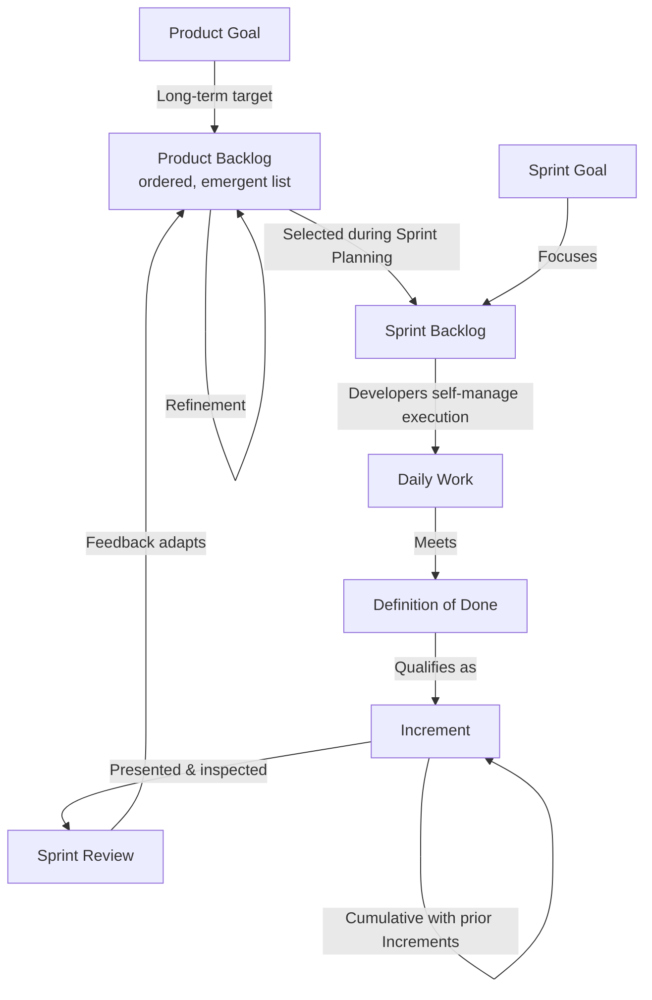

## Product Backlog, Sprint Backlog, and Increment

### Definition and Core Concept

These three artifacts represent work or value in Scrum and are designed to maximize transparency of key information, so everyone inspecting them has the same basis for adaptation. Each artifact contains a **commitment** — a specific element that reinforces empiricism and the Scrum Team's goals: the Product Backlog commits to a Product Goal, the Sprint Backlog commits to a Sprint Goal, and the Increment commits to a Definition of Done.

Artifacts without transparency can lead to decisions that diminish value and increase risk, which is why each has explicit rules governing its visibility and structure.

### Key Points

- Each artifact has an associated commitment that provides focus and measurable progress
- The three artifacts form a hierarchy: Product Backlog → (selected subset) → Sprint Backlog → (built into) → Increment
- All Increments are cumulative; a new Increment is only "Done" if it, together with all prior Increments, meets the Definition of Done
- Artifacts are living documents, continuously refined and updated — not fixed, one-time deliverables

### Artifacts and Commitments Overview

| Artifact | Represents | Commitment | Owner | Update Frequency |
| --- | --- | --- | --- | --- |
| Product Backlog | All known work for the product | Product Goal | Product Owner | Continuously refined |
| Sprint Backlog | Work planned for the current Sprint | Sprint Goal | Developers | Updated daily |
| Increment | Sum of completed, usable work | Definition of Done | Developers (collectively) | Produced continuously within Sprint |

### Product Backlog

**Definition**

An emergent, ordered list of everything that is known to be needed in the product. It is the single source of requirements for any changes to be made to the product.

**Structure and Content**

- Items include features, functions, requirements, enhancements, and fixes
- Items higher in the list are typically clearer and more detailed ("finer-grained") than items lower down
- Estimates reflect the effort or complexity required, refined progressively as items move up the list
- The Product Backlog is never complete; it evolves as the product and its environment evolve

**The Product Goal**

Introduced formally in the 2020 Scrum Guide, the Product Goal describes a future state of the product that can serve as a target for the Scrum Team to plan against. It is the long-term objective for the Scrum Team, and the Product Backlog is the plan to achieve it. A Scrum Team focuses on one Product Goal at a time, though multiple Scrum Teams may work toward a shared larger product.

**Refinement (Grooming)**

The act of breaking down and further defining Product Backlog items into smaller, more precise items — an ongoing activity, not a single event, typically consuming a modest portion of Developer capacity.

**Key Characteristics**

- The Product Owner is accountable for the content, availability, and ordering of the Product Backlog, though they may delegate the actual refinement work to Developers
- Product Backlog items are not committed to until selected for a Sprint by Developers during Sprint Planning

### Sprint Backlog

**Definition**

Composed of the Sprint Goal (why), the set of Product Backlog items selected for the Sprint (what), and an actionable plan for delivering the Increment (how). It is a plan by and for the Developers.

**Structure and Content**

- **Sprint Goal**: A single objective that gives the Sprint coherence and focus, created collaboratively during Sprint Planning
- **Selected items**: The specific Product Backlog items Developers forecast as achievable in the Sprint
- **Delivery plan**: The breakdown of items into a plan, often decomposed into daily-sized tasks

**Key Characteristics**

- Is a highly visible, real-time picture of the work Developers plan to accomplish during the Sprint, updated throughout as new information emerges
- Belongs solely to the Developers; only they can change it during the Sprint (though scope may be renegotiated with the Product Owner as understanding evolves)
- The Sprint Goal remains stable throughout the Sprint even if specific backlog items are adjusted, providing consistent focus for Daily Scrum inspection

**The Sprint Goal's Role**

Provides flexibility in terms of the exact work needed, while providing focus on a single, coherent objective for the Scrum Team. If work turns out to be different than expected, Developers collaborate with the Product Owner to negotiate scope within the Sprint Backlog without abandoning the Sprint Goal.

### Increment

**Definition**

A concrete stepping stone toward the Product Goal. Each Increment is additive to all prior Increments and thoroughly verified, ensuring all Increments work together.

**Key Characteristics**

- Multiple Increments may be created within a single Sprint; the sum of Increments is presented at the Sprint Review, supporting empiricism
- An Increment is a body of inspectable, done work that supports empiricism at the end of the Sprint
- Work cannot be considered part of an Increment unless it meets the Definition of Done
- An Increment must be usable, regardless of whether the Product Owner decides to actually release it — "Done" and "released" are distinct decisions

**The Definition of Done**

A formal description of the state of the Increment when it meets the quality measures required for the product. Once a Product Backlog item meets the Definition of Done, an Increment is born.

- If no organizational-level Definition of Done exists, the Scrum Team must create one appropriate for the product
- The Definition of Done creates transparency by giving everyone a shared understanding of what "complete" work looks like
- Developers are required to conform to the Definition of Done; if an item doesn't meet it, it cannot be released or even presented at the Sprint Review as "Done"
- The Definition of Done may evolve over time (e.g., during Retrospectives) to increase quality standards, but should generally not be loosened to make work appear complete

### Artifact Flow and Hierarchy

### Commitments Relationship

| Artifact | Commitment | What It Answers |
| --- | --- | --- |
| Product Backlog | Product Goal | "Where is the product headed long-term?" |
| Sprint Backlog | Sprint Goal | "What are we achieving this Sprint, and why?" |
| Increment | Definition of Done | "Is this work actually complete and usable?" |

### Practical Example

**Scenario:** A team building a project management SaaS tool.

- **Product Backlog**: Contains items ranging from well-refined near-term stories ("Add drag-and-drop task reordering," estimated at 5 story points) to coarse future epics ("Enterprise SSO integration," unestimated). The Product Goal is "Become the fastest tool for small-team sprint planning by Q3." The Product Owner reorders the backlog after a competitor analysis reveals a gap in reporting features.
- **Sprint Backlog**: For the current 2-week Sprint, Developers select "Add drag-and-drop task reordering" and two related items, with Sprint Goal "Enable users to reorganize their board without page reloads." Tasks are broken down: frontend drag logic, backend position persistence API, and regression tests.
- **Increment**: By Sprint end, drag-and-drop reordering is coded, peer-reviewed, tested, and deployed to staging — matching the team's Definition of Done (code reviewed, unit tests passing, no critical bugs, documentation updated). This Increment is additive to the previously delivered board-view feature; both must work together for the whole to remain "Done."

### Common Anti-Patterns

- **Product Backlog as a wish list**: Never refined, ordered, or curated, resulting in a bloated, unusable backlog with no clear priority
- **Sprint Backlog as a fixed contract**: Treating it as immutable once set, rather than adapting daily as Developers learn more
- **Weak or absent Definition of Done**: Allowing "Done" to mean different things to different team members, undermining transparency of the Increment
- **Undone work hidden or carried silently**: Presenting partially complete work as an Increment at Sprint Review, violating the Definition of Done and damaging stakeholder trust
- **Confusing Sprint Backlog ownership**: Product Owner or Scrum Master altering the Sprint Backlog's task-level plan, which is the Developers' exclusive domain

### Related Topics

- Product Owner, Scrum Master, and Developer Roles
- Sprint Planning, Daily Scrum, Review, and Retrospective
- Definition of Done
- Product Backlog refinement techniques
- Empirical process control
- Adaptive planning concepts
- Velocity and burndown/burnup tracking
- User story writing and acceptance criteria