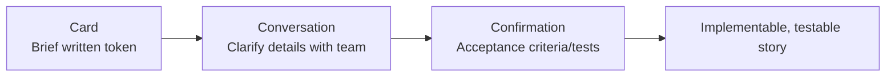
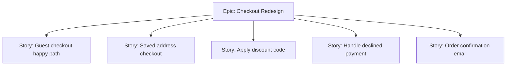

## Writing and Refining User Stories

### Definition and Core Concept

A user story is a short, informal description of a piece of functionality written from the perspective of the person who desires the capability, typically an end user or customer. User stories are the most common unit of work in the Product Backlog, though Scrum itself does not mandate any specific format for backlog items — user stories are a widely adopted convention rather than a formal Scrum artifact.

The purpose of a user story is to shift focus from writing exhaustive specifications to facilitating conversation between the Product Owner, Developers, and stakeholders about user needs, deferring detailed documentation until the item is closer to implementation.

### Key Points

- A user story is a placeholder for a conversation, not a complete specification
- Stories should be small enough to complete within a single Sprint
- Refinement is a continuous activity that progressively adds detail as a story approaches implementation (rolling wave planning applied to backlog items)
- Good stories focus on user value and outcomes, not technical implementation details
- Acceptance criteria define the boundaries of "done" for a specific story, distinct from the team's overall Definition of Done

### Standard User Story Format

The most common template, popularized by Mike Cohn:

**As a** [type of user], **I want** [an action/goal], **so that** [a benefit/value].

**Example:**

"As a returning customer, I want to save my shipping address, so that I can check out faster on future orders."

This format deliberately foregrounds the *who* and *why*, leaving the *how* (implementation) for the team to determine during Sprint Planning.

### INVEST Criteria

A widely used mnemonic (coined by Bill Wake) for evaluating whether a user story is well-formed:

| Letter | Criterion | Meaning |
| --- | --- | --- |
| I | Independent | Story can be developed and delivered without being blocked by other stories |
| N | Negotiable | Details are open to discussion, not a rigid contract |
| V | Valuable | Delivers clear value to a user or customer |
| E | Estimable | The team has enough understanding to size the story |
| S | Small | Fits comfortably within a single Sprint, ideally a fraction of it |
| T | Testable | Has clear criteria to verify when it is complete |

### The Three C's

Another foundational framework (Ron Jeffries) describing the lifecycle of a user story:

- **Card**: The physical or digital card capturing the brief story text — a token for a conversation, not the full requirement
- **Conversation**: The verbal discussion between Product Owner, Developers, and stakeholders that fleshes out details, replacing extensive upfront documentation
- **Confirmation**: The acceptance criteria/tests that confirm the story has been implemented correctly

### Acceptance Criteria

Specific, testable conditions that a story must satisfy to be considered complete. Acceptance criteria narrow ambiguity and give Developers and QA a shared definition of "done" for that particular story (distinct from the team-wide Definition of Done, which applies to every item).

**Common format: Given/When/Then (Gherkin-style)**

- **Given** [initial context], **When** [an action occurs], **Then** [expected outcome]

**Example for the shipping address story:**

- Given a logged-in returning customer with a saved address, When they reach checkout, Then their saved address is pre-filled and editable
- Given a customer with no saved address, When they complete checkout, Then they are prompted to optionally save the address used

### Story Refinement (Grooming) Process

Refinement is the ongoing activity of adding detail, estimates, and clarity to Product Backlog items, typically consuming a modest, regular portion of Developer time (often cited as roughly up to 10% of capacity, though this is a guideline rather than a Scrum Guide mandate). [Unverified: the specific percentage is a commonly cited industry rule of thumb, not a fixed requirement.]

**Typical Refinement Activities**

- Splitting large stories (epics) into smaller, sprint-sized stories
- Adding or clarifying acceptance criteria
- Estimating relative size (story points) via techniques like Planning Poker
- Identifying dependencies or technical risks
- Reordering based on newly discovered information
- Removing stories that are no longer relevant

**Refinement Cadence**

Often held as a recurring mid-Sprint session (e.g., once or twice per Sprint) separate from Sprint Planning, though it can also occur asynchronously or in smaller ad hoc conversations throughout the Sprint.

### Splitting Large Stories (Epics)

Common patterns for decomposing an epic into smaller, independently valuable stories:

**By Workflow Steps**

Split a multi-step process into individual stories per step (e.g., "search for product," "add to cart," "checkout" as separate stories rather than one "purchase flow" epic).

**By Business Rules / Variations**

Split by different rules or edge cases (e.g., "apply percentage discount" vs. "apply fixed-amount discount" as separate stories).

**By CRUD Operations**

Split by Create, Read, Update, Delete when a feature involves data management (e.g., "create a saved address," "edit a saved address," "delete a saved address").

**By User Roles or Personas**

Split when different user types need different variations of similar functionality (e.g., "admin can bulk-edit tickets" vs. "agent can edit their own tickets").

**By Happy Path vs. Edge Cases**

Deliver the primary success scenario first as a complete, valuable slice, then add stories for error handling and edge cases separately.

### Story Estimation Techniques

**Relative Sizing (Story Points)**

Stories are sized relative to each other using scales like a Fibonacci-like sequence (1, 2, 3, 5, 8, 13, 20...) rather than absolute time, reflecting proportionally increasing uncertainty for larger items.

**Planning Poker**

Team members privately and simultaneously select an estimate card, then reveal together; large discrepancies trigger discussion to surface hidden assumptions or complexity before converging.

**T-shirt Sizing**

A coarser relative estimation technique (XS, S, M, L, XL) often used for epics still too large or unclear for precise story-point estimation.

### Common User Story Anti-Patterns

- **Technical tasks disguised as stories**: "As a developer, I want to refactor the database schema" — lacks user-facing value framing; better tracked as a technical task or spike, or reframed around the user benefit it enables
- **Oversized stories**: A story that clearly cannot fit within a Sprint, violating the "Small" INVEST criterion
- **Missing acceptance criteria**: Stories pulled into a Sprint without a clear definition of what "done" means for that specific item, causing rework or disputes
- **Over-specified stories**: Writing exhaustive upfront detail that eliminates the collaborative "conversation" element the Three C's model depends on
- **Compound stories**: A story that bundles multiple unrelated pieces of value, making it hard to estimate, test, or deliver incrementally
- **Solutioning in the story**: Prescribing a specific technical implementation in the story text rather than leaving the "how" to the Developers

### Practical Example: Refining an Epic End-to-End

**Initial Epic (from Product Backlog, coarse-grained):**

"As an online shopper, I want a smoother checkout experience so I complete purchases faster."

**After first refinement session — split into candidate stories:**

1. "As a returning customer, I want my saved address pre-filled, so that I skip manual entry."
2. "As a shopper, I want to apply a discount code at checkout, so that I see my final price before paying."
3. "As a shopper, I want a clear error message if my payment is declined, so that I know how to fix it."

**Further refinement of Story 1 — acceptance criteria added:**

- Given a returning customer with one saved address, When they view checkout, Then it is pre-filled and marked as default
- Given a returning customer with multiple saved addresses, When they view checkout, Then they can select among them via a dropdown
- Given a customer edits the pre-filled address, When they submit the order, Then the original saved address remains unchanged unless they explicitly choose to update it

**Estimation:** Team assigns 5 story points via Planning Poker after discussing the dropdown-selection complexity, which was the source of most estimate variance.

**Sprint Planning:** Story is pulled into the Sprint Backlog, broken into tasks (frontend dropdown component, backend address-selection API, edge case tests).

### Related Topics

- Product Backlog, Sprint Backlog, and Increment
- Product Backlog refinement practices
- Definition of Done vs. acceptance criteria
- Story point estimation and Planning Poker
- Epic and theme decomposition
- Adaptive planning concepts
- Product Owner, Scrum Master, and Developer Roles
- Behavior-Driven Development (Given/When/Then)