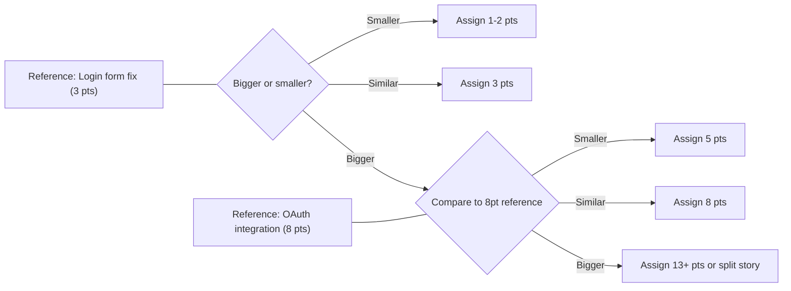

## Story Points and Estimation Techniques

### Overview

Story points are a unit-free, relative measure used in Agile and Scrum to express the effort, complexity, and uncertainty involved in delivering a piece of work, typically a user story. Unlike hours or days, story points do not measure time directly; they measure *relative size* compared to other items the team has previously estimated. This decouples estimation from individual speed, allowing a cross-functional team to converge on a shared understanding of "how big" something is.

Estimation techniques are the structured methods teams use to arrive at these story point values, most of which rely on group consensus, relative comparison, and iterative refinement rather than precise calculation.

### Why Story Points Instead of Time

**Key Points**

- **Effort vs. duration**: Story points capture effort, complexity, and risk combined, while time estimates conflate this with individual skill level, interruptions, and multitasking.
- **Team-relative, not person-relative**: A 5-point story means the same thing regardless of who ends up doing the work, whereas "8 hours" varies by who is asked.
- **Reduces false precision**: Hour-based estimates imply an accuracy that is rarely achievable this early in the development lifecycle; points communicate relative magnitude without pretending to be exact.
- **Enables velocity tracking**: Because points are relative and consistent within a team, summing completed points per sprint produces a stable velocity metric useful for forecasting.
- **Psychological safety**: Estimating in abstract units (points, sizes, animals) reduces the pressure associated with committing to a specific number of hours, which can otherwise be treated as a promise rather than an estimate.

### The Three Dimensions of a Story Point

Most Scrum guidance frames a story point as a composite of three factors:

1. **Complexity** — How intricate is the logic, how many components or systems are touched, how many edge cases exist.
2. **Effort** — The raw amount of work involved, independent of complexity (e.g., updating text across 200 similar screens is low complexity but high effort).
3. **Uncertainty/Risk** — How much is unknown: unclear requirements, unfamiliar technology, dependencies on external teams, or unresolved technical spikes.

A story with low complexity but high uncertainty (e.g., "integrate with an undocumented third-party API") can score the same as a story with high complexity but low uncertainty (e.g., "refactor a well-understood algorithm").

### Fibonacci Sequence and Modified Scales

The most common story point scale is a modified Fibonacci sequence:

$$0, 1, 2, 3, 5, 8, 13, 20, 40, 100$$

**Key Points**

- The widening gaps at higher values reflect the reality that estimation precision decreases as size increases — the difference between a 1 and a 2 matters, but the difference between a 40 and a 41 does not.
- A **0** typically represents trivial changes (e.g., a config value change) or work already completed.
- Values above **13** (commonly 20, 40, 100) are often used as a *signal to split* the story rather than a size to commit to in a sprint — many teams treat anything above 13 as automatically too large for one sprint.
- Some teams use a simplified variant: $1, 2, 3, 5, 8, 13, ?$, where `?` denotes "too uncertain to estimate" and triggers a spike or clarification.

Alternative scales exist:

- **T-shirt sizing**: XS, S, M, L, XL, XXL — used for early-stage, high-level estimation (e.g., epics) before breaking work into stories.
- **Powers of 2**: $1, 2, 4, 8, 16, 32$ — less common, offers coarser granularity.
- **Linear scale**: $1$ through $10$ — discouraged in most Scrum literature because it implies false linearity and precision (a "6" vs a "7" is a meaningless distinction in relative sizing).

### Planning Poker

Planning Poker is the most widely adopted technique for deriving story point consensus.

**Key Points**

- Each team member holds a deck of cards with the Fibonacci-like scale (physical or digital).
- The Product Owner or Scrum Master reads a story aloud and answers clarifying questions.
- All estimators simultaneously reveal a card (preventing anchoring bias from someone calling out a number first).
- If estimates converge (or are close), the team agrees on a value, often taking the higher of the two closest values in case of near-ties, or discussing until consensus.
- If estimates diverge significantly (e.g., one person shows 2, another shows 13), the outliers explain their reasoning — this surfaces hidden assumptions, missing requirements, or unrecognized risk.
- The round repeats until consensus is reached or the story is deemed too large and split.

**Example**

A team estimates "Add two-factor authentication via SMS."

- Estimates revealed: 3, 5, 5, 13
- The person who estimated 13 explains: "We don't have an SMS gateway integrated yet; this includes vendor research."
- The person who estimated 3 explains: "I assumed we already have a gateway."
- After discussion, the team agrees the SMS gateway integration is a separate technical dependency, splits it into its own story, and re-estimates the original story at 5.

### Affinity Mapping / Affinity Estimation

Used for estimating a large backlog quickly, typically during backlog grooming or release planning.

**Key Points**

- All stories are physically or digitally laid out.
- Team members silently move stories into relative size groupings ("smaller than this," "about the same," "bigger than this") without discussion at first.
- Once initial groupings settle, the team discusses outliers and edge cases.
- Groupings are then mapped to point values (e.g., the smallest cluster = 1, next = 2, etc.).
- Significantly faster than sequential Planning Poker for large backlogs (50+ items), at the cost of less per-item discussion depth.

### Bucket System

A hybrid between affinity mapping and Planning Poker, optimized for speed with larger groups.

**Key Points**

- Buckets are labeled with point values (0, 1, 2, 3, 5, 8, 13, ...) laid out in a row.
- One story is read and placed in an initial bucket by consensus to anchor the scale.
- Remaining stories are placed rapidly by individuals or pairs, with challenges allowed if someone disagrees strongly.
- Especially useful in large-scale Agile (SAFe) contexts where many teams must estimate large numbers of items within time constraints (e.g., PI Planning).

### Dot Voting

A lightweight technique often used for a "first pass" pass at complexity/priority before deeper estimation.

**Key Points**

- Each participant is given a fixed number of dot stickers (physical or digital).
- Participants place dots next to items they believe are larger, riskier, or more complex.
- Items with more dots receive further discussion or a higher provisional point value.
- Faster than Planning Poker but offers less rigor; typically a precursor technique rather than a replacement.

### Relative Sizing / "Reference Story" Method

**Key Points**

- The team selects one or two previously completed stories to serve as calibration anchors (e.g., "Story X was a 3, Story Y was an 8").
- New stories are estimated by asking, "Is this bigger or smaller than Story X?" rather than estimating in a vacuum.
- Reduces scale drift over time, a common failure mode where a team's definition of "5 points" gradually inflates or deflates across sprints.
- Best practice: revisit and refresh reference stories periodically, since team composition and tooling change over time. [Inference — the specific cadence for refreshing references is not standardized across Scrum guidance and depends on team stability and turnover.]

### Ideal Days vs. Story Points

Some teams, particularly those transitioning from waterfall or traditional estimation, use "ideal days" as an intermediate step.

**Key Points**

- An "ideal day" represents a day of focused work with no interruptions, meetings, or context switching — distinct from a calendar day.
- Ideal days can feel more intuitive to estimate but tend to reintroduce time-based thinking and comparisons between individuals ("that would take me 2 days but you 4").
- Most mature Scrum teams migrate away from ideal days toward abstract points specifically to avoid this individual-comparison trap.

### Story Point Anti-Patterns

**Key Points**

- **Converting points directly to hours**: Undermines the purpose of relative estimation and often triggers management misuse (e.g., "8 points = 2 days, so this must be done in 2 days").
- **Comparing velocity across teams**: Since point scales are team-relative and not standardized, Team A's "20 points/sprint" is not comparable to Team B's "20 points/sprint." Velocity is only meaningful as a trend within a single team over time.
- **Using points as a performance metric**: Encourages point inflation and gaming rather than honest estimation.
- **Estimating without the whole team present**: Removes the cross-functional perspective (e.g., a backend-heavy estimate that ignores QA or frontend effort).
- **Skipping re-estimation**: Not revisiting a story's estimate after significant new information emerges (e.g., after a spike) leads to stale, inaccurate planning data.

### Velocity and Its Relationship to Story Points

**Key Points**

- **Velocity** = the sum of story points for all stories fully completed (per the team's Definition of Done) in a sprint.
- Velocity is typically averaged over the last 3–6 sprints to smooth out anomalies (holidays, incidents, onboarding).
- Used for **sprint forecasting**: if a team's average velocity is 30 points/sprint and the backlog is 300 points, the team can forecast roughly 10 sprints to completion. [Inference — this assumes stable team composition, scope, and no significant process changes, which rarely holds perfectly in practice.]
- Velocity should never be used as a target to hit; doing so distorts estimation behavior (teams inflate points to "hit" a velocity number).

### No-Estimates Movement (Alternative Perspective)

**Key Points**

- A subset of the Agile community advocates for **#NoEstimates**, arguing that story points and estimation add overhead without proportional value.
- Alternative approaches under this philosophy include:
  - **Story slicing to a consistent small size**: If every story is broken down to roughly the same small size (e.g., 1–3 days of work), counting *stories completed* per sprint can substitute for point-based velocity.
  - **Cycle time / throughput tracking** (common in Kanban): Measuring how long items take from start to finish, using historical cycle time distributions for forecasting instead of upfront sizing.
- This remains a debated practice; most mainstream Scrum guidance (including the Scrum Guide itself) does not mandate story points specifically, leaving the estimation technique as an implementation detail for the team. [Unverified — adoption rates of #NoEstimates versus traditional story pointing across the industry are not something I can verify precisely.]

### Diagram: Planning Poker Workflow (svg_diagram)

<svg xmlns="http://www.w3.org/2000/svg" viewBox="0 0 800 420" font-family="sans-serif">
<text x="400" y="30" text-anchor="middle" font-size="18" font-weight="bold" fill="#1a1a1a">Planning Poker Workflow (svg_diagram)</text>
<rect x="30" y="60" width="160" height="60" rx="8" fill="#e8f0fe" stroke="#4a72d1" stroke-width="2" />
<text x="110" y="85" text-anchor="middle" font-size="13" fill="#1a1a1a">PO reads story</text>
<text x="110" y="102" text-anchor="middle" font-size="13" fill="#1a1a1a">aloud</text>
<rect x="230" y="60" width="160" height="60" rx="8" fill="#e8f0fe" stroke="#4a72d1" stroke-width="2" />
<text x="310" y="85" text-anchor="middle" font-size="13" fill="#1a1a1a">Team asks</text>
<text x="310" y="102" text-anchor="middle" font-size="13" fill="#1a1a1a">clarifying questions</text>
<rect x="430" y="60" width="160" height="60" rx="8" fill="#e8f0fe" stroke="#4a72d1" stroke-width="2" />
<text x="510" y="85" text-anchor="middle" font-size="13" fill="#1a1a1a">Everyone selects</text>
<text x="510" y="102" text-anchor="middle" font-size="13" fill="#1a1a1a">a card privately</text>
<rect x="630" y="60" width="140" height="60" rx="8" fill="#e8f0fe" stroke="#4a72d1" stroke-width="2" />
<text x="700" y="85" text-anchor="middle" font-size="13" fill="#1a1a1a">All reveal</text>
<text x="700" y="102" text-anchor="middle" font-size="13" fill="#1a1a1a">simultaneously</text>
<line x1="190" y1="90" x2="228" y2="90" stroke="#4a72d1" stroke-width="2" marker-end="url(#arrow)" />
<line x1="390" y1="90" x2="428" y2="90" stroke="#4a72d1" stroke-width="2" marker-end="url(#arrow)" />
<line x1="590" y1="90" x2="628" y2="90" stroke="#4a72d1" stroke-width="2" marker-end="url(#arrow)" />
<path d="M 700 120 L 700 170 L 460 170" stroke="#4a72d1" stroke-width="2" fill="none" marker-end="url(#arrow)" />
<rect x="330" y="180" width="260" height="60" rx="8" fill="#fff4e5" stroke="#d18a2a" stroke-width="2" />
<text x="460" y="205" text-anchor="middle" font-size="13" fill="#1a1a1a">Estimates converge?</text>
<text x="460" y="222" text-anchor="middle" font-size="12" fill="#555">(check spread of values)</text>
<line x1="330" y1="210" x2="220" y2="210" stroke="#c0392b" stroke-width="2" marker-end="url(#arrowred)" />
<text x="270" y="200" text-anchor="middle" font-size="12" fill="#c0392b">No</text>
<rect x="60" y="180" width="160" height="60" rx="8" fill="#fdecea" stroke="#c0392b" stroke-width="2" />
<text x="140" y="205" text-anchor="middle" font-size="13" fill="#1a1a1a">Outliers explain</text>
<text x="140" y="222" text-anchor="middle" font-size="13" fill="#1a1a1a">reasoning</text>
<path d="M 140 240 L 140 280 L 460 280 L 460 240" stroke="#c0392b" stroke-width="2" fill="none" marker-end="url(#arrowred)" />
<text x="300" y="270" text-anchor="middle" font-size="12" fill="#c0392b">Re-vote</text>
<line x1="460" y1="240" x2="460" y2="300" stroke="#27ae60" stroke-width="2" marker-end="url(#arrowgreen)" />
<text x="500" y="270" text-anchor="middle" font-size="12" fill="#27ae60">Yes</text>
<rect x="330" y="310" width="260" height="60" rx="8" fill="#eafaf1" stroke="#27ae60" stroke-width="2" />
<text x="460" y="335" text-anchor="middle" font-size="13" fill="#1a1a1a">Team agrees on</text>
<text x="460" y="352" text-anchor="middle" font-size="13" fill="#1a1a1a">final point value</text>
</svg>

### Diagram: Story Point Sizing Relative to Reference Stories

### Story Splitting When Estimates Are Too High

**Key Points**

When a story consistently estimates at 13+ points, teams typically split along these patterns:

- **By workflow steps**: Separate "happy path" from "edge cases and error handling."
- **By CRUD operations**: Split Create, Read, Update, Delete into separate stories if a feature covers all four.
- **By business rule variation**: Separate simple-case logic from complex conditional logic (e.g., "domestic shipping" vs "international shipping").
- **By data variation**: Separate handling for different input types or data sources.
- **Spike first**: If uncertainty (not size) drives the high estimate, extract a time-boxed research spike as its own item, then re-estimate the original story afterward with the unknowns resolved.

### Conclusion

Story points and their associated estimation techniques exist to give Agile teams a fast, relative, and collaboratively-derived sense of size without the false precision and individual bias inherent in time-based estimates. Planning Poker remains the most rigorous and widely taught technique due to its bias-reduction mechanics, while affinity mapping, bucket systems, and dot voting trade some rigor for speed at scale. The value of any of these techniques depends less on the specific method chosen and more on consistent application within a single team, avoidance of cross-team comparisons, and periodic recalibration against reference stories.

**Related Topics**

- Velocity Tracking and Sprint Forecasting
- Backlog Refinement / Grooming Techniques
- Definition of Ready vs. Definition of Done
- User Story Splitting Patterns (SPIDR, INVEST criteria)
- Sprint Planning Meeting Structure
- Kanban Cycle Time and Throughput Metrics
- Scrum Roles: Product Owner, Scrum Master, Development Team
- Retrospectives and Continuous Estimation Improvement