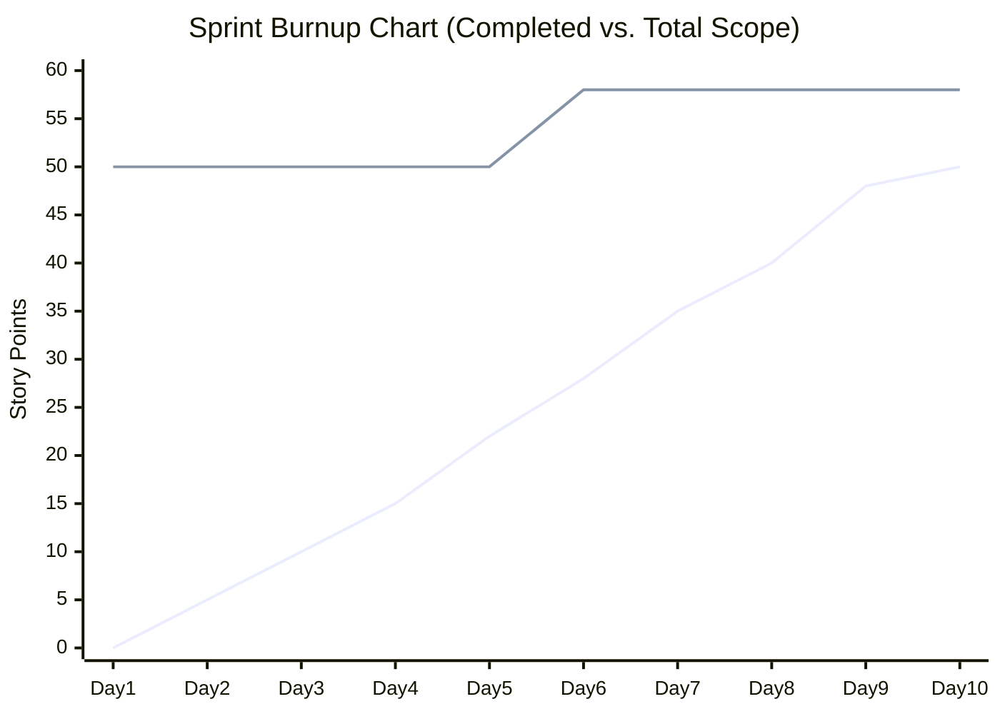
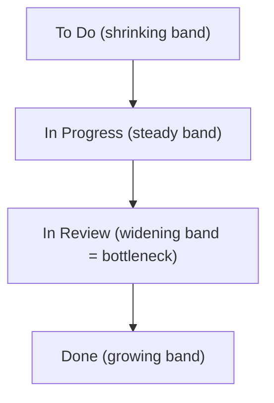

## Sprint Metrics and Burndown Charts

### Overview

Sprint metrics are quantitative signals that help Scrum teams track progress, forecast delivery, and identify process problems within and across sprints. Burndown charts are the most iconic of these visualizations, showing remaining work over time, but they sit within a broader ecosystem of metrics including burnup charts, velocity, cumulative flow, cycle time, and Sprint Goal health indicators. Together, these metrics answer three core questions: *Are we on track? Is our process healthy? Can we predict future delivery?*

### Sprint Burndown Chart

**Key Points**

- Plots **remaining work** (in story points or hours) on the Y-axis against **time** (days of the sprint) on the X-axis.
- An **ideal line** is drawn from total scope at Sprint Day 0 to zero at the sprint's end, assuming perfectly linear completion.
- An **actual line** tracks real remaining work, updated daily (commonly during or right after the Daily Scrum).
- The gap between the ideal and actual lines is a diagnostic signal, not a judgment: it prompts inspection, not blame.

**Interpreting the Shape**

| Pattern | Likely Meaning |
| --- | --- |
| Actual line above ideal, flat early | Work is stalling — dependencies, blockers, or unclear requirements |
| Actual line tracks closely with ideal | Healthy, predictable execution |
| Actual line drops sharply at the end | "Death march" pattern — work is batched and dumped at sprint end, often masking untested or unintegrated code |
| Actual line goes up mid-sprint | Scope was added after Sprint Planning (scope creep) |
| Actual line hits zero early | Sprint may have been under-scoped, or work was rushed without full Definition of Done applied |

**Example**

A 10-day sprint starts with 50 story points of committed work.

- Ideal burn rate: 5 points/day.
- Day 3 actual: 45 points remaining (only 5 points burned in 3 days) — behind pace.
- Day 8 actual: 10 points remaining, but a new 8-point bug fix was added mid-sprint, so remaining jumps to 18.
- This spike signals scope creep to be discussed in the Sprint Retrospective, and possibly flagged as an anti-pattern if it recurs.

### Diagram: Sprint Burndown Chart

<svg xmlns="http://www.w3.org/2000/svg" viewBox="0 0 700 420" font-family="sans-serif">
<text x="350" y="28" text-anchor="middle" font-size="18" font-weight="bold" fill="#1a1a1a">Sprint Burndown Chart (svg_diagram)</text>
<line x1="70" y1="360" x2="650" y2="360" stroke="#333" stroke-width="2" />
<line x1="70" y1="360" x2="70" y2="60" stroke="#333" stroke-width="2" />

<text x="360" y="400" text-anchor="middle" font-size="13" fill="`#1a1a1a`">Sprint Day</text>

<text x="30" y="210" text-anchor="middle" font-size="13" fill="`#1a1a1a`" transform="rotate(-90 30 210)">Remaining Points</text>

<text x="70" y="378" text-anchor="middle" font-size="11" fill="#555">0</text>

<text x="128" y="378" text-anchor="middle" font-size="11" fill="#555">1</text>

<text x="186" y="378" text-anchor="middle" font-size="11" fill="#555">2</text>

<text x="244" y="378" text-anchor="middle" font-size="11" fill="#555">3</text>

<text x="302" y="378" text-anchor="middle" font-size="11" fill="#555">4</text>

<text x="360" y="378" text-anchor="middle" font-size="11" fill="#555">5</text>

<text x="418" y="378" text-anchor="middle" font-size="11" fill="#555">6</text>

<text x="476" y="378" text-anchor="middle" font-size="11" fill="#555">7</text>

<text x="534" y="378" text-anchor="middle" font-size="11" fill="#555">8</text>

<text x="592" y="378" text-anchor="middle" font-size="11" fill="#555">9</text>

<text x="650" y="378" text-anchor="middle" font-size="11" fill="#555">10</text>

<text x="55" y="365" text-anchor="end" font-size="11" fill="#555">0</text>

<text x="55" y="305" text-anchor="end" font-size="11" fill="#555">10</text>

<text x="55" y="245" text-anchor="end" font-size="11" fill="#555">20</text>

<text x="55" y="185" text-anchor="end" font-size="11" fill="#555">30</text>

<text x="55" y="125" text-anchor="end" font-size="11" fill="#555">40</text>

<text x="55" y="65" text-anchor="end" font-size="11" fill="#555">50</text>

<line x1="70" y1="65" x2="650" y2="360" stroke="#9aa8c7" stroke-width="2" stroke-dasharray="6,4" />
<text x="580" y="330" font-size="12" fill="#5a6a99">Ideal</text>

<polyline points="70,65 128,80 186,110 244,140 302,175 360,205 418,235 476,255 534,150 592,120 650,360" fill="none" stroke="`#c0392b`" stroke-width="3" />

<text x="500" y="140" font-size="12" fill="`#c0392b`" font-weight="bold">Actual</text>

<circle cx="534" cy="150" r="4" fill="#c0392b" />
<text x="534" y="135" text-anchor="middle" font-size="10" fill="#c0392b">Scope added</text>
</svg>

### Sprint Burnup Chart

**Key Points**

- Unlike burndown (which shows work *remaining*), a burnup chart plots **work completed** against **total scope**, using two lines.
- Advantage over burndown: scope changes are visible as a *shift in the total scope line* rather than being conflated with progress, making scope creep unambiguous.
- Particularly useful in longer-term release or PI (Program Increment) tracking, where scope is more likely to change mid-cycle than within a single 1–2 week sprint.

### Velocity

**Key Points**

- Sum of story points for stories fully meeting the Definition of Done within a completed sprint.
- Tracked across sprints (usually a rolling 3–6 sprint average) to establish a predictable delivery rate.
- Used for **release forecasting**: Remaining Backlog Points ÷ Average Velocity = Estimated Sprints Remaining.
- **Caution**: Velocity is a planning tool, not a performance metric. Using it to compare individuals or teams, or as a target to "hit," incentivizes point inflation and undermines its forecasting value.

### Cumulative Flow Diagram (CFD)

**Key Points**

- Plots the number of items in each workflow state (e.g., To Do, In Progress, In Review, Done) as stacked bands over time.
- A healthy CFD shows bands of roughly consistent width — indicating balanced flow through the pipeline.
- A widening band (e.g., "In Review" growing wider over time) signals a bottleneck at that stage.
- More commonly associated with Kanban but increasingly used within Scrum teams to diagnose within-sprint flow issues (e.g., testing bottlenecks near sprint end).

### Cycle Time and Lead Time

**Key Points**

- **Lead time**: Total elapsed time from when a work item is requested/created to when it is delivered.
- **Cycle time**: Elapsed time from when work *actively begins* on an item to when it is completed.
- Cycle time is generally the more actionable metric for a Scrum team since it reflects process efficiency once work is committed, rather than backlog wait time.
- Useful for identifying variance: a wide spread in cycle times for similarly-sized stories often indicates inconsistent story slicing or hidden complexity.

$$\text{Cycle Time} = \text{Completion Timestamp} - \text{Start Timestamp}$$

### Sprint Goal Health / Sprint Predictability

**Key Points**

- Distinct from point-based metrics: tracks whether the **qualitative Sprint Goal** was achieved, regardless of whether every individual backlog item was completed.
- A sprint can have low velocity but a fully achieved Sprint Goal (goal-focused success), or high velocity with an unachieved Sprint Goal (busy but unfocused work).
- **Sprint Predictability** (sometimes called "commitment reliability") = Points Completed ÷ Points Committed at Sprint Planning, tracked as a percentage over time. Healthy teams typically stabilize in a consistent range; large swings suggest estimation or planning issues. [Inference — there is no single industry-standard target percentage; acceptable ranges vary by organization and team maturity.]

### Defect/Bug Metrics During Sprint

**Key Points**

- **Escaped defects**: Bugs found after a story was marked "Done," indicating gaps in the Definition of Done or testing coverage.
- **Defect density**: Bugs per story point or per feature, used to assess quality trends over time.
- Rising escaped defect counts across sprints often correlate with an overly loose Definition of Done or excessive schedule pressure. [Inference — correlation is a common retrospective finding but causation depends on team-specific context.]

### Team Happiness / Health Metrics

**Key Points**

- Some Scrum teams track a simple qualitative metric (e.g., 1–5 self-reported happiness or energy score) at each Retrospective.
- Used as a leading indicator: dips often precede drops in velocity or quality, making it useful for early intervention. [Inference — the leading-indicator relationship is a widely cited practitioner observation rather than a rigorously benchmarked statistic.]

### Common Anti-Patterns in Sprint Metrics Usage

**Key Points**

- **Comparing velocity across teams**: Point scales are not standardized between teams, making cross-team velocity comparisons meaningless and often harmful to morale.
- **Using burndown charts for management surveillance**: Turns a team's self-diagnostic tool into a monitoring instrument, encouraging gaming (e.g., marking items "in progress" prematurely to show movement).
- **Ignoring the "why" behind chart shapes**: A flat burndown followed by a late drop is a symptom; teams that only look at the shape without discussing root cause in the Retrospective miss the improvement opportunity.
- **Treating Sprint Predictability as a KPI with penalties**: Encourages sandbagging (under-committing to guarantee a high completion percentage) rather than honest planning.

### Tooling Notes

**Key Points**

- Common tools generating these charts include Jira, Azure DevOps, Linear, and Trello (via power-ups), typically auto-generating burndown/burnup charts from the associated Sprint Board.
- Digital tools compute remaining work automatically from status transitions, but data accuracy still depends on team members updating item status and remaining estimates promptly and consistently. [Behavior may vary depending on tool configuration and team discipline.]

### Conclusion

Burndown charts remain the most recognizable sprint metric, but they are one lens among several. Burnup charts isolate scope changes more clearly, velocity supports longer-range forecasting, cumulative flow and cycle time diagnose process bottlenecks, and Sprint Goal/predictability metrics guard against optimizing for point completion at the expense of actual value delivery. Effective Scrum teams use these metrics as diagnostic and forecasting aids inspected collaboratively in Daily Scrums and Retrospectives, not as external performance evaluation tools.

**Related Topics**

- Definition of Done and Its Impact on Metrics
- Sprint Retrospective Techniques
- Scaled Agile Framework (SAFe) Program Increment Metrics
- Kanban Flow Metrics and WIP Limits
- Release Planning and Forecasting Models
- Story Points and Estimation Techniques
- Daily Scrum Facilitation Patterns