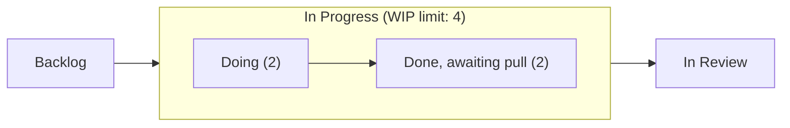
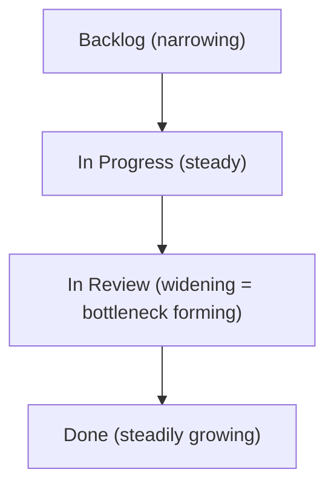

## Visualizing Workflow with Kanban Boards

### Overview

Visualizing workflow is the foundational practice of the Kanban Method — making all work, and the state of that work, visible to everyone involved. A Kanban board is the primary artifact for this: a shared, physical or digital surface that represents the flow of work items through defined stages. The core premise is that you cannot improve what you cannot see; by externalizing work-in-progress, bottlenecks, blockers, and imbalances become immediately observable rather than hidden in status meetings or individual memory.

### The Core Kanban Board Structure

**Key Points**

- A board is divided into **columns**, each representing a distinct stage in the workflow (e.g., Backlog, To Do, In Progress, In Review, Done).
- Work items are represented as **cards**, each corresponding to a single unit of work (a task, story, bug, or request).
- Cards move horizontally across the board from left (not started) to right (completed) as work progresses.
- Unlike Scrum boards, which typically reset every sprint, a Kanban board is **continuous** — cards flow in and out perpetually without a fixed iteration boundary.

### Diagram: Basic Kanban Board Layout

<svg xmlns="http://www.w3.org/2000/svg" viewBox="0 0 760 320" font-family="sans-serif">
<text x="380" y="28" text-anchor="middle" font-size="18" font-weight="bold" fill="#1a1a1a">Basic Kanban Board Layout (svg_diagram)</text>
<rect x="20" y="50" width="170" height="240" fill="#f4f5f7" stroke="#ccc" stroke-width="1" />
<text x="105" y="72" text-anchor="middle" font-size="13" font-weight="bold" fill="#333">To Do</text>
<rect x="200" y="50" width="170" height="240" fill="#f4f5f7" stroke="#ccc" stroke-width="1" />
<text x="285" y="72" text-anchor="middle" font-size="13" font-weight="bold" fill="#333">In Progress (WIP: 3)</text>
<rect x="380" y="50" width="170" height="240" fill="#f4f5f7" stroke="#ccc" stroke-width="1" />
<text x="465" y="72" text-anchor="middle" font-size="13" font-weight="bold" fill="#333">In Review (WIP: 2)</text>
<rect x="560" y="50" width="180" height="240" fill="#f4f5f7" stroke="#ccc" stroke-width="1" />
<text x="650" y="72" text-anchor="middle" font-size="13" font-weight="bold" fill="#333">Done</text>
<rect x="32" y="85" width="146" height="50" rx="4" fill="#ffffff" stroke="#999" />
<text x="105" y="105" text-anchor="middle" font-size="11" fill="#333">Card A: Fix login</text>
<text x="105" y="120" text-anchor="middle" font-size="10" fill="#777">bug, 3pt</text>
<rect x="32" y="145" width="146" height="50" rx="4" fill="#ffffff" stroke="#999" />
<text x="105" y="165" text-anchor="middle" font-size="11" fill="#333">Card B: API docs</text>
<text x="105" y="180" text-anchor="middle" font-size="10" fill="#777">task, 2pt</text>
<rect x="212" y="85" width="146" height="50" rx="4" fill="#fff8e1" stroke="#d1a441" />
<text x="285" y="105" text-anchor="middle" font-size="11" fill="#333">Card C: Payment flow</text>
<text x="285" y="120" text-anchor="middle" font-size="10" fill="#8a6d1f">story, 5pt</text>
<rect x="212" y="145" width="146" height="50" rx="4" fill="#fff8e1" stroke="#d1a441" />
<text x="285" y="165" text-anchor="middle" font-size="11" fill="#333">Card D: Refactor auth</text>
<text x="285" y="180" text-anchor="middle" font-size="10" fill="#8a6d1f">tech debt, 8pt</text>
<rect x="392" y="85" width="146" height="50" rx="4" fill="#e8f0fe" stroke="#4a72d1" />
<text x="465" y="105" text-anchor="middle" font-size="11" fill="#333">Card E: UI polish</text>
<text x="465" y="120" text-anchor="middle" font-size="10" fill="#3a5aa8">story, 3pt</text>
<rect x="572" y="85" width="156" height="50" rx="4" fill="#eafaf1" stroke="#27ae60" />
<text x="650" y="105" text-anchor="middle" font-size="11" fill="#333">Card F: Onboarding</text>
<text x="650" y="120" text-anchor="middle" font-size="10" fill="#1e8449">story, 5pt</text>
<rect x="572" y="145" width="156" height="50" rx="4" fill="#eafaf1" stroke="#27ae60" />
<text x="650" y="165" text-anchor="middle" font-size="11" fill="#333">Card G: Logging setup</text>
<text x="650" y="180" text-anchor="middle" font-size="10" fill="#1e8449">task, 2pt</text>
</svg>

### Cards: Anatomy and Information Design

**Key Points**

A well-designed Kanban card typically encodes:

- **Title/summary**: A short description of the work item.
- **Type indicator**: Often color-coded (e.g., blue = feature, red = bug, yellow = tech debt, purple = spike/research).
- **Size/estimate**: Story points, T-shirt size, or effort indicator, if the team estimates.
- **Assignee**: Avatar or initials of the person(s) currently responsible.
- **Age indicator**: Some digital tools visually flag cards that have sat in a column beyond an expected threshold (e.g., a color shift or an aging icon), surfacing stalled work.
- **Blocked flag**: A visual marker (often a red flag or a distinctly colored sticker) indicating the item cannot proceed, along with the reason.
- **Class of Service marker**: Denotes the urgency category (see Classes of Service below).

### Columns: Representing Workflow Stages

**Key Points**

- Columns should map to the team's **actual** workflow, not an idealized or generic one — a board copied from another team without adaptation often misrepresents real process stages.
- Common pattern: split columns into **"Doing" / "Done"** sub-states (e.g., "In Progress: Doing" and "In Progress: Done") to distinguish active work from work waiting for the next stage — this exposes hand-off delays that a single wide column would hide.
- **Buffer columns** (e.g., "Ready for Dev," "Ready for Test") explicitly represent queues, making wait time visible rather than implicit.
- Columns can represent **cross-functional stages** spanning multiple roles/teams (e.g., Design → Development → QA → Release) when the Kanban system spans an entire value stream rather than a single team's slice of it.

### Diagram: Column with Doing/Done Sub-States

### Swimlanes

**Key Points**

- **Horizontal rows** cutting across all columns, used to segment work by category, priority, team, or Class of Service.
- Common swimlane patterns:
  - **By priority/urgency**: An "Expedite" lane at the top for urgent items that bypass normal queuing.
  - **By work type**: Separate lanes for features, bugs, and technical debt to visualize the balance of work types at a glance.
  - **By team or component**: When multiple sub-teams share one board (e.g., Frontend lane, Backend lane, Infra lane).
- Swimlanes prevent one category of work (e.g., a flood of urgent bugs) from obscuring visibility into other categories.

### Work-in-Progress (WIP) Limits

**Key Points**

- A **WIP limit** caps the number of cards allowed in a column (or swimlane) at any time, typically displayed in the column header (e.g., "In Progress (WIP: 3)").
- Purpose: enforces **single-piece flow thinking** — teams must finish existing work before starting new work, directly countering the common dysfunction of excessive multitasking.
- When a column hits its WIP limit, it visually signals that downstream capacity is exhausted — team members are prompted to **swarm** on unblocking or finishing existing items rather than pulling new work.
- WIP limits can be set per-column or as a shared limit across a set of columns.
- Setting WIP limits is iterative: too high provides no real constraint, too low causes excessive idle time; teams typically start with limits close to team size per stage and tune based on observed flow. [Inference — the "start near team size" heuristic is a common practitioner starting point rather than a fixed rule with a single correct value.]

### Classes of Service

**Key Points**

Kanban boards often visually distinguish work by urgency/risk profile, commonly using four classes:

1. **Expedite** — Drop everything; typically limited to one at a time, bypasses normal WIP limits.
2. **Fixed Delivery Date** — Must be done by a specific date (e.g., regulatory or contractual deadlines); scheduled with buffer awareness.
3. **Standard** — Normal priority, handled in FIFO (first-in-first-out) order within its class.
4. **Intangible** — Work with soft or hard-to-quantify cost of delay (e.g., internal tooling improvements), often processed opportunistically during flow lulls.

Visual encoding is typically via card color, icon, or border style, so the class is visible without opening the card.

### Cumulative Flow Diagram (CFD) as a Board Health Visualization

**Key Points**

- While the board itself shows a snapshot, a **Cumulative Flow Diagram** derived from board history shows workflow health over time — stacked area bands representing the count of items in each state.
- A widening band indicates a bottleneck at that stage; consistently even band widths indicate balanced flow.
- Directly complements the board: the board answers "what's happening now," the CFD answers "is our process trending healthy or degrading."

### Physical vs. Digital Boards

| Aspect | Physical Board | Digital Board |
| --- | --- | --- |
| Visibility | High for co-located teams; instantly scannable | Requires active screen sharing/login; strong for distributed teams |
| Automation | None — manual card moves, manual metrics | Automated WIP enforcement, auto-generated CFDs/aging reports |
| Flexibility | Easy to sketch new columns/swimlanes on the fly | Configuration often requires admin permissions or tool support |
| Persistence/history | Lost when board is cleared unless separately logged | Full historical audit trail retained automatically |
| Remote-friendliness | Poor — inaccessible to distributed team members | Native support for distributed and hybrid teams |

**Key Points**

- Common digital tools include Jira (Kanban board mode), Trello, Azure DevOps Boards, and LeanKit — each supports configurable columns, WIP limits, and swimlanes to varying degrees. [Behavior may vary by tool version and configuration.]
- Many co-located teams historically preferred physical boards for their tactile immediacy, though distributed and hybrid work arrangements have shifted most teams toward digital boards by necessity.

### Ticket/Card Aging and Blockers Visualization

**Key Points**

- **Aging**: Digital boards often visually flag cards that have remained in a single column beyond a defined threshold (e.g., a warning color after 3 days, critical color after 7 days), surfacing silently stalled work that a static board glance might miss.
- **Blockers**: Represented as a distinct visual state — a red flag icon, a "Blocked" sub-lane, or a card border change — paired with an explicit blocker reason noted on the card, ensuring the *cause* of delay is visible, not just the delay itself.

### Common Anti-Patterns in Board Design

**Key Points**

- **Too many columns**: Over-granular workflow stages (10+ columns) reduce scannability and often reflect an attempt to micromanage rather than genuinely distinct value-adding stages.
- **No WIP limits**: A board without WIP limits functions as a glorified to-do list rather than a flow management tool — the core Kanban discipline is lost.
- **Ignoring the "Done, awaiting pull" distinction**: Merging active work and completed-but-blocked-on-handoff work into one column hides real queue time.
- **Stale boards**: Cards not updated in real time undermine the board's core value proposition — visibility must reflect current reality, not last week's status.
- **Board as surveillance tool**: When a board is used primarily for management oversight rather than team self-organization, individuals may under-report blockers or WIP violations to avoid scrutiny.

### Conclusion

Visualizing workflow through a Kanban board is not merely a status-tracking convenience — it is the mechanism by which a team's actual, current work state becomes a shared, actionable reality. Well-designed boards accurately reflect the team's real workflow stages, encode urgency and type through visual cues, enforce flow discipline through WIP limits, and expose stalled or blocked work through aging and flagging conventions. The board's value compounds when paired with derived metrics like the Cumulative Flow Diagram, turning a static snapshot into an ongoing signal for continuous process improvement.

**Related Topics**

- Work-in-Progress (WIP) Limits in Depth
- Classes of Service and Expedite Handling
- Cumulative Flow Diagrams and Bottleneck Analysis
- Cycle Time and Lead Time Measurement
- Pull Systems vs. Push Systems
- Kanban Cadences (Replenishment, Delivery Planning, Service Delivery Review)
- Scrumban: Hybrid Scrum-Kanban Practices