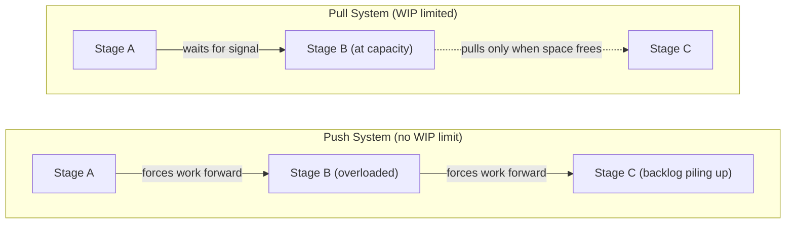

## Limiting Work in Progress

### Overview

Limiting Work in Progress (WIP) is one of the core practices of the Kanban Method and is widely regarded as the mechanism that most directly distinguishes Kanban from simple visual to-do tracking. A WIP limit caps the number of work items permitted in a given workflow state at any given time. The underlying principle is drawn from lean manufacturing and queueing theory: constraining how much work is "in flight" simultaneously reduces multitasking, exposes bottlenecks, shortens cycle time, and improves overall throughput — even though it may feel counterintuitive to leave capacity "idle" rather than starting more work immediately.

### Why Limit WIP: The Underlying Theory

**Key Points**

- **Multitasking penalty**: Context-switching between multiple concurrent tasks incurs a real cognitive and coordination cost; research and practitioner observation broadly agree that switching overhead reduces effective throughput compared to focused, sequential completion. [Inference — exact overhead percentages cited in various sources vary and are not universally benchmarked.]
- **Little's Law**: A foundational queueing theory relationship stating:

$$\text{Average Cycle Time} = \frac{\text{Average WIP}}{\text{Average Throughput}}$$

This implies that for a fixed throughput rate, reducing WIP directly reduces cycle time — and conversely, allowing WIP to grow unchecked inflates cycle time even if throughput stays constant.

- **Bottleneck visibility**: When WIP is unconstrained, work piles up invisibly in front of slow stages. A WIP limit makes the pile-up immediately visible by blocking further intake once the limit is hit.
- **Faster feedback loops**: Less WIP means individual items move through the system faster, so defects, misunderstandings, or design flaws are discovered sooner rather than being buried under a backlog of other in-flight work.

### How WIP Limits Are Applied on a Board

**Key Points**

- WIP limits are typically set **per column** (e.g., "In Progress: max 3") and displayed directly in the column header.
- They can also be set **per swimlane** (e.g., max 2 expedite items) or as a **shared limit across multiple columns** (e.g., a combined limit across "In Progress" and "In Review" to control total active work regardless of sub-stage).
- When a column is at its limit, team members are blocked from pulling new work into it — this is the essence of a **pull system**: work is pulled into a stage only when capacity frees up downstream, not pushed in based on upstream availability.
- Exceeding a WIP limit should visually alert the team (e.g., the column header turns red, or the digital tool prevents the drag-and-drop action entirely).

### Diagram: WIP Limit Enforcement on a Board

<svg xmlns="http://www.w3.org/2000/svg" viewBox="0 0 760 300" font-family="sans-serif">
<text x="380" y="28" text-anchor="middle" font-size="18" font-weight="bold" fill="#1a1a1a">WIP Limit Enforcement (svg_diagram)</text>
<rect x="30" y="55" width="180" height="220" fill="#f4f5f7" stroke="#ccc" />
<text x="120" y="78" text-anchor="middle" font-size="13" font-weight="bold" fill="#333">To Do</text>
<rect x="230" y="55" width="180" height="220" fill="#fdecea" stroke="#c0392b" stroke-width="2" />
<text x="320" y="78" text-anchor="middle" font-size="13" font-weight="bold" fill="#c0392b">In Progress (WIP: 3/3 — FULL)</text>
<rect x="430" y="55" width="180" height="220" fill="#f4f5f7" stroke="#ccc" />
<text x="520" y="78" text-anchor="middle" font-size="13" font-weight="bold" fill="#333">In Review (WIP: 1/2)</text>
<rect x="630" y="55" width="110" height="220" fill="#eafaf1" stroke="#27ae60" />
<text x="685" y="78" text-anchor="middle" font-size="13" font-weight="bold" fill="#1e8449">Done</text>
<rect x="242" y="90" width="156" height="45" rx="4" fill="#fff" stroke="#999" />
<text x="320" y="115" text-anchor="middle" font-size="11">Card A</text>
<rect x="242" y="145" width="156" height="45" rx="4" fill="#fff" stroke="#999" />
<text x="320" y="170" text-anchor="middle" font-size="11">Card B</text>
<rect x="242" y="200" width="156" height="45" rx="4" fill="#fff" stroke="#999" />
<text x="320" y="225" text-anchor="middle" font-size="11">Card C</text>
<rect x="42" y="90" width="156" height="45" rx="4" fill="#fff" stroke="#999" stroke-dasharray="4,3" />
<text x="120" y="115" text-anchor="middle" font-size="11" fill="#c0392b">Card D — BLOCKED</text>
<text x="120" y="150" text-anchor="middle" font-size="10" fill="#c0392b">(cannot pull: column full)</text>
<path d="M 400 112 L 425 112" stroke="#c0392b" stroke-width="3" marker-end="url(#x)" />
<line x1="415" y1="102" x2="435" y2="122" stroke="#c0392b" stroke-width="3" />
<line x1="435" y1="102" x2="415" y2="122" stroke="#c0392b" stroke-width="3" />
<rect x="442" y="90" width="156" height="45" rx="4" fill="#fff" stroke="#999" />
<text x="520" y="115" text-anchor="middle" font-size="11">Card E</text>
</svg>

### Setting Initial WIP Limits

**Key Points**

- A common starting heuristic is to set the limit close to the number of people who can work on items in that column (e.g., a stage with 3 available developers might start with a WIP limit of 3–4). [Inference — this is a widely cited practitioner starting heuristic, not a formula with a single universally correct value; teams commonly deviate based on task nature.]
- Limits should be treated as a **hypothesis to test**, not a fixed rule: teams observe flow behavior after setting a limit and adjust based on evidence (e.g., persistent idle time suggests the limit is too low; persistent overload suggests it's too high).
- Some teams begin deliberately loose (e.g., team size + 1 or +2) and tighten over several iterations as comfort with the constraint grows, rather than starting overly strict and causing early frustration.

### WIP Limits and the Pull System

**Key Points**

- A pull system means work moves to the next stage only when that stage has available capacity, as governed by its WIP limit — this contrasts with a **push system**, where work is forced downstream regardless of the receiving stage's capacity.
- Practically, this reframes the "next action" for idle team members: rather than "start a new task," the instinct becomes "can I help pull something through a bottleneck stage instead?"
- This directly supports **swarming**: when a downstream stage is congested, upstream team members are incentivized to shift focus to unblocking or assisting with existing WIP rather than adding to the pile.

### Diagram: Pull vs. Push System

### Explicit Policies Around WIP Limits

**Key Points**

- Kanban's practice of "Making Policies Explicit" pairs directly with WIP limiting: teams should document *why* a limit exists at a given value and what happens when it's reached (e.g., "swarm on In Review items before starting new development work").
- Explicit exception policies matter too — e.g., how an **Expedite**-class item is handled when it must bypass a full column, and what compensating action follows (such as temporarily allowing an overage while flagging it for review).
- Without explicit policy, WIP limits risk becoming arbitrary numbers that get silently overridden under pressure, eroding the practice's effectiveness over time.

### Impact of WIP Limits on Metrics

**Key Points**

- **Cycle time**: Directly reduced as WIP decreases, per Little's Law — fewer concurrent items means each moves through the system faster on average.
- **Throughput**: Often *increases* despite (or because of) lower WIP, since reduced context-switching improves per-item completion efficiency; this is one of the more counterintuitive findings teams discover after adopting WIP limits. [Inference — the magnitude of throughput improvement is context-dependent and not something that can be guaranteed for a specific team.]
- **Cumulative Flow Diagram**: WIP limits should produce visibly consistent band widths for "in progress" states in a CFD; a widening band despite an enforced limit indicates the limit itself may be set too high relative to actual completion capacity at that stage.
- **Quality**: Reduced multitasking is commonly associated with fewer handoff errors and better focus per item, though this remains a practitioner-observed correlation rather than a rigorously isolated causal metric. [Inference]

### Common Challenges When Introducing WIP Limits

**Key Points**

- **Resistance to "idle" appearance**: Team members and stakeholders unfamiliar with flow-based thinking may perceive someone not starting new work as unproductive, when in fact swarming on existing WIP is the more effective behavior.
- **Local optimization vs. system optimization**: Setting a WIP limit per individual role (e.g., "each developer has their own personal WIP of 1") can create silos; Kanban generally favors limiting at the **column/stage** level so the whole team shares responsibility for flow.
- **Management pressure to raise limits**: When a column is frequently full, the reflexive response is often to raise the limit rather than address the underlying bottleneck (e.g., insufficient testing capacity) — this treats the symptom rather than the cause.
- **Ignoring blocked items in the WIP count**: Some teams exclude blocked cards from the WIP count, which can mask the fact that blocked work is still consuming space and attention; most mature Kanban implementations count blocked items against the limit to keep pressure on resolving blockers quickly.

### WIP Limits in Scrum vs. Kanban Contexts

**Key Points**

- In pure Kanban, WIP limits are a continuous, standing constraint on the board itself.
- In **Scrumban** or Scrum teams borrowing Kanban practices, WIP limits are often applied to the Sprint Board's "In Progress" and "In Review" columns specifically, even though the sprint itself has a fixed time-boxed boundary — this blends Scrum's iteration cadence with Kanban's flow discipline.
- Sprint Planning capacity (how much a team commits to at Sprint Planning) and WIP limits (how much can be actively worked on at once) are distinct concepts that are sometimes conflated: capacity governs total sprint scope, WIP limits govern concurrency within that scope.

### Example: WIP Limit Adjustment Cycle

A team starts with a WIP limit of 5 on their "In Progress" column (team size: 5 developers).

- **Sprint 1–2**: Column frequently sits at 5/5, but "In Review" is consistently backed up to 6–7 items, well beyond its own limit of 2 — indicating the real bottleneck is code review capacity, not development capacity.
- **Retrospective action**: The team reduces the "In Progress" WIP limit to 3, deliberately creating idle development capacity, and reassigns two developers to assist with reviews when the review column nears its limit.
- **Sprint 3 onward**: Review column stabilizes at 2/2, cycle time for completed items drops, and overall throughput per sprint increases despite fewer items being "in progress" at once — an empirical demonstration of the Little's Law relationship in practice.

### Conclusion

Limiting Work in Progress is the practice that operationalizes Kanban's flow-based philosophy: rather than maximizing the number of things started, the goal is to maximize the smooth, fast completion of things already started. By capping concurrent work at each stage, teams surface bottlenecks, reduce the hidden costs of multitasking, and create a natural pull system that redirects effort toward unblocking flow rather than accumulating unfinished work. WIP limits are not a one-time configuration but an ongoing experiment, continuously tuned based on observed cycle time, throughput, and Cumulative Flow Diagram trends.

**Related Topics**

- Little's Law and Flow-Based Metrics
- Cumulative Flow Diagrams and Bottleneck Analysis
- Pull Systems and Kanban Cadences
- Classes of Service and Expedite Handling
- Cycle Time and Lead Time Measurement
- Visualizing Workflow with Kanban Boards
- Scrumban: Hybrid Scrum-Kanban Practices