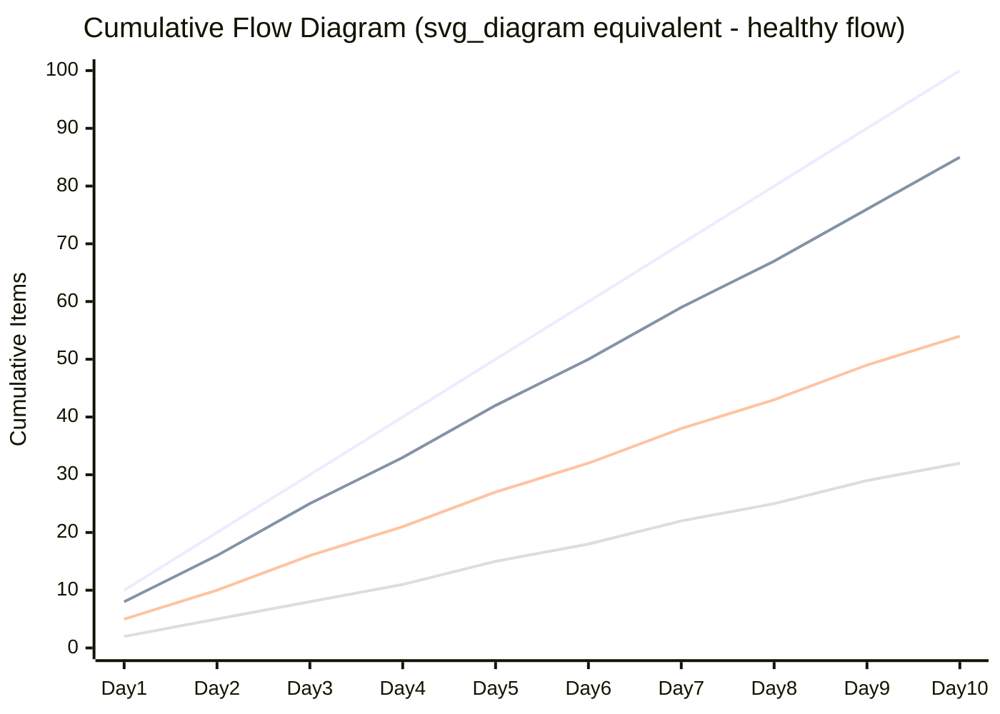
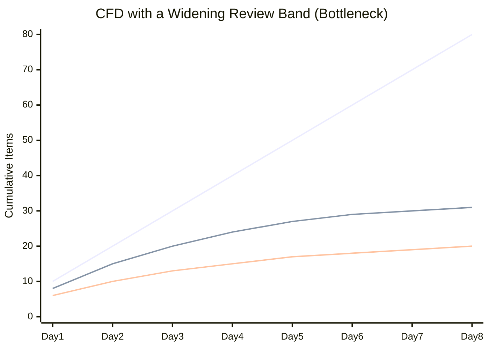

## Managing Flow and Cumulative Flow Diagrams

### Overview

Managing flow is the third core practice of the Kanban Method, following visualization and WIP limiting. Where visualization makes work visible and WIP limits constrain concurrency, managing flow is the ongoing discipline of observing how work moves through the system, identifying friction points, and adjusting the process to improve speed, predictability, and quality of delivery. The **Cumulative Flow Diagram (CFD)** is the primary analytical tool for this practice — a single chart that reveals bottlenecks, WIP trends, and delivery predictability at a glance.

### What "Managing Flow" Means in Kanban

**Key Points**

- Flow refers to the movement of work items through the value stream from request to delivery — smooth flow means items move steadily without excessive queuing, blocking, or rework.
- Managing flow is an active, continuous practice: teams regularly review flow metrics (typically in a **Service Delivery Review** or similar cadence) and make process adjustments rather than treating the workflow configuration as fixed.
- The goal is not merely "faster" in isolation, but **predictable and sustainable** — a system that reliably delivers within a known range is often more valuable than one that is occasionally very fast but highly variable.
- Managing flow draws on core flow metrics: **cycle time**, **lead time**, **throughput**, and **WIP**, all of which are interrelated via Little's Law:

$$\text{Average Cycle Time} = \frac{\text{Average WIP}}{\text{Average Throughput}}$$

### Cumulative Flow Diagram: Structure

**Key Points**

- A CFD is a stacked area chart with **time** on the X-axis and **cumulative count of work items** on the Y-axis.
- Each colored band represents a workflow state (e.g., Backlog, In Progress, In Review, Done), stacked on top of each other.
- Each band's vertical thickness at any point in time represents the **number of items currently in that state**.
- The chart is cumulative: once an item enters a state, it is counted in that band and all bands above it until it moves further along, so the topmost line (cumulative "Done") only ever moves upward or stays flat, never decreasing.

### Diagram: Cumulative Flow Diagram (Healthy Flow)

**Interpreting this chart**: each line represents the cumulative count entering a successive stage (e.g., top line = entered Backlog, second = started In Progress, third = entered Review, bottom = Done). Roughly even vertical spacing between adjacent lines throughout the timeline indicates balanced flow across stages.

### Reading a CFD: Extracting Key Metrics

**Key Points**

The CFD is not just a visual — it directly yields quantitative flow metrics:

- **WIP at any point in time**: The vertical distance between two adjacent bands at a given X-axis point.
- **Cycle time for a given "batch" of work**: The horizontal distance between when a given cumulative count crosses into one band versus when that same count crosses into a later band.
- **Throughput trend**: The overall slope of the "Done" line — a steepening slope indicates increasing throughput; a flattening slope indicates decreasing throughput.
- **Approximate average cycle time and WIP** can be derived visually by drawing a horizontal line at a given cumulative count and measuring the horizontal gap between bands (cycle time), or a vertical line at a given date and measuring the vertical gap (WIP).

### Diagram: Deriving Cycle Time and WIP from a CFD

<svg xmlns="http://www.w3.org/2000/svg" viewBox="0 0 700 420" font-family="sans-serif">
<text x="350" y="28" text-anchor="middle" font-size="18" font-weight="bold" fill="#1a1a1a">Reading Cycle Time and WIP from a CFD (svg_diagram)</text>
<line x1="70" y1="360" x2="650" y2="360" stroke="#333" stroke-width="2" />
<line x1="70" y1="360" x2="70" y2="60" stroke="#333" stroke-width="2" />
<text x="360" y="395" text-anchor="middle" font-size="13" fill="#1a1a1a">Time</text>
<text x="30" y="210" text-anchor="middle" font-size="13" fill="#1a1a1a" transform="rotate(-90 30 210)">Cumulative Items</text>
<polygon points="70,340 650,120 650,360 70,360" fill="#d6e4ff" opacity="0.7" />
<text x="500" y="330" font-size="11" fill="#3a5aa8">Arrived (Backlog+)</text>
<polygon points="70,355 650,220 650,360 70,360" fill="#ffe9b3" opacity="0.8" />
<text x="500" y="300" font-size="11" fill="#8a6d1f">In Progress</text>
<polygon points="70,358 650,300 650,360 70,360" fill="#c8f0d8" opacity="0.9" />
<text x="500" y="340" font-size="11" fill="#1e8449">Done</text>
<line x1="70" y1="200" x2="650" y2="200" stroke="#c0392b" stroke-width="1.5" stroke-dasharray="4,3" />
<text x="655" y="195" font-size="11" fill="#c0392b">WIP at this date</text>
<line x1="400" y1="60" x2="400" y2="360" stroke="#4a72d1" stroke-width="1.5" stroke-dasharray="4,3" />
<text x="405" y="75" font-size="11" fill="#4a72d1">Cycle time for a cohort</text>
</svg>

### Diagnosing Bottlenecks via CFD Shape

**Key Points**

| CFD Pattern | Diagnosis |
| --- | --- |
| A band widens progressively over time | Items are accumulating in that stage faster than they leave — a bottleneck at that stage |
| A band narrows toward zero thickness | Starvation — the stage has no incoming work, likely due to a bottleneck upstream |
| All bands run parallel and evenly spaced | Healthy, balanced flow |
| The topmost line (arrivals) grows steeper than the bottom line (completions) | Demand is outpacing delivery capacity — WIP is growing unsustainably |
| A band shows a sudden step change in width | A batch of items moved together, often indicating manual/batched handoffs rather than continuous flow |
| Lines flatten simultaneously across all bands | Work has stopped entirely (e.g., holiday, incident response diverting the team, or a full stop for planning) |

### Diagram: CFD Showing a Developing Bottleneck

In this example, the gap between the first line (arrivals) and second line (leaving "In Progress" into Review) widens steadily — items are entering the system faster than the Review stage can absorb them, signaling a review-capacity bottleneck.

### Managing Flow: Practical Interventions

**Key Points**

Once a bottleneck or flow issue is identified via the CFD, common interventions include:

- **Swarming**: Temporarily redirecting team members from upstream stages to help clear a bottlenecked downstream stage.
- **Adjusting WIP limits**: Lowering the limit *before* the bottleneck to prevent further pile-up, forcing upstream stages to slow intake until the bottleneck clears.
- **Cross-training**: Reducing single-person dependency on a stage (e.g., only one person can perform code review) by building shared skill coverage.
- **Splitting bottleneck stages**: If a stage consistently bottlenecks, consider whether it should be split into parallel sub-stages or given dedicated capacity.
- **Addressing the Theory of Constraints**: Kanban's flow management is heavily influenced by Eliyahu Goldratt's Theory of Constraints — the core insight is that optimizing anywhere other than the actual bottleneck yields no net system improvement, so identifying the *true* constraint (via the CFD) before intervening is essential.

### Flow Efficiency

**Key Points**

- **Flow efficiency** measures the proportion of total lead time that is actually **active work time**, versus time spent waiting in queues:

$$\text{Flow Efficiency} = \frac{\text{Active Work Time}}{\text{Total Lead Time}} \times 100\%$$

- It is common for flow efficiency in many real-world workflows to be surprisingly low — a substantial portion of an item's total lead time is often queue/wait time rather than active work. [Inference — specific percentages cited across industry sources vary considerably and depend heavily on the specific process being measured; no single universal figure applies.]
- Improving flow efficiency (reducing wait time) frequently yields larger overall lead-time improvements than trying to make active work itself faster, since queue time is often the dominant component.

### Service Delivery Review

**Key Points**

- A recurring, typically periodic (e.g., biweekly or monthly) meeting cadence in the Kanban Method, distinct from a Scrum Retrospective, focused specifically on reviewing flow metrics: CFD trends, cycle time distributions, throughput, and Service Level Expectations (SLEs).
- Distinguishes "fitness for purpose" (is the service meeting customer/stakeholder needs) from purely internal process metrics.
- Provides the structured forum where flow management insights (from the CFD and other metrics) translate into concrete process changes.

### Service Level Expectations (SLEs)

**Key Points**

- A probabilistic forecast of how long a work item is likely to take, typically expressed as a percentile derived from historical cycle time data (e.g., "85% of items complete within 7 days").
- Distinct from a fixed deadline — an SLE is a statistical expectation, not a commitment, and is recalculated periodically as historical data accumulates.
- Cycle time scatterplots (individual item cycle times plotted against completion date) are often used alongside the CFD to derive these percentiles, since the CFD shows aggregate flow while a scatterplot shows the underlying distribution and variance.

### CFD vs. Burndown/Burnup Charts

**Key Points**

- Burndown/burnup charts are typically **sprint- or scope-bound** (they reset or track a fixed backlog), whereas a CFD is **continuous**, well-suited to Kanban's absence of fixed iterations.
- A CFD reveals **where** in the workflow items are accumulating (which stage), while a burndown chart only shows aggregate remaining work without indicating which stage is responsible for the delay.
- Teams practicing Scrumban often use both: burndown/burnup for sprint-level scope tracking, CFD for underlying process health diagnosis.

### Common Anti-Patterns in Flow Management

**Key Points**

- **Reading the CFD only after problems become severe**: Flow management should be a proactive, regular review, not a reactive autopsy after delivery has already suffered.
- **Optimizing a non-bottleneck stage**: Improving throughput at a stage that isn't the constraint has no effect on overall system throughput — effort should be directed at the actual bottleneck identified via the widening band.
- **Treating WIP limit violations as a one-time fix**: A recurring bottleneck signals a structural capacity issue, not something a single WIP limit adjustment permanently resolves.
- **Ignoring blocked time in flow metrics**: Excluding blocked periods from cycle time calculations understates real lead time and can mask chronic external dependency issues.
- **Comparing CFDs across unrelated teams**: Like velocity, CFD shapes and absolute item counts are context-specific; the *trend* within one team's CFD is meaningful, cross-team comparison generally is not.

### Conclusion

Managing flow is the ongoing analytical discipline that makes Kanban a genuine continuous-improvement system rather than a static visualization exercise. The Cumulative Flow Diagram is the central tool for this practice, translating raw workflow history into a visual that simultaneously reveals WIP levels, cycle time, throughput trends, and — most critically — exactly where bottlenecks are forming. Combined with practices like Service Delivery Reviews and Service Level Expectations, flow management closes the loop between observing the system and deliberately evolving it, grounded in the Theory of Constraints principle that only the true bottleneck, once identified, is worth optimizing.

**Related Topics**

- Little's Law and Flow-Based Metrics
- Limiting Work in Progress
- Cycle Time Scatterplots and Service Level Expectations
- Theory of Constraints
- Service Delivery Review Cadence
- Classes of Service and Expedite Handling
- Scrumban: Hybrid Scrum-Kanban Practices