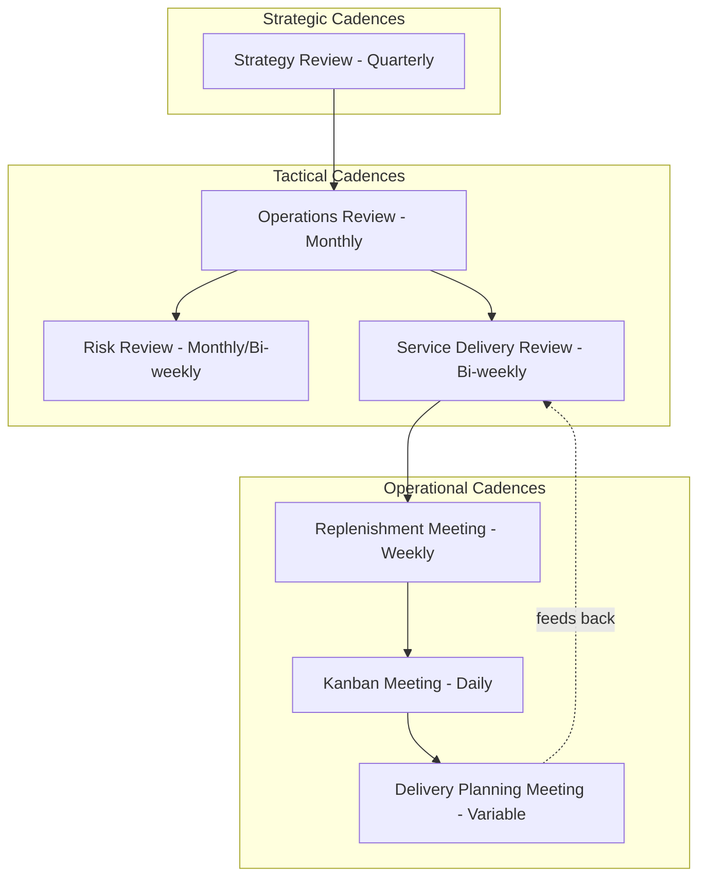
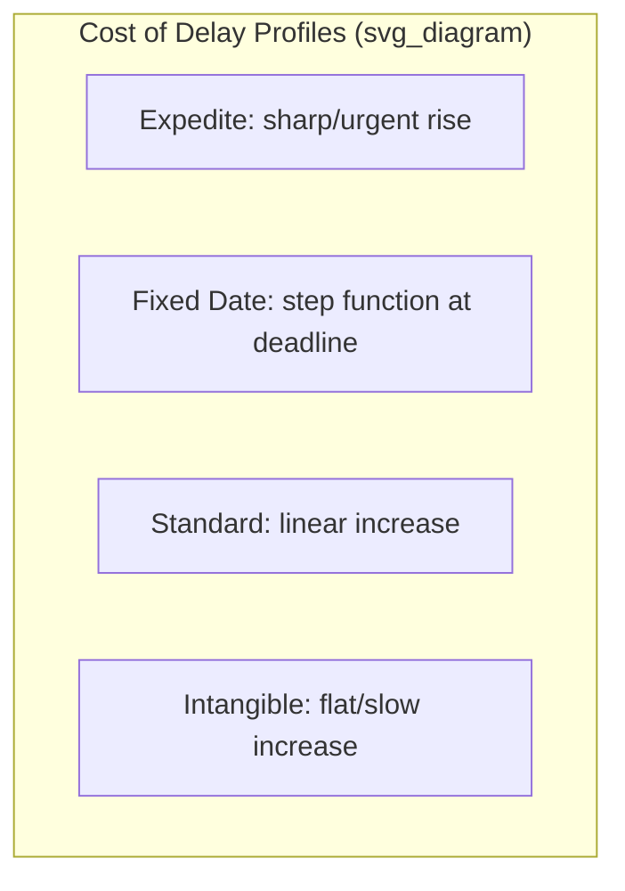
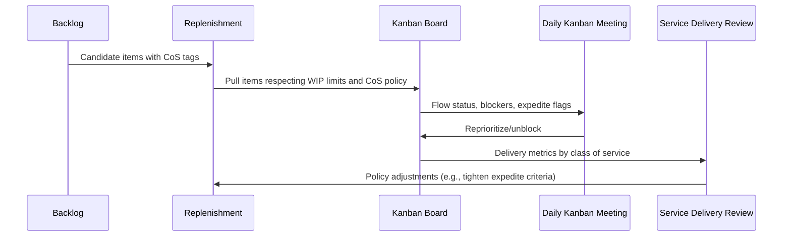

## Kanban Cadences and Classes of Service

### Overview

Kanban Cadences and Classes of Service are two of the core practices in the Kanban Method (alongside visualizing workflow, limiting WIP, managing flow, making policies explicit, implementing feedback loops, and improving collaboratively). Cadences establish the rhythm of meetings and decision-making events that keep a Kanban system responsive without imposing fixed-length iterations, while Classes of Service provide a policy-driven mechanism for differentiating how work items are prioritized and expedited based on cost of delay.

### Kanban Cadences

**Concept**

Unlike Scrum, which bundles planning, review, and retrospective activities into a single sprint boundary, the Kanban Method decouples cadences: each feedback loop runs at its own optimal frequency, decided by the team based on what that loop needs to be effective. David J. Anderson's Kanban Method defines seven core cadences.

**The Seven Cadences**

1. **Strategy Review** — Reviews market conditions, portfolio direction, and organizational strategy against current service offerings. Typically quarterly.
2. **Operations Review** — Cross-team/cross-service review of operational metrics, risk, and blockers at a portfolio or organizational level. Typically monthly.
3. **Risk Review** — Examines risks logged against work items or classes of service, reviewing aging items and blocked work. Typically bi-weekly or monthly.
4. **Service Delivery Review** — Reviews a single service's delivery performance (lead time, throughput, quality) against customer expectations. Typically bi-weekly.
5. **Replenishment Meeting** — Selects which items enter the "ready" or commitment point of the workflow from the backlog, based on capacity signals (e.g., available slots in a WIP-limited column). Frequency matches the rate at which the team pulls new work, often weekly.
6. **Kanban Meeting (Daily Standup)** — A short daily walk of the board, typically right-to-left, focused on flow and blockers rather than individual status reporting. Daily.
7. **Delivery Planning Meeting** — Coordinates the actual release or deployment of completed work to customers. Frequency depends on release cadence, which may be decoupled entirely from development cadence.

**Decoupled Cadence Design**

A defining principle is that each cadence's frequency is tuned independently to the feedback loop it serves rather than forced into alignment with a single iteration length. [Inference] This decoupling is often cited as a key advantage of Kanban over timeboxed frameworks in contexts with variable-sized work items or continuous flow delivery, since fast-cycle items don't need to wait for an artificial sprint boundary to be reviewed or released. Teams commonly start with a simpler subset (daily standup, weekly replenishment, bi-weekly service delivery review) and add strategic-level cadences as the practice matures across a larger organization.

**Replenishment Meeting in Detail**

The replenishment meeting is where explicit pull policies are exercised. Rather than pushing a fixed batch of work into a sprint, the team examines available capacity (open slots in the "Ready"/"Committed" column governed by its WIP limit) and pulls in the highest-priority items from the backlog that fit. This meeting is where Classes of Service become operationally relevant, since replenishment decisions should weigh cost of delay and service-level expectations rather than pure backlog order.

### Classes of Service (CoS)

**Concept**

A Class of Service is an explicit policy that defines how a work item should be prioritized and treated as it flows through the system, based on its urgency profile and cost of delay curve. Classes of Service make implicit prioritization judgment calls explicit and consistent, replacing ad hoc "squeaky wheel" prioritization with agreed-upon rules.

**Cost of Delay Function**

Each class of service corresponds to a different cost-of-delay (CoD) profile — how the cost or impact of not completing an item changes as time passes. Understanding the shape of that curve for a given work item determines which class it belongs to.

$$CoD(t) = f(t)$$

where $t$ represents elapsed time and $f(t)$ describes how impact/cost accumulates — linear, step-function, or exponential, depending on the class.

**The Four Classic Classes of Service**

1. **Expedite**
   - Reserved for genuinely urgent items (e.g., production outages, critical security vulnerabilities) with a cost of delay that is very high or increasing sharply.
   - Typically allowed to bypass normal WIP limits as a special exception, pulled immediately, and worked with maximum focus, sometimes by temporarily exceeding a column's WIP limit by exactly one item.
   - Strict policy: limited to one expedite item in the system at a time, and often has an entry criterion (e.g., approval from a specific role) to prevent abuse.
2. **Fixed Delivery Date**
   - Items with a hard deadline where the cost of delay is low until close to the date, then rises sharply once the date is missed (a step-function cost curve) — for example, regulatory filing deadlines or contractually committed dates.
   - Prioritization intensifies as the due date approaches; these items are tracked with visible countdown indicators or date-proximity ordering on the board.
3. **Standard Class**
   - The default class for most work items, with a roughly linear cost-of-delay curve — later delivery is proportionally worse, but not catastrophic.
   - Ordered using standard prioritization mechanisms (e.g., FIFO within the class, or business-value ranking).
4. **Intangible (or Non-Urgent)**
   - Items with a low, slowly accumulating cost of delay in the near term but real long-term value — technical debt paydown, exploratory research, documentation.
   - Deliberately deprioritized against other classes in the short term, but should still receive periodic allocation (e.g., a reserved WIP slot) to prevent indefinite starvation.

**Cost of Delay Comparison (SVG)**

<svg xmlns="http://www.w3.org/2000/svg" viewBox="0 0 640 380">
<title>Cost of Delay Curves by Class of Service (svg_diagram)</title>
<rect x="0" y="0" width="640" height="380" fill="#ffffff" />
<line x1="60" y1="30" x2="60" y2="320" stroke="#333333" stroke-width="2" />
<line x1="60" y1="320" x2="600" y2="320" stroke="#333333" stroke-width="2" />
<text x="30" y="20" font-size="13" fill="#333333">Cost</text>
<text x="560" y="345" font-size="13" fill="#333333">Time</text>

<path d="M 60 300 Q 200 290, 300 200 Q 400 80, 460 40" fill="none" stroke="#d9534f" stroke-width="3" />
<text x="465" y="45" font-size="12" fill="#d9534f">Expedite</text>

<path d="M 60 310 L 380 310 L 380 60 L 560 60" fill="none" stroke="#f0ad4e" stroke-width="3" />
<text x="400" y="55" font-size="12" fill="#f0ad4e">Fixed Delivery Date</text>

<path d="M 60 315 L 560 120" fill="none" stroke="#337ab7" stroke-width="3" />
<text x="470" y="130" font-size="12" fill="#337ab7">Standard</text>

<path d="M 60 318 L 560 280" fill="none" stroke="#5cb85c" stroke-width="3" />
<text x="470" y="270" font-size="12" fill="#5cb85c">Intangible</text>
</svg>

**Implementation on the Board**

Classes of Service are usually made visible directly on the physical or digital Kanban board through:

- **Color-coded cards**: e.g., red for Expedite, yellow for Fixed Date, blue for Standard, green for Intangible
- **Swimlanes**: a dedicated "Expedite" lane at the top of the board, sometimes explicitly exempted from WIP limits
- **Explicit policies posted near columns**: written rules stating entry/exit criteria, WIP exceptions, and escalation procedures per class

### Interaction Between Cadences and Classes of Service

Cadences and Classes of Service reinforce each other operationally:

- During **replenishment**, items are pulled with awareness of their class — a Fixed Delivery Date item nearing its deadline may be pulled ahead of an older Standard item.
- During the **Kanban meeting**, an Expedite item's progress is checked first since it represents the highest active cost of delay.
- During the **service delivery review**, teams analyze whether class-of-service policies were honored and whether the mix of classes pulled matches the actual demand profile, adjusting policies if, for example, "expedite" is being invoked too frequently (a signal of process abuse or upstream planning failure).
- During the **risk review**, aging Intangible or Standard items are checked against starvation risk to confirm they aren't perpetually deprioritized.

### Practical Example

**Example**

A platform engineering team runs a Kanban board with WIP limits of 3 in "In Progress" and 2 in "Testing." Their class-of-service policy states:

- Expedite: limited to 1 concurrent item, allowed to exceed WIP limit by exactly 1, requires director-level sign-off
- Fixed Date: contractual SLA items, escalated to top of "Ready" queue within 5 business days of due date
- Standard: default class, pulled FIFO from backlog during weekly replenishment
- Intangible: capped at 1 slot per week, reserved specifically for tech-debt items

A critical authentication outage arrives mid-sprint. Because it qualifies for Expedite (cost of delay is severe and immediate), it is pulled into "In Progress" even though the column is already at its WIP limit of 3, temporarily allowing 4 items with the understanding that no further pulls occur until the count returns to 3. The daily Kanban meeting tracks the expedite item first each day until resolution, after which the team's next Service Delivery Review examines why the outage wasn't caught earlier and whether monitoring-related Intangible work should be reprioritized.

### Common Pitfalls

- Overusing the Expedite class until it becomes the de facto default, which erodes flow predictability for all other classes
- Failing to define explicit entry/exit policies for each class, leading to subjective, inconsistent application
- Running all seven cadences from day one instead of starting with a minimal set (standup, replenishment, delivery review) and scaling up as the system matures
- Treating cadence meetings as status-reporting rituals rather than flow-focused, board-centric working sessions
- Neglecting the Intangible class entirely, causing technical debt and improvement work to be perpetually starved

### Next Steps

- Kanban Board Design and Workflow Visualization
- WIP Limits and Little's Law in Flow Management
- Kanban Metrics: Lead Time, Cycle Time, Throughput, and Cumulative Flow Diagrams
- Service Level Expectations (SLE) and Probabilistic Forecasting
- Scaling Kanban: Portfolio Kanban and the Kanban Maturity Model (KMM)
- Comparing Kanban Cadences to Scrum Ceremonies
- Pull Systems and Replenishment Policy Design
- Managing Bottlenecks and Blocked Work Items