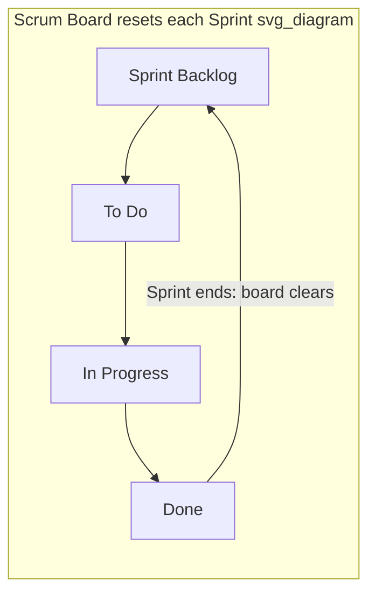
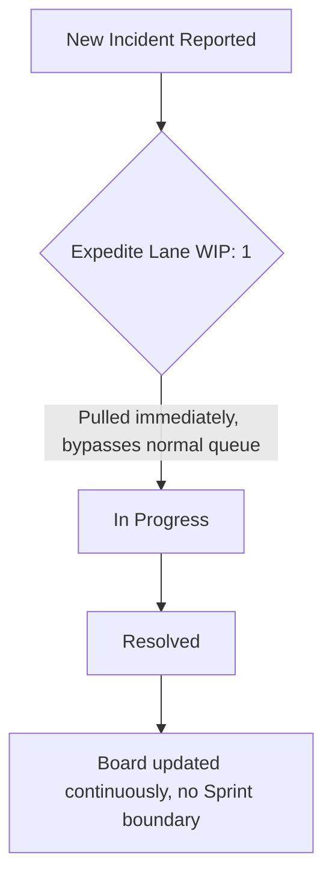

## Kanban Compared to Scrum

### Overview

Kanban and Scrum are the two most widely adopted approaches for implementing Agile and Lean principles in knowledge work. Both aim to deliver value incrementally and improve team performance, but they differ fundamentally in structure, cadence, roles, and philosophy of change. Kanban is a flow-based method that visualizes and limits work-in-progress without prescribing fixed roles or timeboxes, while Scrum is a framework built around fixed-length iterations, defined roles, and a structured set of ceremonies.

### Core Philosophy

**Kanban** is rooted in Lean manufacturing (originating from Toyota's production system) and evolutionary change theory. Its guiding principle is to start with what you do now and pursue incremental, evolutionary improvements to the existing process rather than replacing it wholesale.

**Scrum** is rooted in empirical process control theory (transparency, inspection, adaptation) and is designed as a revolutionary framework — teams adopt a prescribed set of roles, events, and artifacts as a complete package, then inspect and adapt within that structure.

### Foundational Comparison Table

| Dimension | Kanban | Scrum |
| --- | --- | --- |
| Cadence | Continuous flow, no fixed iterations | Fixed-length Sprints (1–4 weeks) |
| Roles | No mandatory roles | Product Owner, Scrum Master, Developers |
| Change philosophy | Evolutionary, incremental | Prescribed framework adopted wholesale |
| Work-in-Progress (WIP) | Explicit WIP limits per column | Implicit WIP limit via Sprint Backlog |
| Delivery | Continuous delivery, any time an item is done | Delivered at Sprint Review, end of Sprint |
| Planning | On-demand, as capacity frees up | Sprint Planning at start of each Sprint |
| Board reset | Never resets; board is persistent | Sprint Backlog resets each Sprint |
| Metrics | Cycle time, throughput, lead time | Velocity, burndown/burnup charts |
| Estimation | Optional; often unestimated | Typically required (story points) |
| Prioritization | Continuous, can reprioritize anytime | Locked for the Sprint duration |
| Team structure | Can be cross-functional or specialized | Must be cross-functional |
| Change during cycle | Allowed anytime, pulled when capacity opens | Discouraged mid-Sprint |

### Structural Differences

#### Cadence and Iterations

Scrum organizes work into **Sprints** — fixed-length, timeboxed iterations, most commonly two weeks. Every Sprint follows the same rhythm: Sprint Planning, Daily Scrum, the work itself, Sprint Review, and Sprint Retrospective. Kanban has **no mandated iterations**. Work items are pulled continuously from a backlog as capacity becomes available, and the workflow can operate indefinitely without a defined start or end point for a batch of work.

```mermaid
gantt
    title Scrum Sprint Cadence vs Kanban Continuous Flow
    dateFormat  X
    axisFormat %s

    section Scrum
    Sprint 1 :s1, 0, 10
    Sprint 2 :s2, 10, 10
    Sprint 3 :s3, 20, 10

    section Kanban
    Continuous Flow (no boundaries) :k1, 0, 30
```



#### Roles

Scrum defines three accountabilities:

- **Product Owner** — owns the Product Backlog and maximizes product value
- **Scrum Master** — accountable for the team's effectiveness and adherence to Scrum theory
- **Developers** — the people doing the work of delivering the Increment

Kanban prescribes **no roles at all** in its core practices. Some organizations layer service-delivery roles on top (e.g., Service Delivery Manager, Service Request Manager) as part of the Kanban Maturity Model, but these are optional extensions, not requirements.

#### Work-in-Progress Limits

This is one of the most distinguishing mechanical differences.

**Kanban** enforces **explicit WIP limits** on each column of the board (e.g., "Development: max 3 items"). If a column is at its limit, no new item can enter until an item leaves — this creates a pull-based system and immediately surfaces bottlenecks.

$$WIP_{limit}(column) \geq \text{items currently in column}$$

**Scrum** has an **implicit WIP limit**: the Sprint Backlog itself, sized by the team's estimated capacity (velocity). There is no per-column limit; all Sprint Backlog items are technically "in progress" for the duration of the Sprint, even if work hasn't started on all of them.

#### Board Behavior

```mermaid
flowchart LR
    subgraph Kanban Board persistent, never resets svg_diagram
    A1[Backlog] -->|pull| B1[To Do]
    B1 -->|WIP: 3| C1[In Progress]
    C1 -->|WIP: 2| D1[Review]
    D1 --> E1[Done]
    end
```



### Metrics and Measurement

**Kanban metrics** focus on flow efficiency:

- **Cycle Time** — time from when work starts on an item to when it's completed
- **Lead Time** — time from when an item is requested to when it's delivered
- **Throughput** — number of items completed per unit time
- **Cumulative Flow Diagram (CFD)** — visualizes WIP, throughput, and bottlenecks over time

$$\text{Little's Law: } WIP = \text{Throughput} \times \text{Cycle Time}$$

**Scrum metrics** focus on predictability of iteration output:

- **Velocity** — story points completed per Sprint
- **Burndown Chart** — remaining work over the course of a Sprint
- **Burnup Chart** — completed work accumulated over Sprints, often against scope
- **Sprint Goal achievement** — qualitative measure of whether the Sprint's objective was met

### Planning and Prioritization

In **Scrum**, prioritization is locked in during Sprint Planning; the Product Owner reorders the Product Backlog beforehand, but once a Sprint begins, the Sprint Backlog is protected from external changes ("scope is fixed for the duration of the Sprint" is a strong Scrum norm, though not an absolute rule in every implementation — [Inference] enforcement of this varies by team maturity and organizational context).

In **Kanban**, prioritization is **continuous**. Because there's no Sprint boundary, the Product Owner (or equivalent) can reprioritize the backlog at any time, and the next-highest priority item is simply pulled in when capacity opens. This makes Kanban well suited to environments with frequent, unpredictable priority shifts (e.g., support/ops teams, SRE, maintenance work).

### Delivery Cadence

Scrum delivers a **potentially shippable Increment** at the end of each Sprint, reviewed formally in the Sprint Review. Kanban supports **continuous delivery** — an item can ship the moment it's done, independent of any other item's status, since there's no batch boundary forcing synchronization.

### When Each Fits Best

**Options Card equivalent (in prose form):**

- **Choose Scrum when:**
  - Work can be meaningfully batched into fixed iterations
  - The team benefits from a regular cadence of planning, review, and reflection
  - Stakeholders want predictable, iteration-based delivery checkpoints
  - Cross-functional collaboration and shared accountability are priorities
- **Choose Kanban when:**
  - Work arrives unpredictably (support tickets, incident response, maintenance)
  - Priorities shift frequently and locking scope for weeks is impractical
  - The team wants to evolve its existing process incrementally rather than adopt a new framework
  - Continuous delivery, rather than batch delivery, is the operational norm
- **Hybrid ("Scrumban"):**
  - Combines Scrum's cadence (Sprint Planning, Retrospectives) with Kanban's flow mechanics (WIP limits, continuous pull)
  - Common in teams transitioning from Scrum to a more flow-based model, or teams that want Scrum's ceremonies but Kanban's flexibility on scope

### Practical Example

**Example:** A software team handling both new feature development and production incidents.

- Under pure Scrum, an urgent production incident mid-Sprint disrupts the Sprint Backlog, forces re-planning, and can distort velocity metrics for that Sprint.
- Under Kanban, the incident is simply pulled into an "Expedite" lane (a common Kanban class-of-service pattern) with its own WIP policy, without needing to renegotiate a Sprint commitment.



### Shared Ground

Despite their differences, Kanban and Scrum share several Agile/Lean foundations:

- Both visualize work (task board / Kanban board)
- Both aim to limit batch size and reduce work in flight
- Both encourage continuous improvement (Retrospective in Scrum; Kaizen/evolutionary change in Kanban)
- Both are pull-oriented at the team level rather than push-oriented from management
- Both can incorporate empirical metrics to guide process adjustments

### Common Misconceptions

- **Misconception:** Kanban has no planning. **Reality:** Kanban has planning, but it's continuous and just-in-time rather than batched into a ceremony.
- **Misconception:** Scrum's velocity is comparable across teams. **Reality:** Velocity is a relative, team-specific measure ([Unverified] as a cross-team benchmark; treating it as an absolute unit of productivity is a widely cited anti-pattern in Scrum literature).
- **Misconception:** Kanban means no deadlines. **Reality:** Kanban can incorporate Service Level Expectations (SLEs) on cycle time, which function as flow-based commitments distinct from Sprint deadlines.

**Next Steps**

- Kanban Board Design and Column Mapping
- Work-in-Progress (WIP) Limits: Setting and Tuning
- Classes of Service in Kanban
- Cumulative Flow Diagrams: Reading and Interpreting
- Scrumban: Combining Scrum Cadence with Kanban Flow
- Little's Law and Flow-Based Forecasting
- Service Level Expectations (SLEs) in Kanban