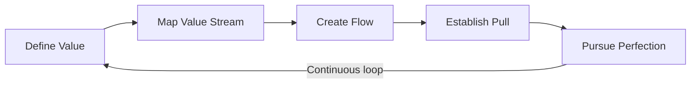
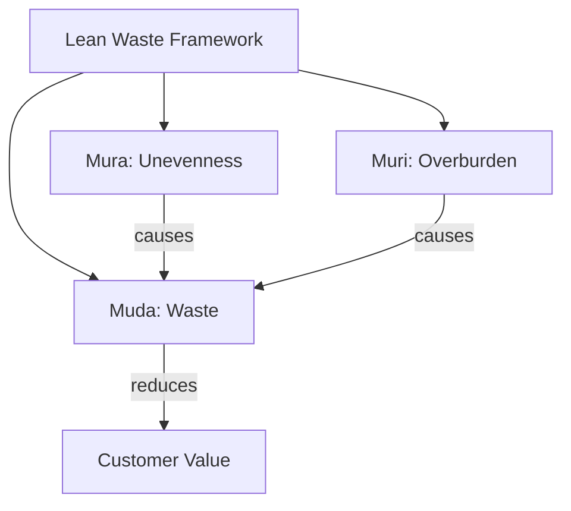
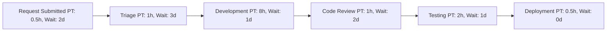

## Lean Principles and Waste Elimination

### Overview

Lean is a management philosophy originating from the Toyota Production System (TPS), developed primarily by Taiichi Ohno and Shigeo Shingo in post-war Japan. It was later adapted to knowledge work and software/project management through works like Mary and Tom Poppendieck's *Lean Software Development*. At its core, Lean is about maximizing customer value while minimizing waste — structuring work so that every activity contributes directly to value the customer is willing to pay for, and systematically identifying and removing activities that do not.

### The Five Lean Principles

Lean is commonly organized around five core principles, formalized by James Womack and Daniel Jones in *Lean Thinking*:

1. **Define Value** — Value is defined strictly from the customer's perspective, not the producer's. A feature, process step, or deliverable only counts as valuable if the customer would pay for it or explicitly wants it.
2. **Map the Value Stream** — Identify every step required to take a product or service from request to delivery, and classify each step as value-adding, non-value-adding-but-necessary, or pure waste.
3. **Create Flow** — Eliminate interruptions, delays, and batching so that work moves smoothly through the value stream without stalling in queues.
4. **Establish Pull** — Work is initiated by downstream demand (a customer request or a downstream process needing input), not pushed based on forecasts or upstream availability.
5. **Pursue Perfection** — Continuous improvement (Kaizen) is ongoing and never considered complete; every iteration of the value stream should be examined for further waste removal.

### The Seven (Plus One) Wastes — Muda

Lean identifies categories of waste — activities that consume resources without creating customer value. The original TPS framework defined seven, often remembered by the acronym **TIMWOOD**; an eighth was added later for knowledge/software contexts.

| Waste (Japanese: Muda) | Manufacturing Example | Project Management / Software Example |
| --- | --- | --- |
| **T**ransportation | Moving materials between stations | Handoffs between teams, unnecessary approvals |
| **I**nventory | Excess raw materials or stock | Unfinished work-in-progress, backlogged features |
| **M**otion | Unnecessary worker movement | Context switching, searching for information |
| **W**aiting | Idle time between production steps | Waiting for approvals, blocked tasks, code review delays |
| **O**verproduction | Producing more than demanded | Building features nobody asked for (gold-plating) |
| **O**verprocessing | Doing more work than the spec requires | Excessive documentation, redundant testing, over-engineering |
| **D**efects | Faulty products requiring rework | Bugs, rework, unclear requirements causing errors |
| **Skills** (8th waste, added later) | Underused worker expertise | Not leveraging team members' full skill sets |

### Three Types of Waste: Muda, Mura, Muri

Lean recognizes three interrelated forms of waste, not just Muda:

- **Muda (無駄)** — Waste: non-value-adding activity (the seven/eight wastes above)
- **Mura (斑)** — Unevenness: inconsistency in workload or process that causes bottlenecks and idle time (e.g., wildly fluctuating sprint scope)
- **Muri (無理)** — Overburden: pushing people, equipment, or processes beyond sustainable capacity (e.g., chronic overtime, unrealistic deadlines)

Reducing Muda in isolation without addressing Mura and Muri tends to be a partial fix — [Inference] uneven workload (Mura) and overburden (Muri) are frequently the root causes that generate downstream Muda, so mature Lean practice addresses all three together rather than treating waste elimination as a checklist exercise on Muda alone.

### Value Stream Mapping (VSM)

Value Stream Mapping is the primary diagnostic tool for applying Lean principles. It visually documents every step in a process, along with:

- **Process time (PT)** — time actually spent doing the work
- **Lead time (LT)** — total elapsed time including waiting
- **%C/A (Percent Complete and Accurate)** — how often the step's output is usable downstream without rework

$$\text{Process Efficiency} = \frac{\sum \text{Process Time}}{\text{Total Lead Time}} \times 100\%$$

A low process efficiency percentage indicates most of the lead time is consumed by waiting and non-value-adding activity rather than actual work.

**Example VSM walkthrough (simplified feature request flow):**

In this example, total process time is roughly 13 hours, but total lead time spans roughly 9 days — a strong visual signal that waiting (Muda) dominates the process, not the actual work.

### Applying Lean Principles in Project Management

#### 1. Eliminate Waste

Practically, this means auditing workflows for:

- Redundant status meetings that don't change decisions (Waiting/Motion waste)
- Features built speculatively without validated demand (Overproduction)
- Documentation created for its own sake rather than a defined audience need (Overprocessing)
- Long-lived work-in-progress that ties up capacity without delivering value (Inventory)

#### 2. Amplify Learning

Especially emphasized in Lean Software Development: short feedback loops, frequent releases, and validated learning over big upfront design.

#### 3. Decide as Late as Possible

Defer irreversible commitments until the last responsible moment, preserving options and reducing waste from decisions made on incomplete information.

#### 4. Deliver as Fast as Possible

Fast delivery cycles shrink the feedback loop and reduce the cost of being wrong; this connects directly to the "Create Flow" principle.

#### 5. Respect People

Teams closest to the work are empowered to identify and fix waste (this underlies Kaizen and the Toyota practice of Andon — any worker can halt the line to fix a defect at its source).

#### 6. Optimize the Whole

Avoid local optimization (e.g., maximizing one team's throughput) at the expense of the overall value stream; a classic anti-pattern is a fast development team whose output piles up unreviewed because the review step wasn't scaled proportionally.

### Kaizen: Continuous Improvement

**Kaizen (改善)** — "change for better" — is the operational mechanism behind "Pursue Perfection." It emphasizes small, incremental, continuous improvements driven by the people doing the work, as opposed to large infrequent overhauls driven top-down.

**Key Points**

- Improvements are small, frequent, and reversible
- Anyone on the team can propose and often implement a Kaizen change
- Retrospectives in Agile/Scrum function as a structured Kaizen mechanism
- Kaizen events (or "Kaizen blitzes") are time-boxed, focused improvement sprints targeting a specific waste

### Relationship to Kanban and Agile

Lean is the philosophical foundation underlying both Kanban and much of Agile/XP practice:

- **Kanban** operationalizes "Create Flow" and "Establish Pull" directly through WIP limits and pull-based scheduling.
- **Extreme Programming (XP)** operationalizes waste elimination through practices like Test-Driven Development (reducing Defects waste) and Continuous Integration (reducing Waiting and Inventory waste).
- **Scrum's Sprint Retrospective** operationalizes Kaizen.

### Common Pitfalls in Applying Lean

- Treating Lean as a one-time cost-cutting exercise rather than an ongoing discipline
- Focusing exclusively on visible wastes (Defects, Waiting) while ignoring structural ones (Overprocessing, Skills underutilization)
- Removing Muda without addressing the underlying Mura/Muri causing it, leading to the waste reappearing elsewhere in the value stream
- Applying manufacturing-style waste categories too literally to knowledge work without adapting the definitions (e.g., "Inventory" in software is unshipped code or undeployed features, not physical stock)

### Practical Example

**Example:** A project team notices consistent delays between "development complete" and "deployed to production."

1. **Map the value stream** — discover a 3-day average wait for a manual QA sign-off (Waiting waste)
2. **Investigate root cause** — QA is a single-person bottleneck reviewing work from five developers (Mura: uneven load distribution)
3. **Apply Lean principle (Create Flow)** — introduce automated regression testing to handle routine checks, freeing the QA specialist for exploratory testing only
4. **Result** — average lead time from code-complete to deployment drops significantly; [Inference] the exact percentage reduction depends on the proportion of testing that can be safely automated, which varies by codebase and risk profile.

**Next Steps**

- Value Stream Mapping: Detailed Technique and Symbols
- Kaizen Events and Continuous Improvement Cycles
- Toyota Production System (TPS) and Its Software Adaptations
- Lean Software Development (Poppendieck Principles)
- Just-In-Time (JIT) Production and Pull Systems
- Extreme Programming (XP) Practices for Waste Reduction
- Theory of Constraints and Bottleneck Analysis