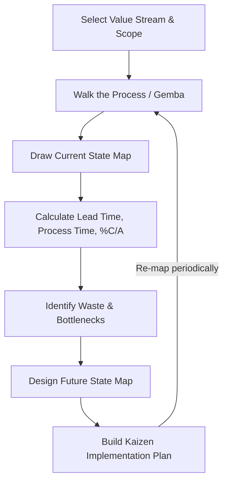

## Value Stream Mapping

### Overview

Value Stream Mapping (VSM) is a Lean visualization technique used to document, analyze, and improve the flow of materials and information required to bring a product or service from request to delivery. Originating from Toyota's Material and Information Flow Mapping practice, VSM was popularized outside manufacturing by Mike Rother and John Shook's *Learning to See*. In project management contexts, it is used to expose waste, bottlenecks, and excessive lead time across a workflow — spanning both the "production" steps (the value-adding work itself) and the surrounding information flow (approvals, handoffs, scheduling) that governs how work moves.

### Core Purpose

VSM answers a specific question: **of the total time an item takes from request to delivery, how much of that time is actually spent adding value, and how much is waste?** It makes the invisible visible — queues, handoffs, rework loops, and delays that don't show up in a simple task list or Gantt chart.

$$\text{Process Efficiency} = \frac{\text{Value-Add Time}}{\text{Total Lead Time}} \times 100\%$$

In most unoptimized processes — manufacturing or knowledge work — this ratio is surprisingly low; [Inference] published case studies frequently report process efficiencies under 10-15%, though the exact figure is highly context-dependent and varies by industry, so it shouldn't be treated as a universal benchmark.

### Key Terminology

| Term | Definition |
| --- | --- |
| **Process Time (PT)** | Actual time spent performing the work at a given step |
| **Lead Time (LT)** | Total elapsed time for an item to move through a step, including waiting |
| **Cycle Time (CT)** | Time between successive units completing a step (throughput rate) |
| **%C/A (Percent Complete and Accurate)** | Fraction of the time a step's output is usable downstream without correction or clarification |
| **Taktakt Time** | Rate at which customer demand requires items to be completed (demand rate) |
| **Value-Added (VA) Time** | Time spent on activities the customer would pay for |
| **Non-Value-Added (NVA) Time** | Time spent on waiting, rework, handoffs, or other waste |
| **Push vs. Pull** | Whether work is forced downstream regardless of capacity, or pulled by downstream demand |

### The Value Stream Mapping Process

#### 1. Select the Value Stream (Scope)

Define the specific product, service, or request type to map, and set clear start and end boundaries (e.g., "from feature request submission to production deployment").

#### 2. Draw the Current State Map

Walk the actual process (Gemba — "go and see") and document each step, capturing:

- Process time and lead time at each step
- %C/A between each step
- Information flow (how work is scheduled, communicated, and triggered)
- Inventory/queue sizes between steps (backlog counts, WIP)

#### 3. Calculate Totals and Identify Waste

Sum process times and lead times across the full stream, then compute process efficiency and pinpoint the steps consuming the most non-value-added time.

#### 4. Draw the Future State Map

Design a target process with waste removed — this typically means introducing pull systems, reducing batch sizes, removing unnecessary approval steps, and balancing capacity across steps.

#### 5. Create an Implementation Plan

Break the transformation into a sequence of Kaizen actions with owners and timelines.

### VSM Symbols and Notation

Traditional manufacturing VSM uses a standardized icon set; in software/knowledge-work adaptations, a simplified subset is typically used:

- **Process box** — a rectangle representing a discrete step, annotated with PT, LT, and %C/A
- **Data box** — attached below a process box, listing metrics for that step
- **Arrow (push)** — a striped or solid arrow indicating work forced to the next step regardless of downstream readiness
- **Arrow (pull)** — a different arrow style indicating work is pulled by downstream demand
- **Inventory triangle** — a triangle marking a queue or backlog of waiting work between steps
- **Kaizen burst** — a starburst symbol marking a specific spot targeted for improvement

Below is a representative current-state VSM rendered as raw SVG (renders natively in Markdown environments like Obsidian):

<svg xmlns="http://www.w3.org/2000/svg" viewBox="0 0 900 340" font-family="Helvetica, Arial, sans-serif">
<text x="450" y="24" text-anchor="middle" font-size="16" font-weight="bold" fill="#1a1a1a">Current State Value Stream Map (svg_diagram)</text>

<rect x="20" y="60" width="140" height="60" fill="#e8f0fe" stroke="#1a56db" stroke-width="1.5" />
<text x="90" y="85" text-anchor="middle" font-size="12" font-weight="bold">Request</text>
<text x="90" y="100" text-anchor="middle" font-size="11">Submitted</text>
<rect x="20" y="120" width="140" height="34" fill="#ffffff" stroke="#1a56db" stroke-width="1" />
<text x="90" y="134" text-anchor="middle" font-size="10">PT: 0.5h LT: 2d</text>
<text x="90" y="147" text-anchor="middle" font-size="10">%C/A: 70%</text>

<polygon points="175,105 195,75 215,105" fill="#fff3cd" stroke="#b45309" stroke-width="1.5" />
<text x="195" y="98" text-anchor="middle" font-size="9">Queue</text>

<rect x="230" y="60" width="140" height="60" fill="#e8f0fe" stroke="#1a56db" stroke-width="1.5" />
<text x="300" y="85" text-anchor="middle" font-size="12" font-weight="bold">Triage &amp;</text>
<text x="300" y="100" text-anchor="middle" font-size="11">Prioritize</text>
<rect x="230" y="120" width="140" height="34" fill="#ffffff" stroke="#1a56db" stroke-width="1" />
<text x="300" y="134" text-anchor="middle" font-size="10">PT: 1h LT: 3d</text>
<text x="300" y="147" text-anchor="middle" font-size="10">%C/A: 85%</text>

<polygon points="385,105 405,75 425,105" fill="#fff3cd" stroke="#b45309" stroke-width="1.5" />
<text x="405" y="98" text-anchor="middle" font-size="9">Queue</text>

<rect x="440" y="60" width="140" height="60" fill="#e8f0fe" stroke="#1a56db" stroke-width="1.5" />
<text x="510" y="85" text-anchor="middle" font-size="12" font-weight="bold">Development</text>
<rect x="440" y="120" width="140" height="34" fill="#ffffff" stroke="#1a56db" stroke-width="1" />
<text x="510" y="134" text-anchor="middle" font-size="10">PT: 8h LT: 1d</text>
<text x="510" y="147" text-anchor="middle" font-size="10">%C/A: 90%</text>

<polygon points="300,25 308,40 325,38 313,50 320,66 300,57 280,66 287,50 275,38 292,40" fill="#fecaca" stroke="#b91c1c" stroke-width="1" />
<text x="300" y="44" text-anchor="middle" font-size="8" font-weight="bold">Kaizen</text>

<polygon points="595,105 615,75 635,105" fill="#fff3cd" stroke="#b45309" stroke-width="1.5" />
<text x="615" y="98" text-anchor="middle" font-size="9">Queue</text>

<rect x="650" y="60" width="140" height="60" fill="#e8f0fe" stroke="#1a56db" stroke-width="1.5" />
<text x="720" y="85" text-anchor="middle" font-size="12" font-weight="bold">Code Review</text>
<rect x="650" y="120" width="140" height="34" fill="#ffffff" stroke="#1a56db" stroke-width="1" />
<text x="720" y="134" text-anchor="middle" font-size="10">PT: 1h LT: 2d</text>
<text x="720" y="147" text-anchor="middle" font-size="10">%C/A: 75%</text>

<line x1="160" y1="90" x2="175" y2="90" stroke="#374151" stroke-width="2" marker-end="url(#arrow)" />
<line x1="215" y1="90" x2="230" y2="90" stroke="#374151" stroke-width="2" marker-end="url(#arrow)" />
<line x1="370" y1="90" x2="385" y2="90" stroke="#374151" stroke-width="2" marker-end="url(#arrow)" />
<line x1="425" y1="90" x2="440" y2="90" stroke="#374151" stroke-width="2" marker-end="url(#arrow)" />
<line x1="580" y1="90" x2="595" y2="90" stroke="#374151" stroke-width="2" marker-end="url(#arrow)" />
<line x1="635" y1="90" x2="650" y2="90" stroke="#374151" stroke-width="2" marker-end="url(#arrow)" />
<line x1="20" y1="220" x2="790" y2="220" stroke="#9ca3af" stroke-width="1.5" />
<text x="90" y="240" text-anchor="middle" font-size="10">LT: 2d</text>
<text x="90" y="253" text-anchor="middle" font-size="10" fill="#16a34a">PT: 0.5h</text>
<text x="300" y="240" text-anchor="middle" font-size="10">LT: 3d</text>
<text x="300" y="253" text-anchor="middle" font-size="10" fill="#16a34a">PT: 1h</text>
<text x="510" y="240" text-anchor="middle" font-size="10">LT: 1d</text>
<text x="510" y="253" text-anchor="middle" font-size="10" fill="#16a34a">PT: 8h</text>
<text x="720" y="240" text-anchor="middle" font-size="10">LT: 2d</text>
<text x="720" y="253" text-anchor="middle" font-size="10" fill="#16a34a">PT: 1h</text>

<text x="450" y="285" text-anchor="middle" font-size="12" font-weight="bold">Total Lead Time: 8 days | Total Process Time: 10.5 hours</text>

<text x="450" y="305" text-anchor="middle" font-size="12" fill="`#b91c1c`" font-weight="bold">Process Efficiency: ~5.5%</text>

</svg>

### Calculating Process Efficiency: Worked Example

Using the mapped values above:

- Total Process Time (PT) = $0.5h + 1h + 8h + 1h = 10.5h$
- Total Lead Time (LT) = $2d + 3d + 1d + 2d = 8d = 192h$

$$\text{Process Efficiency} = \frac{10.5}{192} \times 100\% \approx 5.5\%$$

This means roughly 94.5% of the total time an item spends in this workflow is non-value-added waiting, not actual work — a strong signal that queue reduction (not speeding up the work itself) is the highest-leverage improvement target.

### VSM in Software and Knowledge Work

Unlike physical manufacturing, software/project VSM often has less tangible "inventory" — unshipped code, undeployed features, or unreviewed pull requests function as inventory in the Lean sense. Key adaptations include:

- **Information flow** carries more weight relative to physical flow — tracking systems (Jira, Azure DevOps boards) function as the "information flow" arrows
- **%C/A** commonly reflects requirements clarity or defect escape rate rather than physical part quality
- **Batch size** refers to story/feature batching (e.g., large releases vs. continuous deployment) rather than physical lot sizes

### Common Bottleneck Patterns Revealed by VSM

- **Approval Queues** — items sitting idle awaiting sign-off from a single approver (classic Mura/uneven-load pattern)
- **Handoff Loss** — context lost between specialized teams (e.g., design to development), often visible as low %C/A at the receiving step
- **Batch-and-Queue** — work accumulated into large batches before moving downstream, inflating lead time without inflating process time
- **Rework Loops** — a step whose low %C/A sends a meaningful fraction of items back to a prior step, an easily overlooked source of hidden lead time (VSM depicts this as a looped arrow returning to an earlier box)

### Relationship to Other Lean/Agile Tools

- **Kanban boards** provide a real-time, ongoing view of WIP and flow, whereas VSM is typically a periodic, deeper diagnostic exercise
- **Cumulative Flow Diagrams (CFDs)** quantify the same waiting/queueing patterns VSM identifies, but over time rather than as a step-by-step snapshot
- **Theory of Constraints** complements VSM by focusing improvement effort specifically on the single most limiting bottleneck identified in the map

### Practical Example

**Example:** An organization maps its feature-request-to-deployment value stream (as shown above) and finds an 8-day lead time against only 10.5 hours of actual process time. The Kaizen burst placed at "Triage & Prioritize" (3-day queue) targets the largest single contributor to lead time. Introducing a daily triage cadence instead of a weekly one, and capping the triage queue with a WIP limit, is proposed as the first future-state change — a low-cost intervention directly addressing the mapped bottleneck rather than the more expensive step of adding developer headcount, which would improve process time but not the dominant waiting time.

**Related Topics**

- Cumulative Flow Diagrams and Flow Metrics
- Theory of Constraints and Bottleneck Analysis
- Kaizen Events and Continuous Improvement Cycles
- Batch Size Reduction and Single-Piece Flow
- Takt Time and Demand-Based Scheduling
- Gemba Walks and Direct Observation Techniques
- Future-State Mapping and Implementation Roadmaps