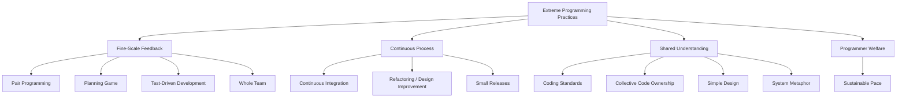
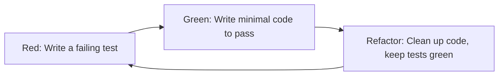

## Extreme Programming Practices


### Overview

Extreme Programming (XP) is an Agile software development methodology created by Kent Beck in the late 1990s, first fully articulated in *Extreme Programming Explained* (1999). XP takes established good engineering practices — code review, testing, simplicity, integration — and pushes them to an "extreme" degree of intensity and frequency, on the theory that if a practice is beneficial in moderation, doing it continuously yields compounding benefits. XP is distinguished from Scrum and Kanban by its heavy emphasis on **engineering discipline and technical practices** rather than primarily process/workflow structure.

### The Five XP Values

XP practices are grounded in five core values:

1. **Communication** — Close, continuous collaboration between developers, customers, and stakeholders
2. **Simplicity** — Build the simplest thing that could possibly work; avoid speculative generality
3. **Feedback** — Short feedback loops at every level (unit tests, pair programming, customer demos)
4. **Courage** — The willingness to refactor, discard bad code, or raise hard truths about progress
5. **Respect** — Mutual respect among team members and between the team and the customer

### The Twelve Core XP Practices

XP's original practices are commonly grouped into four categories: Fine-Scale Feedback, Continuous Process, Shared Understanding, and Programmer Welfare.



#### Fine-Scale Feedback

**1. Pair Programming**

Two developers work at a single workstation — one "driver" typing code, one "navigator" reviewing each line in real time and thinking strategically. Roles switch frequently. The intent is continuous code review, knowledge transfer, and reduced defect rates.

**Key Points**

- Reduces the need for separate formal code review steps
- Accelerates onboarding and cross-training
- [Unverified] Net productivity impact relative to solo programming is debated in the empirical software engineering literature; effects appear to vary by task complexity and pair familiarity, so it should not be treated as a universally proven productivity multiplier.

**2. Planning Game**

A lightweight, recurring planning process where business stakeholders (via "user stories") define scope and priority, and developers estimate effort. This is the XP ancestor of Sprint Planning and backlog refinement in Scrum.

**3. Test-Driven Development (TDD)**

Tests are written *before* the production code that satisfies them, following the **Red-Green-Refactor** cycle:



**Example (pseudocode):**

```python
# Red: write the failing test first
def test_add_positive_numbers():
    assert add(2, 3) == 5

# Green: write minimal code to pass
def add(a, b):
    return a + b

# Refactor: only if needed once more tests exist
```

**4. Whole Team**

All roles needed for the project — developers, testers, customer representatives, domain experts — work together as one team in the same space (or tightly integrated virtually), rather than being organized into separate functional silos.

#### Continuous Process

**5. Continuous Integration (CI)**

Developers integrate code into a shared mainline branch multiple times per day, with each integration verified by an automated build and test suite. This minimizes "integration hell" — the exponentially compounding difficulty of merging long-lived divergent branches.

$$\text{Integration Risk} \propto \text{Time Since Last Merge} \times \text{Number of Divergent Changes}$$

**6. Refactoring / Design Improvement**

Continuously restructuring existing code to improve its internal structure without changing external behavior, keeping the codebase simple and adaptable as requirements evolve. Refactoring is done in small, safe, test-covered steps rather than large rewrites.

**7. Small Releases**

Deliver working software to customers in small, frequent increments rather than large infrequent releases — enabling faster feedback and reducing the risk and cost of any single release.

#### Shared Understanding

**8. Coding Standards**

A team-wide agreed style and set of conventions, so code looks and reads consistently regardless of author — a prerequisite for effective pair programming and collective ownership.

**9. Collective Code Ownership**

Any team member can modify any part of the codebase at any time, rather than code being "owned" and gatekept by individuals. This is supported by comprehensive automated tests and coding standards, which reduce the risk of unfamiliar-code changes introducing defects.

**10. Simple Design**

Kent Beck's four rules of simple design, in priority order:

1. Passes all tests
2. Reveals intention clearly (readable, expressive)
3. Contains no duplication (DRY)
4. Has the fewest possible elements (minimal, no speculative generality)

**11. System Metaphor**

A shared, simple story or analogy that describes how the system works, giving the whole team (including non-technical stakeholders) a common vocabulary for discussing architecture (e.g., describing a billing system using a "shopping cart and checkout" metaphor).

#### Programmer Welfare

**12. Sustainable Pace** (originally called "40-Hour Week")

Work is done at a pace the team can sustain indefinitely, explicitly rejecting chronic overtime as a substitute for realistic planning — connecting directly to the Lean concept of Muri (overburden).

### Comparison to Scrum

| Dimension | Extreme Programming | Scrum |
| --- | --- | --- |
| Primary focus | Engineering/technical practices | Process/workflow structure |
| Iteration length | Typically 1-2 weeks | 1-4 weeks |
| Roles | Less formally prescribed | Product Owner, Scrum Master, Developers |
| Core mechanism | TDD, pairing, CI, refactoring | Sprint ceremonies, backlog management |
| Customer involvement | On-site customer, continuous | Product Owner represents customer |
| Compatibility | Frequently combined with Scrum | Frequently combined with XP practices |

[Inference] In practice, many teams describe themselves as "Scrum teams" while actually running several XP engineering practices (TDD, CI, pairing) underneath a Scrum process shell — the two are complementary rather than competing at the practice level, even though they originated as distinct methodologies.

### Practical Example

**Example:** A team adopts TDD and Continuous Integration for a new billing module.

1. A developer writes a failing test asserting that applying a 10% discount code reduces an order total correctly
2. They write the minimal `apply_discount()` function to pass that test
3. They refactor the function for clarity once a small suite of related tests exists
4. They commit and push to the shared mainline; the CI server automatically runs the full test suite
5. If any test fails, the build is marked broken and fixing it becomes the team's top priority before further work continues

This tight loop — test, code, refactor, integrate — is the practical embodiment of XP's Feedback and Courage values: developers can confidently modify code because a comprehensive test suite will immediately reveal any regression.

### Common Pitfalls

- Adopting pair programming or TDD only partially/inconsistently, which reduces the compounding benefit the "extreme" application of the practice depends on
- Treating Continuous Integration as merely a tool (a CI server) without the accompanying discipline of frequent small commits
- Skipping refactoring due to schedule pressure, leading to accumulating technical debt that XP's practices are specifically designed to prevent
- Applying "Simple Design" as an excuse to skip necessary architectural planning rather than as a discipline against speculative over-engineering

**Next Steps**

- Test-Driven Development: Detailed Workflow and Patterns
- Pair Programming: Techniques and Remote Adaptations
- Continuous Integration and Continuous Delivery (CI/CD) Pipelines
- Refactoring Patterns and Technical Debt Management
- The Planning Game and User Story Estimation
- Collective Code Ownership and Coding Standards Enforcement
- XP and Scrum: Hybrid Team Implementations