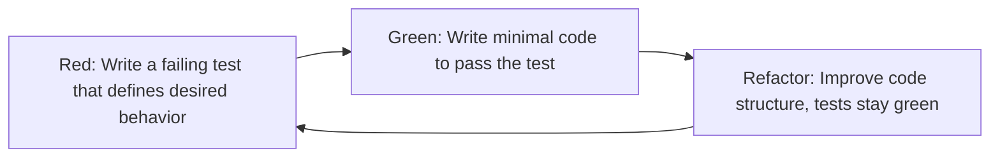
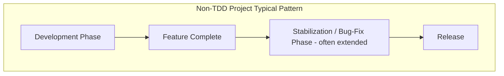
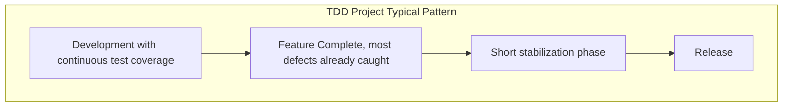

## Test Driven Development for Project Managers

### Overview

Test-Driven Development (TDD) is a software engineering practice, originating from Extreme Programming, in which automated tests are written *before* the corresponding production code. While TDD is executed by developers, project managers need working fluency in it because it materially affects estimation, scheduling, risk management, quality metrics, and how "done" is defined at the project level. This item covers TDD specifically through the lens of what a project manager needs to know to plan around it, communicate its value to stakeholders, and interpret its signals.

### The TDD Cycle: Red-Green-Refactor

- **Red** — A test is written for a behavior that doesn't exist yet; it fails by definition
- **Green** — The developer writes the simplest code that makes the test pass
- **Refactor** — The code is cleaned up and restructured while the passing test suite guarantees no behavior was broken

This cycle typically repeats in intervals of minutes, not hours or days — a granularity relevant to how PMs interpret "progress" signals during development.

### Why This Matters for Project Management

#### 1. Impact on Estimation

Upfront development velocity on TDD-practicing teams can appear slower than non-TDD teams, since writing tests takes additional time before any "visible" feature progress appears. [Inference] This apparent slowdown is frequently offset over the project's lifetime by reduced debugging and rework time, but the size of that offset varies by project complexity, codebase longevity, and team TDD proficiency — it should not be presented to stakeholders as a guaranteed short-term acceleration.

#### 2. Impact on Quality Metrics

TDD produces a natural byproduct: a comprehensive regression test suite. For PMs, this changes what quality metrics are meaningful to track:

| Metric | Relevance to PM |
| --- | --- |
| Test coverage % | Rough proxy for how much of the codebase is protected against regressions |
| Defect escape rate | Bugs found in production vs. caught pre-release; TDD teams often show lower escape rates |
| Regression frequency | How often previously-working features break after new changes |
| Time-to-fix defects | Often shorter on TDD codebases, since tests help pinpoint the exact failure |

#### 3. Impact on Scope and Change Management

Because TDD-covered code can be refactored safely (tests catch regressions immediately), teams practicing TDD are often more receptive to accommodating scope changes mid-project — the cost of "will this break something else?" is lower. This directly supports Agile's tolerance for evolving requirements.

#### 4. Impact on Scheduling and Milestones

A PM scheduling around a TDD team should expect:

- Slightly longer initial implementation time per feature (writing tests first)
- Fewer late-stage "stabilization" or "bug-fixing" phases before release, since defects are caught earlier and continuously
- More predictable, less lumpy defect discovery — bugs tend to surface immediately rather than clustering right before a release deadline

### Key Concepts a PM Should Recognize (Without Writing Code)

**Unit Test** — A test verifying a single, small piece of logic (e.g., one function) in isolation.

**Test Suite** — The complete collection of automated tests for a codebase; run frequently, often on every code commit via Continuous Integration.

**Test Coverage** — The percentage of code exercised by the test suite, often reported as a build metric. High coverage is a positive signal but is not itself a guarantee of quality — [Inference] coverage percentage measures how much code ran during tests, not whether the tests actually assert correct behavior, so a PM should treat it as one input signal, not a definitive quality score.

**Regression** — A previously working feature that breaks due to a later change; TDD's core value proposition is catching regressions immediately rather than after release.

**Mocking/Stubbing** — Techniques developers use to isolate the code under test from external dependencies (databases, APIs) during testing; relevant to a PM mainly as a reason test suites can run quickly and frequently without needing live production systems.

### Communicating TDD's Value to Stakeholders

A common PM challenge is justifying to non-technical stakeholders why a feature is taking longer than expected when developers are "just" writing tests. Framing that tends to resonate:

- **Key Points**
  - TDD is an investment that front-loads a cost (writing tests) to reduce a much larger, less predictable downstream cost (production defects, emergency fixes, extended stabilization phases)
  - A comprehensive test suite functions as a form of risk insurance for future changes — safer refactoring, safer scope changes, safer handoffs to new team members
  - Defect trends are a more informative signal of project health than raw feature-completion velocity, especially on TDD projects

### Risk Management Considerations

TDD reduces certain categories of project risk while not eliminating others:

- **Reduces:** Regression risk, risk from developer turnover (tests document expected behavior), risk of late-cycle "surprise" defects
- **Does not eliminate:** Requirements risk (tests can correctly verify the *wrong* requirement if the requirement itself was misunderstood), integration risk with genuinely external systems outside the team's control, and UX/usability defects (functional correctness ≠ good user experience)

### Practical Example

**Example:** A PM is planning a 6-week feature build. The lead developer proposes a TDD approach, estimating a 15% longer implementation phase compared to a non-TDD estimate, but forecasting a substantially shorter stabilization phase before release.

- Non-TDD estimate: 4 weeks development + 2 weeks stabilization = 6 weeks, with meaningful uncertainty in the stabilization phase length if defects are worse than expected
- TDD estimate: 4.5 weeks development (tests included) + 0.5-1 week stabilization = 5-5.5 weeks, with tighter variance around the stabilization estimate since most defects will already have surfaced during development

The PM uses this reasoning to justify the slightly longer-looking development phase to stakeholders by pointing to the reduced schedule risk in the stabilization phase — a trade of predictability for a small amount of nominal upfront time.

### Common Misconceptions PMs Should Avoid

- **Misconception:** TDD means "more testing" is happening overall. **Reality:** TDD changes *when* and *how* tests are written (before the code, driving its design), not simply the quantity of testing relative to a team that tests thoroughly after writing code.
- **Misconception:** High test coverage means the software is bug-free. **Reality:** Coverage indicates code was executed during tests, not that all edge cases or requirements were correctly captured.
- **Misconception:** TDD is a testing-team responsibility. **Reality:** TDD is authored and owned by the developers writing the production code, not a separate QA function.

**Related Topics**

- Extreme Programming Practices (parent methodology)
- Continuous Integration and Automated Build Pipelines
- Defining "Done": Acceptance Criteria and Definition of Done
- Technical Debt: Identification and Management for PMs
- Quality Metrics and Defect Tracking in Agile Projects
- Refactoring and Its Impact on Project Risk
- Behavior-Driven Development (BDD) as a Stakeholder-Facing Extension of TDD