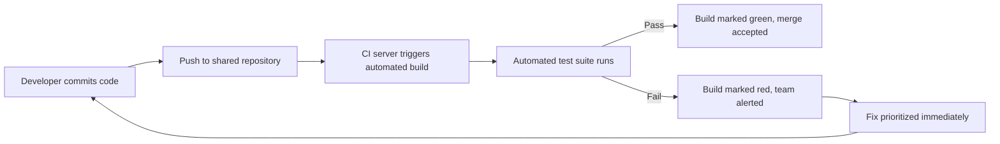
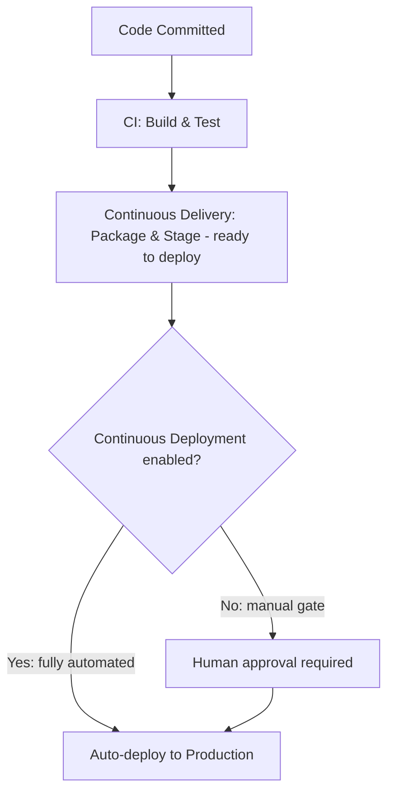
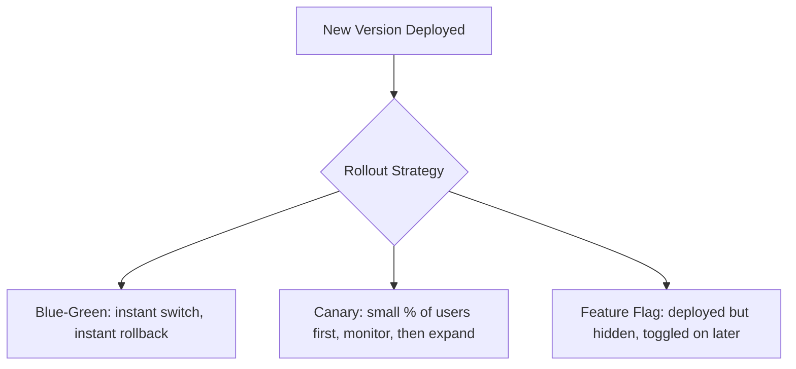

## Continuous Integration and Delivery Concepts

### Overview

Continuous Integration (CI) and Continuous Delivery/Deployment (CD) — together commonly abbreviated **CI/CD** — are software engineering practices that automate the process of merging code changes, validating them, and moving working software toward production. Originating from Extreme Programming's Continuous Integration practice, CI/CD has become foundational infrastructure across nearly all modern Agile and Lean software delivery, and project managers need to understand it to plan releases, assess delivery risk, and interpret pipeline health as a project signal.

### Continuous Integration (CI)

CI is the practice of developers merging their code changes into a shared mainline branch frequently — often multiple times per day — with each merge automatically verified by a build and test process.

**Core mechanics:**

1. A developer commits and pushes code to a shared repository
2. An automated CI server detects the change and triggers a build
3. The build compiles the code and runs the automated test suite
4. Results (pass/fail) are reported back to the team immediately

**Why frequent integration matters:** the cost of resolving merge conflicts and integration defects grows non-linearly with the size and age of the divergence between branches.

$$\text{Integration Effort} \propto (\text{Divergence Time})^{k}, \quad k > 1 \text{ [Inference: exact exponent is context-dependent]}$$

### Continuous Delivery vs. Continuous Deployment

These two terms are frequently conflated but represent different levels of automation:

| Term | Definition | Human Gate Before Production? |
| --- | --- | --- |
| **Continuous Delivery** | Every change that passes automated tests is automatically prepared for release (built, tested, packaged) and is *deployable* at any time | Yes — a human decides when to release |
| **Continuous Deployment** | Every change that passes automated tests is automatically released to production with no manual intervention | No — deployment itself is automated |

### The Full CI/CD Pipeline

A typical pipeline progresses through a series of automated stages, each acting as a quality gate:

**Key Points**

- Each stage is a gate: a failure at any stage halts the pipeline and surfaces the issue immediately, rather than allowing a defect to silently progress toward production
- Pipelines are typically defined as code (e.g., YAML configuration files) and version-controlled alongside the application itself
- Feedback speed is the central design goal — the faster a failure is detected, the cheaper it is to fix (a principle shared with TDD and Lean's emphasis on short feedback loops)

### Why This Matters for Project Management

#### 1. Release Planning and Predictability

Teams with mature CI/CD pipelines can release smaller batches of work more frequently, reducing the risk profile of any single release and making release dates less tied to a large "stabilization" milestone.

#### 2. Risk Management

CI/CD directly reduces **integration risk** and **deployment risk** — two categories of project risk that, in less automated environments, tend to cluster unpredictably near release deadlines.

#### 3. Deployment Strategies Relevant to Scheduling

- **Blue-Green Deployment** — two identical production environments; traffic is switched from the old ("blue") to the new ("green") version, enabling near-instant rollback
- **Canary Release** — a new version is rolled out to a small subset of users first, with metrics monitored before a full rollout
- **Feature Flags/Toggles** — new code is deployed but hidden behind a flag, decoupling deployment (getting code to production) from release (making it visible to users) — a distinction PMs should recognize, since "deployed" no longer necessarily means "live for all users"

#### 4. Metrics PMs Should Track

| Metric | What It Indicates |
| --- | --- |
| Build success rate | Overall pipeline health and code stability |
| Deployment frequency | How often the team ships to production — a core DevOps performance indicator |
| Lead time for changes | Time from code commit to production deployment |
| Change failure rate | Percentage of deployments causing a production incident |
| Mean time to recovery (MTTR) | How quickly the team restores service after a failed deployment |

These five metrics (the last four drawn from the widely cited DORA — DevOps Research and Assessment — research program) give a PM an evidence-based way to discuss delivery performance with stakeholders, separate from subjective impressions of team speed. [Unverified] Specific DORA performance benchmarks (e.g., what counts as "elite" performance) are periodically updated in the underlying research and should be checked against the current State of DevOps report rather than treated as fixed thresholds.

### Common Pitfalls

- **Flaky tests** — tests that intermittently fail without a real underlying defect erode trust in the pipeline and can lead teams to start ignoring failures, defeating the purpose of automated gating
- **Long-running pipelines** — if a build/test cycle takes too long, developers batch up changes to avoid waiting, undermining the "frequent small integration" principle
- **Deploying without adequate monitoring** — automating deployment without corresponding automated rollback/alerting increases the blast radius of an undetected bad release
- **Treating CI as merely a tool, not a discipline** — installing a CI server without the accompanying practice of fixing broken builds immediately (the XP norm) yields little of the intended benefit

### Practical Example

**Example:** A PM is planning a quarterly roadmap and needs to decide release cadence.

- Without CI/CD: the team batches three months of work into one large release, requiring a multi-week manual regression testing phase and creating a single high-risk go/no-go decision point
- With CI/CD (Continuous Delivery): the team can release weekly, in small increments, each individually lower-risk; the PM can commit to a fixed release cadence to stakeholders rather than a single uncertain date, and any single week's release can be rolled back or paused without threatening the entire quarter's output

This shifts the PM's core planning question from "when will the big release be ready?" to "what should go into this week's release?" — a materially different and generally lower-risk planning posture.

**Related Topics**

- Extreme Programming Practices (parent methodology)
- Test-Driven Development and Its Role in Pipeline Reliability
- DORA Metrics and DevOps Performance Measurement
- Feature Flags and Progressive Delivery Strategies
- Deployment Risk Management and Rollback Planning
- Infrastructure as Code and Pipeline-as-Code Practices
- Release Management in Agile and Lean Frameworks