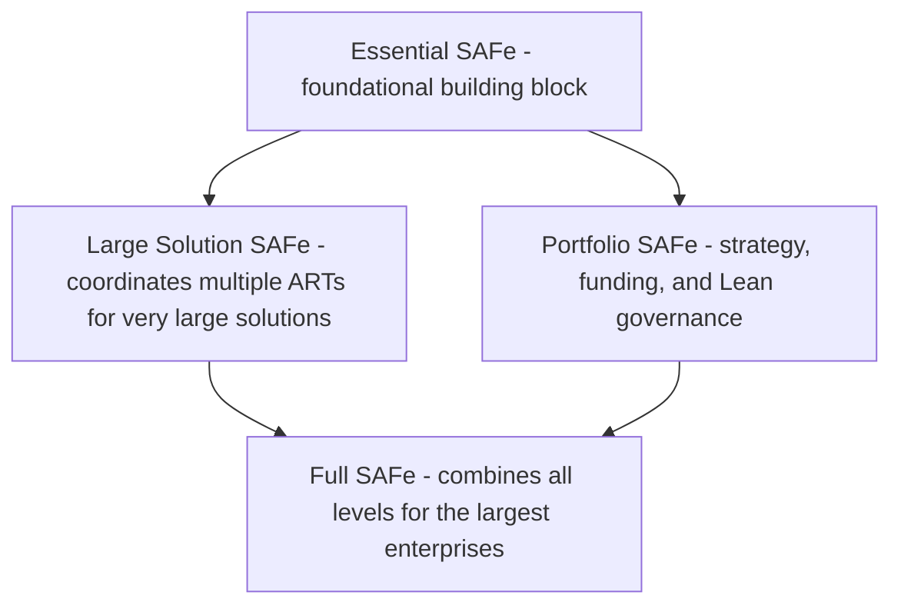
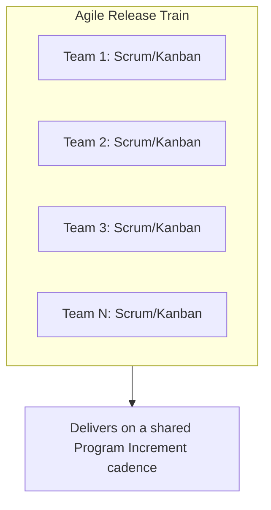

## Scaled Agile Framework (SAFe)

### Overview

The Scaled Agile Framework (SAFe) is a set of organizational and workflow patterns for implementing Agile and Lean practices at enterprise scale, developed by Dean Leffingwell and maintained by Scaled Agile, Inc. Where Scrum and Kanban operate primarily at the single-team level, SAFe addresses the coordination problem that arises when dozens or hundreds of teams must align toward shared business objectives. The current major version, SAFe 6.0, represents a comprehensive update introducing new and advanced practices alongside a revised "Big Picture" and updated terminology. [Scaled Agile Framework](https://framework.scaledagile.com/whats-new-in-safe-6-0)

### The Four SAFe Configurations

SAFe 6.0 is organized into four configurations: Essential SAFe, Large Solution SAFe, Portfolio SAFe, and Full SAFe. These represent increasing levels of organizational scale, not mutually exclusive alternatives — larger configurations build on smaller ones. [Scaled Agile Framework](https://framework.scaledagile.com/safe-6-0-configurations)

Essential SAFe is the primary building block for the other SAFe configurations, considered the starting point based on the principles and practices of four core competencies: Lean-Agile leadership, Team and Technical Agility, Agile Product Delivery, and Continuous Learning Culture. This configuration consists of Agile teams covering a large part of the work of defining, building, validating, deploying, and supporting significant systems, with the cross-functional nature of these teams connecting to the customer and delivering a continuous flow of value. It has the fewest artifacts, events, and roles, making it the most accessible form of SAFe. [What are the Several Configurations of the Scaled Agile Framework in Version 6.0? +2](https://www.advanceagility.com/post/what-are-the-several-configurations-of-the-scaled-agile-framework-in-version-6-0)

### Core Structural Concept: The Agile Release Train (ART)

The Agile Release Train is SAFe's central organizing unit at the Essential level — a long-lived team of Agile teams (typically 50-125 people) that plans, commits to, and delivers value together on a synchronized cadence.

SAFe merges Scrum principles at the Team level with the Agile Release Train at the Program level, ensuring synchronized team efforts towards business objectives, embodying incremental and iterative development. [Agilest](https://www.agilest.org/scaled-agile/safe-framework/)

### Key Roles

The product manager defines and prioritizes the ART backlog, develops the vision and roadmap, works with product owners to optimize feature delivery to customers, and sets PI objectives, holding content authority for the ART. [ibm](https://www.ibm.com/docs/en/SSUC3U_7.1/com.ibm.jazz.platform.doc/topics/safe60.html)

The Release Train Engineer (RTE) facilitates ART processes and execution, escalates impediments, manages risk, and drives continuous ART-level improvement, also facilitating ART events such as release planning, Inspect and Adapt, and the Scrum of Scrums. [ibm](https://www.ibm.com/docs/en/SSUC3U_7.1/com.ibm.jazz.platform.doc/topics/safe60.html)

The System Architect defines a technological vision and implementation scenarios through architectural epics that support the business strategy, maintaining a high-level understanding of user needs, system requirements, and business benefits for the release train. [ibm](https://www.ibm.com/docs/en/SSUC3U_7.1/com.ibm.jazz.platform.doc/topics/safe60.html)

At the team level, roles mirror Scrum (Product Owner, Scrum Master, Developers), nested within the larger ART structure.

### Program Increment (PI) Planning

Program Increment Planning synchronizes team efforts and aligns them with business goals — it is SAFe's signature cadence-based planning event, typically a 1-2 day, face-to-face (or virtual) event bringing together all teams on an ART. [Udemy](https://www.udemy.com/course/basics-introduction-of-scaled-agile-framework-latest-safe-60/)

The template structure assumes an ART that delivers features in regular planning intervals (PIs), with each PI containing five sprints. [ibm](https://www.ibm.com/docs/en/SSUC3U_7.1/com.ibm.jazz.platform.doc/topics/safe60.html)

```mermaid
gantt
    title Program Increment (PI) Structure — 5 Sprints
    dateFormat  X
    axisFormat %s
    section PI
    Sprint 1 :s1, 0, 2
    Sprint 2 :s2, 2, 2
    Sprint 3 :s3, 4, 2
    Sprint 4 :s4, 6, 2
    Innovation & Planning Sprint :ip, 8, 2
```

The last sprint in a PI is commonly reserved as an "Innovation and Planning" (IP) iteration — buffer time for innovation, exploration, PI Planning preparation, and reducing schedule pressure accumulation across the increment.

### Comparison to Single-Team Frameworks

| Dimension | Scrum/Kanban (single team) | SAFe (enterprise) |
| --- | --- | --- |
| Scale | One team (typically 5-11 people) | Multiple teams, up to full enterprise |
| Planning cadence | Sprint-level | Program Increment-level (multiple sprints) |
| Coordination mechanism | Not needed (single team) | Agile Release Train, PI Planning, Scrum of Scrums |
| Roles | PO, Scrum Master, Developers | Adds RTE, Product Manager, System Architect, and portfolio-level roles |
| Governance | Team-level | Adds Lean Portfolio Management at Portfolio configuration |
| Strategic alignment | Implicit via Product Owner | Explicit via Portfolio-level strategic themes and Value Streams |

### The Seven Core Competencies

SAFe 6.0 is built around seven core competencies that organizations develop to achieve business agility: [Advance Agility](https://www.advanceagility.com/post/what-are-the-several-configurations-of-the-scaled-agile-framework-in-version-6-0)

1. **Lean-Agile Leadership** — leaders modeling and driving Lean-Agile ways of working
2. **Team and Technical Agility** — strong Agile teams practicing technical excellence
3. **Agile Product Delivery** — customer-centric approach to defining, building, and releasing value
4. **Enterprise Solution Delivery** — applying Lean-Agile principles to the largest, most complex solutions
5. **Lean Portfolio Management** — aligning strategy and execution through Lean budgeting and governance
6. **Organizational Agility** — the ability to sense and respond quickly to market changes
7. **Continuous Learning Culture** — an environment of continual learning and innovation

### Portfolio SAFe and Lean Governance

At the portfolio apex, leaders shape the organization's vision, crafting business goals and strategies, with SAFe equipping teams to tackle funding, road mapping, and change management using Lean principles for goal realization. Portfolio SAFe introduces: [Agilest](https://www.agilest.org/scaled-agile/safe-framework/)

- **Strategic Themes** — business objectives connecting portfolio decisions to enterprise strategy
- **Value Streams** — the sequence of steps used to deliver value to a customer, used to organize ARTs
- **Lean Budgeting** — funding value streams directly (rather than individual projects), reducing the overhead of traditional project-based budget approval cycles

### Applicability and Trade-offs

**Key Points**

- SAFe is best suited to large organizations (hundreds+ of people) where multiple teams must coordinate on shared, interdependent deliverables
- Smaller organizations or single-team contexts typically gain little from SAFe's additional structure and may find plain Scrum or Kanban sufficient
- SAFe has drawn criticism in parts of the Agile community for reintroducing process overhead and hierarchical elements that some view as in tension with Agile's original lightweight philosophy — [Unverified] the degree to which this critique applies depends heavily on implementation fidelity and organizational culture, and is a genuinely contested topic rather than a settled fact
- Adopting Essential SAFe first, before layering on Large Solution or Portfolio configurations, is the framework's own recommended incremental adoption path

### Practical Example

**Example:** A financial services company has 12 Agile teams building an interconnected suite of banking products. Individually, each team runs Scrum, but features frequently depend on work from three or four other teams, causing release delays and unclear cross-team priorities.

Adopting Essential SAFe, the company:

1. Organizes the 12 teams into a single Agile Release Train
2. Introduces a Release Train Engineer to coordinate cross-team dependencies and facilitate a "Scrum of Scrums"
3. Runs quarterly PI Planning events where all 12 teams jointly commit to a shared set of PI Objectives, surfacing cross-team dependencies in the room rather than discovering them mid-sprint
4. Reserves the final sprint of each PI as an Innovation and Planning iteration to absorb schedule risk and prepare for the next PI Planning event

This restructuring trades some of Scrum's team-level autonomy for enterprise-level predictability and dependency visibility — an explicit trade-off inherent to any scaling framework.

**Related Topics**

- Agile Release Trains: Structure and Facilitation
- Program Increment Planning: Detailed Event Design
- Lean Portfolio Management and Value Stream Funding
- SAFe vs. LeSS vs. Disciplined Agile: Comparing Scaling Frameworks
- Scrum of Scrums and Cross-Team Coordination Patterns
- SAFe Core Values and Lean-Agile Mindset
- Value Stream Identification and Mapping at Enterprise Scale