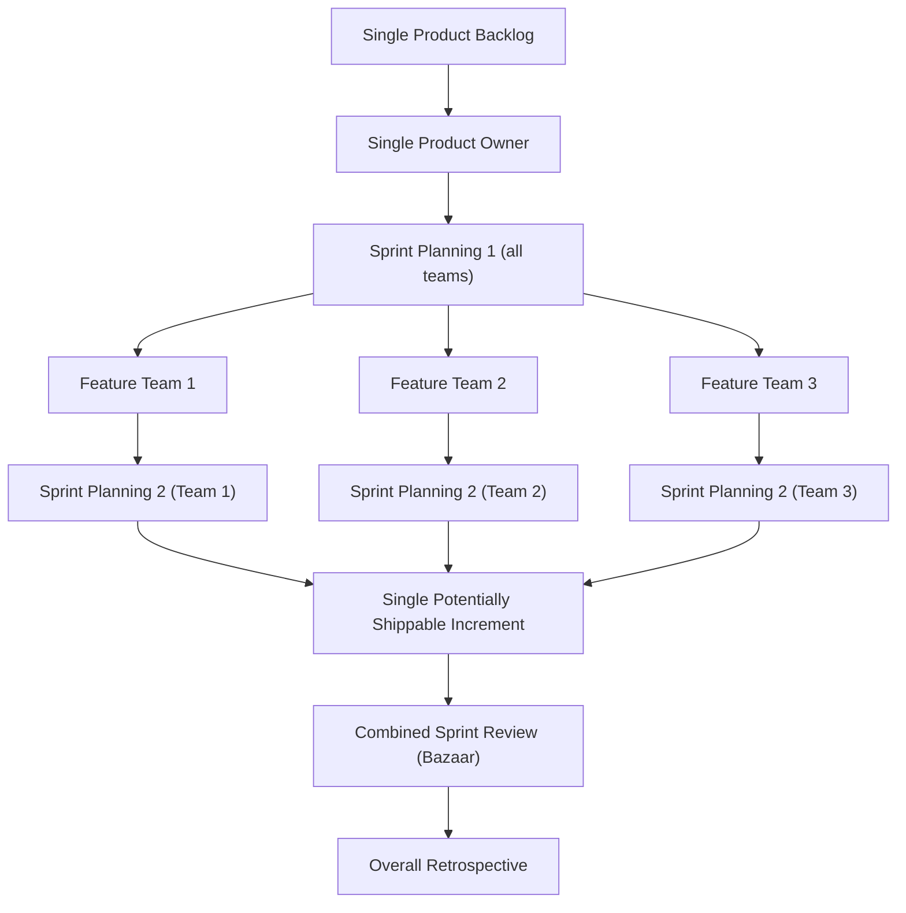
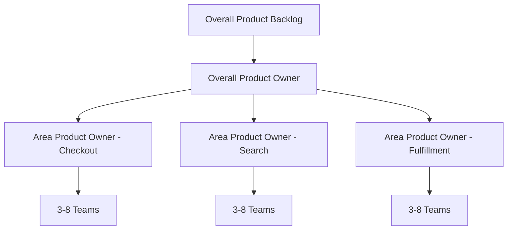

## Large Scale Scrum (LeSS)

### Overview

Large Scale Scrum (LeSS) is a framework for applying Scrum principles to product development involving multiple teams working on a single product. Developed by Craig Larman and Bas Vodde based on their experience scaling Scrum at Nokia Networks and other organizations, LeSS is distinguished from other scaling frameworks by its philosophy of "more with less": less roles, less management structure, less complexity — while preserving the original intent of Scrum rather than layering new processes on top of it.

LeSS comes in two variants:

- **LeSS** (basic): for 2–8 teams (roughly up to 50 people) working on one product.
- **LeSS Huge**: for 8+ teams (potentially hundreds of people), introducing the concept of Requirement Areas to keep the framework tractable at very large scale.

### Core Philosophy

LeSS is built on ten principles that differentiate it from other scaling approaches:

1. **Large-Scale Scrum is Scrum** — LeSS is not a new framework bolted onto Scrum; it is Scrum applied at scale, with the same accountabilities, artifacts, and events, adapted minimally.
2. **Empirical process control** — decisions are made based on inspection and adaptation of real outcomes, not upfront planning.
3. **Transparency** — visibility into work, progress, and impediments across all teams.
4. **More with less** — fewer specialized roles, fewer management layers, fewer distinct processes; complexity is pushed down into the product rather than the organizational structure.
5. **Whole-product focus** — all teams share a single Product Backlog and a single Product Owner, oriented toward the entire product, not separate team backlogs.
6. **Customer-centric** — value delivered to real customers/users is the measure of success, not adherence to process.
7. **Continuous improvement toward perfection** — a kaizen mindset applied to both product and process.
8. **Systems thinking** — teams and management understand how local optimizations can harm the whole system.
9. **Lean thinking** — eliminating waste, optimizing the whole, building quality in.
10. **Queuing theory** — understanding how batch size, work-in-progress, and queue length affect cycle time and predictability, which informs backlog and sprint design.

### LeSS Structure (2–8 Teams)

**Single artifacts across all teams:**

- **One Product Backlog** — shared by all teams; no team-specific backlogs.
- **One Product Owner** — prioritizes the single backlog for the whole product.
- **One Definition of Done** — common baseline for all teams, though individual teams may strengthen (not weaken) it for their own work.
- **One Potentially Shippable Product Increment** per Sprint — the combined output of all teams.

**Teams:**

- Multiple cross-functional, self-managing feature teams (not component teams) work from the same Product Backlog.
- Teams are ideally long-lived, stable, and co-located or working as if co-located.
- LeSS strongly favors **feature teams** (end-to-end capability to deliver customer-centric features) over **component teams** (organized around technical layers), because feature teams reduce cross-team dependencies and hand-offs.

### LeSS Huge Structure (8+ Teams)

At larger scale, a single Product Backlog and Product Owner become a bottleneck. LeSS Huge addresses this with:

- **Requirement Areas** — the overall product is split into a small number of customer-centric areas (e.g., "Checkout," "Search," "Fulfillment"), each a broad, relatively stable category of customer requirements.
- **Area Product Owner (APO)** — each Requirement Area has its own Product Owner, who manages an Area Backlog derived from the single overall Product Backlog and coordinates with the overall Product Owner.
- **3–8 teams per Requirement Area**, each area functioning internally like a basic LeSS structure.
- The overall Product Owner still owns the single, prioritized Product Backlog at the highest level; APOs handle area-level refinement and prioritization within their scope.

### Roles

LeSS deliberately minimizes distinct roles compared to other scaling frameworks (no Release Train Engineer, no Chief Product Owner hierarchy by default, no separate Scrum of Scrums role):

| Role | Scope | Responsibility |
| --- | --- | --- |
| Product Owner | Whole product | Owns and prioritizes the single Product Backlog |
| Area Product Owner (LeSS Huge only) | One Requirement Area | Owns Area Backlog, coordinates with overall PO |
| Scrum Master | 1–3 teams | Coaches teams and organization; a full-time, dedicated role (not a part-time addition to someone's engineering job) |
| Team members | Single feature team | Self-managing, cross-functional; no distinct sub-roles (e.g., no "component lead") |

Notably, LeSS has **no additional coordination roles** by default — no program manager, no scaling-specific committee. Coordination is expected to emerge from the teams themselves through practices like Scrum of Scrums or communities of practice, deliberately kept informal and lightweight.

### Events (Adapted from Single-Team Scrum)

| Event | Adaptation at Scale |
| --- | --- |
| Sprint Planning | Split into **Sprint Planning 1** (all teams together or via representatives, selecting items from the shared backlog and clarifying scope) and **Sprint Planning 2** (each team plans its own sprint backlog and design) |
| Daily Scrum | Held per team, as in single-team Scrum; not combined across teams |
| Product Backlog Refinement (PBR) | Includes **Overall PBR** (multi-team, cross-team dependency identification) and team-level PBR |
| Sprint Review | A single, combined Sprint Review (often a "bazaar" or open-space format) so all teams and stakeholders see the whole product increment together |
| Sprint Retrospective | Held per team, plus an **Overall Retrospective** attended by representatives from each team, Scrum Masters, Product Owner, and management to address cross-team/systemic issues |

### Coordination Mechanisms

LeSS avoids formal, imposed coordination structures in favor of lightweight, self-organized ones:

- **Scrum of Scrums (optional)** — representatives sync on dependencies and integration issues; not mandated as a formal event.
- **Communities of Practice** — cross-team groups around a discipline (e.g., testing, architecture) that share knowledge informally.
- **Traveler / Component mentor** — a team member temporarily joins another team to transfer knowledge across a dependency.
- **Open space during Sprint Planning 1 and Overall Retrospective** — ad hoc, self-organized clustering of people around shared topics or dependencies.
- **Continuous integration and shared codebase** as the primary technical mechanism for keeping multiple teams' work compatible, rather than heavy process coordination.

### LeSS vs. Other Scaling Frameworks

**Key Points**

- **LeSS vs. SAFe**: SAFe introduces multiple new organizational layers (Program, Large Solution, Portfolio levels) with dedicated roles (RTE, Product Manager, Solution Train Engineer) and prescriptive ceremonies (PI Planning). LeSS deliberately avoids adding layers and roles, instead descaling the organization around the existing Scrum framework.
- **LeSS vs. Scrum@Scale**: Scrum@Scale (Jeff Sutherland) scales via a "Scrum of Scrums" network with a Scrum of Scrums Master and an Executive Action Team; it permits multiple Product Owners with a Chief Product Owner hierarchy. LeSS insists on a single Product Owner (or Area Product Owners under one overall PO) and a single Product Backlog even at large scale.
- **LeSS vs. Nexus**: Nexus (Ken Schwaber/Scrum.org) is designed for 3–9 teams and introduces a Nexus Integration Team responsible for ensuring integration of work. LeSS has no dedicated integration team; integration is the direct responsibility of the teams themselves.
- [Inference] Organizations already comfortable with minimal process overhead and strong technical practices (CI/CD, trunk-based development) tend to adapt to LeSS more readily than organizations expecting a detailed, prescriptive playbook, since LeSS deliberately leaves many scaling mechanics to be self-organized.

### Adoption Considerations

**Prerequisites for adopting LeSS:**

- Willingness to restructure component teams into cross-functional feature teams.
- Organizational acceptance of a single Product Owner/Product Backlog for a potentially very large product.
- Strong technical practices (continuous integration, automated testing, refactoring discipline) to support multiple teams working in one shared codebase without excessive merge conflicts or integration debt.
- Management willingness to shift from direct control of work assignment toward removing organizational impediments (LeSS explicitly asks managers to adopt a "go see" / Gemba-based management style rather than status-reporting oversight).

**Common challenges:**

- Resistance from middle management roles that LeSS does not replicate (e.g., component leads, project managers) — LeSS proposes management focus shift toward experimentation and impediment removal rather than status control.
- Difficulty splitting a single Product Backlog across many teams without creating hidden dependencies, especially during the transition from component-based teams.
- Sprint Review at scale becoming unwieldy without a well-facilitated bazaar/market-style format.

### Example: Sprint Planning 1 Flow in LeSS (6 Teams)

1. Product Owner presents the top of the single Product Backlog and overall Sprint Goal to representatives (or all members) of all 6 teams.
2. Teams collaboratively "pull" Product Backlog items, self-selecting work based on capability and capacity, clarifying acceptance criteria directly with the Product Owner.
3. Cross-team dependencies surfacing during this session are flagged for coordination (e.g., via a Traveler or informal ad hoc discussion).
4. Each team then holds its own Sprint Planning 2 to design its sprint backlog and technical approach for the items it selected.

### Diagram: LeSS Structure (2–8 Teams)

### LeSS Huge Structure Diagram (Requirement Areas)

### Related Topics

- Feature teams vs. component teams (organizational design implications)
- Scrum of Scrums and other lightweight cross-team coordination patterns
- SAFe (Scaled Agile Framework) for comparison
- Nexus framework for scaling Scrum
- Scrum@Scale
- Continuous integration practices for multi-team shared codebases
- Communities of Practice in agile organizations
- Systems thinking and queuing theory applied to software delivery
- Product Backlog refinement techniques at scale
- Management's role transition in agile scaling (Gemba/"go see" management)