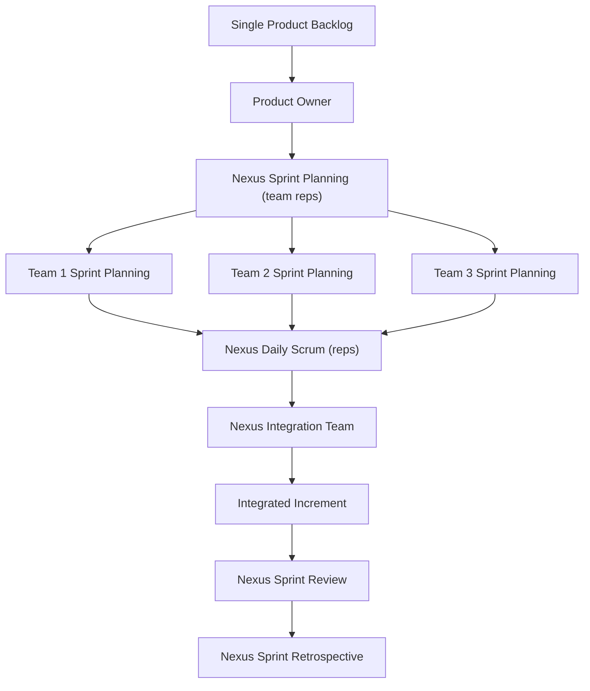

## Nexus Framework

### Overview

Nexus is a framework developed by Ken Schwaber and Scrum.org for scaling Scrum to multiple teams (typically 3–9 teams, roughly 25–125 people) working on a single product. Nexus is explicitly framed as a minimal extension of Scrum — it exists to expose and manage cross-team integration issues that naturally arise when several Scrum Teams work from one Product Backlog, without introducing an entirely separate scaling framework.

Nexus assumes the teams involved are already competent at single-team Scrum; it does not replace Scrum events or artifacts, it adds a thin coordination layer around them.

### Core Purpose: Managing Integration

The central problem Nexus addresses is **cross-team dependencies and integration**. When multiple teams build against a shared Product Backlog and shared codebase, dependencies, duplicate work, and integration conflicts emerge. Nexus's defining structural answer to this is the **Nexus Integration Team (NIT)**.

### Roles

| Role | Description |
| --- | --- |
| Product Owner | Single Product Owner for the entire Nexus; owns and orders the one Product Backlog, same as single-team Scrum |
| Scrum Master | Each team retains its own Scrum Master; one of these (or a person filling this capacity) also supports the Nexus Integration Team |
| Development Teams | Multiple cross-functional Scrum Teams pulling from the shared Product Backlog |
| **Nexus Integration Team (NIT)** | Composed of the Product Owner, a Scrum Master, and members drawn from the Development Teams (often senior/technical members); accountable for ensuring the Integrated Increment is produced each Sprint and for coaching teams on integration practices |

The Nexus Integration Team is not a separate, permanent team of dedicated integration specialists sitting apart from delivery — its membership is typically drawn from and overlaps with the Development Teams, rotating as needed, so integration accountability stays close to the people doing the work.

### Artifacts

- **Single Product Backlog** — one backlog for the whole Nexus, shared and refined across all teams, as in LeSS.
- **Nexus Sprint Backlog** — a composite view assembled from the individual Sprint Backlogs of all teams, used to make dependencies and progress toward the Sprint Goal transparent across the Nexus.
- **Integrated Increment** — the single, integrated, done, and potentially releasable product increment produced each Sprint by combining the work of all teams; this is the artifact the Nexus Integration Team is explicitly accountable for.

### Events

Nexus extends the standard Scrum events with additional cross-team touchpoints:

| Event | Nexus Adaptation |
| --- | --- |
| Refinement | **Refinement across the Nexus** happens continuously to identify cross-team dependencies early and decompose Product Backlog items so they can be distributed among teams with minimal coupling |
| Nexus Sprint Planning | Representatives from each team (plus the Product Owner) participate in a combined planning session to select and coordinate work from the Product Backlog before each team conducts its own detailed Sprint Planning |
| Daily Scrum (team level) | Held per team, as in single-team Scrum |
| **Nexus Daily Scrum** | Representatives from each team meet daily to inspect the current state of the Integrated Increment, identify newly surfaced cross-team dependencies or integration issues, and determine whether they impact the Sprint Goal |
| Sprint Review | A single, combined Sprint Review across all teams, inspecting the one Integrated Increment together with stakeholders |
| Nexus Sprint Retrospective | Includes a cross-team component: representatives first meet to identify Nexus-wide issues, which are then shared back to individual teams' own retrospectives for deeper discussion and action |

### Nexus vs. Other Scaling Frameworks

**Key Points**

- **Nexus vs. LeSS**: Both frameworks scale a single Product Backlog and single Product Owner across multiple teams and are both close, minimal extensions of Scrum. The key structural difference is that Nexus introduces a formal **Nexus Integration Team** explicitly accountable for the Integrated Increment, while LeSS assigns integration responsibility to the feature teams themselves without a dedicated integration body.
- **Nexus vs. SAFe**: SAFe scales across Program, Large Solution, and Portfolio levels with dedicated roles (Release Train Engineer, Product Manager) and fixed cadences (Program Increment Planning). Nexus stays scoped to the team-of-teams level for a single product and does not prescribe portfolio- or program-level structures.
- **Nexus vs. Scrum@Scale**: Scrum@Scale permits multiple Product Owners coordinated through an Executive MetaScrum and a Scrum of Scrums network with its own Scrum Master; it is designed to scale indefinitely. Nexus targets a bounded range (3–9 teams) and keeps a single Product Owner and single Product Backlog rather than a federated PO structure.
- [Inference] Nexus tends to suit organizations that want a scaling approach that stays visibly and structurally close to standard Scrum, since Scrum.org designed it explicitly as "Scrum at scale" with minimal new vocabulary or roles beyond the Integration Team.

### Example: Nexus Sprint Planning Flow (5 Teams)

1. Team representatives (often technical leads) and the Product Owner meet for **Nexus Sprint Planning**, reviewing the top of the single Product Backlog and identifying which items each team can pull with minimal cross-team coupling.
2. Dependencies identified here are logged and visualized (e.g., on a shared dependency board) so all teams are aware of them going into the Sprint.
3. Representatives return to their respective teams, who each hold their own detailed Sprint Planning to select specific Product Backlog items and design their Sprint Backlog.
4. Throughout the Sprint, the **Nexus Daily Scrum** brings representatives together daily to inspect integration status and flag any new dependency or integration risk against the shared Sprint Goal.
5. At Sprint end, all teams' work is combined into a single **Integrated Increment**, inspected together in one **Nexus Sprint Review**.

### Common Adoption Challenges

- Selecting and empowering the right people for the Nexus Integration Team — if NIT membership is only nominal and members lack real technical authority or bandwidth, integration issues surface too late.
- Maintaining a genuinely single Product Backlog when teams are tempted to maintain their own local backlogs for convenience, which reintroduces the coordination problems Nexus is meant to solve.
- Scaling the combined Sprint Review to remain meaningful and engaging as the number of teams grows toward the upper end of Nexus's 9-team range; beyond this range, organizations typically look to LeSS Huge or other frameworks designed for larger scale.
- [Inference] Continuous, automated integration testing infrastructure is generally necessary for the Nexus Integration Team to detect and act on integration issues quickly enough to be useful within a single Sprint, though Nexus itself does not mandate specific tooling.

### Diagram: Nexus Structure and Flow

### Related Topics

- Nexus Integration Team composition and responsibilities in depth
- Cross-team dependency management and visualization techniques
- LeSS and LeSS Huge (comparison framework)
- Scrum@Scale and Scrum of Scrums patterns
- SAFe (Scaled Agile Framework)
- Continuous integration and automated testing for multi-team products
- Single Product Backlog refinement practices at scale
- Nexus+ Scaling (extending beyond 9 teams)
- Definition of Done alignment across multiple teams