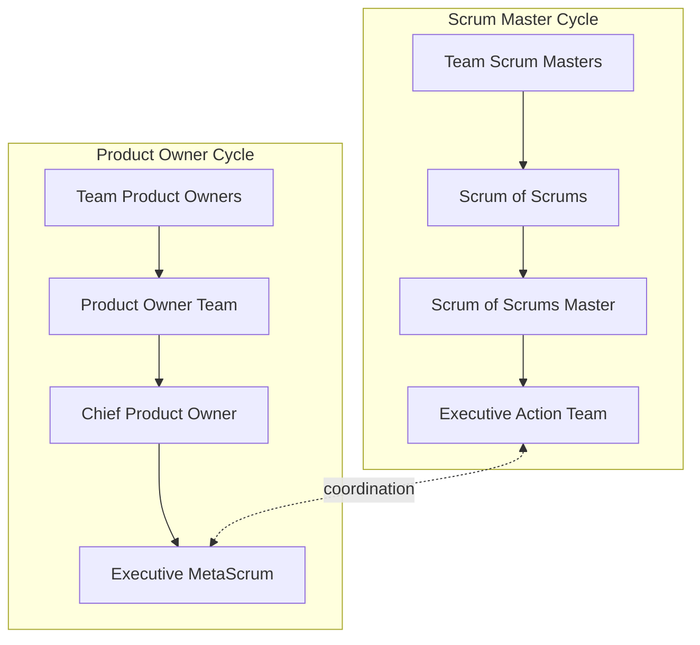

## Scrum at Scale

### Overview

Scrum at Scale (S@S) is a framework developed by Jeff Sutherland (co-creator of Scrum) and Alex Brown, delivered through Scrum at Scale Inc. and Scrum Inc. It is designed to scale Scrum across an entire organization — not just at the team-of-teams level, but up through the executive level — while keeping each individual Scrum Team operating with standard Scrum. Its stated aim is to allow an organization to scale "linearly," achieving a similar output-per-team ratio as a single team, rather than experiencing the typical diminishing returns of scaling.

Scrum at Scale organizes its structure around two interlocking cycles: the **Scrum Master Cycle** (concerned with how work gets *done* — process, delivery) and the **Product Owner Cycle** (concerned with what work should be done — strategy, prioritization, value).

### Core Design Principles

- **Minimum viable bureaucracy** — only as much structure and process as necessary to scale, no more.
- **Scale-free architecture** — the same patterns (e.g., a "Scrum of Scrums" pattern) can recursively apply at every level of the organization, from a handful of teams up to hundreds, without needing a fundamentally different structure at each layer.
- **Right-sizing** — teams are recommended to stay close to 4–9 people; when a group of teams grows beyond roughly 5 teams in a Scrum of Scrums, another layer (Scrum of Scrum of Scrums) is added rather than growing any single group indefinitely.
- Both cycles report into an **Executive Action Team (EAT)** and **Executive MetaScrum (EMS)**, meaning scaling considerations reach true executive/organizational strategy level, not just delivery coordination.

### The Two Cycles

**Scrum Master Cycle** (the "how"):

- **Team-level Scrum Masters** run standard Scrum for their individual teams.
- **Scrum of Scrums (SoS)** — representatives (often Scrum Masters) from multiple teams coordinate; for larger scale, a **Scrum of Scrum of Scrums (SoSoS)** aggregates multiple SoS groups.
- **Scrum of Scrums Master (SoSM)** — facilitates the SoS, resolves impediments that individual Scrum Masters cannot resolve alone, and coordinates release plans.
- **Executive Action Team (EAT)** — the top of this cycle; a small leadership group accountable for removing organization-wide impediments, ensuring continuous improvement of the whole delivery system, and maintaining the overall Scrum at Scale implementation.

**Product Owner Cycle** (the "what"):

- **Team-level Product Owners** own their team's backlog, same as single-team Scrum.
- **Product Owner Team / Meta Scrum** — Product Owners across teams coordinate backlog alignment and dependencies.
- **Chief Product Owner (CPO)** — coordinates multiple Product Owners, resolves cross-team prioritization conflicts, and maintains a coherent overall backlog view; multiple CPOs may exist at greater scale, coordinated by a further "Chief" layer.
- **Executive MetaScrum (EMS)** — the top of this cycle; a forum where executives and senior stakeholders align on organizational strategy, vision, and top-level prioritization, translating strategic intent into a prioritized backlog.

### Roles Comparison Table

| Role | Cycle | Scope |
| --- | --- | --- |
| Scrum Master | Scrum Master Cycle | Single team |
| Scrum of Scrums Master (SoSM) | Scrum Master Cycle | Group of teams |
| Executive Action Team (EAT) | Scrum Master Cycle | Whole organization (process/impediment authority) |
| Product Owner | Product Owner Cycle | Single team |
| Chief Product Owner (CPO) | Product Owner Cycle | Group of teams |
| Executive MetaScrum (EMS) | Product Owner Cycle | Whole organization (strategic prioritization) |

### Events

Scrum at Scale layers additional coordination events on top of standard team-level Scrum events:

| Event | Purpose |
| --- | --- |
| Team-level Sprint Planning, Daily Scrum, Review, Retrospective | Unchanged from single-team Scrum |
| **Scrum of Scrums (SoS)** | Cross-team daily/regular sync on dependencies, impediments, and integration, similar in spirit to a Daily Scrum but among team representatives |
| **Scaled Daily Scrum / SoS meeting** | Focused on cross-team blockers and coordination |
| **Executive Action Team meeting** | Reviews organization-wide impediments raised up through the SoS/SoSoS chain and drives structural/process improvements |
| **Executive MetaScrum (EMS)** | Regular forum (often weekly) where the prioritized backlog is aligned with current business strategy across the organization |
| **Scale-wide Retrospective** | Cross-team retrospective input aggregated to identify systemic issues |

### Scrum at Scale vs. Other Scaling Frameworks

**Key Points**

- **Scrum at Scale vs. LeSS**: LeSS enforces a single Product Owner and single Product Backlog even at large scale, viewing this as essential to whole-product focus. Scrum at Scale explicitly supports multiple Product Owners coordinated through a Chief Product Owner and Executive MetaScrum, making it more federated and potentially more suited to very large or multi-product organizations.
- **Scrum at Scale vs. Nexus**: Nexus is scoped specifically to the team-of-teams level (3–9 teams) around a single Integration Team. Scrum at Scale explicitly extends coordination all the way to executive strategy (EAT, EMS), addressing organizational-level scaling, not just delivery-team integration.
- **Scrum at Scale vs. SAFe**: Both address scaling to the enterprise/portfolio level. SAFe is comparatively prescriptive, defining fixed roles (RTE, Solution Train Engineer), fixed cadences (Program Increment/PI Planning every 8–12 weeks), and a layered structure (Team, Program, Large Solution, Portfolio). Scrum at Scale positions itself as a lighter-weight, less prescriptive "framework of frameworks" that lets organizations choose their own practices within the two-cycle structure, self-describing as minimum viable bureaucracy rather than a fixed operating model.
- [Inference] Organizations already running multiple Scrum teams with individual Product Owners, and wanting to preserve that federated ownership rather than consolidate to a single backlog, often find Scrum at Scale's structure a more natural fit than LeSS or Nexus.

### Example: Impediment Escalation Path in Scrum at Scale

1. A team-level impediment that a single Scrum Master cannot resolve (e.g., a shared testing environment bottleneck affecting 3 teams) is raised at the team's Daily Scrum.
2. The Scrum Master brings it to the **Scrum of Scrums**, where representatives from affected teams discuss and attempt cross-team resolution.
3. If unresolved at the SoS level, the **Scrum of Scrums Master** escalates it to the **Executive Action Team**.
4. The EAT, having organizational authority, allocates resources or changes policy (e.g., funding a dedicated shared test environment) to remove the impediment for good, rather than requiring each SoS to work around it repeatedly.

### Common Adoption Considerations

- Scrum at Scale requires genuine executive engagement in the Executive MetaScrum and Executive Action Team — without leadership actually participating (not just delegating), the top of both cycles becomes symbolic rather than functional.
- Because it is less prescriptive than SAFe, organizations must actively design several of their own practices (e.g., specific cadence of SoS meetings, exact composition of the CPO layer), which can be an advantage for tailoring but a challenge for teams wanting an out-of-the-box, fully specified process.
- The two-cycle (Product Owner Cycle / Scrum Master Cycle) split can create ambiguity if organizations don't clearly delineate strategic prioritization authority (EMS) from process/impediment authority (EAT).
- [Inference] Scale-free recursion (SoS → SoSoS → further layers) implies the framework can theoretically extend to very large organizations, but empirical guidance on best practices tends to thin out at the highest layers, since fewer organizations operate at that scale.

### Diagram: Scrum at Scale — Dual Cycle Structure

### Related Topics

- Executive MetaScrum design and cadence
- Scrum of Scrums facilitation techniques
- Chief Product Owner responsibilities and backlog consolidation
- LeSS and LeSS Huge (comparison framework)
- Nexus Framework (comparison framework)
- SAFe (Scaled Agile Framework)
- Minimum viable bureaucracy as an organizational design principle
- Impediment escalation and organizational impediment removal
- Scaling Scrum roles: Product Owner vs. Chief Product Owner accountability boundaries