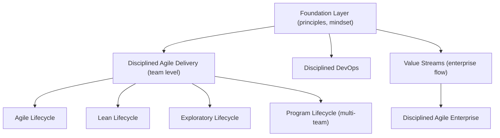

## Disciplined Agile

### Overview

Disciplined Agile (DA) is a hybrid, toolkit-based framework for enterprise agility, originally created by Scott Ambler and Mark Lines and now maintained by the Project Management Institute (PMI), which acquired Disciplined Agile Consortium in 2019. Unlike prescriptive scaling frameworks that define one fixed process, DA is explicitly a **process decision toolkit**: it provides choices among multiple ways of working (WoW) and guides teams and organizations in selecting and evolving practices that fit their specific context, rather than mandating a single method.

DA integrates and references strategies from multiple sources — Scrum, Kanban, Lean, SAFe-style scaling concepts, traditional project management, and DevOps — treating them as options within a coherent decision-making structure rather than as competitors.

### Core Philosophy: "Choose Your WoW"

DA's central premise is captured in its own tagline, "Choose your WoW!" (Way of Working). Key philosophical commitments:

- **Context matters** — there is no single best process; the right way of working depends on team size, domain, compliance requirements, distribution, and other factors.
- **Being agile vs. doing agile** — DA emphasizes principles and outcomes over strict adherence to any one named method's ceremonies.
- **Pragmatism over dogma** — DA explicitly incorporates traditional/predictive elements where appropriate (e.g., regulated or safety-critical domains), rather than insisting on pure agile practices everywhere.
- **Enterprise awareness** — teams operate within a wider organizational ecosystem (other teams, existing systems, governance, culture) and should optimize for the whole enterprise, not just local team velocity.
- **Goal-driven, not prescriptive** — DA is organized around **process goals** (e.g., "Grow Team Members," "Coordinate Activities") rather than prescribed ceremonies; each goal offers a decision point with multiple documented options and trade-offs.

### The DA Toolkit Structure

DA organizes its guidance into four layers, moving from team-level delivery to full enterprise scale:

| Layer | Focus |
| --- | --- |
| **Foundation** | Core concepts, principles, and the underlying mindset shared across the whole toolkit |
| **Disciplined DevOps** | Extends agile delivery with DevOps concerns: data management, release management, IT operations |
| **Value Streams** | Enterprise-level view: how value flows across the whole organization, connecting delivery to strategy and portfolio decisions |
| **Disciplined Agile Delivery (DAD)** | The team-level process decision framework — how a single team plans, builds, and delivers a solution |

**Disciplined Agile Delivery (DAD)**, the most commonly referenced layer, is itself organized around lifecycles and process goals.

### DAD Lifecycles

DA does not mandate one lifecycle; teams choose among several depending on context:

- **Agile lifecycle** — Scrum-based, iteration-driven delivery.
- **Lean lifecycle** — Kanban-based, continuous-flow delivery.
- **Continuous Delivery: Agile** — high-frequency releases building on the Agile lifecycle.
- **Continuous Delivery: Lean** — high-frequency releases building on the Lean lifecycle.
- **Exploratory lifecycle** — Lean Startup-style, hypothesis-driven approach for high-uncertainty product discovery.
- **Program lifecycle** — coordinates multiple teams working on a large initiative (DA's scaling lifecycle for teams-of-teams).

### Process Goals

Rather than prescribing fixed events, DAD defines **process goals** — decision points a team must address, each with a goal diagram presenting multiple options ranked roughly by trade-off (e.g., ease of adoption vs. effectiveness). Example goals include:

- Form Team
- Explore Scope
- Develop Common Vision
- Grow Team Members
- Address Risk
- Coordinate Activities
- Accelerate Value Delivery
- Govern Team

**Example (Process Goal in practice):** For the "Coordinate Activities" goal, a team might choose among options like a Daily Standup, Daily Scrum, coordination via a shared Kanban board, or asynchronous coordination tools — the choice depends on team distribution, size, and preference, and DA provides no single mandated answer, only guidance on trade-offs.

### DA at Scale (Enterprise Layers)

Beyond team-level DAD, the broader DA toolkit addresses scaling through:

- **DA FLEX (Flow for Enterprise Transformation)** — guidance on organizing value streams and connecting strategy-to-delivery flow across an entire enterprise, positioned as DA's most current large-scale/organizational transformation guidance.
- **Disciplined Agile Enterprise (DAE)** — an organization that can sense and respond to change effectively across all its parts (not just IT/delivery), addressing functions like Finance, HR, Marketing, Legal as part of the enterprise's overall agility, not only software delivery teams.
- Coordination among multiple DAD teams uses the **Program lifecycle**, which draws on scaling patterns conceptually similar to a Scrum of Scrums, adapted per DA's choice-driven philosophy rather than fixed rules.

### Disciplined Agile vs. Other Scaling Frameworks

**Key Points**

- **DA vs. SAFe**: SAFe is highly prescriptive, defining specific roles, artifacts, and cadences (PI Planning, ARTs) intended to be adopted largely as specified. DA instead offers a decision framework with multiple valid options at each goal point, explicitly avoiding a single "correct" way of working — this makes DA more flexible but requires more organizational judgment to apply well.
- **DA vs. LeSS**: LeSS scales a single team-based Scrum model with minimal added structure and insists on specific practices (single Product Backlog, single PO, feature teams). DA does not insist on Scrum at all — a DA team may use a Lean/Kanban lifecycle instead, and DA generally accommodates a wider range of starting points, including regulated or hybrid-traditional environments LeSS does not directly address.
- **DA vs. Scrum at Scale**: Scrum at Scale is Scrum-rooted, extending Scrum's own dual-cycle pattern to enterprise scale. DA is method-agnostic at its foundation, incorporating Scrum, Kanban, Lean, and traditional practices as interchangeable options rather than scaling one specific method.
- [Inference] DA tends to appeal to larger, more heterogeneous organizations — especially those with regulatory constraints, existing traditional PM practices, or multiple different team contexts — because its toolkit approach explicitly supports mixing lifecycles across teams, rather than requiring uniform adoption of one named method organization-wide.

### PMI Integration Context

Since PMI's acquisition of the Disciplined Agile Consortium, DA has been positioned as PMI's agile/hybrid delivery framework, complementing (rather than replacing) PMI's traditional project management body of knowledge. This is reflected in PMI's PMI-ACP (Agile Certified Practitioner) and Disciplined Agile-specific certifications (e.g., Disciplined Agile Scrum Master (DASM), Disciplined Agile Senior Scrum Master (DASSM), Disciplined Agile Coach (DAC)), which are relevant credentials within project management career paths. [Unverified] Specific certification names, exam structures, and prerequisite requirements should be checked against PMI's current certification documentation, as these details are subject to change over time.

### Adoption Considerations

**Key Points**

- **Strength**: DA's flexibility allows organizations with mixed contexts (e.g., some regulated teams, some greenfield product teams) to apply appropriately different ways of working under one coherent, PMI-endorsed umbrella, rather than forcing a single scaling framework onto every situation.
- **Challenge**: The toolkit's breadth of choice can be overwhelming for teams wanting a simple, prescriptive starting point; organizations sometimes need dedicated DA coaching or certified practitioners to navigate the goal-diagrams effectively.
- **Challenge**: Because DA does not mandate specific artifacts or ceremonies, measuring and comparing agile maturity across teams using different DA-selected lifecycles requires more deliberate, custom governance than in more standardized frameworks like SAFe.

### Diagram: DA Layered Toolkit Structure

### Related Topics

- Process goal-driven decision-making (DAD goal diagrams in depth)
- DA FLEX and value stream management
- Choosing a DAD lifecycle for a given team context
- Disciplined Agile Enterprise (DAE) and whole-organization agility
- PMI agile certifications (DASM, DASSM, DAC, PMI-ACP)
- Comparison of hybrid vs. pure-agile approaches in regulated industries
- SAFe, LeSS, Nexus, and Scrum at Scale (comparison frameworks)
- Lean/Kanban flow metrics as used within DA's Lean lifecycle