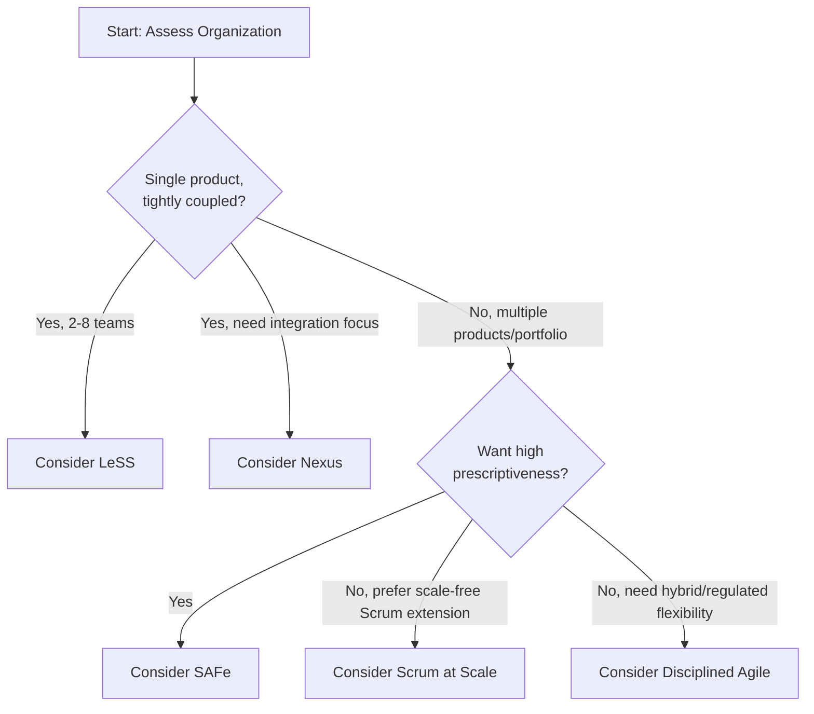

## Choosing a Scaling Approach

### Overview

Selecting a scaling framework for agile — SAFe, LeSS, Nexus, Scrum at Scale, Disciplined Agile, or a custom/hybrid approach — is a strategic decision, not merely a process preference. The choice depends on organizational context: size, product architecture, regulatory environment, culture, and existing team maturity. No single framework is universally superior; each embodies different trade-offs between structure/prescriptiveness and flexibility/self-organization.

### Key Decision Factors

**Organizational Size and Number of Teams**

- **Small scale (2–8 teams, one product)**: LeSS or Nexus fit well, since both are designed specifically for this range and avoid adding organizational layers unnecessary at this size.
- **Medium-to-large scale (multiple products, dozens of teams)**: SAFe's Program and Large Solution levels, LeSS Huge, or Scrum at Scale's multi-layer SoS/SoSoS structure become more relevant.
- **Enterprise-wide (across the whole organization, including non-IT functions)**: SAFe's Portfolio level, Scrum at Scale's Executive MetaScrum/EAT, or Disciplined Agile's Disciplined Agile Enterprise (DAE) concept address strategy-to-delivery alignment beyond delivery teams alone.

**Product Architecture**

- A single, tightly-coupled product with one shared codebase favors frameworks built around **one Product Backlog and Product Owner** (LeSS, Nexus).
- Multiple related but distinct products or a Solution comprising several products favors frameworks with a **Solution/Portfolio layer** (SAFe) or federated Product Owner structures (Scrum at Scale's CPO layer, DA's value streams).

**Degree of Prescriptiveness Desired**

- Organizations wanting a well-defined, "out-of-the-box" operating model with detailed roles, artifacts, and cadences tend toward **SAFe**.
- Organizations preferring minimal added structure, trusting self-organization to fill gaps, tend toward **LeSS** or **Nexus**.
- Organizations wanting flexibility to mix multiple methods across different teams and contexts (including non-agile/regulated teams) tend toward **Disciplined Agile**.
- Organizations already comfortable with Scrum and wanting a scale-free, federated extension of it (rather than a wholly new operating model) tend toward **Scrum at Scale**.

**Regulatory and Compliance Context**

- Regulated industries (finance, healthcare, aerospace, government) often need traceability, documented governance, and compliance touchpoints that DA explicitly accommodates through its hybrid, "choose your WoW" philosophy, or that SAFe accommodates through its structured Portfolio/governance layers.
- [Inference] Frameworks emphasizing minimal formal artifacts (LeSS, Nexus) may require organizations to layer in additional compliance documentation practices themselves, since neither framework specifically addresses regulatory traceability as a first-class concern.

**Organizational Culture and Change Readiness**

- Cultures with strong existing middle-management layers (component leads, project managers) may find SAFe's structured roles (RTE, Product Manager) provide a smoother transition path, since they map more directly onto pre-existing management structures.
- Cultures ready to flatten management structures and shift toward Lean/systems-thinking-based leadership (Gemba-style, impediment-removal-focused) are better positioned for LeSS's or Scrum at Scale's descaling philosophy.

### Comparison Table: Framework Selection Guide

| Factor | LeSS | Nexus | Scrum at Scale | SAFe | Disciplined Agile |
| --- | --- | --- | --- | --- | --- |
| Team count sweet spot | 2–8 (LeSS), 8+ (LeSS Huge) | 3–9 | Scale-free (small to very large) | Team to enterprise-wide | Any (toolkit-based) |
| Product Owner structure | Single PO (or Area POs) | Single PO | Federated (PO → CPO → EMS) | Product Manager + Product Owners (hierarchical) | Flexible/context-dependent |
| Prescriptiveness | Low-medium | Low-medium | Medium (structure) / Low (specific practices) | High | Low (decision toolkit) |
| Added roles beyond Scrum | None (minimal) | Nexus Integration Team | SoSM, CPO, EAT, EMS | RTE, Solution Train Engineer, Product Manager | Context-dependent, DA-specific coach roles |
| Best fit | Single product, feature teams, lean philosophy | Team-of-teams needing formal integration focus | Scrum-rooted orgs wanting scale-free growth | Large enterprises wanting structured, portfolio-aligned scaling | Heterogeneous/regulated orgs needing flexible hybrid approaches |

### Example: Framework Selection Scenario

**Example**

A mid-sized fintech company has 6 teams building one core trading platform (single codebase, tightly coupled), operating in a regulated environment requiring audit trails. Decision walkthrough:

- Team count (6) fits comfortably within LeSS or Nexus range.
- Single-product, tightly-coupled architecture favors a single-backlog approach (LeSS or Nexus) over SAFe's multi-product Solution Train model.
- The regulatory requirement for audit trails is not natively addressed by LeSS or Nexus, so the organization would need to layer in its own compliance documentation practices, or consider Disciplined Agile's hybrid governance flexibility instead.
- If the organization values minimal structure and already has strong feature teams: **LeSS**. If it specifically wants dedicated integration accountability due to a history of integration failures: **Nexus**. If compliance/governance needs are heavy: **Disciplined Agile** with a customized lifecycle.

### Common Pitfalls in Framework Selection

- **Framework-shopping without addressing root causes** — adopting a scaling framework to solve problems (e.g., poor code quality, unclear product vision) that are not structural/coordination problems and won't be fixed by any scaling framework.
- **Over-scaling prematurely** — introducing a heavyweight framework (e.g., full SAFe) for an organization that could be served by simpler team-level Scrum plus light coordination, adding unnecessary process overhead.
- **Partial adoption without organizational buy-in** — implementing scaling ceremonies (e.g., Scrum of Scrums, PI Planning) without corresponding management/cultural shifts (e.g., real impediment-removal authority), which tends to produce process theater rather than genuine improvement.
- **Ignoring product architecture** — adopting a single-Product-Backlog framework (LeSS, Nexus) for genuinely separate products with different customers and roadmaps, forcing artificial coordination where none is needed.
- [Inference] Organizations that pilot a scaling approach with a subset of teams before full rollout tend to identify context-specific friction points earlier than those attempting simultaneous enterprise-wide adoption, though outcomes vary by organizational readiness and are not guaranteed by piloting alone.

### Decision Framework Checklist

**Next Steps**

- Map the current product/codebase architecture: single tightly-coupled product vs. multiple distinct products.
- Count current and near-future team numbers to identify which frameworks' designed ranges fit.
- Assess organizational appetite for prescriptiveness vs. self-organized flexibility.
- Identify regulatory/compliance constraints that any candidate framework must accommodate (natively or via customization).
- Evaluate current management structure and willingness to shift roles (e.g., component leads becoming coaches or Scrum Masters).
- Consider running a time-boxed pilot with 2–3 teams before an organization-wide rollout, regardless of framework chosen.
- Establish clear success metrics (cycle time, deployment frequency, cross-team dependency resolution time) before adoption, to evaluate whether the chosen framework is delivering intended benefits.

### Diagram: Scaling Framework Decision Flow

### Related Topics

- SAFe (Scaled Agile Framework) in depth
- Large Scale Scrum (LeSS)
- Nexus Framework
- Scrum at Scale
- Disciplined Agile
- Organizational change management for agile transformations
- Measuring agile scaling success (flow metrics, DORA metrics)
- Feature teams vs. component teams as an architectural/organizational prerequisite
- Piloting and incremental rollout strategies for scaling frameworks