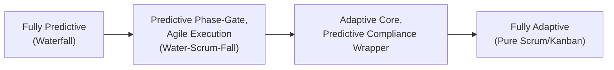
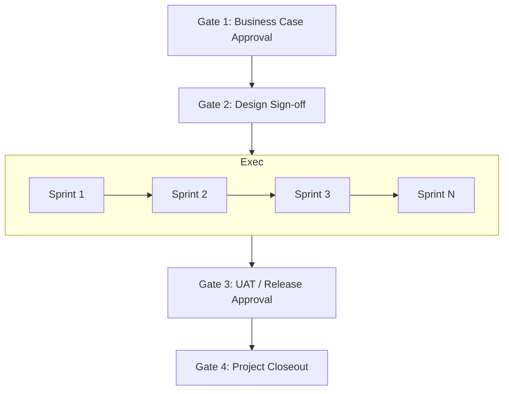

## Blending Predictive and Adaptive Approaches

### Overview

Hybrid project management combines elements of predictive (traditional/waterfall/plan-driven) and adaptive (agile/iterative) approaches within a single project or organization. Rather than treating predictive and adaptive as mutually exclusive paradigms, hybrid approaches recognize that most real-world projects contain a mix of well-understood, stable components (suited to predictive planning) and uncertain, evolving components (suited to adaptive, iterative delivery). This blending approach is formally recognized in PMI's *Guide to the Project Management Body of Knowledge* (PMBOK Guide) and the *Agile Practice Guide*, both of which explicitly endorse tailoring a project's approach along a predictive–adaptive continuum rather than requiring a pure methodology.

### Why Blend: The Continuum Concept

Predictive and adaptive are best understood not as a binary but as a **continuum**:

- **Fully predictive**: Scope, schedule, and cost are defined upfront in detail; changes go through formal change control (classic waterfall).
- **Fully adaptive**: Scope emerges iteratively; short cycles (sprints) deliver working increments, with continuous re-prioritization (pure Scrum/Kanban).
- **Hybrid**: Different project phases, workstreams, or components sit at different points on this continuum simultaneously.

The degree of predictive vs. adaptive blending for a given project is typically driven by:

- **Requirements clarity and stability** — well-understood, unlikely-to-change requirements (e.g., regulatory reporting formats) suit predictive planning; poorly understood or fast-evolving requirements (e.g., new UX features) suit adaptive iteration.
- **Risk and uncertainty profile** — high technical or market uncertainty favors adaptive, incremental learning; low uncertainty, well-precedented work favors predictive planning.
- **Contractual and governance constraints** — fixed-price contracts, regulatory approval gates, or capital budgeting processes often require predictive milestones and deliverables even within an otherwise agile project.
- **Organizational and stakeholder culture** — stakeholders accustomed to Gantt charts and fixed scope commitments may need a predictive "wrapper" around adaptive delivery internally.

### Common Hybrid Patterns

**Key Points**

- **Predictive Phase-Gate with Agile Execution ("Water-Scrum-Fall")**: The overall project follows a predictive phase-gate structure (initiation, planning, execution, closing with formal gate approvals), but the execution/build phase internally uses Scrum or Kanban sprints. Common in enterprises where governance and funding require phase-gate reporting but delivery teams work iteratively.
- **Predictive Program, Adaptive Projects**: A program-level roadmap and budget are planned predictively (e.g., annual planning), while individual projects/workstreams within the program are executed adaptively, replanned each sprint or iteration based on discovered information.
- **Adaptive Core, Predictive Wrapper for Compliance**: The core development work is fully agile (Scrum/Kanban), but specific deliverables required for regulatory sign-off (e.g., validation documentation in pharma, safety certification artifacts in aerospace) are tracked and delivered against fixed predictive milestones layered on top.
- **Mixed-Method Portfolio**: Different projects within the same organization or portfolio use different approaches entirely — some pure waterfall (e.g., infrastructure/construction-adjacent IT work), others pure agile (e.g., new product development) — coordinated at the portfolio level using predictive-style roadmapping and resource planning.
- **Disciplined Agile-style team-by-team blending**: As in Disciplined Agile's toolkit approach, different teams within the same organization independently choose points on the predictive–adaptive continuum appropriate to their own work, coordinated through shared enterprise governance.

### PMBOK / PMI Framing

The PMI *Agile Practice Guide* (developed jointly with the Agile Alliance) explicitly frames tailoring project approach as a spectrum and provides guidance for selecting a hybrid approach based on project characteristics. Key PMI-aligned concepts relevant to hybrid PM:

- **Tailoring** — the deliberate customization of process, tools, and lifecycle to fit the specific project, a core PMBOK principle applicable to blending predictive and adaptive elements.
- **Life Cycle Selection** — PMBOK's seventh edition and the *Agile Practice Guide* describe a spectrum of project life cycles: predictive, iterative, incremental, agile, and hybrid, explicitly naming hybrid as a legitimate life cycle category rather than a deviation from standard practice.
- **Suitability filters** — the *Agile Practice Guide* offers assessment tools (e.g., questions about culture, team, and project characteristics) to help determine where on the predictive–adaptive spectrum a given project or component should sit.

### Example: Hybrid Approach in Practice

**Example**

A government agency is replacing a legacy benefits-processing system. The project:

- Uses a **predictive phase-gate structure** for overall governance: a Business Case phase, a Design phase with formal sign-off, an Execution phase, and a Closeout phase, each requiring steering committee approval to proceed (satisfying public-sector audit and funding requirements).
- Within the Execution phase, development teams use **two-week Scrum sprints** to build and demo features incrementally, allowing the agency to adjust UX and workflow details based on user feedback as the system is built.
- Regulatory compliance documentation (a fixed, well-understood deliverable set) is tracked against a **predictive milestone schedule** running in parallel with the sprints, since these documents' content and structure are stable and unlikely to benefit from iterative discovery.
- Result: the agency satisfies its governance/audit requirements (predictive) while still gaining agile's benefit of adapting the actual user-facing workflow design based on real feedback (adaptive).

### Governance and Reporting in Hybrid Projects

- **Steering committees and stage gates** typically remain predictive in structure (formal go/no-go decisions at defined points), even when execution is iterative underneath.
- **Reporting cadence differences**: Predictive elements are often reported via percent-complete against a baseline schedule (Earned Value Management-style metrics); adaptive elements are better reported via agile metrics (velocity, burn-down/burn-up charts, cycle time). Hybrid projects frequently need **both types of reporting simultaneously** for different stakeholder audiences.
- **Change control divergence**: Predictive components typically retain formal change request processes; adaptive components handle change through backlog reprioritization each iteration. Project managers in hybrid environments must clearly communicate to stakeholders which change-management process applies to which part of the work, to avoid confusion about why some changes go through formal approval and others do not.

### Common Challenges

- **Mismatched cadences** — predictive milestones (e.g., quarterly) and agile sprints (e.g., biweekly) can create reporting friction if not deliberately aligned (e.g., aligning sprint reviews with milestone checkpoints).
- **Stakeholder confusion about commitment level** — stakeholders used to fixed-scope predictive commitments may struggle with the adaptive components' evolving scope, requiring explicit communication about which parts of the project are fixed vs. flexible.
- **Resource planning conflicts** — predictive resource allocation (assigning people to tasks months in advance) can conflict with agile's just-in-time, self-organizing team allocation model; hybrid projects often need resource plans that reserve capacity at a rolling-wave level of detail rather than full upfront allocation.
- **Metric incompatibility** — comparing progress using percent-complete (predictive) against velocity/burndown (adaptive) requires a translation layer (e.g., mapping story points completed to overall project percent-complete) that can be imprecise. [Inference] Organizations that establish this translation approach explicitly and early tend to have fewer reporting disputes than those that improvise it project-by-project, though the appropriate translation method varies significantly by project type.

### Diagram: Hybrid Life Cycle Continuum

### Diagram: Water-Scrum-Fall Governance Pattern

### Related Topics

- PMI Agile Practice Guide suitability filters and tailoring assessments
- Water-Scrum-Fall pattern in detail
- Earned Value Management (EVM) adapted for hybrid projects
- Rolling wave planning as a resource-allocation technique
- Stage-gate / phase-gate governance models
- Choosing a Scaling Approach (comparison to enterprise-level framework selection)
- Agile metrics (velocity, burndown/burnup) vs. predictive metrics (percent-complete, EVM)
- Change control processes: formal change requests vs. backlog reprioritization
- Disciplined Agile as a toolkit for team-by-team lifecycle blending